# 2018年广东省公务员录用考试《行测》题（县级、乡镇统一卷）（网友回忆版）

> 资料分析 · 15 题 · 广东 2018

## 材料 1

        A市坚持发挥科技创新的引领作用，强化企业的创新主体地位，研发投入不断增加，研发人员快速增长，创新能力持续增强，锂电池等新兴产业尤为突出。

        五年来，企业创新意愿不断提升，研发投入快速增长。2016年，该市有研究与试验发展（R&amp;D）活动的单位172家，比2012年增加26家，R&amp;D经费内部支出19.55亿元，比2012年增加11.65亿元，增长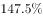，年均增长率为；R&amp;D经费内部支出与地区生产总值之比为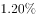，比2012年提高0.5个百分点。规模以上工业企业研发投入大幅提高，2016年该市规模以上工业企业R&amp;D经费内部支出19.14亿元，比2012年增加11.52亿元，增长，年均增长。全年技术改造经费支出10.74亿元，比2012年增长；引进境外技术经费支出1.61亿元，增长；引进境外技术的消化吸收经费支出0.54亿元，增长。

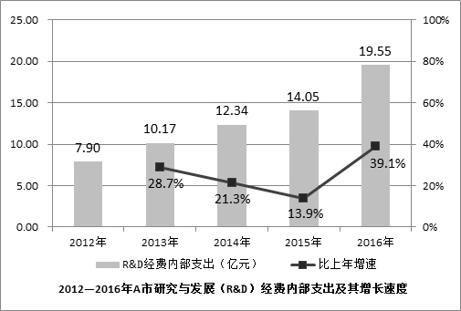

        该市在增加科技投入的同时，研发人才引进和培养力度持续加大。2016年全市R&amp;D人员合计6924人，比2012年增长，年均增长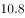，其中研究人员3268人，占R&amp;D人员的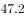，比2012年提高18.8个百分点。全市R&amp;D人员中，本科及以上学历人员4007人，占全部R&amp;D人员比重的，比2012年提高24个百分点；其中研究生及以上学历1216人，占全部R&amp;D人员比重的，比2012年提高9.1个百分点。

        2016年，该市加大力度发展新兴科技产业，全市锂电池等制造行业R&amp;D经费内部支出12.63亿元，比2012年增长17.5倍，年均增长。R&amp;D人员2851人，比2012年增长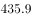，年均增长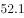。新产品产值达241.06亿元，比2012年增加219.37亿元，增长10.1倍。

### 第 1 题　qid 2185109 · 综合

2012年，该市的下列各项经费支出最多的是（  ）。

- **A**. 
规模以上工业企业经费
　✅
- **B**. 
全年技术改造经费

- **C**. 
 引进境外技术经费

- **D**. 
引进境外技术的消化吸收经费

**答案**：A

**官方解析**

根据题干“2012年，······支出最多的是”，结合材料为2016年，可判定本题为基期比较问题。定位文字材料第二段，根据公式：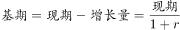，可得各选项2012年的经费支出分别为：A项：；B项：；C项：；D项：。

对比可得，2012年经费支出最多的为A项。

故正确答案为A。

---

### 第 2 题　qid 2185113 · 综合

2016年，该市生产总值比2012年约多（  ）亿元。

- **A**. 350
- **B**. 430
- **C**. 500　✅
- **D**. 660

**答案**：C

**官方解析**

根据题干“2016年，······比2012年约多多少亿元”，可判定本题为增长量计算问题。定位文字材料第二段，“2016年，R＆D经费内部支出19.55亿元，比2012年增加11.65亿元。R＆D经费内部支出与地区生产总值之比为，比2012年提高0.5个百分点”。根据公式：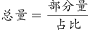，可得2016年该市生产总值比2012年约多：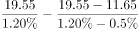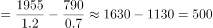，对应C项。

故正确答案为C。

---

### 第 3 题　qid 2185117 · 平均数

2012年，该市平均每家研究与试验发展（R&D）活动单位的R&D经费内部支出约为（  ）亿元。

- **A**. 0.023
- **B**. 0.054　✅
- **C**. 0.163
- **D**. 0.242

**答案**：B

**官方解析**

根据题干“2012年，该市平均每家······”，结合材料数据为2016年，可判定本题为基期平均数计算问题。定位文字材料第二段“2016年，该市有研究与试验发展（R＆D）活动的单位172家，比2012年增加26家。经费内部支出19.55亿元，比2012年增加11.65亿元。”则可得2012年平均每家R＆D活动单位的经费内部支出为：亿，与B项最接近。

故正确答案为B。

---

### 第 4 题　qid 2185119 · 综合

2016年，该市R&D人员中，本科学历的人数为（  ）。

- **A**. 1216
- **B**. 1517
- **C**. 2791　✅
- **D**. 4007

**答案**：C

**官方解析**

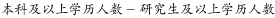。定位文字材料第三段，“全市R＆D人员中，本科及以上学历人员4007人，研究生及以上学历1216人”，则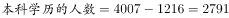人。

故正确答案为C。

---

### 第 5 题　qid 2185122 · 综合

根据材料，下列说法不正确的是（  ）。

- **A**. 
2013-2016年，经费内部支出增加最多的是2015年
　✅
- **B**. 
2012-2016年，经费内部年均支出约12.8亿元

- **C**. 
2016年，该市新兴科技产业的发展较2012年有较大提高

- **D**. 
2016年，该市人员学历水平较2012年有所提高

**答案**：A

**官方解析**

A项：定位柱状图，R＆D经费内部支出2015年增加：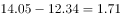亿元，2016年增加：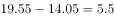亿元。2015年增加并非最多，错误；

B项：定位柱状图，2012-2016年R＆D经费内部年均支出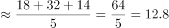亿元，正确；

C项：根据文字材料最后一段可得，2016年该市大力发展新兴科技产业，R＆D经费内部支出、人员数、新产品产值均取得长足发展，比2012年有较大提高，正确；

D项：根据文字材料第三段可得，2016年该市R＆D人员本科及以上、研究生及以上学历人员比2012年均有所增加，学历水平有所提升，正确。

本题为选非题，故正确答案为A。

---

## 材料 2

根据下列资料，回答91～95题：

        2017年第四季度，人力资源部门对东、中、西三大区域共95个城市的公共就业服务机构市场供求信息进行了统计分析，部分数据如下：

        总体而言，用人单位通过公共就业服务机构招聘各类人员约433.7万人，进入市场的求职者约354.2万人，岗位空缺与求职人数的比率约为1.22，比去年同期上升0.09，市场需求略大于供给。

        与去年同期相比，需求人数增加15.6万人，求职人数减少17.3万人。与上季度相比，需求人数和求职人数分别减少了58.9万人和73.2万人，各下降了和。

        分区域看，东、中、西部市场岗位空缺与求职人数的比率分别为1.22、1.18、1.29，市场需求均略大于供给。

### 第 6 题　qid 2185129 · 综合

2017年，第四季度岗位空缺与求职人数比率较第三季度上升了（  ）。

- **A**. 0.03
- **B**. 0.06　✅
- **C**. 0.09
- **D**. 0.12

**答案**：B

**官方解析**

定位折线图可得，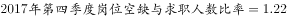；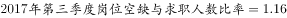。故上升了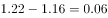。

故正确答案为B。

---

### 第 7 题　qid 2185132 · 平均数

2015—2017年，各季度的岗位空缺与求职人数比率的平均值约为（  ）。

- **A**. 1.07
- **B**. 1.09
- **C**. 1.11　✅
- **D**. 1.13

**答案**：C

**官方解析**

根据问题问“2015—2017年，各季度······的平均值”，可判定该题为现期平均数问题。定位折线图，根据“削峰填谷”可定基准线为1.00，则2015年第一季度—2017年第四季度分别相差：0.12、0.06、0.09、0.10、0.07、0.05、0.10、0.13、0.13、0.11、0.16、0.22，相加可得：1.34。

故2015—2017年，各季度的岗位空缺与求职人数比率的平均值为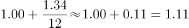。

故正确答案为C。

---

### 第 8 题　qid 2185135 · 增长

2017年第四季度求职人数比2016年第四季度下降了约（  ）。

- **A**. 

　✅
- **B**. 

- **C**. 

- **D**. 

**答案**：A

**官方解析**

【方法一】根据问题“下降”结合选项都是百分数，可判定题型为一般增长率。定位文字材料第二段和第三段可得：2017年第四季度，进入市场的求职者约为354.2万人，与去年同期相比，求职人数减少17.3万人。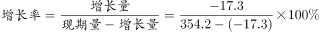，与A项最接近。

【方法二】根据问题“下降”结合选项百分数，及材料给了2017年第四季度的东部、中部、西部各地区求职人数的同比增长率，求2017年第四季度求职人数增长率，可判定题型为混合增长率。

定位表格图形可得，2017年第四季度东部、中部、西部的求职人数增长率分别为、、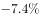。根据“混合增长率居中但不正中”可知，2017年第四季度求职人数的同比增长率在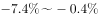之间，只有A项符合。 

故正确答案为A。

---

### 第 9 题　qid 2185136 · 综合

2015—2017年，人力资源市场供给最能满足市场需求的是（  ）。

- **A**. 2015年第三季度
- **B**. 2016年第二季度　✅
- **C**. 2017年第一季度
- **D**. 2017年第四季度

**答案**：B

**官方解析**

定位折线趋势图，是2015年第一季度至2017年第四季度岗位空缺与求职人数比率变化趋势，即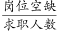。人力资源供给最能满足市场需求的是比率最小的。直接读数2015年三季度比率是1.09，2016年二季度是1.05，2017年一季度是1.13，2017年四季度是1.22，比较可知最小的是1.05。

故正确答案为B。

---

### 第 10 题　qid 2185139 · 综合

根据材料，下列说法正确的是（  ）。

- **A**. 2015年第一季度以来，东、中、西三大区域市场需求长期大于供给　✅
- **B**. 2016年第二季度以来，岗位空缺与求职人数比率总体呈“W”型变化趋势
- **C**. 2017年第三季度东、中、西三大区域人才市场中，西部市场岗位空缺与求职人数的比率最大
- **D**. 2016年第四季度，中部市场岗位空缺与求职人数的比率约为1.25

**答案**：A

**官方解析**

A项，由折线趋势图可知，2015年第一季度至2017年第四季度岗位空缺与求职人数比率都大于1，即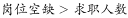，说明2015年第一季度以来，市场需求长期大于供给。正确；

B项，由折线趋势图可知，2016年第二季度以来，岗位空缺与求职人数比率呈“N”型变化趋势。错误；

C项，折线图是整体岗位空缺与求职人数比率变化趋势，表格材料是2017年第四季度的同比变化情况，故无法得出2017年第三季度西部市场岗位空缺与求职人数比率，因此无法比较。错误；

D项，由最后一段文字材料可知，2017年第四季度，中部市场岗位空缺与求职人数的比率为1.18。由表格材料可知，2017年第四季度与去年同期相比，中部市场用人需求，即岗位空缺的增长量是0.5万人，而求职人数的增长量为-0.4万人，所以2017年第四季度的中部市场岗位空缺与求职人数的比率大于2016年同期，可知，2016年第四季度中部市场岗位空缺与求职人数的比率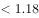。错误。

故正确答案为A。

---

## 材料 3

<b>根据下列资料，回答</b><b>96</b><b>～</b><b>100</b><b>题：</b>

        近年来，广东全省医疗卫生资源总量继续增加，医疗服务能力不断增强。截止2016年底，全省医疗卫生机构4.91万个，医疗卫生机构拥有床位46.5万张，其中：医院37.2万张，卫生院5.7万张。医疗卫生机构卫生技术人员66.8万人，其中：执业（助理）医师24.4万人，注册护士28.4万人，医护比1：1.16。

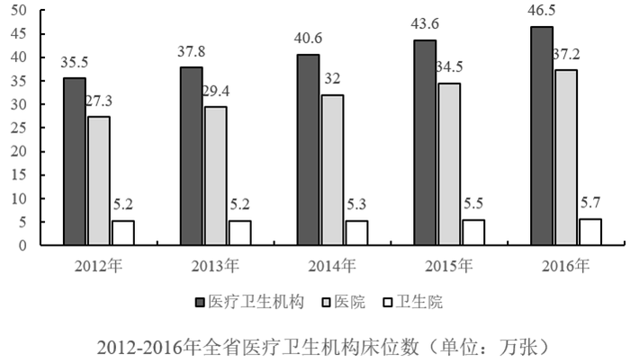

### 第 11 题　qid 2185039 · 增长

2010—2016年，全省医疗卫生机构数同比上一年增长率最高的是（  ）年。

- **A**. 2012
- **B**. 2013　✅
- **C**. 2014
- **D**. 2016

**答案**：B

**官方解析**

根据题干“2010-2016年···同比上一年增长率最高的是···年”，可判定本题为增长率比较问题。定位图一可得，2009-2016年每年全省医疗卫生机构数，根据增长率，求出选项各年增长率进行比较即可。

A.2012年：定位图一可得，2011年全省医疗卫生机构数4.59万个，2012年为4.66万个，则增长率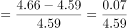；

B.2013年：定位图一可得，2012年全省医疗卫生机构数4.66万个，2013年为4.79万个，则增长率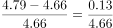；

C.2014年：定位图一可得，2013年全省医疗卫生机构数4.79万个，2014年为4.81万个，则增长率；

D.2016年：定位图一可得，2015年全省医疗卫生机构数4.84万个，2016年为4.91万个，则增长率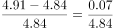。

比较可知同比增长率最高的为2013年。

故正确答案为B。

---

### 第 12 题　qid 2185042 · 平均数

2013—2016年，全省医疗卫生机构平均每年较上一年增加执业（助理）医师约（  ）万人。

- **A**. 0.9
- **B**. 1.1　✅
- **C**. 1.7
- **D**. 2.1

**答案**：B

**官方解析**

根据题干“2013-2016年…平均每年较上一年增加…约（）万人”，结合材料时间，可判定本题为年均增长量计算问题，且根据“较上一年”可知，2013-2016年中的每一年都需要和上一年相比较，所以2013年需与2012年比较，则本题基期为2012年。定位图三可得，2012年全省医疗卫生机构执业（助理）医师数为19.9万人，2016年为24.4万人。根据年均增长量可得，2013-2016年全省医疗卫生机构平均每年增加执业（助理）医师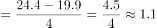万人。

故正确答案为B。

---

### 第 13 题　qid 2185044 · 平均数

2016年全省医疗卫生机构的平均床位数约是2012年的（  ）倍。

- **A**. 1.2　✅
- **B**. 1.5
- **C**. 2
- **D**. 2.3

**答案**：A

**官方解析**

根据题干“2016年······的平均床位数约是2012年的多少倍”，结合材料时间，可判定本题为现期倍数问题。定位图一可得，2012年全省医疗卫生机构数4.66万个，2016年为4.91万个。定位图二可得，2012年全省医疗卫生机构床位数为35.5万张，2016年为46.5万张。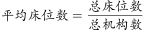，可得2016年平均床位数为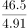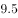张，2012年为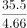张，则2016年是2012年的倍，与A项最接近。

故正确答案为A。

---

### 第 14 题　qid 2185047 · 比重

2012—2016年，全省医疗卫生机构卫生技术人员中注册护士所占比率最高的一年比例约为（  ）。

- **A**. 

- **B**. 

- **C**. 

　✅
- **D**. 

**答案**：C

**官方解析**

由题干“2012-2016年，······所占比率最高的一年”，可判定此题为现期比重比较问题。定位图3中2012-2016年的数据，根据现期比重公式可得，

2012年注册护士所占比率；

2013年注册护士所占比率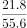；

2014年注册护士所占比率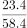；

2015年注册护士所占比率；

2016年注册护士所占比率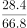。

比较可得，2012-2016年，全省医疗卫生机构卫生技术人员中注册护士所占比率最高的一年是2016年，其比例约为，与C项最接近。

故正确答案为C。

---

### 第 15 题　qid 2185055 · 综合

根据材料，下列说法正确的是（  ）。

- **A**. 
2016年全省医疗卫生机构数量是2009年的1.5倍

- **B**. 
2012—2016年，医院床位数占全省医疗卫生机构床位数的比例均低于

- **C**. 
2009—2016年，全省医疗卫生机构的平均卫生技术人员数均大于10

- **D**. 
2012—2016年，全省医疗卫生机构中注册护士与执业（助理）医师人数相差最大的是2016年
　✅

**答案**：D

**官方解析**

A项：定位统计图1中2009年全省医疗卫生机构数量为4.43万个，2016年为4.91万个，可得2016年全省医疗卫生机构数量是2009年的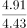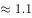倍，错误；

B项：定位统计图2中2012-2016年数据，可得

2012年医院床位数占全省医疗卫生机构床位数的比例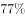；

2013年医院床位数占全省医疗卫生机构床位数的比例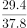；

2014年医院床位数占全省医疗卫生机构床位数的比例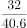；

2015年医院床位数占全省医疗卫生机构床位数的比例；

2016年医院床位数占全省医疗卫生机构床位数的比例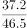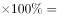。

由于2016年比例为，不满足2012-2016年医院床位数占全省医疗卫生机构床位数的比例均低于，错误；

C项：统计图3中没有提供2009-2011年卫生技术人员数量，故无法判断，错误；

D项：定位统计图3，2012年-2016年注册护士与执业（助理）医师人数相差分别为：2012年相差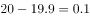万人、2013年相差万人、2014年相差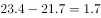万人、2015年相差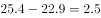万人、2016年相差万人。比较可知，2012-2016年，全省医疗卫生机构中注册护士与执业（助理）医师人数相差最大的是2016年，正确。

故正确答案为D。

---
