# 2018年广州市公务员录用考试 《行测》题（3月24日网友回忆版）

> 资料分析 · 15 题 · 广州市考 2018

## 材料 1

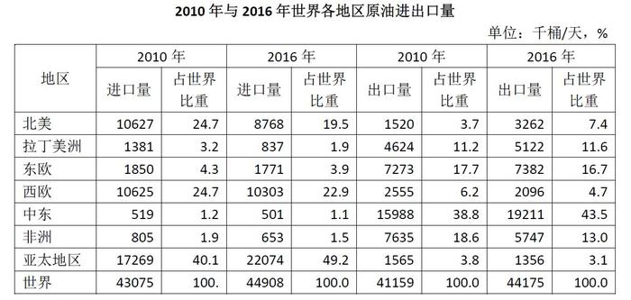

### 第 1 题　qid 2172101 · 比重

与2010年相比，2016年原油进口量和出口量占世界比重变化最大的地区分别是（  ）。

- **A**. 北美和中东
- **B**. 北美和非洲
- **C**. 亚太地区和中东
- **D**. 亚太地区和非洲　✅

**答案**：D

**官方解析**

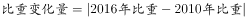，代入表格数据，各地区原油进口量占世界比重变化分别为：北美，亚太地区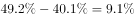，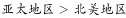，排除A项、B项；各地区原油出口量占世界比重变化分别为：中东，非洲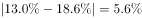，，排除C项。

故正确答案为D。

---

### 第 2 题　qid 2172105 · 比重

按照原油出口量占世界比重由高到低排位，2016年排位与2010年完全相同的地区有（  ）个。

- **A**. 0
- **B**. 1
- **C**. 2　✅
- **D**. 3

**答案**：C

**官方解析**

定位表格可得，2010年与2016年各地区按照原油出口量占世界比重由高到低排位情况如下：

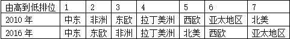

排名完全相同的地区有：中东、拉丁美洲，共2个。

故正确答案为C。

---

### 第 3 题　qid 2172164 · 增长

2016年中国原油进出口总量约比2010年增长了（  ）。

- **A**. 
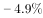

- **B**. 

- **C**. 

　✅
- **D**. 

**答案**：C

**官方解析**

根据题干“2016年……约比2010年增长”，结合选项为百分数，可判定此题为一般增长率计算问题。，代入统计图数据可得，2016年中国原油进出口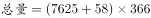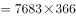千桶，2010年进出口千桶；代入公式：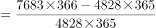。

故正确答案为C。

---

### 第 4 题　qid 2172166 · 比重

2016年中国原油进口量占世界比重约比2010年上升了（  ）个百分点。

- **A**. 4.2
- **B**. 4.9
- **C**. 5.9　✅
- **D**. 7.3

**答案**：C

**官方解析**

根据题干“2016年…比重约比2010年上升…百分点”可判定此题为两期比重的计算问题。定位表格可得，2016年世界原油进口量为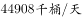，2010年为；定位统计图可得，2016年中国原油进口量为，2010年为。，则2016年中国原油进口量占世界比重比2010年上升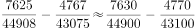，即2016年比重约比2010年上升5.9个百分点。

故正确答案为C。

---

### 第 5 题　qid 2172182 · 比重

以下说法中正确的是（  ）。

①2016年中东地区原油出口量比2010年增长超过了；

②2016年中国原油出口量占进出口总量的比重高于2010年；

③与2010年相比，2016年东欧和西欧两个地区的原油进口量都有所下降。

- **A**. ①和③　✅
- **B**. ①和②
- **C**. ②和③
- **D**. 仅有③

**答案**：A

**官方解析**

①定位表格，2016年中东地区原油出口量为，2010年为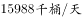，代入公式：，2016年出口量比2010年增长超过，正确；

②，代入统计图数据，2016年中国原油出口量占进出口总量的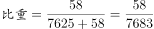，2010年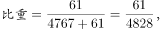前者分母大且分子小因而数值较小，故2016年比重低于2010年，错误；

③定位表格，2016年东欧原油进口量，与2010年的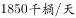相比，进口量下降，2016年西欧原油进口量，与2010年的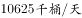相比，进口量下降，正确。

说法正确的为①、③。

故正确答案为A。

---

## 材料 2

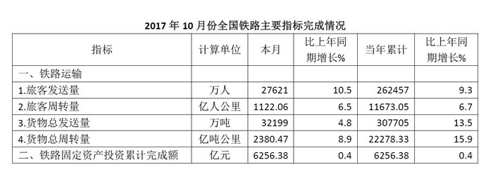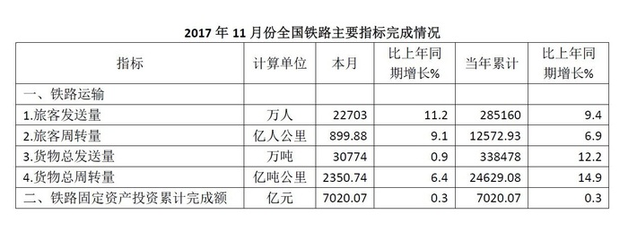

### 第 6 题　qid 2172132 · 综合

2017年10-12月份全国铁路共完成旅客发送（  ）万人。

- **A**. 2905.93
- **B**. 73543　✅
- **C**. 308379
- **D**. 855996

**答案**：B

**官方解析**

定位表格材料1、2、3的首行数据可得“2017年10、11、12月全国铁路完成旅客发送量依次为27621万人、22703万人和23219万人”，则2017年10-12月份全国铁路共完成旅客发送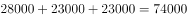万人，与B项最接近。（本题也可根据个位数字的和为3，直接排除A、C、D三项）

故正确答案为B。

---

### 第 7 题　qid 2172136 · 综合

2016年1-9月份全国铁路货物总发送量累计约为（  ）万吨。

- **A**. 215129
- **B**. 234836
- **C**. 240381　✅
- **D**. 275506

**答案**：C

**官方解析**

由题干“2016年1-9月，全国铁路货物总发送量······”，结合表格材料1分别给出“2017年10月，全国铁路货物总发送量32199万吨，同比增速；2017年1-10月累计307705万吨，同比增速”，根据“”，判定本题为基期和差问题。代入公式：，2016年1-9月份全国铁路货物总发送量累计约为万吨，与C项最接近。

故正确答案为C。

---

### 第 8 题　qid 2172139 · 综合

2017年10-12月份全国铁路旅客发送量和货物总发送量的图示应为（  ）。

- **A**. A　✅
- **B**. B
- **C**. C
- **D**. D

**答案**：A

**官方解析**

由材料可得“2017年10月、11月和12月，全国旅客发送量分别为27621万人、22703万人和23219万人”，则旅客发送量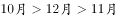，排除B、C两项；根据“2017年10月、11月和12月，全国货物总发送量分别为32199万吨、30774万吨和30387万吨”，则货物总发送量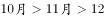月，排除D项。

故正确答案为A。

---

### 第 9 题　qid 2172144 · 综合

2016年全国铁路货物总周转量当年累计完成约（  ）亿吨公里。

- **A**. 8018
- **B**. 21435
- **C**. 23797　✅
- **D**. 333211

**答案**：C

**官方解析**

由题干“2016年······约为多少亿吨公里”，结合材料时间为“2017年”，判定本题为基期计算问题。定位表格材料3可得“2017年12月，全国铁路货物总周转量当年累计完成26962.20亿吨公里，同比增长”，代入公式：，可得：2016年全国铁路货物总周转量当年累计完成约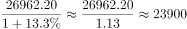亿吨公里，与C项最接近。

故正确答案为C。

---

### 第 10 题　qid 2172123 · 综合

以下说法正确的是（  ）。

- **A**. 2017年10-12月份全国铁路旅客周转量合计超过3000亿人公里
- **B**. 2017年铁路固定资产投资当年累计完成额高于2016年
- **C**. 2017年10-12月份全国铁路货物总周转量呈现上升趋势
- **D**. 2016年全国铁路旅客发送量当年累计超过280000万人　✅

**答案**：D

**官方解析**

A项：定位表格材料1、2、3的第二行数据，2017年10-12月份全国铁路旅客周转量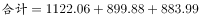亿人公里，错误；

B项：定位表格材料3，“2017年铁路固定资产投资当年累计完成额同比增长”，由于，可得2017年铁路固定资产投资当年累计完成额低于2016年，错误；

C项：定位表格材料1、3，2017年10月份全国铁路货物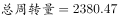亿吨公里；12月份全国铁路货物亿吨公里，10月12月，呈现下降趋势，错误；

D项：定位表格材料3，“2017年全国铁路旅客发送量为308379万人，同比增长”，代入公式：，可得2016年全国铁路旅客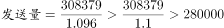万人，正确。

故正确答案为D。

---

## 材料 3

        截至2017年末，全国农村贫困人口从2012年末的9899万人减少至3046万人，比上年末减少1289万人；贫困发生率从2012年的下降至，比上年末下降1.4个百分点。

        分三大区域看，2017年东、中、西部地区农村贫困人口全面减少。东部地区农村贫困人口300万人，比上年减少190万人；中部地区农村贫困人口1112万人，比上年减少482万人；西部地区农村贫困人口1634万人，比上年减少617万人。

        分省看，2017年各省农村贫困发生率普遍下降至以下。其中，农村贫困发生率降至及以下的省份有17个，包括北京、天津、河北、内蒙古、辽宁、吉林、黑龙江、上海、江苏、浙江、安徽、福建、江西、山东、湖北、广东、重庆。

        全国农村贫困监测调查显示，2017年，贫困地区农村居民人均可支配收入9377元，比上年增加894元。

        2017年贫困地区农村居民收入增速快于上年。其主要特点：一是粮食丰收，贫困地区农村居民出售农产品数量增加，粮食、肉羊等部分大宗农产品市场价格回升。农民家庭一产经营净收入人均2826元，增长，增速比上年提高0.5个百分点。二是随着产业扶贫、旅游扶贫、电商扶贫等深入推进，贫困地区二三产业加快发展，一二三产业融合发展取得可喜进展。农民家庭二三产业经营净收入人均897元，增长，增速比上年提高6.5个百分点。

        2017年贫困地区农村居民分项收入增速全面快于全国农村居民。贫困地区农村居民人均工资性收入3210元，比上年增长，增速比全国农村平均水平高2.3个百分点；人均经营净收入3723元，增长，增速比全国农村平均水平高0.9个百分点；人均财产净收入119元，增长，增速比全国农村平均水平高0.5个百分点；人均转移净收入2325元，增长，增速比全国农村平均水平高3.0个百分点。

### 第 11 题　qid 2172068 · 增长

2017年全国农村居民分项收入增速最高的是（  ）。

- **A**. 人均工资性收入
- **B**. 人均经营净收入
- **C**. 人均财产净收入
- **D**. 人均转移净收入　✅

**答案**：D

**官方解析**

定位文字材料最后一段可得：2017年贫困地区农村居民人均工资性收入比上年增长，增速比全国农村平均水平高2.3个百分点；人均经营净收入增长，增速比全国农村平均水平高0.9个百分点；人均财产净收入增长，增速比全国农村平均水平高0.5个百分点；人均转移净收入增长，增速比全国农村平均水平高3.0个百分点。可得2017年全国农村居民分项收入中，人均工资性收入增长、人均经营净收入增长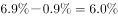、人均财产净收入增长、人均转移净收入增长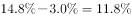，收入增速最高的是人均转移净收入。

故正确答案为D。

---

### 第 12 题　qid 2172071 · 比重

2016年，西部地区农村贫困人口占全国农村贫困人口的比重为（  ）。

- **A**. 

- **B**. 

- **C**. 

　✅
- **D**. 

**答案**：C

**官方解析**

由题干“2016年，…占…的比重为”，结合材料时间“2017年”，判定本题为基期比重计算问题。定位文字材料第一段可得“截至2017年末，全国农村贫困人口从2012年末的9899万人减少至3046万人，比上年末减少1289万人”，则2016年全国农村贫困人口为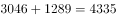万人；定位第二段可得“2017年，西部地区农村贫困人口1634万人，比上年减少617万人”，则2016年西部地区农村贫困人口为万人。代入公式：，则2016年，西部地区农村贫困人口占全国农村贫困人口的比重为，与C项最接近。

故正确答案为C。

---

### 第 13 题　qid 2172073 · 综合

以下省份，2017年农村贫困发生率全部在及以下的是（  ）。

- **A**. 吉林、安徽、海南
- **B**. 黑龙江、江西、贵州
- **C**. 内蒙古、湖北、河北　✅
- **D**. 湖北、辽宁、宁夏

**答案**：C

**官方解析**

定位文字材料第三段可得“2017年，农村贫困发生率降至及以下的省份有17个，包括北京、天津、河北、内蒙古、辽宁、吉林、黑龙江、上海、江苏、浙江、安徽、福建、江西、山东、湖北、广东、重庆。”只有C项（内蒙古、湖北、河北）均在以上范围内。

故正确答案为C。

---

### 第 14 题　qid 2172074 · 平均数

2016年贫困地区农民家庭一二三产业经营净收入人均（  ）元。

- **A**. 3483　✅
- **B**. 3608
- **C**. 3723
- **D**. 8483

**答案**：A

**官方解析**

方法一：

由题干“2016年······一二三产业经营净收入······”，结合文字材料第五段“2017年，贫困地区农民家庭一产经营净收入人均2826元，增长，······农民家庭二三产业经营净收入人均897元，增长”，根据“一二三产业=一产业+二三产业”，判定本题为基期和差计算问题。代入公式：，可得2016年贫困地区农民家庭一二三产业经营净收入人均为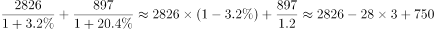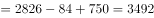元。与A项最接近。

方法二：

由题干“2016年······一二三产业经营净收入······”，结合文字材料最后一段“2017年贫困地区······人均经营净收入3723元，增长6.9%”，判定本题为基期计算问题。代入公式：，可得2016年贫困地区人均经营净收入为元。

故正确答案为A。

---

### 第 15 题　qid 2172077 · 平均数

以下说法中错误的是（  ）。

①2012年末全国农村贫困人口约为2017年末的3.8倍；

②2017年东、中部地区农村贫困人口之和占全国农村贫困人口的；

③2016年贫困地区农村居民人均经营净收入占人均可支配收入的比重超过。

- **A**. ①和②
- **B**. ①和③　✅
- **C**. ②和③
- **D**. 仅有③

**答案**：B

**官方解析**

①定位文字材料第一段“截至2017年末，全国农村贫困人口从2012年末的9899万人减少至3046万人”，可得2012年末全国农村贫困人口约为2017年末的倍，错误；

②定位文字材料第一段可得“截至2017年末，全国农村贫困人口为3046万人”，第二段可得“分三大区域看，2017年东部地区农村贫困人口300万人；中部地区农村贫困人口1112万人”，代入公式：，故2017年东、中部地区农村贫困人口之和占全国农村贫困人口的，正确；

③定位文字材料第四段可得“2017年，贫困地区农村居民人均可支配收入9377元，比上年增加894元”，代入公式：，则2016年，贫困地区农村居民人均可支配收入为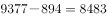元。定位最后一段可得“2017年，贫困地区农村居民人均经营净收入3723元，增长”，代入公式：，则2016年，贫困地区农村居民人均经营净收入为元。2016年贫困地区农村居民人均经营净收入占人均可支配收入的比重约为，错误。

说法错误的为①和③。

故正确答案为B。

---
