# 2018年广州市公务员录用考试 《行测》题（3月25日网友回忆版）

> 资料分析 · 15 题 · 广州市考 2018

## 材料 1

        某行政区从“服务态度”“办事效率”“政务公开”三个方面评价下属的6个街道办事处（简称为街道办）的综合服务效能水平，并调查了群众对各个街道办的满意度。这6个街道办分别为天坊街道办、云仙街道办、和风街道办、景秀街道办、东河街道办、南田街道办。每个方面评价分数采用百分制。评价结果如下图：

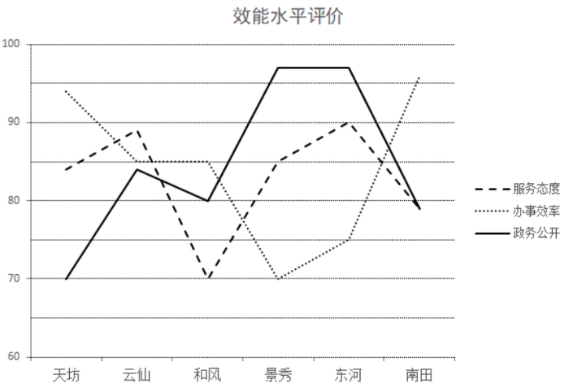

### 第 1 题　qid 2172869 · 综合

“服务态度”“办事效率”“政务公开”分数依次由高到低排序的街道办是（  ）。

- **A**. 天坊
- **B**. 景秀
- **C**. 云仙　✅
- **D**. 南田

**答案**：C

**官方解析**

定位统计图1，各街道办三项指标分数由高到低排序分别为：A项天坊：办事效率服务态度政务公开；B项景秀：政务公开服务态度办事效率；C项云仙：服务态度办事效率政务公开；D项南田：办事效率政务公开服务态度。符合要求的为C项云仙。

故正确答案为C。

---

### 第 2 题　qid 2172870 · 平均数

该行政区六个街道办的群众满意度平均分约为（  ）。

- **A**. 89
- **B**. 83　✅
- **C**. 75
- **D**. 70

**答案**：B

**官方解析**

根据题干“平均分”，可判定此题为现期平均数计算问题。定位统计图2可得，六个街道办群众满意度评价得分别为：约92分、约83分、85分、约71分、约73分、约94分，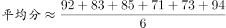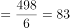分。

故正确答案为B。

---

### 第 3 题　qid 2172871 · 综合

如果要选择一个指标代替群众满意度得分，则最适合的指标是（  ）。

- **A**. 服务态度
- **B**. 办事效率　✅
- **C**. 政务公开
- **D**. 三项分数的均值

**答案**：B

**官方解析**

定位统计图1、2，将第二个图中的群众满意度折线图与第一个图中的三个指标对应的折线图分别进行比对，发现办事效率指标折线图与群众满意度相似度最高，且分数最接近，因此B项办事效率指标最适合代替。
故正确答案为B。

---

### 第 4 题　qid 2172872 · 综合

如果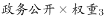，其中。而天坊的效能指数为84。那么以下、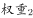、的数字依次排列最可能的是（  ）。

- **A**. 0.3，0.4，0.3　✅
- **B**. 0.3，0.5，0.2
- **C**. 0.2，0.3，0.5
- **D**. 0.1，0.2，0.7

**答案**：A

**官方解析**

定位统计图1，天坊的服务态度分数约为84、办事效率约为94、政务公开为70。按照各选项权重计算，天坊的效能指数为：

A项：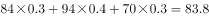；

B项：；

C项：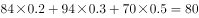；

D项：。

与天坊的实际效能指数84最接近的是A项。

故正确答案为A。

---

### 第 5 题　qid 2172873 · 综合

以下说法错误的是（  ）。

- **A**. 街道办的“群众满意”分数从高到低排序分别是南田、天坊、和风、云仙、东河、景秀
- **B**. 在“政务公开”中分数并列第一的街道办是东河和景秀
- **C**. 南田街道办在“服务态度”和“政务公开”取得的分数相同
- **D**. 云仙街道办三个效能分数均比和风街道办的要高　✅

**答案**：D

**官方解析**

A项：定位统计图2，“群众满意”分数从高到低排序为：南田天坊和风云仙东河景秀，正确；

B项：定位统计图1，“政务公开”中，景秀与东河分数相同，且高于其他4个街道办，为并列第一，正确；

C项：定位统计图1，南田街道办“服务态度”和“政务公开”的数据点重合，即分数相同，正确；

D项：定位统计图1，云仙、和风的办事效率得分均为85分，二者得分相同，错误。

本题为选非题，故正确答案为D。

---

## 材料 2

### 第 6 题　qid 2172874 · 综合

A市文化事业财政资金使用最为全面的行政区是（  ）。

- **A**. 雅溪
- **B**. 童新
- **C**. 桃甘
- **D**. 东丰　✅

**答案**：D

**官方解析**

由表格材料可得，A市各行政区文化事业财政拨款与支出中，只有东丰区各项支出均大于零，因此，A市文化事业财政资金使用最为全面的行政区是东丰区。
故正确答案为D。

---

### 第 7 题　qid 2172875 · 综合

A市文化事业财政资金拨款最少的行政区是（  ）。

- **A**. 雅溪　✅
- **B**. 童新
- **C**. 英远
- **D**. 东丰

**答案**：A

**官方解析**

由表格材料可得，A市各行政区文化事业财政资金拨款分别为：万元；万元；万元；万元。故A市文化事业财政资金拨款最少的行政区是雅溪区。

故正确答案为A。

---

### 第 8 题　qid 2172876 · 比重

以下A市各行政区的某项文化事业财政资金，支出额占拨款额的比重最低的是（  ）。

- **A**. 雅溪区——群众文化　✅
- **B**. 童新区——图书馆
- **C**. 英远区——群众文化
- **D**. 东丰区——文化活动

**答案**：A

**官方解析**

由题干“······占······的比重最低”，判定本题为现期比重比较问题。由公式：。定位材料可得“雅溪区群众文化财政资金支出额为1180万元、拨款额为1832万元”，占比为；“童新区图书馆财政资金支出额为1871万元、拨款额为1880万元”，占比为；“英远区群众文化财政资金支出额为11590万元、拨款额为7637万元”，占比为；“东丰区文化活动财政资金支出额为1039万元、拨款额为1039万元”，占比为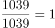。可得：支出额占拨款额的比重最低的是雅溪区—群众文化。

故正确答案为A。

---

### 第 9 题　qid 2172877 · 综合

下图最符合A市所有行政区各项文化事业财政支出总额情况的是（  ）。

- **A**. 
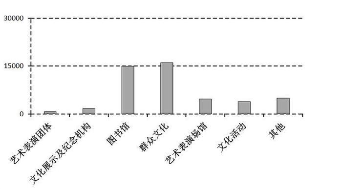

- **B**. 

　✅
- **C**. 
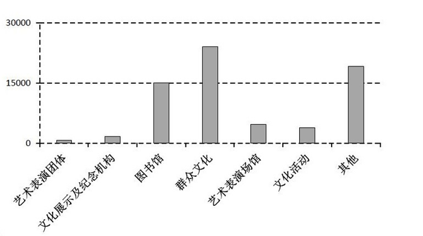

- **D**. 

**答案**：B

**官方解析**

由表格材料可得：A市所有行政区各项文化事业财政支出额中，群众文化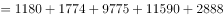万元，与30000万元比较接近，排除A项；其他万元，排除C项；艺术表演团体（万元）小于文化展示及纪念机构（万元），排除D项。

故正确答案为B。

---

### 第 10 题　qid 2172878 · 综合

以下说法正确的是（  ）。

- **A**. 各行政区的文化事业财政支出总额均比拨款总额要低
- **B**. 有些行政区并未在群众文化上支出财政资金
- **C**. 并未出现拨款金额与支出金额相等的情况
- **D**. 各行政区在图书馆上均有财政投入　✅

**答案**：D

**官方解析**

A项：由表格材料可得，英远区文化事业财政支出总额万元，拨款总额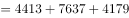万元，支出总额高于拨款总额，错误；

B项：由表格材料可得，所有行政区在群众文化上财政支出金额均大于0，即所有行政区在系项目上均有支出财政资金，错误；

C项：由表格材料可得，东丰区艺术表演团体财政拨款金额与支出金额相等，均为35万元，错误；

D项：由表格材料可得，各行政区在图书馆上财政支出金额均大于0，即各行政区在图书馆上均有财政投入，正确。

故正确答案为D。

---

## 材料 3

        我国2017年粮食种植面积为11222万公顷，比上年减少81万公顷。其中，小麦种植面积2399万公顷，减少20万公顷；稻谷种植面积3018万公顷，减少0.2万公顷；玉米种植面积3545万公顷，减少132万公顷。棉花种植面积323万公顷，减少12万公顷。油料种植面积1420万公顷，增加7万公顷。糖料种植面积168万公顷，减少1万公顷。

        2017年粮食产量61791万吨，比上年增加166万吨，增产。其中，夏粮产量14031万吨，增产；早稻产量3174万吨，减产；秋粮产量44585万吨，增产。全年谷物产量56455万吨，比上年减产。其中，稻谷产量20856万吨，增产；小麦产量12977万吨，增产；玉米产量21589万吨，减产。全年棉花产量549万吨，比上年增产。油料产量3732万吨，增产。糖料产量12556万吨，增产。茶叶产量255万吨，增产。

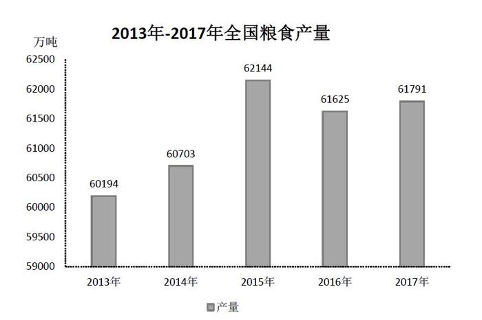

### 第 11 题　qid 2172879 · 综合

2017年，我国小麦、稻谷、玉米、棉花四种农作物中，种植面积减少速度最快的是（  ）。

- **A**. 小麦
- **B**. 稻谷
- **C**. 玉米　✅
- **D**. 棉花

**答案**：C

**官方解析**

由题干“减少速度最快的是”，可判定本题为一般增长率比较问题。定位文字材料第一段可得“我国2017年小麦种植面积2399万公顷，减少20万公顷；稻谷种植面积3018万公顷，减少0.2万公顷；玉米种植面积3545万公顷，减少132万公顷；棉花种植面积323万公顷，减少12万公顷”，代入公式：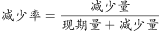，可得四种农作物种植面积减少速度分别为：小麦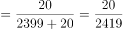；稻谷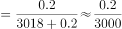；玉米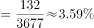；棉花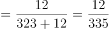。由于玉米和棉花的减少速度非常接近，故需要精确计算。可得种植面积减少速度最快的是玉米。

故正确答案为C。

---

### 第 12 题　qid 2172880 · 综合

2017年，我国棉花的产量比2016年约增产了（  ）万吨。

- **A**. 7
- **B**. 19　✅
- **C**. 31
- **D**. 48

**答案**：B

**官方解析**

由题干“…约增产了多少万吨”，可判定本题为增长量计算问题。定位文字材料第二段可得“2017年，我国棉花产量为549万吨，比上年增产”，代入公式：，可得：2017年，我国棉花的产量比2016年约增产了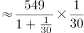万吨，与B项最接近。

故正确答案为B。

---

### 第 13 题　qid 2172881 · 增长

相较于上一年，2015年全国粮食产量的增长率约是2014年的（  ）倍。

- **A**. 3　✅
- **B**. 5
- **C**. 7
- **D**. 9

**答案**：A

**官方解析**

由题干“…约是…的多少倍”，可判定本题为现期倍数计算问题。定位柱形图可得“2015年全国粮食产量为62144万吨、2014年为60703万吨、2013年为60194万吨”，代入公式：，则2015年全国粮食产量同比增长率；2014年同比增长率。因此，相较于上一年，2015年全国粮食产量的增长率约是2014年的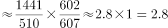倍，与A项最接近。

故正确答案为A。

---

### 第 14 题　qid 2172882 · 增长

三种谷物中，2017年产量比上年增加最多的谷物，其种植面积约占全国粮食种植面积的（  ）。

- **A**. 

- **B**. 

- **C**. 

　✅
- **D**. 

**答案**：C

**官方解析**

由题干“…约占…的百分之几”，可判定本题为现期比重计算问题。定位文字材料第二段可得“2017年，三种谷物中：稻谷产量20856万吨，增产；小麦产量12977万吨，增产；玉米产量21589万吨，减产”，由于玉米为减产，排除；稻谷和小麦产量增长率一致，稻谷现期量大于小麦现期量，根据，可以判定三种谷物中，稻谷增产最多。

定位文字材料第一段“2017年我国粮食种植面积为11222万公顷，其中稻谷种植面积3018万公顷”，代入公式：，可得2017年产量比上年增长最多的谷物稻谷，其种植面积约占全国粮食种植面积的。

故正确答案为C。

---

### 第 15 题　qid 2172883 · 综合

以下说法正确的是（  ）。

- **A**. 2017年，我国各种粮食产量均有所增长
- **B**. 2017年，小麦，稻谷，玉米的产量总和为谷物的总产量
- **C**. 2017年，小麦，稻谷，玉米这三种谷物中单位面积产量最高的是稻谷　✅
- **D**. 2017年，油料的产量增长率等于其种植面积增长率的3倍

**答案**：C

**官方解析**

A项：定位文字材料第二段可得“2017年，玉米产量为21589万吨，减产”，并非各种粮食产量均增长，错误；

B项：定位文字材料第二段可得“2017年，谷物产量为56455万吨。其中：稻谷产量为20856万吨；小麦产量为12977万吨；玉米产量为21589万吨”，稻谷、小麦和玉米产量之和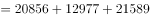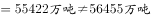，错误；

C项：定位文字材料第一段可得“2017年，小麦种植面积为2399万公顷；稻谷种植面积为3018万公顷；玉米种植面积为3545万公顷”；定位文字材料第二段可得“2017年，小麦产量为12977万吨；稻谷产量为20856万吨；玉米产量为21589万吨”。由于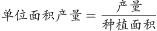，因此2017年三种谷物单位面积产量分别为：小麦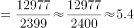吨/公顷；稻谷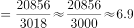吨/公顷；玉米吨/公顷，稻谷最高，正确；

D项：定位文字材料第二段可得“2017年油料产量增产”；定位文字材料第一段可得“2017年，油料种植面积1420万公顷，增加7万公顷”。代入公式：，2017年，油料种植面积增长率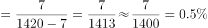。2017年，油料产量增长率等于其种植面积增长率的倍，错误。

故正确答案为C。

---
