# 2018年广西选调生考试《行测》试题（网友回忆版）

> 资料分析 · 15 题 · 选调 2018

## 材料 1

### 第 1 题　qid 2184622 · 增长

2016年网购固定篮子价格指数环比增速最快的月份是：

- **A**. 1月
- **B**. 2月　✅
- **C**. 7月
- **D**. 12月

**答案**：B

**官方解析**

定位图形材料可知，2016年1月、2月、7月、12月的环比增速分别为、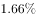、、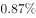，2月12月7月1月，所以环比增速最快的月份是2月份。

故正确答案为B。

---

### 第 2 题　qid 2184624 · 综合

2016年上半年网购固定篮子价格指数环比下跌的月份有几个？

- **A**. 3
- **B**. 4　✅
- **C**. 5
- **D**. 6

**答案**：B

**官方解析**

固定篮子价格指数环比下跌即只要满足环比增长率为负即可。定位图形材料可知，2016年上半年网购固定篮子价格指数环比下跌的月份有1月()、3月(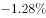)、5月(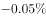)、6月()，共4个月。

故正确答案为B。

---

### 第 3 题　qid 2184626 · 增长

2016年各月网购固定篮子价格指数同比增速与上月该数字之间的差值最大的月份是：

- **A**. 2月
- **B**. 3月
- **C**. 11月
- **D**. 12月　✅

**答案**：D

**官方解析**

定位图形材料可知，2016年各月固定篮子价格指数同比增速与上月该数字之间的差值分别为：A项，2月，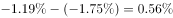；B项，3月，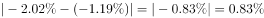；C项，11月，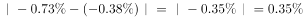；D项，12月，。差值最大的是12月。

故正确答案为D。

---

### 第 4 题　qid 2184627 · 综合

若2016年1月网购固定篮子价格指数为100，则当年12月该指数约为：

- **A**. 101　✅
- **B**. 106
- **C**. 95
- **D**. 99

**答案**：A

**官方解析**

由题意，给出2016年1月的指数，求2016年12月的指数，判定本题为现期计算问题。定位材料可知2016年1月环比下降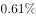，故2015年12月网购固定篮子价格指数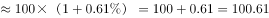；根据材料可知，2016年12月网购固定篮子价格指数同比增长率为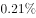，故可知2016年12月网购固定篮子，与A项最接近。

故正确答案为A。

---

### 第 5 题　qid 2184631 · 综合

关于网购固定篮子价格指数变化情况，能够从上述资料中推出的是：

- **A**. 
2016年，网购固定篮子价格指数曾连续3个月环比负增长

- **B**. 
2016年，每个月网购固定篮子价格指数都低于上年同期

- **C**. 
2016年3月购买网购固定篮子商品，平均比2015年3月多花费左右

- **D**. 
2015年12月的网购固定篮子价格指数低于同年1月
　✅

**答案**：D

**官方解析**

A项：由图中环比增速变化曲线可得，2016年网购固定篮子价格指数环比增速没有出现连续三个月为负数的情况，错误。

B项：由材料可知2016年12月，网购固定篮子价格指数同比增长，故2016年12月，网购固定篮子价格指数高于上年同期，错误。

C项：由材料可知2016年3月，网购固定篮子价格指数同比下降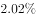，故2016年3月购买网购固定篮子商品，平均比2015年3月少花费左右，错误。

D项：由材料可知，2016年1月，网购固定篮子价格指数环比下降，同比下降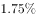，根据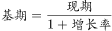可得，网购固定篮子价格指数对应的数值：、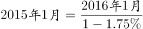，由于两式分子相等，分母前者大于后者，则分数前者小于后者，即2015年12月网购固定篮子价格指数低于同年1月份，正确。

故正确答案为D。

---

## 材料 2

        2017年1～2月，我国副省级城市实现软件业务收入3874亿元，同比增长。其中，软件产品收入1216亿元，同比增长；信息技术服务收入2042亿元，同比增长；嵌入式系统软件收入616亿元，同比增长。

### 第 6 题　qid 2184616 · 综合

2017年1～2月，副省级城市软件产品和信息技术服务收入占软件业务收入的：

- **A**. 三成多
- **B**. 六成多
- **C**. 八成多　✅
- **D**. 九成多

**答案**：C

**官方解析**

根据题干“2017年1~2月，……占……”，可判定本题为现期比重问题。定位文字材料可知，2017年1~2月，我国副省级城市实现软件业务收入3874亿元，其中软件产品收入1216亿元，信息技术服务收入2042亿元。则2017年1～2月副省级城市软件产品和信息技术服务收入占软件业务收入的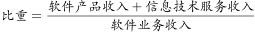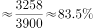，即八成多。

故正确答案为C。

---

### 第 7 题　qid 2184617 · 综合

2017年1～2月，软件企业数量最多的副省级城市软件业务收入约是软件企业数量最少的副省级城市的多少倍？

- **A**. 5
- **B**. 8
- **C**. 10
- **D**. 19　✅

**答案**：D

**官方解析**

根据题干“2017年1～2月，······是······多少倍”，可判定本题为现期倍数问题。定位表格材料前两列，根据软件企业数量比较可以发现，最多和最少的城市分别是武汉和哈尔滨，二者对应的软件业务收入分别为210.6亿元、11.3亿元。则题干所求倍，与D项最接近。

故正确答案为D。

---

### 第 8 题　qid 2184618 · 增长

2017年1～2月软件业务收入排名前10的副省级城市中，软件业务收入同比增速超过整体平均水平的有多少个？

- **A**. 4
- **B**. 5　✅
- **C**. 6
- **D**. 7

**答案**：B

**官方解析**

定位文字材料可知，2017年1～2月，我国副省级城市实现软件业务收入同比增长，定位表格材料可知，2017年1-2月软件业务收入排名前10的城市依次为深圳、广州、南京、成都、杭州、青岛、济南、西安、武汉、大连，软件业务收入同比增速超过整体水平（）的城市有广州（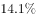）、杭州（）、青岛（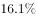）、西安（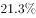）、武汉（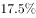）共5个副省级城市。

故正确答案为B。

---

### 第 9 题　qid 2184619 · 平均数

2017年1～2月，长三角地区副省级城市按照平均每家软件企业软件业务收入从高到低排序正确的是：

- **A**. 南京、杭州、宁波
- **B**. 杭州、南京、宁波　✅
- **C**. 宁波、杭州、南京
- **D**. 宁波、南京、杭州

**答案**：B

**官方解析**

根据题干“2017年1～2月，平均每家软件企业软件业务收入”，可判定本题为现期平均数的比较问题。定位表格材料可知每个城市的软件企业数和软件业务收入，根据，则长三角地区副省级城市平均每家企业软件业务收入如下：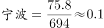；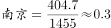；，从高到低排序为杭州、南京、宁波。

故正确答案为B。

---

### 第 10 题　qid 2184620 · 综合

关于2017年1～2月副省级城市软件业务，能够从上述资料中推出的是：

- **A**. 
软件业务收入增速最快的副省级城市，软件企业数量排名第三

- **B**. 
东北三省副省级城市软件业务收入不足副省级城市总额的

- **C**. 
深圳市平均每家软件企业软件业务收入约是广州市的2倍
　✅
- **D**. 
成都市软件业务收入占副省级城市总体比重高于上年同期水平

**答案**：C

**官方解析**

A项：定位表格材料可知，软件业务收入增速最快的副省级城市为西安市，增速为，其软件企业个数2050个，仅次于武汉市，在副省级城市中排名第二，非第三，错误。

B项：东北三省的副省级城市有大连、沈阳、长春和哈尔滨，定位表格材料可知，四个城市2017年1~2月软件业务收入总额为亿元；定位文字材料可知，2017年1~2月我国副省级城市实现软件业务收入3874亿元。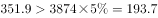，故东北三省副省级城市软件业务收入超过副省级城市总额的，错误。

C项：定位表格材料可知，2017年1~2月，深圳市软件企业1530个，软件业务收入875.1亿元；广州市软件企业1561个，软件业务收入442.6亿元。则2017年1~2月，深圳市平均每家软件企业软件业务收入是广州的倍，正确。

D项：定位文字材料可知，2017年1~2月我国副省级城市软件业务收入同比增长，定位表格材料可知，2017年1~2月成都市软件业务收入同比增长。根据两期比重比较的结论，部分增长率（）总体增长率()，则比重低于去年同期水平，错误。

故正确答案为C。

---

## 材料 3

        2017年1～4月，S市对欧盟进出口总值为802.6亿元人民币，比去年同期（下同）增长，占我国对欧盟进出口总值的。其中，对欧盟出口621.2亿元，增长，占我国对欧盟出口总值的；自欧盟进口181.4亿元，增长。

        1～4月，S市对欧盟以一般贸易方式进出口总值增长，占同期全市对欧盟进出口总值的；以加工贸易方式进出口总值下降，占同期全市对欧盟进出口总值的；以海关特殊监管方式进出口总值为139.3亿元，下降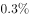。

        1～4月，在欧盟前5大贸易国中，S市对德国进出口164.3亿元，增长；对英国进出口123亿元，增长；对荷兰进出口108.1亿元，增长；对意大利进出口61.4亿元，增长；对法国进出口81.1亿元，下降。同期，对“一带一路”沿线欧盟国家进出口113.5亿元，增长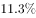。

### 第 11 题　qid 2184641 · 平均数

2017年1～4月，我国平均每月对欧盟进出口总值约为多少万亿元？

- **A**. 0.3　✅
- **B**. 0.5
- **C**. 0.8
- **D**. 1.2

**答案**：A

**官方解析**

根据题干“2017年1～4月，我国平均每月对欧盟进出口总值约为多少万亿元”，时间与材料一致，可判定本题为现期平均数计算问题。定位材料第一段“2017年1～4月，S市对欧盟进出口总值为802.6亿元人民币······占我国对欧盟进出口总值的”,则2017年1～4月我国平均每月对欧盟进出口总值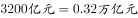，与A项最接近。

故正确答案为A。

---

### 第 12 题　qid 2184645 · 综合

2017年1～4月，S市除一般贸易、加工贸易和海关特殊监管方式进出口贸易之外，其余贸易方式对欧盟进出口约占其对欧盟进出口总值的：

- **A**. 
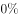

- **B**. 

　✅
- **C**. 

- **D**. 

**答案**：B

**官方解析**

根据题干“2017年1~4月······占······”，结合选项为百分数，时间与材料一致，可判定本题为现期比重问题。定位材料第一段“2017年1~4月，S市对欧盟进出口总值为802.6亿元人民币”，定位材料第二段“以一般贸易方式进出口总值······占同期全市对欧盟进出口总值的；以加工贸易方式进出口总值······占同期全市对欧盟进出口总值的；以海关特殊监管方式进出口总值为139.3亿元”。则以海关特殊监管方式进出口总值占比，故除这三种贸易方式以外的其余贸易方式占比约为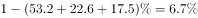，与B项最接近。

故正确答案为B。

---

### 第 13 题　qid 2184648 · 增长

2017年1～4月，S市对下列国家进出口同比增长最快的是：

- **A**. 德国
- **B**. 英国
- **C**. 荷兰　✅
- **D**. 意大利

**答案**：C

**官方解析**

定位材料第三段可知，2017年1~4月，S市对德国进出口同比增长，对英国进出口同比增长，对荷兰进出口同比增长，对意大利进出口同比增长。比较可知，对荷兰进出口同比增长最快。

故正确答案为C。

---

### 第 14 题　qid 2184654 · 比重

2017年1～4月S市对欧盟前5大贸易国中，进出口总值占S市对欧盟进出口总值比重高于上年同期水平的有几个？

- **A**. 1
- **B**. 2　✅
- **C**. 3
- **D**. 4

**答案**：B

**官方解析**

根据题干“2017年1～4月······比重高于上年同期水平······”可判定本题为两期比重问题。根据两期比重比较的结论，部分增长率大于整体增长率，则比重上升。定位材料第一段可知S市对欧盟进出口总值较去年同期增长，即整体增长率为，定位材料第三段，对荷兰（）、意大利（）这2个国家进出口总值的增速大于，因此有2个国家满足条件。

故正确答案为B。

---

### 第 15 题　qid 2184658 · 综合

关于2017年1～4月S市对欧盟贸易情况，能够从上述资料中推出的是：

- **A**. 以加工贸易方式进出口总值超过200亿元
- **B**. 对欧盟出口总值占全国比重低于自欧盟进口总值占全国比重
- **C**. 对欧盟前3大贸易国进出口总值超过对欧盟进出口额的一半
- **D**. 上年同期对“一带一路”沿线欧盟国家进出口超过100亿元　✅

**答案**：D

**官方解析**

A项：定位材料第一段可知，2017年1~4月S市对欧盟进出口总值为802.6亿元，定位材料第二段可知，2017年1~4月S市以加工贸易方式进出口总值占同期全市对欧盟进出口总值的，则2017年1~4月，S市以加工贸易方式进出口总值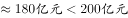，错误；

B项：定位材料第一段可知，2017年1~4月S市对欧盟进出口总值占全国比重为，对欧盟出口总值占全国比重为，根据混合比重的结论“居中而不中”，可得进口总值占全国比重进出口总值占全国比重（）出口总值占全国比重（），错误；

C项：定位材料第一段可知，S市对欧盟进出口总值为802.6亿元，定位材料第三段，可得S市对欧盟前3大贸易国进出口总值分别为：德国（164.3亿元）、英国（123亿元）、荷兰（108.1亿元），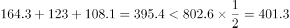，错误；

D项：定位材料第三段可知，2017年1~4月S市对“一带一路”沿线欧盟国家进出口113.5亿元，增长，则上年同期S市对“一带一路”沿线欧盟国家进出口额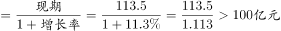，正确。

故正确答案为D。

---
