# 2018年新疆生产建设兵团面向社会招录公务员考试《行测》题（网友回忆版）

> 资料分析 · 20 题 · 新疆 2018

## 材料 1

        2016年，X省交通运输、仓储和邮政业实现增加值930.8亿元，增长，增速比2015年加快0.4个百分点，快于全省经济增速4.2个百分点；占全省GDP比重，比2015年上升0.2个百分点；对GDP增长贡献率；占全省第三产业增加值比重为，第三产业增长贡献率为。

        2016年，X省高速公路完成投资118亿元，建成公路里程236公里。高速公路通车里程达到5265公里，其中：国家高速公路网（行政级别属于国道的高速公路）里程达到3193公里。全省119个县（市、区）有113个通了高速公路。2016年底X省公路通车里程达到142065公里，新增公路通车里程1106公里，公路密度为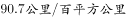。

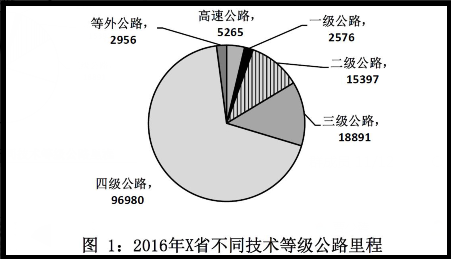

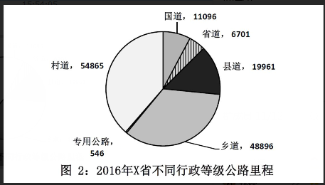

### 第 1 题　qid 2247276 · 比重

2016年，X省第三产业增加值占GDP比重约为：

- **A**. 

- **B**. 

- **C**. 

　✅
- **D**. 

**答案**：C

**官方解析**

由题干“2016年，X省第三产业增加值占GDP比重约为”，判定本题为现期比重问题。定位文字材料第一段可知，2016年X省交通运输、仓储和邮政业实现增加值930.8亿元，占全省GDP比重，占全省第三产业增加值比重为。则题目所求为：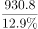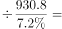，即占比约为，C项满足。

故正确答案为C。

---

### 第 2 题　qid 2247279 · 综合

X省面积约为多少万平方公里？

- **A**. 14
- **B**. 16　✅
- **C**. 18
- **D**. 20

**答案**：B

**官方解析**

由题干“X省面积约为多少万平方公里”，根据，结合材料所给时间，可判定本题为现期平均数问题。定位文字材料文字第二段可知，2016年底X省公路通车里程达到142065公里，公路密度为。根据，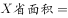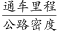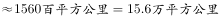，B项较为接近。

故正确答案为B。

---

### 第 3 题　qid 2247282 · 比重

2016年，X省国道里程中高速公路的比重约比省道：

- **A**. 高2个百分点
- **B**. 高20个百分点
- **C**. 低2个百分点　✅
- **D**. 低20个百分点

**答案**：C

**官方解析**

由题干“2016年，X省国道里程中高速公路的比重约比省道”，结合材料时间，判定本题为现期比重问题。定位文字材料第二段可知，2016年X省高速公路通车里程达到5265公里，国道里程中高速公路里程为3193公里，定位材料统计图2可知，2016年X省省道里程为6701公里，国道里程为11096公里。则题目所求为：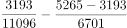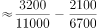，即低2个百分点，C项满足。

故正确答案为C。

---

### 第 4 题　qid 2247287 · 增长

2016年该省公路密度约比上年增加了多少？

- **A**. 0.7　✅
- **B**. 1.2
- **C**. 1.9
- **D**. 3.5

**答案**：A

**官方解析**

由题干“2016年该省公路密度约比上年增加了多少”，根据，判定本题为平均数的增长量问题。材料未表述2016年该省面积有所变化，默认面积保持不变，则。定位文字材料第二段可知，2016年底X省公路通车里程达到142065公里，新增公路通车里程1106公里，公路密度为90.7公里/百平方公里。根据公式：公路密度，则X省面积百平方公里。故题目所求为：公里/百平方公里。

故正确答案为A。

---

### 第 5 题　qid 2247297 · 综合

关于X省2016年交通发展状况，能够从上述资料中推出的是：

- **A**. 
交通运输、仓储和邮政业增加值较2014年增加了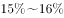之间

- **B**. 
高速公路通车里程较上年增长以上

- **C**. 
三级以上公路密度超过30

- **D**. 
公路里程中村道占比比乡道占比高不到5个百分点
　✅

**答案**：D

**官方解析**

A项：定位材料文字第一段，2016年，X省交通运输、仓储和邮政业实现增加值增长，增速比2015年加快0.4个百分点，可知2015年交通运输、仓储和邮政业实现增加值同比增长。代入间隔增长率公式：，题目表述错误；

B项：定位材料文字第二段，2016年，X省建成高速公路里程236公里，通车里程达到5265公里。则2015年X省高速通车里程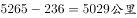，题目所求增速为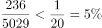，错误；

C项：根据图一，三级以上公路里程为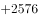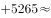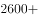，根据本篇材料第2题，X省面积约为1560百平方公里，则三级以上公路密度约为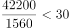公里/百平方公里，错误；

D项：定位材料文字第二段，2016年底X省公路通车里程达到142065公里；根据图二，公路里程中村道为54865公里，乡道为48896公里，题目所求为，正确。

故正确答案为D。

---

## 材料 2

        2017年上半年，Y市文化创意产业实现增加值1734.7亿元，同比增长，占地区生产总值的；规模以上文创产业法人单位实现收入6902.7亿元，同比增长，比上年4季度和今年1季度分别提高1.3个和0.2个百分点；实现利润总额349.8亿元，同比增长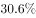。

        分领域看，上半年，文化艺术服务领域规模以上法人单位实现收入182.7亿元，同比增长；软件和信息技术服务领域实现收入2836.7亿元，增长；设计服务领域实现收入167.1亿元，增长；新闻出版及发行服务领域实现收入340.6亿元，增长。

        分功能区看，上半年文创功能区规模以上法人单位实现收入5087.5亿元，同比增长。其中，文化科技融合示范区实现收入2616.1亿元，同比增长；时尚创意功能区、文化体育（会展）融合功能区、文化艺术品交易功能区分别实现收入187.9亿元、167.5亿元、52.2亿元，同比分别增长、和，均呈快速增长态势。

        上半年文化创意产业完成固定资产投资141.6亿元，同比增长。其中，旅游休闲娱乐领域完成投资81.3亿元，占文创产业投资总额的。

### 第 6 题　qid 2247319 · 增长

2017年上半年，Y市地区生产总值同比增长。该市文化创意产业增加值占地区生产总值比重比上年提高了约多少个百分点？

- **A**. 0.2
- **B**. 0.8　✅
- **C**. 2.5
- **D**. 6.2

**答案**：B

**官方解析**

由题干“2017年上半年，Y市地区生产总值同比增长（b）。······占······比重比上年提高了约多少个百分点”，可判定本题为两期比重比较问题。定位文字材料第一段可得，“2017年上半年，Y市文化创意产业实现增加值（A）1734.7亿元，同比增长（a），占地区生产总值的”。由两期比重比较公式可得，所求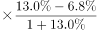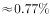，与B项最接近。

故正确答案为B。

---

### 第 7 题　qid 2247321 · 增长

2017年上半年，Y市软件和信息技术服务领域规模以上法人单位收入同比增量约占全市规模以上文创产业法人单位同比增量的：

- **A**. 四成
- **B**. 五成
- **C**. 六成　✅
- **D**. 七成

**答案**：C

**官方解析**

由题干“2017年上半年······约占······的”，结合选项为几成，可判定本题为现期比重计算问题。定位材料第一、二段可得，“2017年上半年，规模以上文创产业法人单位实现收入6902.7亿元，同比增长，软件和信息技术服务领域实现收入2836.7亿元，增长”。根据可得，2017年上半年，Y市软件和信息技术服务领域规模以上法人单位收入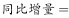。全市规模以上文创产业法人单位。故所求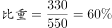，即为六成。

故正确答案为C。

---

### 第 8 题　qid 2247329 · 增长

设Y市文化科技融合示范区、时尚创意功能区、文化体育（会展）融合功能区和文化艺术品交易功能区规模以上法人单位2017年上半年收入同比增长率分别为X、Y、Z和N，则以下正确的是：

- **A**. 

- **B**. 

- **C**. 

- **D**. 
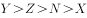
　✅

**答案**：D

**官方解析**

定位材料第三段可得，2017年上半年，文化科技融合示范区实现收入同比增长（X）；时尚创意功能区、文化体育（会展）融合功能区、文化艺术品交易功能区收入同比分别增长（Y），（Z）和（N）。比较可知，。

故正确答案为D。

---

### 第 9 题　qid 2247340 · 比重

Y市2017年上半年固定资产投资总额为3569.7亿元。则同期旅游休闲娱乐领域之外的文化创意产业完成固定资产投资占全市投资总额的比重为：

- **A**. 

　✅
- **B**. 

- **C**. 

- **D**. 

**答案**：A

**官方解析**

由题干“······占······的比重为”，可判定本题为现期比重计算问题。定位文字材料第四段可得，“（2017年）上半年文化创意产业完成固定资产投资141.6亿元，其中，旅游休闲娱乐领域完成投资81.3亿元，占文创产业投资总额的” 。则同期旅游休闲娱乐领域之外的文化创意产业完成固定资产投资为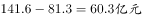，故，与A项最接近。

故正确答案为A。

---

### 第 10 题　qid 2247343 · 增长

关于2017年上半年Y市文化创意产业状况，以下信息中能够从上述资料中推出的有几条？
①2季度收入同比增速快于1季度
②按收入计算的利润率高于上年同期水平
③新闻出版及发行服务领域实现收入比设计服务领域高2倍多
④文化科技融合示范区实现收入增长了400多亿元

- **A**. 1
- **B**. 2　✅
- **C**. 3
- **D**. 4

**答案**：B

**官方解析**

①定位材料第一段可得，“2017年上半年，规模以上文创产业法人单位实现收入6902.7亿元，同比增长，比上年4季度和今年1季度分别提高1.3个和0.2个百分点”。可计算今年一季度增速为。上半年由1季度与2季度构成，根据混合增长率口诀混合居中但不中可知，

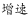，正确； 

②定位材料第一段可得，“（2017年上半年）规模以上文创产业法人单位实现收入（B）6902.7亿元，同比增长（b），实现利润总额（A）349.8亿元，同比增长（a）”。，则可按两期比重比较方法来比较两期利润率高低。，则比重上升，即利润率上升，正确；

③定位材料第二段可得，“（2017年上半年）设计服务领域实现收入167.1亿元，新闻出版及发行服务领域实现收入340.6亿元”。倍多，故新闻出版及发行服务领域实现收入是设计的2倍多，即高1倍多，错误；

④定位材料第三段可得，“（2017年上半年）文化科技融合示范区实现收入2616.1亿元，同比增长”。根据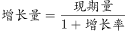可得，文化科技融合示范区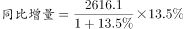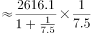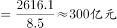，错误。

正确的有两项。

故正确答案为B。

备注：如果严格按照题干“Y市文化创意产业状况”分析，前两个是找不到对应数据的，选项中没有对应的正确答案个数。因此，合理推测本题前两个说法命题人考查的应该是规模以上文化产业的情况，由于命题不严谨可能会造成争议，特此说明。

---

## 材料 3

        十八大以来，兵团各级紧紧抓住经济换挡升级的有利时机，有力地推动了商贸规模持续扩大。2016年，兵团实现商品销售总额3341.37亿元，比2012年增长2.2倍；社会消费品零售总额632.29亿元，比2012年增长1.1倍。

        2016年，兵团拥有商贸流通企业3357家，比2012年增长。分行业看，批发零售企业3244家，比2012年增长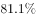；住宿餐饮企业113家，比2012年增长。

        2016年，兵团拥有亿元以上商品交易市场23家，比2012年增加13家，总摊位数12621个，实现交易额1001.39亿元，比2012年增长25.6倍。分类型看，综合市场6家，其中，工业消费品综合市场1家，农产品综合市场2家，其他综合市场3家；专业市场17家，其中，生产资料市场2家，农产品市场6家，纺织服装鞋帽市场2家，电器、通讯器材、电子设备市场2家，家具、五金及装饰材料市场2家，汽车、摩托车及零配件市场3家。

        2016年，兵团拥有商业综合体3家，商户数共348家，从业人员1802人。其中，自营、联营商户64家，实现销售额1.65亿元；租赁商户284家，实现销售额5.83亿元。

### 第 11 题　qid 2247293 · 综合

2012年兵团社会消费品零售总额约占商品销售总额的：

- **A**. 

- **B**. 

- **C**. 

　✅
- **D**. 

**答案**：C

**官方解析**

根据题干“2012年······约占······”，结合材料数据为2016年，可判定本题为基期比重问题。定位文字材料第一段，2016年，兵团实现商品销售总额3341.37亿元（B），比2012年增长2.2倍（b）；社会消费品零售总额632.29亿元（A），比2012年增长1.1倍（a）。代入基期比重公式：可得：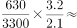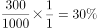，与C项最接近。

故正确答案为C。

---

### 第 12 题　qid 2247295 · 综合

2016年兵团批发零售企业的数量比2012年多出：

- **A**. 1391家
- **B**. 1453家　✅
- **C**. 1518家
- **D**. 1604家

**答案**：B

**官方解析**

由题干“2016年······的数量比2012年多出”，可判定本题为增长量计算问题。定位文字材料第二段，2016年，兵团拥有批发零售企业3244家，比2012年增长。代入增长量计算公式： 可得，批发零售企业增长了 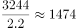家，与B项最接近。

故正确答案为B。

---

### 第 13 题　qid 2247300 · 综合

下列符合2016年兵团亿元以上商品交易专业市场分布情况的是：

- **A**. 
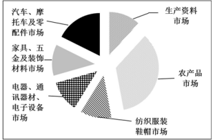
　✅
- **B**. 
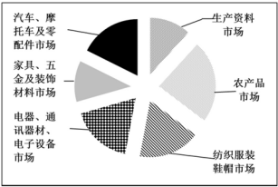

- **C**. 
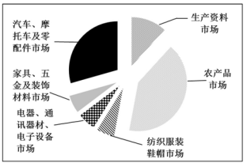

- **D**. 
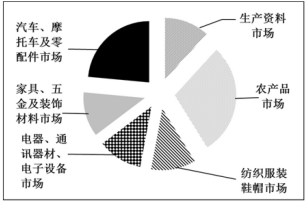

**答案**：A

**官方解析**

根据题干“2016年······分布情况······”，结合选项为各商品交易专业市场所占比重的饼状图，且材料数据时间也是2016年，可判定本题为现期比重问题。定位文字材料第三段，生产资料市场与纺织服装鞋帽市场均为2家，所占比重应相同，排除B、C两项；农产品市场6家，汽车、摩托车及零配件市场3家，农产品市场所占比重应为汽车、摩托车及零配件市场的2倍，排除D项。
故正确答案为A。

---

### 第 14 题　qid 2247303 · 综合

2016年，兵团商业综合体共实现多少销售额？

- **A**. 1.65亿元
- **B**. 3.23亿元
- **C**. 5.19亿元
- **D**. 7.48亿元　✅

**答案**：D

**官方解析**

定位文字材料第四段，2016年兵团商业综合体中自营、联营商户实现销售额1.65亿元；租赁商户实现销售额5.83亿元。可得2016年兵团商业综合体亿元。

故正确答案为D。

---

### 第 15 题　qid 2247306 · 综合

可以根据上述资料推出的是：

- **A**. 2012年，兵团商贸流通企业数量约为1700家
- **B**. 2012年，兵团拥有亿元以上商品交易市场11家
- **C**. 2016年，兵团商业综合体每商户平均有5名从业人员　✅
- **D**. 2016年，兵团批发零售企业数量约是住宿餐饮企业数量的20倍

**答案**：C

**官方解析**

A项：定位文字材料第二段，2016年，兵团拥有商贸流通企业3357家，比2012年增长。代入基期计算公式：可得，2012年兵团拥有商贸流通企业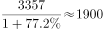家，错误；

B项：定位文字材料第三段，2016年，兵团拥有亿元以上商品交易市场23家，比2012年增加13家。可得2012年兵团拥有亿元以上商品交易市场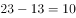家，错误；

C项：定位文字材料第四段，2016年，兵团拥有商业综合体3家，商户数共348家，从业人员1802人。可得每商户平均拥有从业人员人，正确；

D项：定位文字材料第二段，2016年兵团拥有批发零售企业3244家，住宿餐饮企业113家。可得批发零售企业数量约为住宿餐饮企业数量的倍，错误。

故正确答案为C。

---

## 材料 4

        2016年，某自治区全年实现农林牧渔业总产值2969.70亿元，比上年增长，其中，农业产值2163.11亿元，增长；林业产值50.28亿元，增长；畜牧业产值653.15亿元，增长；渔业产值22.18亿元，增长；农林牧渔服务业产值80.98亿元，增长。

        全年农作物播种面积9348.42万亩，同比增长。其中，粮食（含薯类）3601.70万亩，增长；棉花3232.36万亩，下降；油料382.82万亩，增长；甜菜115.69万亩，增长；蔬菜489.84万亩，增长。特色林果2475.48万亩，增长，其中，园林水果1490.64万亩，增长。

        全年粮食产量（含薯类）1512.28万吨，下降。棉花420万吨，增长。油料75.89万吨，增长。甜菜554.99万吨，增长。蔬菜1966.45万吨，增长。特色林果产量1790.88万吨，增长，其中，园林水果1011.02万吨，增长。

        年末猪牛羊存栏4621.35万头（只），比上年下降。全年猪牛羊出栏4341.90万头（只），增长。猪牛羊肉总产量134.70万吨，增长，其中，牛肉产量42.48万吨，增长；羊肉产量58.32万吨，增长；猪肉产量33.90万吨，增长。禽肉产量15.92万吨，增长。禽蛋产量36.13万吨，增长。牛奶产量156.08万吨，增长。水产品产量16.16万吨，增长。

        年末农业机械总动力2581.96万千瓦，同比增长。拥有大中型拖拉机48.68万台，增长；小型拖拉机26.74万台，下降。农作物机耕率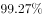，农作物机播率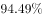。化肥施用量（折纯）250.21万吨，增长。农村用电量108.16亿千瓦时，增长。

        拥有农业产业化经营组织12682家，比上年增加820家。自治区级以上农业产业化重点龙头企业507家。农产品加工（流通）企业14165家（其中规模以上企业达到1030家），增加407家；实现农产品加工（流通）业总产值1895.02亿元，增长；自治区级以上休闲观光农业示范点达到183家，其中，国家级示范点达到19家。

### 第 16 题　qid 2247263 · 比重

最符合2015年该自治区农林牧渔业各产业产值占农林牧渔总产值的比例情况的是：

- **A**. 

　✅
- **B**. 

- **C**. 

- **D**. 
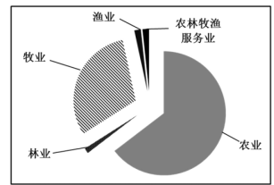

**答案**：A

**官方解析**

根据题干“2015年······占······比例”，结合材料时间为2016年，判定本题为基期比重问题。定位文字材料第一段可得，2016年该自治区农林牧渔业总产值为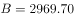亿元，增长率为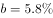；农业产值为亿元，增长率为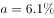；渔业产值22.18亿元，增长率为；农林牧渔服务业产值为80.98亿元，增长率为。

代入公式可得，2015年农业产值占总产值的比重为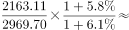，所占比重接近，排除B、D两项；根据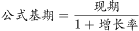可得，2015年渔业产值亿元远小于农林牧渔服务业产值亿元，排除C项。

故正确答案为A。

---

### 第 17 题　qid 2247266 · 增长

2016年，下列三种农作物的播种面积增加值从大到小排序正确的是：

- **A**. 油料、蔬菜、甜菜
- **B**. 蔬菜、油料、甜菜
- **C**. 甜菜、油料、蔬菜
- **D**. 油料、甜菜、蔬菜　✅

**答案**：D

**官方解析**

由题意：2016年…播种面积增加值从大到小排序，可判定本题为增长量比较问题。定位文字材料第二段可得，2016年油料播种面积为382.82万亩，增长率为；甜菜播种面积为115.69万亩，增长率为；蔬菜播种面积为489.84万亩，增长率为。代入增长量公式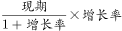可得，油料播种面积增加值为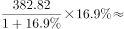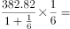万亩；甜菜播种面积增加值为万亩；蔬菜播种面积增加值为万亩。则播种面积增加值从大到小排序为油料、甜菜、蔬菜。

故正确答案为D。

备注：此处的增加值即增长量，不同于“产业增加值”当中的“增加值”。

---

### 第 18 题　qid 2247267 · 综合

2016年，亩产量最低的农作物是：

- **A**. 粮食（含薯类）
- **B**. 棉花　✅
- **C**. 特色林果
- **D**. 园林水果

**答案**：B

**官方解析**

根据题干“2016年，亩产量最低的农作物是”判定本题为现期平均数问题。定位文字材料第二段可得，2016年粮食(含薯类)播种面积3601.70万亩，棉花播种面积3232.36万亩，特色林果播种面积2475.48万亩，园林水果播种面积1490.64万亩；定位文字材料第三段可得，2016年粮食产量（含薯类）1512.28万吨，棉花产量420万吨，特色林果产量1790.88万吨，园林水果产量1011.02万吨。

根据可得，2016年粮食（含薯类）亩产量为吨，棉花亩产量吨，特色林果亩产量吨，园林水果亩产量吨。因此2016年亩产量最低的农作物是棉花。

故正确答案为B。

---

### 第 19 题　qid 2247269 · 综合

2015年，大中型拖拉机的数量是小型拖拉机的多少倍？

- **A**. 0.87
- **B**. 1.67　✅
- **C**. 2.02
- **D**. 2.84

**答案**：B

**官方解析**

根据题干“2015年……是……的多少倍”，结合材料时间为2016年，判定本题为基期倍数问题。定位文字材料第五段可得，2016年大中型拖拉机万台，增长率；小型拖拉机万台，增长率。代入基期倍数公式计算，，略小于1.8，但大于1.8的一半，满足条件的只有B选项。

故正确答案为B。

---

### 第 20 题　qid 2247271 · 综合

可以根据上述资料推出的是：

- **A**. 
2016年，农业产业化经营组织数量同比增加约
　✅
- **B**. 
2016年，牛羊猪肉产量的同比增长率中，牛肉的最高

- **C**. 
2016年，农产品加工（流通）企业的平均产值超过2000万

- **D**. 
2016年，棉花种植面积、猪牛羊存栏量、化肥施用量的同比增长率均为负值

**答案**：A

**官方解析**

A项：定位文字材料第六段可得，2016年农业产业化经营组织12682家，比上年增加820家，代入公式，正确。

B项：定位文字材料第四段可得，2016年牛肉产量增长、羊肉产量增长、猪肉产量增长，则羊肉产量增长率最高，错误。

C项：定位文字材料第六段可得，2016年农产品加工（流通）企业14165家，实现农产品加工（流通）业总产值1895.02亿元，，错误。

D项：定位文字材料第二段可得，2016年棉花种植面积增长率为；定位文字材料第四段可得，猪牛羊存栏量增长率为；定位文字材料第五段可得，化肥施用量（折纯）增长率为，错误。

故正确答案为A。

---
