# 2018年江苏省公务员录用考试《行测》题（B类）（网友回忆版）

> 资料分析 · 20 题 · 江苏 2018

## 材料 1

        2017年末，全国民用汽车保有量21743万辆，比上年末增长。其中私人汽车保有量18695万辆，增长；民用轿车保有量12185万辆，增长，其中私人轿车保有量11416万辆，增长；全国新能源汽车保有量153.0万辆，其中新能源汽车新注册登记65.0万辆，比上年增加15.6万辆。

        按地区分，东部、中部、西部地区机动车保有量分别为15544万辆、9006万辆、6436万辆。其中，西部地区近五年汽车保有量增加1963万辆，年均增速，高于东部、中部地区、的年均增速。

        2017年末，全国机动车驾驶人3.85亿人，近五年年均增加2467万人，汽车驾驶人超3.42亿人。从性别看，男性驾驶人2.74亿人，占；女性驾驶人1.11亿人，占，比上年末提高1.6个百分点。

### 第 1 题　qid 2172304 · 综合

2016年末全国私人轿车保有量为：

- **A**. 10148万辆　✅
- **B**. 11006万辆
- **C**. 13879万辆
- **D**. 16559万辆

**答案**：A

**官方解析**

由题目求“2016年末全国私人轿车保有量”，结合材料时间为“2017年末”，判定本题为基期计算问题。定位材料第一段 “2017年末，私人轿车保有量11416万辆，增长”。代入公式：，可得2016年末全国私人轿车保有量为万辆，和A项最接近。

故正确答案为A。

---

### 第 2 题　qid 2172326 · 比重

2017年全国新能源汽车新注册登记数占年末新能源汽车保有量的比重是：

- **A**. 

- **B**. 

　✅
- **C**. 

- **D**. 

**答案**：B

**官方解析**

由题目求“2017年······占······的比重”，判定本题为现期比重问题。定位材料第一段“全国新能源汽车保有量153.0万辆，其中新能源汽车新注册登记65.0万辆”。代入公式：，可得2017年全国新能源汽车新注册登记数占年末新能源汽车保有量的比重是：。

故正确答案为B。

---

### 第 3 题　qid 2172334 · 综合

2012年末西部地区汽车保有量为：

- **A**. 

- **B**. 

- **C**. 

　✅
- **D**. 

**答案**：C

**官方解析**

由题目求“2012年末西部地区汽车保有量”，结合材料时间为“2017年末”判定本题为基期计算问题。定位材料第二段“2017年末，西部地区近五年汽车保有量增加1963万辆，年均增速”，根据年均增长率公式：，可得：，故可推出2012年末西部地区汽车保有量为万辆。

故正确答案为C。

---

### 第 4 题　qid 2172335 · 比重

若2018年全国男性机动车驾驶人数量不少于上年末，要使女性机动车驾驶人占比达到，则女性驾驶人增加的人数至少为：

- **A**. 462万
- **B**. 643万　✅
- **C**. 963万
- **D**. 1099万

**答案**：B

**官方解析**

根据题干“2018年，······占比达到”，可判定本题为现期比重问题。定位材料第三段“2017年末，全国机动车驾驶人3.85亿人…男性驾驶人2.74亿人，占；女性驾驶人1.11亿人，占”，2018年女性驾驶人占比，要使得女性驾驶人增加人数最少即分子最小，分数值一定时要使得分子最小即使得分母最小，结合题干“2018年全国男性机动车驾驶人数量不少于上年末”可知男性驾驶人增加人数最少为0，此时分母取最小。可得，解得女性增加人数最少约为643万人。

故正确答案为B。

---

### 第 5 题　qid 2172336 · 综合

不能从上述资料推出的是：

- **A**. 
2016年全国新能源汽车新注册登记49.4万辆

- **B**. 
2017年末全国机动车保有量为30986万辆

- **C**. 
2017年全国民用轿车保有量增长快于民用汽车

- **D**. 
2013—2017年全国汽车保有量年均增速为
　✅

**答案**：D

**官方解析**

A项：定位材料第一段“2017年末，新能源汽车新注册登记65.0万辆，比上年增加15.6万辆”，则2016年末全国新能源汽车新注册登记万辆，正确；

B项：定位材料第二段“东部、中部、西部地区机动车保有量分别为15544万辆、9006万辆、6436万辆”，则2017年末全国机动车保有量万辆，正确；

C项：定位材料第一段“2017年末，全国民用汽车保有量21743万辆，比上年末增长。其中私人汽车保有量18695万辆，增长；民用轿车保有量12185万辆，增长”，民用轿车保有量增长，大于民用汽车保有量增长，即2017年末全国民用轿车保有量增长快于民用汽车，正确；

D选项：选项求的是“2013—2017年全国汽车保有量年均增速”，定位材料第二段“西部地区近五年汽车保有量增加1963万辆，年均增速，高于东部、中部地区、的年均增速”，只知道三个部分的年均增速，但不知道各地区具体的汽车保有量，因此无法具体计算全国的汽车保有量年均增速，错误。

本题为选非题，故正确答案为D。

---

## 材料 2

### 第 6 题　qid 2172454 · 综合

2013-2016年中国在欧洲和北美洲承包工程完成营业额最接近的年份是：

- **A**. 2013年
- **B**. 2014年　✅
- **C**. 2015年
- **D**. 2016年

**答案**：B

**官方解析**

定位表格材料可得，2013-2016年中国在欧洲和北美洲承包工程完成营业额的具体值。估算每年欧洲和北美洲完成营业额的差值：

2013年万美元；2014年万美元；

2015年万美元；2016年万美元。

故2014年欧洲和北美洲完成营业额差值最小，即2014年中国在欧洲和北美洲承包工程完成营业额最接近。

故正确答案为B。

---

### 第 7 题　qid 2172455 · 平均数

2014-2016年中国在非洲承包工程完成营业额的年平均增量是：

- **A**. -75723万美元
- **B**. -50482万美元
- **C**. 89241万美元
- **D**. 118988万美元　✅

**答案**：D

**官方解析**

根据题干“2014-2016年······年平均增量”，可判定本题为年均增长量的计算问题。定位表格材料可得，2013年中国在非洲承包工程完成营业额为4789064万美元，2016年完成营业额为5146029万美元,故2014-2016年中国在非洲承包工程完成营业额的年平均增量万美元，与D项最接近。

故正确答案为D。

---

### 第 8 题　qid 2172456 · 综合

2013-2016年中国在亚洲承包工程当年派出人数超过其余5个洲派出总人数的年份个数有：

- **A**. 1个
- **B**. 2个　✅
- **C**. 3个
- **D**. 4个

**答案**：B

**官方解析**

定位表格材料“当年派出人数（人）”可得：

2013年中国在亚洲承包工程当年派出人数为130888人，其余5个洲派出总人数为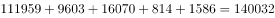人，，不符合；

2014年中国在亚洲承包工程当年派出人数为134534人，其余5个洲派出总人数为人，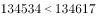，不符合；

2015年中国在亚洲承包工程当年派出人数为133373人，其余5个洲派出总人数为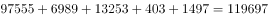人，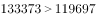，符合；

2016年中国在亚洲承包工程当年派出人数为140888人，其余5个洲派出总人数为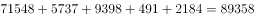人，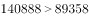，符合。

符合条件的有2015年和2016年两个年份。

故正确答案为B。

---

### 第 9 题　qid 2172458 · 比重

下列各洲中，2015年中国在其承包工程派出人数占当年派出总人数的比重与上年相差最大的是：

- **A**. 亚洲　✅
- **B**. 北美洲
- **C**. 欧洲
- **D**. 拉丁美洲

**答案**：A

**官方解析**

根据题干“2015年…占…的比重与上年相差最大的是”，可判定本题为两期比重差的比较问题。定位表格可得：2015年派出人数中，亚洲为133373人，北美洲为403人，欧洲为6989人，拉丁美洲为13253人，派出总人数为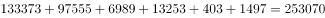人；2014年派出人数中，亚洲为134534人，北美洲为367人，欧洲为10162人，拉丁美洲为13990人，派出总人数为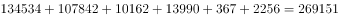人。根据，故

亚洲的两期比重差：；

北美洲的两期比重差：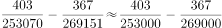；

欧洲的两期比重差：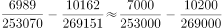；

拉丁美洲的两期比重差：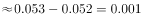。

综上所述，亚洲的比重差最大。

故正确答案为A。

---

### 第 10 题　qid 2172467 · 综合

下列判断不正确的是：

- **A**. 
2014—2016年中国在世界各洲承包工程完成营业额之和逐年增加

- **B**. 
2016年中国在大洋洲承包工程派出人数不足当年派出总人数的

- **C**. 
2016年中国在世界各洲承包工程派出总人数比2015年少2万人以上

- **D**. 
2013—2016年中国在拉丁美洲承包工程完成营业额均不足当年完成营业总额的
　✅

**答案**：D

**官方解析**

A项：定位表格材料，可得2013年中国在世界各洲承包工程完成营业额之和约为：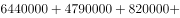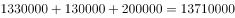万美元；2014年完成营业额之和约为：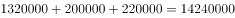万美元；2015年完成营业额之和约为：万美元；2016年完成营业额之和约为：万美元，故2014-2016年中国在世界各洲承包工程完成营业额之和逐年增加，正确；

B项：定位表格，可知2016年中国在各大洲承包工程派出人数。故2016年中国在大洋洲承包工程派出人数占总人数比重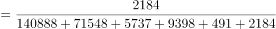，正确；

C项：定位表格，可知2016年和2015年中国在世界各大洲承包工程派出人数。2016年派出人数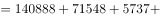人，2015年派出人数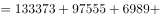人，故2016年派出总人数比2015年派出总人数增加人数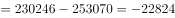人，减少超过2万人，正确；

D项：定位表格，可知2013-2016年中国在世界各大洲承包工程完成营业额。2015年拉丁美洲承包工程完成营业额占当年营业总额比重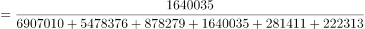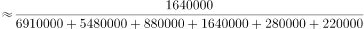，错误；

本题为选非题，故正确答案为D。

---

## 材料 3

        2016年江苏规模以上光伏产业总产值2846.2亿元，比上年增长，增速较上年回落3.5个百分点；主营业务收入2720.5亿元，增长，增速回落2.5个百分点；利润总额153.6亿元，增长，增速回落8.8个百分点。苏南、苏中、苏北地区规模以上光伏产业产值分别比上年增长、、。2016年江苏光伏发电新增装机容量123万千瓦，年末累计装机容量546万千瓦。

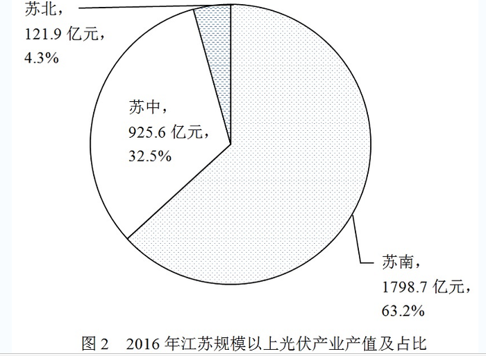

### 第 11 题　qid 2172271 · 综合

2015年末江苏光伏发电累计装机容量是：

- **A**. 123万千瓦
- **B**. 423万千瓦　✅
- **C**. 546万千瓦
- **D**. 669万千瓦

**答案**：B

**官方解析**

根据题干“2015年末江苏光伏发电累计装机容量”，结合材料数据为2016年，可判定本题为基期计算问题。定位文字材料最后一句可得：2016年光伏发电新增装机容量123万千瓦，年末累计装机容量546万千瓦。根据公式：，2015年末江苏光伏发电累计装机容量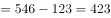万千瓦。

故正确答案为B。

---

### 第 12 题　qid 2172275 · 增长

2016年3—12月，江苏规模以上光伏产业产值环比增速低于上年同期的月份个数为：

- **A**. 2个
- **B**. 3个
- **C**. 5个　✅
- **D**. 8个

**答案**：C

**官方解析**

由题目问“环比增速低于上年同期的月份个数”，即每个月的环比增速要与上年同期比较，判定为一般增长率比较问题。定位图1可得“2016年2-12月每个月份同比增长率”，根据增长率公式可得：，即：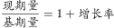，故可得：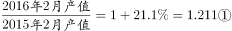

；。

将②÷①，可得，整理得：,即2016年3月环比增速低于上年同期的环比增速。

由此可得：若本月产值同比增长率小于上月，则本月环比增长率低于上年同期，满足条件的有3月、5月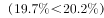、7月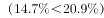、8月、9月，共5个月份。

故正确答案为C。

---

### 第 13 题　qid 2172279 · 综合

2014年江苏规模以上光伏产业利润总额为

- **A**. 114.3亿元　✅
- **B**. 127.6亿元
- **C**. 133.9亿元
- **D**. 137.6亿元

**答案**：A

**官方解析**

根据题干“2014年……”，结合材料时间为2016年，可判定本题为间隔基期计算问题。定位文字材料第三行可得：利润总额153.6亿元，增长，增速回落8.8个百分点。故利润总额的间隔增长率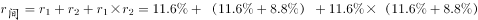。

2014年江苏规模以上光伏产业利润总额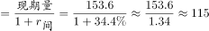亿元，与A项最接近。

故正确答案为A。

---

### 第 14 题　qid 2172283 · 比重

2015年苏中地区规模以上光伏产业产值占全省的比重为：

- **A**. 

- **B**. 

- **C**. 

- **D**. 

　✅

**答案**：D

**官方解析**

根据题干“2015年······占······的比重”，结合材料数据时间为2016年，可判定本题为基期比重问题。定位文字材料可得：2016年江苏规模以上光伏产业总产值2846.2亿元，比上年增长，苏中地区规模以上光伏产业产值增长；定位图2可得：2016年苏中地区光伏产业产值占总产值比重为。根据基期比重公式：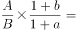，只有D项满足。

故正确答案为D。

---

### 第 15 题　qid 2172298 · 综合

下列说法正确的是：

- **A**. 
2016年江苏规模以上光伏产业利润率低于
　✅
- **B**. 
2015年苏中地区规模以上光伏产业产值比苏北地区多10倍以上

- **C**. 
2016年2—12月江苏规模以上光伏产业产值少于上年同期的有3个月

- **D**. 
2015—2016年江苏规模以上光伏产业主营业务收入年均增速不到

**答案**：A

**官方解析**

A项，定位文字材料可得，主营业务收入为2720.5亿元，利润总额为153.6亿元，故2016年江苏规模以上光伏产业利润率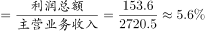，正确；

B项，定位文字材料与饼形图可得，2016年苏中地区规模以上光伏产业产值为925.6亿元，增长率为，苏北地区规模以上光伏产业产值为121.9亿元，增长率为，基期倍数，B项问的是多的倍数，应该再减1倍，多出不到9倍，错误；

C项，定位折线图，要想让2016年2-12月江苏规模以上光伏产业产值少于上年同期，只需定位同比增速为负的月份即可，只有9月与10月两个月满足，错误；

D项，定位文字材料可得2016年主营业收入为2720.5亿元，增长，增速回落2.5个百分点，故2015年增速为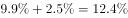。已知年均增长率公式，所以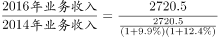，而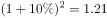，所以应大于，错误。

故正确答案为A。

---

## 材料 4

        2017年末全国农村贫困人口3046万人，比上年末减少1289万人，比2012年末减少6853万人；贫困发生率（指年末农村贫困人口占目标调查人口的比重）为，比2012年末下降7.1个百分点。2017年全国贫困地区农村居民人均可支配收入9377元，比上年增长。

### 第 16 题　qid 2172264 · 综合

2013—2017年全国农村贫困人口年均减少的人数是

- **A**. 1055万
- **B**. 1142万
- **C**. 1289万
- **D**. 1371万　✅

**答案**：D

**官方解析**

根据题干“2013-2017年······年均减少的人数是”，可判定本题为年均增长量计算问题。定位文字材料“2017年末全国农村贫困人口3046万人，······比2012年末减少6853万人”，故2013年2017年全国农村贫困人口年均增长量万人，即2013年-2017年全国农村贫困人口年均减少的人数是1370.6万人，与D项最接近。

故正确答案为D。

---

### 第 17 题　qid 2172268 · 平均数

2017年全国贫困地区农村居民人均可支配收入比上年增加的金额是

- **A**. 782元
- **B**. 853元
- **C**. 891元　✅
- **D**. 1069元

**答案**：C

**官方解析**

根据题干“2017年······比上年增加的金额是”，可判定本题为增长量计算问题。定位文字材料“2017年全国贫困地区农村居民人均可支配收入9377元，比上年增长”，故2017年全国贫困地区农村居民人均可支配收入比上年增加的金额元，C选项最为接近。

故正确答案为C。

---

### 第 18 题　qid 2172273 · 增长

2017年末全国农村贫困发生率的目标调查人口与2012年末相比，增加的人数是：

- **A**. 1209万　✅
- **B**. 1033万
- **C**. -1319万
- **D**. 0

**答案**：A

**官方解析**

根据题干“2017年······与2012年末相比，增加的人数”，可判定本题为增长量的计算问题。定位文字材料“2017年末全国农村贫困人口3046万人······比2012年末减少6853万人；贫困发生率（指年末农村贫困人口占目标调查人口的比重）为，比2012年末下降7.1个百分点”，故2017年末全国农村贫困发生率的目标调查人口万人，2012年末全国农村贫困发生率的目标调查人口万人，则2017年末全国农村贫困发生率的目标调查人口与2012年末相比，增加人数为：万人，与A项一致。

故正确答案为A。

---

### 第 19 题　qid 2172277 · 增长

2014—2017年全国、城镇和农村居民人均可支配收入年均增速的快慢关系是

- **A**. 城镇最快、全国次之、农村最慢
- **B**. 农村最快、全国次之、城镇最慢　✅
- **C**. 全国最快、农村次之、城镇最慢
- **D**. 农村最快、城镇次之、全国最慢

**答案**：B

**官方解析**

由题干“2014-2017年······年均增速的快慢关系······”，可判定此题为年均增长率的比较问题。根据年均增长率的公式：，可得：，可看出2017年的值与2013年的值比值越大，年均增速越大，故此题比较2017年与2013年的比值大小即可。定位统计图可知，，，，所以三者的年均增速的快慢关系是：。

故正确答案为B。

---

### 第 20 题　qid 2172282 · 综合

下列判断不正确的是：

- **A**. 
2012年末全国农村贫困发生率是

- **B**. 
2014—2017年全国城镇和农村居民人均可支配收入均逐年增加

- **C**. 
2014—2017年全国城镇与农村居民人均可支配收入的差额逐年减少
　✅
- **D**. 
2017年全国农村居民人均可支配收入是贫困地区农村居民的1.4倍

**答案**：C

**官方解析**

A项：定位文字材料“2017年末全国农村贫困发生率（指年末农村贫困人口占目标调查人口的比重）为，比2012年末下降7.1个百分点”，可知2012年末全国农村贫困发生率是，正确；

B项：定位统计图，通过数字逐年递增，可知2014-2017年全国城镇和农村居民人均可支配收入均逐年增加，正确；

C项：定位统计图中代表农村和城镇的柱形图可知，2013年全国城镇与农村居民人均可支配收入的差额是元，2014年：元，2015年：元，2016年：元，2017年：元，通过以上数据可看出，2014-2017年全国城镇与农村居民人均可支配收入的差额逐年增加，错误；

D项：定位统计图可知2017年全国农村居民人均可支配收入是13432元，定位文字材料可知2017年全国贫困地区农村居民人均可支配收入是9377元，则2017年全国农村居民人均可支配收入是贫困地区农村居民的倍，正确。

本题为选非题，故正确答案为C。

---
