# 2018年江苏省公务员录用考试《行测》题（C类）（网友回忆版）

> 资料分析 · 20 题 · 江苏 2018

## 材料 1

        2017年末，全国民用汽车保有量21743万辆，比上年末增长。其中私人汽车保有量18695万辆，增长；民用轿车保有量12185万辆，增长，其中私人轿车保有量11416万辆，增长；全国新能源汽车保有量153.0万辆，其中新能源汽车新注册登记65.0万辆，比上年增加15.6万辆。

        按地区分，东部、中部、西部地区机动车保有量分别为15544万辆、9006万辆、6436万辆。其中，西部地区近五年汽车保有量增加1963万辆，年均增速，高于东部、中部地区、的年均增速。

        2017年末，全国机动车驾驶人3.85亿人，近五年年均增加2467万人，汽车驾驶人超3.42亿人。从性别看，男性驾驶人2.74亿人，占；女性驾驶人1.11亿人，占，比上年末提高1.6个百分点。

### 第 1 题　qid 2172304 · 综合

2016年末全国私人轿车保有量为：

- **A**. 10148万辆　✅
- **B**. 11006万辆
- **C**. 13879万辆
- **D**. 16559万辆

**答案**：A

**官方解析**

由题目求“2016年末全国私人轿车保有量”，结合材料时间为“2017年末”，判定本题为基期计算问题。定位材料第一段 “2017年末，私人轿车保有量11416万辆，增长”。代入公式：，可得2016年末全国私人轿车保有量为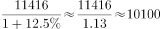万辆，和A项最接近。

故正确答案为A。

---

### 第 2 题　qid 2172326 · 比重

2017年全国新能源汽车新注册登记数占年末新能源汽车保有量的比重是：

- **A**. 
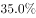

- **B**. 

　✅
- **C**. 

- **D**. 

**答案**：B

**官方解析**

由题目求“2017年······占······的比重”，判定本题为现期比重问题。定位材料第一段“全国新能源汽车保有量153.0万辆，其中新能源汽车新注册登记65.0万辆”。代入公式：，可得2017年全国新能源汽车新注册登记数占年末新能源汽车保有量的比重是：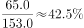。

故正确答案为B。

---

### 第 3 题　qid 2172334 · 综合

2012年末西部地区汽车保有量为：

- **A**. 
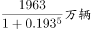

- **B**. 

- **C**. 

　✅
- **D**. 
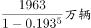

**答案**：C

**官方解析**

由题目求“2012年末西部地区汽车保有量”，结合材料时间为“2017年末”判定本题为基期计算问题。定位材料第二段“2017年末，西部地区近五年汽车保有量增加1963万辆，年均增速”，根据年均增长率公式：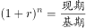，可得：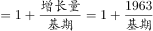，故可推出2012年末西部地区汽车保有量为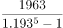万辆。

故正确答案为C。

---

### 第 4 题　qid 2172335 · 比重

若2018年全国男性机动车驾驶人数量不少于上年末，要使女性机动车驾驶人占比达到，则女性驾驶人增加的人数至少为：

- **A**. 462万
- **B**. 643万　✅
- **C**. 963万
- **D**. 1099万

**答案**：B

**官方解析**

根据题干“2018年，······占比达到”，可判定本题为现期比重问题。定位材料第三段“2017年末，全国机动车驾驶人3.85亿人…男性驾驶人2.74亿人，占；女性驾驶人1.11亿人，占”，2018年女性驾驶人占比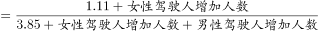，要使得女性驾驶人增加人数最少即分子最小，分数值一定时要使得分子最小即使得分母最小，结合题干“2018年全国男性机动车驾驶人数量不少于上年末”可知男性驾驶人增加人数最少为0，此时分母取最小。可得，解得女性增加人数最少约为643万人。

故正确答案为B。

---

### 第 5 题　qid 2172336 · 综合

不能从上述资料推出的是：

- **A**. 
2016年全国新能源汽车新注册登记49.4万辆

- **B**. 
2017年末全国机动车保有量为30986万辆

- **C**. 
2017年全国民用轿车保有量增长快于民用汽车

- **D**. 
2013—2017年全国汽车保有量年均增速为
　✅

**答案**：D

**官方解析**

A项：定位材料第一段“2017年末，新能源汽车新注册登记65.0万辆，比上年增加15.6万辆”，则2016年末全国新能源汽车新注册登记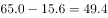万辆，正确；

B项：定位材料第二段“东部、中部、西部地区机动车保有量分别为15544万辆、9006万辆、6436万辆”，则2017年末全国机动车保有量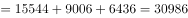万辆，正确；

C项：定位材料第一段“2017年末，全国民用汽车保有量21743万辆，比上年末增长。其中私人汽车保有量18695万辆，增长；民用轿车保有量12185万辆，增长”，民用轿车保有量增长，大于民用汽车保有量增长，即2017年末全国民用轿车保有量增长快于民用汽车，正确；

D选项：选项求的是“2013—2017年全国汽车保有量年均增速”，定位材料第二段“西部地区近五年汽车保有量增加1963万辆，年均增速，高于东部、中部地区、的年均增速”，只知道三个部分的年均增速，但不知道各地区具体的汽车保有量，因此无法具体计算全国的汽车保有量年均增速，错误。

本题为选非题，故正确答案为D。

---

## 材料 2

二、根据以下资料回答116-120题。

        2016年江苏农业生产经营人员1270.87万人。其中女性645.40万人，苏南、苏中、苏北地区分别有186.16万人、321.29万人、763.42万人；年龄35岁及以下的有127万人。36-54岁的有524.90万人、55岁及以上的有618.87万人。

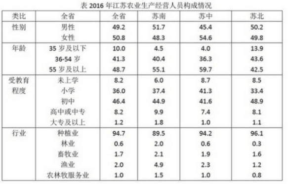

### 第 6 题　qid 2172701 · 综合

2016年苏中地区男性与女性农业生产经营人员相差多少？

- **A**. 19.93万人
- **B**. 25.55万人
- **C**. 27.23万人
- **D**. 29.56万人　✅

**答案**：D

**官方解析**

根据题干“2016年苏中地区男性与女性农业生产经营人员相差”，材料给出2016年苏中地区农业生产经营人员总数及男女占比，判定本题为现期比重问题。定位文字材料2016年苏中地区农业生产经营人员321.29万人；定位表格，苏中地区农业生产经营人员中男性占、女性占。根据公式：，则2016年苏中地区男性与女性农业生产经营人员相差：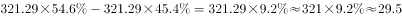万人，与D项最接近。

故正确答案为D。

---

### 第 7 题　qid 2172702 · 综合

2016年苏北地区的大专及以上文化程度农业生产经营人员是苏中地区的：

- **A**. 1.9倍
- **B**. 2.2倍
- **C**. 2.6倍　✅
- **D**. 3.1倍

**答案**：C

**官方解析**

根据题干“2016年…是…”结合选项为倍数，判定本题为现期倍数问题。定位文字材料“2016年，苏中地区农业生产经营人员为321.29万人，苏北地区为763.42万人”；定位表格，苏中地区的大专及以上农业生产经营人员占，苏北地区的大专及以上农业生产经营人员占。根据公式：，则苏中地区的大专及以上农业生产经营人员为万人，苏北地区为万人，后者是前者的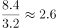倍，与C项最接近。

故正确答案为C。

---

### 第 8 题　qid 2172703 · 比重

2016年苏南地区的女性农业生产经营人员占全省女性农业生产经营人员比重与苏北地区的相差：

- **A**. 14.0个百分点
- **B**. 27.2个百分点
- **C**. 31.7个百分点
- **D**. 45.0个百分点　✅

**答案**：D

**官方解析**

根据题干“2016年…比重与…相差”可判定此题为现期比重问题。定位文字材料可得，2016年江苏女性农业生产经营人员645.40万人，苏南、苏北地区农业生产经营人员分别为186.16万人、763.42万人；定位表格，苏南地区农业生产经营人员中女性占、苏北地区中女性占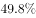。则苏南地区女性农业生产经营人员为万人，苏北地区女性农业生产经营人员为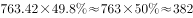万人，二者占全省女性农业生产经营人员的比重相差：，即相差45个百分点，与D项最接近。

故正确答案为D。

---

### 第 9 题　qid 2172705 · 综合

用X、Y、Z分别表示2016年苏南、苏中、苏北地区从事渔业的农业生产经营人数，则三者的大小关系为：

- **A**. 
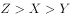
　✅
- **B**. 
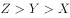

- **C**. 

- **D**. 

**答案**：A

**官方解析**

定位文字与表格材料可得：苏南、苏中、苏北地区的人数分别为186.16万人、321.29万人、763.42万人，从事渔业的人数占比分别为、、，根据公式，苏南地区从事渔业的农业生产经营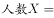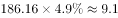，苏中地区从事渔业的农业生产经营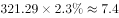,苏北地区从事渔业的农业生产经营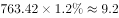,故,因此A项正确。

故正确答案为A。

---

### 第 10 题　qid 2172707 · 综合

下列判断不正确的是：

- **A**. 
2016年江苏省55岁及以上农业生产经营人员中，从事种植业的超过

- **B**. 
2016年苏南地区农业生产经营人员中从事林业的人数超过全省的一半
　✅
- **C**. 
2016年江苏农业生产经营人员中苏北地区35岁及以下占全省的比重超过

- **D**. 
2016年江苏农业生产经营人员中苏北与苏南地区相差人数的一半不超过全省女性人数

**答案**：B

**官方解析**

A项：根据表格材料可知，55岁以下农业生产经营人员占全省农业生产经营人员的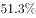，55岁及以上的占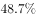。由于从事种植业的人数占全省的比重为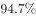，假设55岁以下的全部从事种植业，则55岁及以上的占比至少为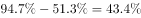，因此55岁及以上农业生产经营人员中从事种植业的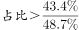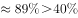，正确；

B项：定位文字材料，“2016年江苏农业生产经营人员1270.87万人……苏南地区有186.16万人”，定位表格材料可知，苏南地区从事林业的占比为，全省占比为，苏南地区农业生产经营人员中从事林业的有，全省农业生产经营人员中从事林业人数的一半有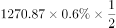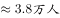，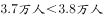，故不到全省的一半，错误；

C项：定位文字材料与表格可得，全省农业生产经营人员1270.87万人，其35岁及以下占比为，苏北地区人数为763.42万人，其35岁及以下占比，故苏北地区35岁及以下占全省的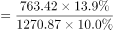，超过，正确；

D项：定位文字材料与表格材料可得，苏北地区有763.42万人，苏南地区有186.16万人，全省女性有645.4万人，则苏北与苏南地区相差人数的一半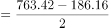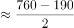，正确。

本题为选非题，故正确答案为B。

---

## 材料 3

        2017年末全国农村贫困人口3046万人，比上年末减少1289万人，比2012年末减少6853万人；贫困发生率（指年末农村贫困人口占目标调查人口的比重）为，比2012年末下降7.1个百分点。2017年全国贫困地区农村居民人均可支配收入9377元，比上年增长。

### 第 11 题　qid 2172264 · 综合

2013—2017年全国农村贫困人口年均减少的人数是

- **A**. 1055万
- **B**. 1142万
- **C**. 1289万
- **D**. 1371万　✅

**答案**：D

**官方解析**

根据题干“2013-2017年······年均减少的人数是”，可判定本题为年均增长量计算问题。定位文字材料“2017年末全国农村贫困人口3046万人，······比2012年末减少6853万人”，故2013年2017年全国农村贫困人口年均增长量万人，即2013年-2017年全国农村贫困人口年均减少的人数是1370.6万人，与D项最接近。

故正确答案为D。

---

### 第 12 题　qid 2172268 · 平均数

2017年全国贫困地区农村居民人均可支配收入比上年增加的金额是

- **A**. 782元
- **B**. 853元
- **C**. 891元　✅
- **D**. 1069元

**答案**：C

**官方解析**

根据题干“2017年······比上年增加的金额是”，可判定本题为增长量计算问题。定位文字材料“2017年全国贫困地区农村居民人均可支配收入9377元，比上年增长”，故2017年全国贫困地区农村居民人均可支配收入比上年增加的金额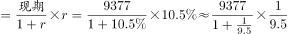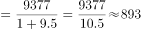元，C选项最为接近。

故正确答案为C。

---

### 第 13 题　qid 2172273 · 增长

2017年末全国农村贫困发生率的目标调查人口与2012年末相比，增加的人数是：

- **A**. 1209万　✅
- **B**. 1033万
- **C**. -1319万
- **D**. 0

**答案**：A

**官方解析**

根据题干“2017年······与2012年末相比，增加的人数”，可判定本题为增长量的计算问题。定位文字材料“2017年末全国农村贫困人口3046万人······比2012年末减少6853万人；贫困发生率（指年末农村贫困人口占目标调查人口的比重）为，比2012年末下降7.1个百分点”，故2017年末全国农村贫困发生率的目标调查人口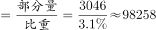万人，2012年末全国农村贫困发生率的目标调查人口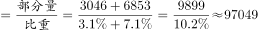万人，则2017年末全国农村贫困发生率的目标调查人口与2012年末相比，增加人数为：万人，与A项一致。

故正确答案为A。

---

### 第 14 题　qid 2172277 · 增长

2014—2017年全国、城镇和农村居民人均可支配收入年均增速的快慢关系是

- **A**. 城镇最快、全国次之、农村最慢
- **B**. 农村最快、全国次之、城镇最慢　✅
- **C**. 全国最快、农村次之、城镇最慢
- **D**. 农村最快、城镇次之、全国最慢

**答案**：B

**官方解析**

由题干“2014-2017年······年均增速的快慢关系······”，可判定此题为年均增长率的比较问题。根据年均增长率的公式：，可得：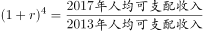，可看出2017年的值与2013年的值比值越大，年均增速越大，故此题比较2017年与2013年的比值大小即可。定位统计图可知，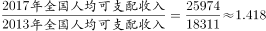，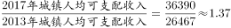，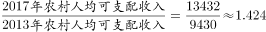，所以三者的年均增速的快慢关系是：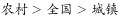。

故正确答案为B。

---

### 第 15 题　qid 2172282 · 综合

下列判断不正确的是：

- **A**. 
2012年末全国农村贫困发生率是

- **B**. 
2014—2017年全国城镇和农村居民人均可支配收入均逐年增加

- **C**. 
2014—2017年全国城镇与农村居民人均可支配收入的差额逐年减少
　✅
- **D**. 
2017年全国农村居民人均可支配收入是贫困地区农村居民的1.4倍

**答案**：C

**官方解析**

A项：定位文字材料“2017年末全国农村贫困发生率（指年末农村贫困人口占目标调查人口的比重）为，比2012年末下降7.1个百分点”，可知2012年末全国农村贫困发生率是，正确；

B项：定位统计图，通过数字逐年递增，可知2014-2017年全国城镇和农村居民人均可支配收入均逐年增加，正确；

C项：定位统计图中代表农村和城镇的柱形图可知，2013年全国城镇与农村居民人均可支配收入的差额是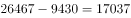元，2014年：元，2015年：元，2016年：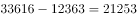元，2017年：元，通过以上数据可看出，2014-2017年全国城镇与农村居民人均可支配收入的差额逐年增加，错误；

D项：定位统计图可知2017年全国农村居民人均可支配收入是13432元，定位文字材料可知2017年全国贫困地区农村居民人均可支配收入是9377元，则2017年全国农村居民人均可支配收入是贫困地区农村居民的倍，正确。

本题为选非题，故正确答案为C。

---

## 材料 4

        为了解市民家庭存书（不含教材教辅）阅读和共享意愿情况，某市统计局成功访问了18岁以上的常住市民2007人。调查显示，关于家庭存书共享意愿的问题，选择“无条件愿意”“有条件愿意”“不愿意”“不知道/不清楚”的受访市民所占比重分别是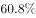、、、。

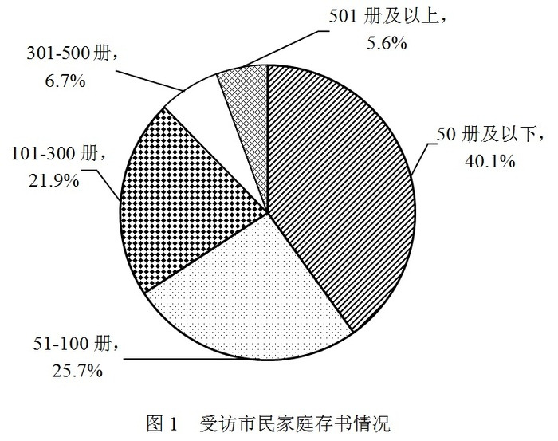

### 第 16 题　qid 2172285 · 综合

家庭存书超过300册的受访市民人数为：

- **A**. 134
- **B**. 247　✅
- **C**. 616
- **D**. 805

**答案**：B

**官方解析**

根据题干“家庭存书超过300册的受访市民人数”，结合材料给出总受访人数及存书300—500册、501册的受访人数占总受访人数的比重，可判定本题为现期比重问题。定位文字资料“……访问了18岁以上的常住市民2007人”可知，。定位图形材料可得，存书301—500册的受访市民占总受访市民人数的比重为，存书501册及以上的受访市民占总受访市民人数的比重为，故超过300册的受访市民占总受访市民人数的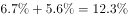。由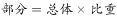，可得：家庭存书超过300册的受访市民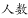，与B项最接近。

故正确答案为B。

---

### 第 17 题　qid 2172287 · 综合

选择“无条件愿意”共享家庭存书的受访市民比选择“有条件愿意”的多：

- **A**. 5倍
- **B**. 4倍
- **C**. 3倍　✅
- **D**. 2倍

**答案**：C

**官方解析**

根据题干“...比...多”，结合选项几倍，可判定本题为现期倍数问题。定位文字材料，“......访问了18岁以上的常住市民2007人......”选择“无条件愿意”“有条件愿意”的市民所占比重分别是、,所以选择“无条件愿意”共享家庭存书的受访市民比选择“有条件愿意”的多的倍数为倍。

故正确答案为C。

---

### 第 18 题　qid 2172292 · 综合

家庭存书被翻阅不少于四分之一的受访市民人数不可能为：

- **A**. 1825
- **B**. 1810　✅
- **C**. 1846
- **D**. 1838

**答案**：B

**官方解析**

根据题干“家庭存书被翻阅不少于四分之一”，可判定本题为现期比重问题。不少于四分之一即大于等于四分之一。定位材料图2可得：翻阅四分之一、翻阅一半左右、翻阅四分之三和全部翻阅的人数占受访市民的比重分别为、、和，根据公式可得，该部分受访市民人数为。不知道/不清楚的人数占受访市民的比重为，人数为。故家庭存书被翻阅不少于四分之一的受访市民人数应大于等于1822人且小于等于。结合选项只有B项1810不在此范围。

故正确答案为B。

---

### 第 19 题　qid 2172295 · 综合

选择“无条件愿意”共享家庭存书的受访市民中，一定有人的家庭存书为：

- **A**. 50册及以下　✅
- **B**. 51—100册
- **C**. 101—300册
- **D**. 301册及以上

**答案**：A

**官方解析**

定位文字材料第一段可得：选择“无条件愿意”的受访市民所占比重为；定位饼状图1可得，受访市民家庭存书情况中50册及以下所占比重为，二者之和为，二者之和超过整体，说明二者之间必然有交集，也就是说选择“无条件愿意”共享家庭存书的受访市民肯定有人的家庭存书为50册及以下。

故正确答案为A。

---

### 第 20 题　qid 2172297 · 综合

不能从上述资料推出的是：

- **A**. 
有一半以上的受访市民家庭存书不超过100册

- **B**. 
家庭存书被翻阅左右的受访市民不超过100人

- **C**. 
家庭存书被全部翻阅的受访市民中有人选择“不愿意”共享家庭存书
　✅
- **D**. 
选择“无条件愿意”与选择“不愿意”共享家庭存书的受访市民相差800人以上

**答案**：C

**官方解析**

A项：定位图1，受访市民家庭存书51—100册所占比重为，存书50册以下所占比重为。故受访市民家庭存书不超过100册的，多于一半，正确；

B项：定位文字材料和图2，某市统计局成功访问了18岁以上的常住市民2007人，家庭存书被翻阅一成左右的受访市民所占比重为，不知道/不清楚的占。一成即，故家庭存书被翻阅左右的人数总人数比重人100人，正确；

C项：定位图2和文字材料，存书被全部翻阅的受访市民所占比重为，选择“不愿意”共享家庭存书的受访市民所占比重为。二者之和为，二者之和小于整体，所以二者之间可能没有交集，故不能确定被全部翻阅的受访市民中有人选择“不愿意”共享家庭存书，错误；

D项：定位文字材料，某市统计局成功访问了18岁以上的常住市民2007人，关于家庭存书共享意愿问题，选择“无条件愿意”和“不愿意”的受访市民占受访市民所占比重为和。故选择“无条件愿意”与“不愿意”共享家庭存书的受访市民故，即相差超过800人，正确。

本题为选非题，故正确答案为C。

---
