# 2018年浙江省公务员录用考试《行测》题（A类）（网友回忆版）

> 资料分析 · 20 题 · 浙江 2018

## 材料 1

        2015年7月，京津冀区域13个城市空气质量超标天数平均占当月总天数的，平均达标天数比上年同期下降6个百分点。与全国74个城市相比，京津冀区域平均重度污染天数占比高4.4个百分点。而与上年同期相比，74个城市平均达标天数占比也由下降到。

        与上年同期相比，2015年7月京津冀区域13个城市平均PM2.5和PM10浓度分别上升和，长三角区域25个城市平均PM2.5和PM10浓度分别上升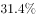和。

### 第 1 题　qid 2144591 · 平均数

2015年7月，京津冀区域平均重度污染天数比全国74个城市约多多少天？

- **A**. 0.8
- **B**. 1.4　✅
- **C**. 2.0
- **D**. 2.5

**答案**：B

**官方解析**

问题求“京津冀区域平均重度污染天数比······多多少天”，根据常识可知7月总天数为31天，定位文字材料第1段：“与全国74个城市相比，京津冀区域平均重度污染天数占比高4.4个百分点”，即已知总体量和部分比重的差值，求部分量的差值。可得，2015年7月，京津冀区域平均重度污染天数比全国74个城市约多天。

故正确答案为B。

---

### 第 2 题　qid 2144596 · 比重

2014年7月，京津冀区域13个城市空气质量超标天数占当月总天数的比重约比全国74个城市高多少个百分点？

- **A**. 51.4
- **B**. 37.9
- **C**. 31.9　✅
- **D**. 19.5

**答案**：C

**官方解析**

根据材料已知时间为2015年7月，求“2014年7月······比重比······高几个百分点”，可知本题为基期比重问题。定位文字材料第1段：“2015年7月，京津冀区域13个城市空气质量超标天数平均占当月总天数的，平均达标天数比上年同期下降6个百分点”，可得，2015年7月，京津冀区域13个城市空气质量超标天数比上年同期上升6个百分点，故2014年7月，京津冀区域13个城市空气质量超标天数；定位文字材料第1段：“而与上年同期相比，74个城市平均达标天数占比也由下降到”，可得，2014年7月，74个城市空气质量超标天数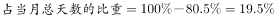，故2014年7月，京津冀区域13个城市空气质量超标天数占当月总天数的比重约比全国74个城市高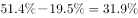，即高31.9个百分点。

故正确答案为C。

---

### 第 3 题　qid 2144601 · 平均数

环保部门定下了5年后京津冀区域13个城市实现7月空气质量超标天数平均占当月总天数以下的目标。如京津冀区域13个城市中，有5个城市大力投入改善本市空气质量。问平均每个城市至少需要将空气质量超标天数减少多少天，才能在另外8个城市空气质量超标天数与2015年7月相同的情况下，实现这一目标？

- **A**. 6　✅
- **B**. 5
- **C**. 4
- **D**. 3

**答案**：A

**官方解析**

题干中出现比重，时间是2015年7月，可知本题为现期比重问题。根据题干：要5年后京津冀区域13个城市实现7月空气质量超标天数平均占当月总天数以下的目标，又根据文字材料第一段可知：“2015年7月，京津冀区域13个城市空气质量超标天数平均占当月总天数的”，则5年后京津冀区域13个城市7月一共需要减少的超标天数为，由题干“如京津冀区域13个城市中，有5个城市大力投入改善本市空气质量，另外8个城市空气质量超标天数与2015年7月相同”，即13个城市7月一共需要减少的超标天数与5个城市总的减少超标天数相同，即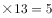个城市平均每个城市减少的超标天数，则5个城市平均每个城市减少的超标天数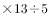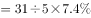天。

故正确答案为A。

---

### 第 4 题　qid 2144604 · 增长

环保部门计划开展两个空气污染物防治项目，每个项目均可以实现特定污染物浓度增速减半的效果。以下哪种立项方式能够最有效地延缓空气质量的恶化？（假设PM2.5和PM10在各地的浓度相同，且在空气质量评估中拥有相同的权重。）

- **A**. 在京津冀区域开展针对PM2.5和PM10污染物的防治
- **B**. 在长三角区域开展针对PM2.5和PM10污染物的防治
- **C**. 在京津冀和长三角区域开展针对PM10污染物的防治
- **D**. 在京津冀和长三角区域开展针对PM2.5污染物的防治　✅

**答案**：D

**官方解析**

由题干可知：每个项目均可以实现特定污染物浓度增速减半的效果。为了“最有效地延缓空气质量的恶化”，则需要综合考虑减少量的大小，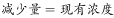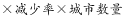，因“各地PM2.5和PM10（初始状态）浓度相同，且在空气质量评估中拥有相同的权重”，则现有浓度各地是相同的，只需要比较“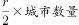”大小即可，定位文字材料第二段，可知长三角区域25个城市平均PM2.5浓度增速为，长三角区域其城市数量最多且PM2.5的增速最大，则其减少量是最大的，排除A、C两项。结合B、D两项，只需要比较长三角区域PM10污染物的减少量和京津冀区域PM2.5污染物的减少量大小即可，依然是只需比较“”，长三角区域PM10相应数值为“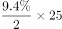”，京津冀区域PM2.5相应数值为“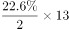”，前者小于后者，排除B项。

故正确答案为D。

---

### 第 5 题　qid 2144607 · 综合

关于2015年7月空气质量状况，能够从上述资料中推出的是：

- **A**. 全国74个城市当月平均达标天数超过25天
- **B**. 京津冀区域13个城市当月平均重度污染天数一定少于11天　✅
- **C**. 如保持当月同比增速，2017年7月京津冀区域PM2.5浓度将超过2015年7月的两倍
- **D**. 长三角区域25个城市当月PM2.5浓度同比增量高于PM10浓度同比增量

**答案**：B

**官方解析**

A项：定位文字材料第一段，“而与上年同期相比，74个城市平均达标天数占比也由下降到”，则2015年7月达标天数有，错误；

B项：定位文字材料第一段，74个城市平均达标天数占比为，则不达标占比为，意味着74个城市重度污染天数占比一定小于。则京津冀区域平均重度污染天数占比一定小于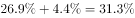，则当月重度污染天数小于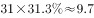天，正确；

C项：定位文字材料第二段，2015年7月京津冀区域PM2.5浓度同比上升，则2017年7月与2015年7月相比，间隔增速为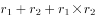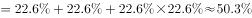，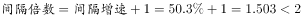，错误；

D项：定位文字材料第二段，“长三角区域25个城市平均PM2.5和PM10浓度分别上升和”，但材料中没有PM2.5和PM10浓度当月或者去年同期具体数值，无法计算，错误。

故正确答案为B。

---

## 材料 2

2016年该市本级完成财政一般预算支出49.86亿元，比上年增支16.79亿元，增长。

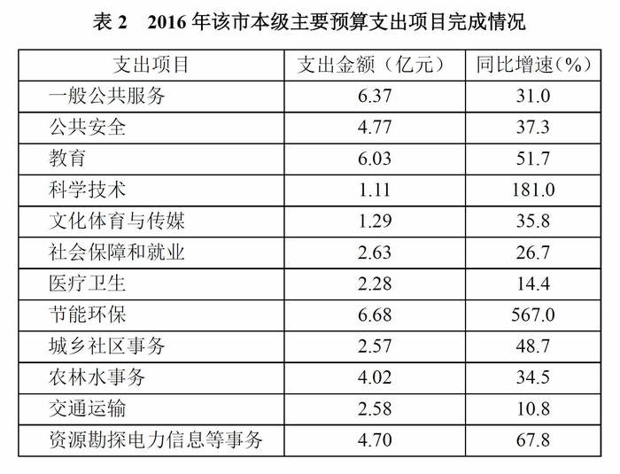

### 第 6 题　qid 2144590 · 综合

表1中“？”处的数字应为：

- **A**. 7　✅
- **B**. 7.5
- **C**. 8.5
- **D**. 9

**答案**：A

**官方解析**

定位表1，可知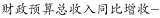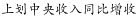，则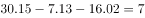亿元。

故正确答案为A。

---

### 第 7 题　qid 2144592 · 增长

2016年该市上划中央收入同比约增长了：

- **A**. 

- **B**. 

- **C**. 

　✅
- **D**. 

**答案**：C

**官方解析**

由题意“2016年该市上划中央收入同比约增长了”且选项为百分数，判定此题为一般增长率问题，增长率公式为。定位表1，可知2016年该市上划中央收入金额为47.57亿元，同比增收为16.02亿元，则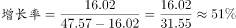。

故正确答案为C。

---

### 第 8 题　qid 2144595 · 比重

2016年该市本级主要预算支出项目中，占总预算支出比重较上年有所提高的项目个数有：

- **A**. 7个
- **B**. 6个
- **C**. 5个
- **D**. 4个　✅

**答案**：D

**官方解析**

由题意“2016年······比重较上年有所提高的项目个数有几个”，判定此题为两期比重问题。若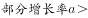，则现期比重上升。定位文字材料可知，2016年该市本级完成财政一般预算支出49.86亿元，比上年增支16.79亿元，增长（这个地方一定要注意，材料中提到总的预算支出的只有这个位置，表1为收入并非支出，因此可以判定题干中的“总预算支出”只有可能是“财政一般预算支出”，否则本题将无法求解），即。定位表2可知部分增长率大于整体增长率（）的项目有教育（）、科学技术（）、节能环保（）、资源勘探电力信息等事务（），共4个。

故正确答案为D。

---

### 第 9 题　qid 2144597 · 增长

2016年该市教育支出同比增量约是医疗卫生的多少倍？

- **A**. 4
- **B**. 7　✅
- **C**. 10
- **D**. 14

**答案**：B

**官方解析**

根据“2016年······是······的多少倍”，判定本题是现期倍数问题。定位表2，教育支出6.03亿元，同比增速为；医疗卫生支出2.28亿元，同比增速为。根据增长量公式，所求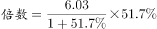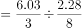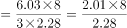，略小于8，B项最接近。 

故正确答案为B。

---

### 第 10 题　qid 2144599 · 综合

关于该市2016年财政收支状况，能够从上述资料中推出的是：

- **A**. 财政总收入金额比预算总收入低1亿多元
- **B**. 基金收入预算额超过40亿元
- **C**. 节能环保支出同比增长了5亿多元　✅
- **D**. 支出增速最低的项目是科学技术

**答案**：C

**官方解析**

A项：，定位表1，财政总收入金额是109.16亿元，预算完成率是。根据公式，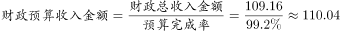亿元，亿元，因此财政总收入金额比预算总收入低不足1亿元，A项错误；

B项：定位表1，基金收入金额是35.33亿元，预算完成率是。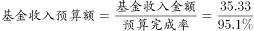，首位商3，因此没有超过40亿元，B项错误；

C项：定位表2，节能环保支出6.68亿元，同比增速为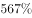。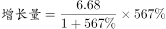亿元，C项正确；

D项：定位表2最后一列，科学技术项目支出增速是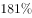，而一般公共服务()、公共安全()、教育()等项目支出增速都小于科学技术项目，D项错误。

故正确答案为C。

---

## 材料 3

        2015年末，全国网民人数为68826万人，互联网普及率（网民人数占总人口数的比重）为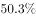。

        2015年新增网民中，低龄（19岁以下）、学生群体占比分别为、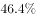。2015年新增网民中，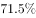的人使用手机上网，占比较2014年末提升了7.4个百分点；的人使用台式电脑上网，较2014年有所下降。

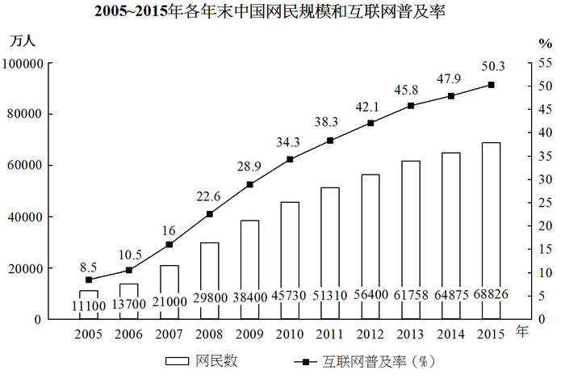

### 第 11 题　qid 2144593 · 综合

截至2007年末，我国约有多少亿非网民？

- **A**. 10.1
- **B**. 10.6
- **C**. 11.0　✅
- **D**. 11.9

**答案**：C

**官方解析**

根据题干所求“2007年非网民人数…”，定位柱形图“截止2007年我国网民数为21000万人，互联网普及率为”，故判定本题为现期比重问题。根据现期比重公式：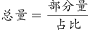，因此2007年末我国，故2007年末我国非网民人数约为。

故正确答案为C。

---

### 第 12 题　qid 2144598 · 增长

将以下年份按年末网民人数同比增量从多到少排序，正确的是：

- **A**. 

- **B**. 

- **C**. 

- **D**. 

　✅

**答案**：D

**官方解析**

由题目要求将同比增量进行排序，可判定本题为增长量比较问题。根据公式，定位柱形图可得：

2006年网民人数；

2007年网民人数；

2008年网民人数；

2009年网民人数。

因此按增长量大小排序为：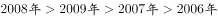。

故正确答案为D。

---

### 第 13 题　qid 2144600 · 综合

2006-2015年，年末互联网普及率比前一年提升超过5个百分点的年份有几个？

- **A**. 4　✅
- **B**. 5
- **C**. 6
- **D**. 7

**答案**：A

**官方解析**

定位图表，年末互联网普及率比前一年提升超过5个百分点的有：

2007年：；

2008年：；

2009年：；

2010年：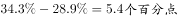。

满足条件的年份共4个。

故正确答案为A。

---

### 第 14 题　qid 2144603 · 综合

2015年新增网民中，年龄在19岁以上的网民约有多少万人？

- **A**. 2130　✅
- **B**. 2030
- **C**. 1930
- **D**. 1830

**答案**：A

**官方解析**

根据题干所求“2015年新增…19岁以上的网民人数”，结合文字材料第二段给出“2015年新增网民中，19岁以下的占比为”，可判断本题为现期比重问题。定位柱形图，可知2015年新增网民人数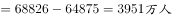。定位文字材料第二段，可知2015年新增网民中低龄（19岁以下）占比，因此19岁以上的占比为。根据比重公式：，因此2015年新增网民中19岁以上的人数为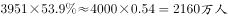，与A项最为接近。

故正确答案为A。

---

### 第 15 题　qid 2144606 · 综合

能够从上述资料中推出的是：

- **A**. 
2015年末我国网民人数比2005年末翻了三番

- **B**. 
“十二五”（2011～2015年）期间中国新增2亿多网民
　✅
- **C**. 
2014年新增网民中，的人使用手机上网

- **D**. 
2014年新增网民中，不到1000万人使用台式电脑上网

**答案**：B

**官方解析**

A项：定位柱形图，2005年末全国网民数为11100万人，2015年末全国网民数为68826万人，，不到3番，错误；

B项：定位柱形图，2010年末全国网民数为45730万人，2015年末全国网民数为68826万人，则“十二五”（2011~2015年）共增长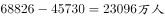，新增2亿多人，正确；

C项：定位文字材料第二段“2015年新增网民中，的人使用手机上网，占比较2014年末提升了7.4个百分点”可知，2014年新增网民中使用手机上网的人数占比为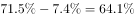，错误；

D项：定位文字材料第二段“的人使用台式电脑上网，较2014年有所下降”可知，2014年使用台式电脑上网的人数占比应大于。由柱形图可知2014年新增网民数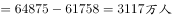。其中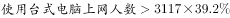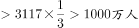，错误。

故正确答案为B。

---

## 材料 4

        2016年末，全国内河航道通航里程12.71万公里。等级航道6.64万公里，其中三级及以上航道1.21万公里，占总里程的，比上年提高0.4个百分点。各等级内河航道通航里程分别为：一级航道1342公里，二级航道3681公里，三级航道7054公里，四级航道10862公里，五级航道7485公里，六级航道18150公里，七级航道17835公里。等外航道6.07万公里。各水系内河航道通航里程分别为：长江水系64883公里，珠江水系16450公里，黄河水系3533公里，黑龙江水系8211公里，京杭运河1438公里，闽江水系1973公里，淮河水系17507公里。

2016年末，全国港口拥有生产用码头泊位30388个，比上年减少871个。其中，沿海港口生产用码头泊位5887个，减少12个；内河港口生产用码头泊位24501个，减少859个。全国港口拥有万吨级及以上泊位2317个，比上年增加96个。其中，沿海港口万吨级及以上泊位1894个，增加87个；内河港口万吨级及以上泊位423个，增加9个。全国万吨级及以上泊位中，专业化泊位1223个，比上年增加50个；通用散货泊位506个，增加33个；通用件杂货泊位381个，增加10个。

### 第 16 题　qid 2144614 · 增长

2012-2015年，全国内河航道通航里程增长幅度最大的是：

- **A**. 2012年
- **B**. 2013年　✅
- **C**. 2014年
- **D**. 2015年

**答案**：B

**官方解析**

由题干“增长幅度最大的是”，可判定本题为增长率比较问题。定位统计图，根据公式代入数据，则有：

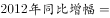；

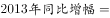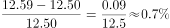；

；

。

故比较可知2013年全国内河航道通航里程增长幅度最大。

故正确答案为B。

---

### 第 17 题　qid 2144615 · 综合

2015年末，全国三级及以上航道通航里程约为：

- **A**. 0.98万公里
- **B**. 1.04万公里
- **C**. 1.16万公里　✅
- **D**. 1.26万公里

**答案**：C

**官方解析**

由题干“2015年末，……”及材料“2016年末，……”可判定本题为基期问题。结合文字材料第一段“三级及以上航道1.21万公里，占总里程的，比上年提高0.4个百分点”可以计算出2015年三级及以上航道占总里程的比重为。定位统计图，2015年总里程为12.70万公里。则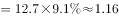万公里。

故正确答案为C。

---

### 第 18 题　qid 2144616 · 综合

2016年末，长江水系内河航道通航里程约占各水系内河航道通航总里程的：

- **A**. 
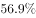
　✅
- **B**. 

- **C**. 

- **D**. 

**答案**：A

**官方解析**

根据题干“2016年末，…占…”且选项为百分数，可判定本题为现期比重问题。长江水系内河航道通航里程为部分量，各水系内河航道通航总里程为总量，根据公式，结合文字材料第一段所给数据代入，则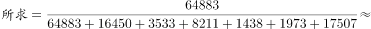，首位商5，仅A项符合。

故正确答案为A。

---

### 第 19 题　qid 2144617 · 增长

2016年，下列哪种泊位数量同比增长最快？

- **A**. 全国港口万吨级及以上泊位
- **B**. 沿海港口万吨级及以上泊位
- **C**. 全国港口10万吨级及以上泊位
- **D**. 内河港口10万吨级及以上泊位　✅

**答案**：D

**官方解析**

由题干“同比增长最快”，可判定本题为增长率比较问题。定位表格材料，根据公式代入数据，则有：

A.全国港口万吨级及以上泊位；

B.沿海港口万吨级及以上泊位；

C.全国港口10万吨级及以上泊位；

D.内河港口10万吨级及以上泊位。

故比较可知，A、B、C项所求明显小于，D项所求等于，D项符合，即内河港口10万吨级及以上泊位数同比增长最快。

故正确答案为D。

---

### 第 20 题　qid 2144618 · 综合

根据资料，下列表述不正确的是：

- **A**. 2015年末，全国沿海港口生产用码头泊位数量不足全国港口生产用码头泊位总量的二成
- **B**. 2016年末，全国内河航道通航里程中，等级航道占比超过一半
- **C**. 2016年末，全国万吨级及以上泊位中，专业化泊位超过一半
- **D**. 2015年末，全国港口3万吨级及以上泊位不足1400个　✅

**答案**：D

**官方解析**

A项：定位文字材料第二段，“2016年末，全国港口拥有生产用码头泊位30388个，比上年减少871个。其中，沿海港口生产用码头泊位5887个，减少12个”，故2015年末，全国沿海港口生产用码头泊位数量占全国港口生产用码头泊位数量比重为，不足二成，正确；

B项：定位文字材料第一段，“2016年末，全国内河航道通航里程12.71万公里。等级航道6.64万公里”，则等级航道占比为，超过一半，正确； 

C项：定位文字材料第二段，“2016年末，全国港口拥有万吨级及以上泊位2317个……全国万吨级及以上泊位中，专业化泊位1223个”，则专业化泊位占比为，超过一半，正确；

D项：定位表格材料，可知2016年末全国港口万吨级以上泊位数量为2317个，比上年末增加96个，1～3万吨级泊位814个，比上年末增加21个。所以2015年末，全国港口3万吨级及以上泊位为个，超过1400个，错误。

本题为选非题，故正确答案为D。

---
