# 2018年湖北省选调生招录考试综合知识和行政职业能力测验试卷（网友回忆版）

> 资料分析 · 10 题 · 选调 2018

## 材料 1

        2017年，我国文化产品和服务进出口总额1265.1亿美元，同比增长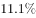。其中，文化产品进出口总额971.2亿美元，同比增长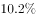。文化服务进出口总额293.9亿美元，同比增长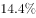。

        文化产品方面，出口881.9亿美元，同比增长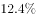；进口89.3亿美元，同比下降。出口的技术含量有所提升，具有较高附加值的游艺器材和娱乐用品、广播电影电视设备出口同比增长，占比提升2个百分点至。美国、中国香港、荷兰、英国和日本为中国文化产品进出口前五大市场，进出口额合计占比为。这样比较上年下降1.8个百分点。我国与“一带一路”沿线国家进出口额达到176.2亿美元，同比增长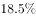，占比提高1.2个百分点至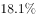；与金砖国家进出口额43亿美元，同比增长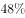。

        文化服务方面，进口232.2亿美元，同比增长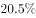。其中视听及相关产品许可费、著作权等研发成果使用费进口分别同比增长和。出口61.7亿美元，同比下降；其中处于核心层的文化和娱乐服务、研发成果、使用费、视听及相关产品许可费等三项服务出口15.4亿美元，同比增长，占比增提升5.7个百分点至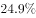。

### 第 1 题　qid 2676488 · 增长

若保持2017年同比增速不变，我国文化产业和服务进出口总额将在哪年突破1500亿美元？

- **A**. 2018年
- **B**. 2019年　✅
- **C**. 2020年
- **D**. 2021年

**答案**：B

**官方解析**

根据题干“若保持······同比增速不变，······将在······年突破·······”，可判定本题为现期追赶问题。定位文字材料第一段，2017年，我国文化产品和服务进出口总额1265.1亿美元，同比增长。代入公式，，则，即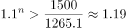，解得，则文化产业和服务进出口总额将在2年后，即2019年突破1500亿美元。

故正确答案为B。

---

### 第 2 题　qid 2676496 · 比重

2016年我国文化产品进出口总额中，我国与一带一路沿线国家进出口额占比为：

- **A**. 

　✅
- **B**. 

- **C**. 
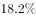

- **D**. 

**答案**：A

**官方解析**

根据题干“2016年······中，占比为”，结合材料时间为2017年，可判定本题为基期比重问题。定位文字材料第二段，我国与“一带一路”沿线国家进出口额达到176.2亿美元，同比增长18.5%，占比提高1.2个百分点至18.1%。可以计算出2016年我国与一带一路沿线国家进出口额占比为18.1%-1.2%=16.9%。
故正确答案为A。
备注：文字材料第二段，“我国与‘一带一路’沿线国家进出口额达到176.2亿美元，同比增长18.5%，占比提高1.2个百分点至18.1%”，经查询后占比提高为1.3个百分点，但1.3没有答案，所以材料无需修改。

---

### 第 3 题　qid 2676507 · 综合

2016年我国与金砖国家文化产品进出口额约占2017年的：

- **A**. 

- **B**. 

- **C**. 

- **D**. 

　✅

**答案**：D

**官方解析**

根据题干“2016年······约占2017年的”，可判定本题为比值计算问题。定位文字材料第二段，与金砖国家进出口额同比增长，根据公式，现期量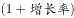可知，2017年进出口额2016年进出口额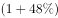，则比值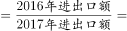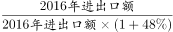。

故正确答案为D。

---

### 第 4 题　qid 2676510 · 综合

2017年我国文化产品进出口总额比文化服务进出口总额多约：

- **A**. 2.3倍　✅
- **B**. 2.4倍
- **C**. 3.3倍
- **D**. 3.4倍

**答案**：A

**官方解析**

根据题干“文化产品进出口总额比文化服务进出口总额多约”，结合选项，可判定本题为现期倍数问题。定位文字材料第一段，文化产品进出口总额971.2亿美元，同比增长。文化服务进出口总额293.9亿美元，同比增长。故所求倍数为倍。

故正确答案为A。

---

### 第 5 题　qid 2676514 · 综合

根据所给资料，下列表述错误的是：

- **A**. 2017年我国文化产品出口国际市场呈多元格局
- **B**. 2017年我国文化产品出口结构更趋优化
- **C**. 2016年我国文化服务进出口出现顺差　✅
- **D**. 2017年我国文化服务进口增势明显

**答案**：C

**官方解析**

A项：定位文字材料第二段可知，美国、中国香港、荷兰、英国和日本为中国文化产品进出口前五大市场，我国与“一带一路”沿线国家进出口额达到176.2亿美元，同比增长；与金砖国家进出口额43亿美元，同比增长。由此可见我国文化产品出口国际市场呈现多元格局，正确；

B项：定位文字材料第二段可知，出口的技术含量有所提升，具有较高附加值的游艺器材和娱乐用品、广播电影电视设备出口同比增长，占比提升2个百分点至。由此可见，我国文化产品出口结构更趋优化，正确；

C项：贸易顺差，即出口额进口额，定位材料第三段，文化服务方面，进口232.2亿美元，同比增长，出口61.7亿美元，同比下降。根据公式基期量，则2016年进口额亿元；2016年出口额亿元，则2016年文化服务出口额64.2亿元文化服务进口额192.7亿元，为贸易逆差，错误；

D项：定位文字材料第三段可知，文化服务方面，进口232.2亿美元，同比增长，可知进口增势明显，正确。

本题为选非题，故正确答案为C。

---

## 材料 2

        2017年6月，我国在线教育用户规模达14426万人，在线教育使用率（占网民比率）达。在线教育用户中，在线教育月花费500元以内、500—1000元、1001—1999元、2000元及以上的用户占比分别为、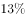、和。

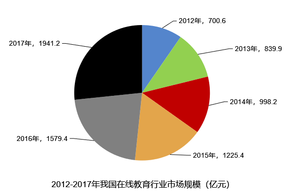

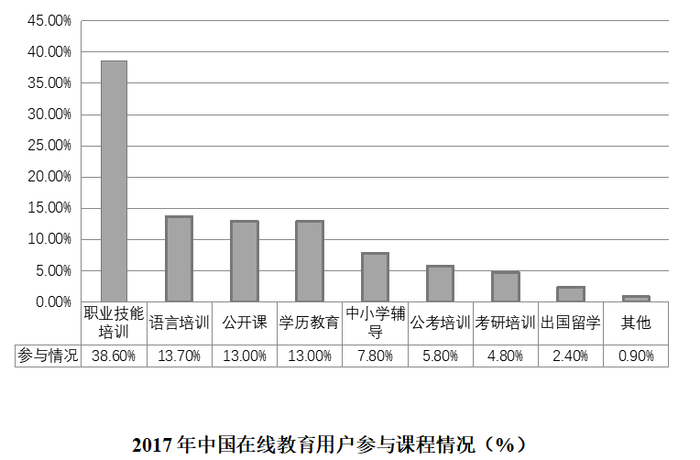

### 第 6 题　qid 2676661 · 综合

2017年6月，我国网民人数约达到：

- **A**. 6.59亿人
- **B**. 6.93亿人
- **C**. 7.09亿人
- **D**. 7.51亿人　✅

**答案**：D

**官方解析**

根据题干“2017年6月，我国网民人数约达到”，结合材料给出在线教育用户数及占网民比例，可判定本题为现期比重问题。定位文字材料第一段，2017年6月，我国在线教育用户规模达14426万人，在线教育使用率（占网民比率）达。可知网民人数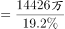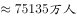，对应D项。

故正确答案为D。

---

### 第 7 题　qid 2676663 · 综合

2017年中国在线教育用户中选择职业技能培训课和学历教育课程的人数之比约为：

- **A**. 5：3
- **B**. 3：2
- **C**. 3：1　✅
- **D**. 4：3

**答案**：C

**官方解析**

根据题干“2017年······之比约为”，可判定本题为比值计算问题。由统计表可知，2017年选择职业技能培训课的用户占中国在线教育用户，选择学历教育课程用户占中国在线教育用户。可得人数之比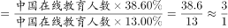。

故正确答案为C。

---

### 第 8 题　qid 2676664 · 增长

2013—2016年我国在线教育市场规模增速最快的是：

- **A**. 2016年　✅
- **B**. 2015年
- **C**. 2014年
- **D**. 2013年

**答案**：A

**官方解析**

根据题干“······增速最快的是”，可判定本题为一般增长率的比较问题。定位饼状图可知，2013—2016年各年数据，根据公式可得：

A项，2016年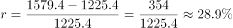；

B项，2015年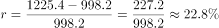；

C项，2014年；

D项，2013年。

所以2013—2016年我国在线教育市场规模增速最快的是2016年，对应A项。

故正确答案为A。

---

### 第 9 题　qid 2676668 · 综合

截至2017年6月我国手机在线教育用户：

- **A**. 
人数同比实现了翻番

- **B**. 
近半年来月均增量约为420万人

- **C**. 
人数在同期我国在线教育用户总数中占比超过九成

- **D**. 
在线教育月花费超过千元的人数占总人数的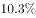
　✅

**答案**：D

**官方解析**

A项：定位图表1可知，2017年6月与2016年6月我国手机在线教育用户规模分别为11990万人、6987万人。翻番即2倍，，即人数同比未实现翻番，错误；

B项：定位图表1可知，2017年6月与2016年12月我国手机在线教育用户规模分别为11990万人、9798万人，则近半年来月均增量约为万人，错误；

C项：定位图表1可知，2017年6月我国手机在线教育用户规模为11990万人，在线教育用户规模为14426万人，题干占比为，未超过九成，错误；

D项：定位文字材料第一段可知，在线教育月花费1001—1999元、2000元及以上的用户占比分别为和，则月花费超过千元的人数占总人数的，正确。

故正确答案为D。

备注：本题存在问题，在题干背景下D项中“在线教育月花费超过千元”应指我国手机在线教育用户中在线教育月花费超过千元的人数，其占总人数的比重应小于在线教育用户中在线教育月花费超过千元的人数占总人数的比重，即。此时没有答案，故粉笔考虑D项不受题干背景影响。

---

### 第 10 题　qid 2676669 · 综合

下列选项中，不能根据所给资料推出的是：

- **A**. 2013—2017年我国在线教育行业市场规模的年均增速
- **B**. 2017年6月我国网民中选择语言培训在线教育的人数占比
- **C**. 2012年我国在线教育行业市场规模的环比增速　✅
- **D**. 2016年12月我国在线教育使用率同比增幅

**答案**：C

**官方解析**

A项：定位饼状图可知，2013—2017年我国在线教育行业的市场规模。根据年均增长率公式：年均增长率，则2013—2017年我国在线教育行业市场规模的年均增速为，可推出；

B项：定位文字材料可知，“2017年6月，我国在线教育用户规模达14426万人，在线教育使用率（占网民比率）达。”；定位图表3可知，2017年6月中国在线教育用户参与语言培训的占比为。代入公式比重，则网民规模为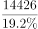万人，选择语言培训在线教育的规模为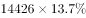万人。题干所求占比为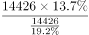，可推出；

C项：定位饼状图可知，2012年我国在线教育行业的市场规模，无法得到2011年的市场规模，无法推出；

D项：定位图表1可知，2016年12月与2015年12月的在线教育使用率分别为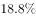、。现期量与基期量都已给出，则在线教育使用率同比增幅为可推出。

本题为选非题，故正确答案为C。

备注：本题存在问题，图表3为2017年中国在线教育用户参与课程情况，故B项中“中国在线教育用户参与语言培训的占比”为2017年数据，非2017年6月数据，无法推出。此时存在B、C两个正确选项，故粉笔考虑图表3的时间是2017年6月。

---
