# 2018年福建省选调生考试《行政职业能力测验》

> 资料分析 · 20 题 · 福建 2018

## 材料 1

        2016年全国粮食情况如下：

        全国粮食总产量61623.9万吨（12324.8亿斤），比2015年减少520.1万吨（104.0亿斤），减少0.8%。其中谷物产量56516.5万吨（11303.3亿斤），比2015年减少711.5万吨（142.3亿斤），减少1.2%。

        全国粮食播种面积113028.2千公顷（169542.3万亩），比2015年减少314.7千公顷（472.1万亩），减少0.3%。其中谷物播种面积94370.8千公顷（141556.2万亩），比2015年减少1265.1千公顷（1897.7万亩），减少1.3%。

        对此，国家统计局解读称，2016年粮食产量下降同时受到播种面积减少和单产下降的影响。2016年，全国粮食播种面积比上年减少了472万亩，因播种面积减少而减产34亿斤，占粮食减产总量的33.2%；全国粮食产量因单产下降而减产70亿斤，占粮食减产总量的66.8%。

        粮食单产下降的主要原因：

        一是高产作物面积减少。按可食用的籽粒玉米统计，玉米播种面积5.51亿亩，比上年减少2039万亩，减少3.6%。低产作物大豆播种面积1.08亿亩，比上年增加1046万亩，增长10.7%。2016年，玉米平均亩产398.2公斤，是大豆的3.3倍，仅玉米改种大豆就可拉低粮食亩产约1.7公斤。

        二是全国农业气象灾害较上年偏重，部分地区受灾较重。夏粮、早稻因灾减产。秋粮生长前期，南方多地遭受强降水，湖北、安徽等地受灾较重，部分农田反复受淹，作物倒伏严重。7月下旬至8月中下旬，南方一些地区又遭受持续高温天气，导致水稻空壳率增加；东北、西北部分地区出现不同程度旱情，对玉米后期生产和灌浆不利。据民政部统计，今年1-10月份，全国农作物受灾面积3.97亿亩，比上年同期增加5410万亩；绝收面积6218万亩，增加1719万亩。

### 第 1 题　qid 4713985 · 比重

2015年我国粮食非谷物播种面积占全国的比重约为：

- **A**. 8%
- **B**. 16%　✅
- **C**. 84%
- **D**. 92%

**答案**：B

**官方解析**

根据题干“2015年······占······的比重约为”，结合材料时间为2016年，可判定本题为基期比重问题。

方法一：定位文字材料第三段可得：2016年全国粮食播种面积113028.2千公顷（B），比2015年减少0.3%（b）；谷物播种面积94370.8千公顷（A），比2015年减少1.3%（a）。根据公式：基期比重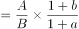，则2015年谷物播种面积占全国的比重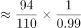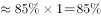，故2015年非谷物播种面积占比，与B项最接近。

方法二：定位文字材料第三段可得：2016年全国粮食播种面积113028.2千公顷，比2015年减少314.7千公顷；谷物播种面积94370.8千公顷，比2015年减少1265.1千公顷。根据公式：基期量=现期量-增长量，比重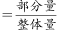，则2015年谷物播种面积占全国的比重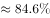，故2015年非谷物播种面积占比，与B项最接近。

故正确答案为B。

---

### 第 2 题　qid 4713993 · 综合

2015年我国玉米播种面积约是大豆的多少倍？

- **A**. 5.1
- **B**. 5.9　✅
- **C**. 7
- **D**. 4.3

**答案**：B

**官方解析**

根据题干“2015年······约是······的多少倍”，结合材料时间为2016年，可判定本题为基期倍数问题。

方法一：定位文字材料第六段可得：2016年玉米播种面积5.51亿亩（A），比上年减少3.6%（a）；大豆播种面积1.08亿亩（B），比上年增长10.7%（b）。根据公式：基期倍数，则所求倍数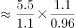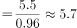，与B项最接近。

方法二：定位文字材料第六段可得：2016年玉米播种面积5.51亿亩，比上年减少2039万亩；大豆播种面积1.08亿亩，比上年增加1046万亩。2039万亩0.204亿亩，1046万亩0.105亿亩。根据公式：基期量=现期量-增长量，则所求倍数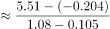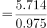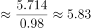，与B项最接近。

故正确答案为B。

---

### 第 3 题　qid 4714000 · 比重

2016年，我国谷物产量占粮食总产量的比重比上年约：

- **A**. 提高0.37个百分点
- **B**. 提高2.08个百分点
- **C**. 降低0.37个百分点　✅
- **D**. 降低2.08个百分点

**答案**：C

**官方解析**

根据题干“2016年，······占······的比重比上年约”，结合选项均为“提高/降低······个百分点”，可判定本题为两期比重问题。定位文字材料第二段可得：2016年全国粮食总产量61623.9万吨（B），比2015年减少0.8%（b）；谷物产量56516.5万吨（A），比2015年减少1.2%（a）。根据公式：两期比重差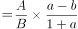，则所求比重差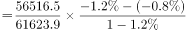，即约降低了0.37个百分点。

故正确答案为C。

---

### 第 4 题　qid 4714012 · 增长

2016年我国粮食单位面积产量约同比：

- **A**. 增长0.56%
- **B**. 增长1.12%
- **C**. 减少0.56%　✅
- **D**. 减少1.12%

**答案**：C

**官方解析**

根据题干“2016年······单位面积产量约同比”，结合选项给出增长/减少+%，可判定本题为平均数的增长率问题。定位文字材料第二段可知，2016年全国粮食总产量比2015年减少0.8%（a）；定位文字材料第三段可知，2016年全国粮食播种面积比2015年减少0.3%（b）。根据平均数的增长率公式：，可得：2016年我国粮食单位面积产量同比增长率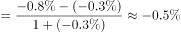，即约同比减少0.5%，与C项最接近。

故正确答案为C。

---

### 第 5 题　qid 4714015 · 综合

以下说法正确的是：

- **A**. 2016年，除谷物外我国其他粮食播种面积之和有所增加　✅
- **B**. 假设粮食总产量以每年10%的速度增长，2019年将首次突破7万万吨
- **C**. 2016年粮食产量下降主要是播种面积减少造成的
- **D**. 2016年全国农作物受灾面积同比增长约为16%

**答案**：A

**官方解析**

A项：定位文字材料第三段可知，2016年全国粮食播种面积比2015年减少314.7千公顷；其中谷物播种面积比2015年减少1265.1千公顷。2016年除谷物外我国其他粮食播种面积之和变化量为（-314.7）-（-1265.1）=950.4＞0，即2016年，除谷物外我国其他粮食播种面积之和有所增加，正确；

B项：定位文字材料第二段可知，2016年全国粮食总产量61623.9万吨，若粮食总产量以每年10%的速度增长，根据公式：，设n年后粮食总产量首次突破7万万吨，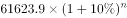，即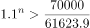，当n=2时不等式成立，即2016+2=2018年全国粮食总产量首次突破7万万吨，错误；

C项：定位文字材料第四段可知，2016年，全国粮食播种面积比上年减少了472万亩，因播种面积减少而减产34亿斤，占粮食减产总量的33.2%。由于因播种面积减少而减产的产量占粮食减产总量的比重少于一半，故播种面积减少不是粮食产量下降的主要原因，错误；

D项：定位文字材料最后一段可知，2016年1-10月份，全国农作物受灾面积3.97亿亩，未给出2016年全年的相关数据，故无法计算，错误。

故正确答案为A。

---

## 材料 2

### 第 6 题　qid 4713973 · 综合

2011年某省工业用电量最多的季度是：

- **A**. 第一季度
- **B**. 第二季度
- **C**. 第三季度　✅
- **D**. 第四季度

**答案**：C

**官方解析**

定位图2可得，2011年某省各月工业用电量。则：

第一季度工业用电量=1月+2月+3月=86.68+19+29.9＜200亿千瓦时；

第二季度工业用电量=4月+5月+6月=91.3+85.72+98.91276亿千瓦时；

第三季度工业用电量=7月+8月+9月=89.77+98.16+89.31277亿千瓦时；

第四季度工业用电量=10月+11月+12月=81.95+86.23+87.09255亿千瓦时。

综上所述，2011年某省工业用电量最多的季度是第三季度。

故正确答案为C。

---

### 第 7 题　qid 4713988 · 增长

2011年工业用电量增速高于全社会用电量增速的月份有：

- **A**. 6 个
- **B**. 7 个　✅
- **C**. 8 个
- **D**. 9 个

**答案**：B

**官方解析**

下表所示为2011年某省工业用电量和全社会用电量的增速：

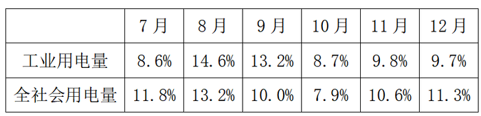

符合条件的有：1月，3月，4月，6月，8月，9月，10月，共7个。

故正确答案为B。

---

### 第 8 题　qid 4713994 · 增长

2011年第一季度全社会用电量同比增长量和增速分别约为：

- **A**. 59.43亿千瓦时，17.7%
- **B**. 59.43亿千瓦时，21.6%　✅
- **C**. 72.80亿千瓦时，26.4%
- **D**. 72.80亿千瓦时，21.7%

**答案**：B

**官方解析**

根据题干“2011年第一季度······同比增长量和增速分别约为”，结合图形材料可知2011年1-3月全社会用电量的同比增速，可判定本题为增长量计算和混合增长率问题。

1.求混合增长率：定位图1可知，2011年1-3月全社会用电量的增速分别为：19.2%，22.6%，23.4%。根据混合后的增长率居中，则2011年第一季度全社会用电量的增速r：19.2%&lt;r&lt;23.4%，排除A、C两项。

2.求增长量：

方法一：定位图1可知，2011年1-3月全社会用电量及其增速分别为：125.09亿千瓦时，19.2%；98.34亿千瓦时，22.6%；111.52亿千瓦时，23.4%。根据公式：，则2011年1-3月全社会用电量的同比增长量分别为：1月：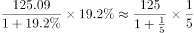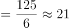亿千瓦时；2月：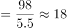亿千瓦时；3月：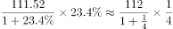亿千瓦时。因此2011年第一季度全社会用电量同比增长量约为21+18+22=61亿千瓦时，与B项最接近。

方法二：根据B、D两项可确定2011年第一季度全社会用电量的增速为21.6%或21.7%。定位图1可知，2011年1-3月全社会用电量分别为：125.09亿千瓦时，98.34亿千瓦时，111.52亿千瓦时。则2011年第一季度全社会用电量为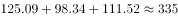亿千瓦时。根据公式：，则2011年第一季度全社会用电量的同比增长量约为：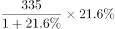（或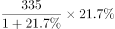）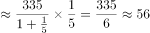亿千瓦时，与B项最接近。

故正确答案为B。

---

### 第 9 题　qid 4714002 · 比重

2011年工业用电量占全社会用电量的比重最小的月份是：

- **A**. 2 月份　✅
- **B**. 3 月份
- **C**. 8 月份
- **D**. 9 月份

**答案**：A

**官方解析**

根据题干“2011年······占······的比重最小的月份是”，结合材料时间为2011年，可判定本题为现期比重问题。定位图形材料可知，2011年某省2月、3月、8月和9月的全社会用电量和工业用电量分别为：98.34亿千瓦时，19亿千瓦时；111.52亿千瓦时，29.9亿千瓦时；150.53亿千瓦时，98.16亿千瓦时；138.9亿千瓦时，89.31亿千瓦时。根据公式：比重，则所求比重分别为：2月：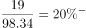；3月：；8月：；9月：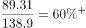，故比重最小的月份是2月份。

故正确答案为A。

---

### 第 10 题　qid 4714005 · 综合

以下说法正确的是：

- **A**. 2011年全社会用电量环比变动的趋势与工业用电量完全一致　✅
- **B**. 2011年和2010年年度工业用电量的峰值均出现在6月份
- **C**. 2011年度全社会用电量达到峰值的月份，其非工业用电量增速最高
- **D**. 2011年全社会用电量增速与工业用电量增速差距最大的月份，其非工业用电量为当年最小值

**答案**：A

**官方解析**

A项：定位统计图1和图2可得，2011年11月全社会用电量为122.9亿千瓦时，12月为122.51亿千瓦时，12月全社会用电量环比下降；11月工业用电量为86.23亿千瓦时，12月为87.09亿千瓦时，12月工业用电量环比上升。即2011年二者环比变动的趋势不完全一致，错误；

B项：定位统计图2可得，2011年工业用电量最大值为6月，为98.91亿千瓦时，同比增长26.2%；8月为98.16亿千瓦时，同比增长14.6%。根据公式：基期量，则2010年6月工业用电量亿千瓦时，8月亿千瓦时，2010年8月工业用电量更大，即2010年工业用电量的峰值不是6月份，错误；

C项：定位统计图1可得，达到峰值的月份为8月，同比增长13.2%。定位统计图2，8月同比增长14.6%。根据混合增长率口诀“混合后居中”可得：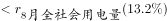。同理，2011年度全社会用电量2月同比增长22.6%，2011年度工业用电量2月同比增长19%，因此：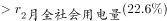。2月非工业用电量增速高于8月，即2011年度全社会用电量达到峰值的月份，其非工业用电量增速不是最高，错误；

D项：定位统计图1和图2可得，2011年1-12月全社会用电量增速与工业用电量增速之差分别为： 

1月：|19.2%-19.3%|=0.1%；

2月：22.6%-19%=3.6%；

3月：|23.4%-29.9%|=6.5%；

4月：|20.2%-21.7%|=1.5%；

5月：13%-12.7%=0.3%；

6月：|25.6%-26.2%|=0.6%；

7月：11.8%-8.6%=3.2%；

8月：|13.2%-14.6%|=1.4%；

9月：|10%-13.2%|=3.2%；

10月：|7.9%-8.7%|=0.8%；

11月：10.6%-9.8%=0.8%；

12月：11.3%-9.7%=1.6%。

差值最大的是3月，3月非工业用电量=111.52-29.9=81.62亿千瓦时，而4月非工业用电量=127.64-91.3=36.34亿千瓦时，4月非工业用电量低于3月，即2011年二者增速差距最大的月份，其非工业用电量不是当年最小值，错误。

备注：本题四个选项均错误，故无正确答案。

---

## 材料 3

        2012年末福建省常住人口3748万人，比上年增长。农村居民人均纯收入9967元，比上年增长13.5%，扣除价格因素，实际增长10.8%，城镇居民人均可支配收入28055元，比上年增长12.6%，扣除价格因素，实际增长10.0%，农村居民食品消费支出占消费总支出比重为46.0%，城镇为39.4% 。

        全省领取失业保险金人数4.61万人，比上年增长1.04万人，全省纳入城镇最低生活保障的居民16.89万人，减少1.20万人，纳入农村最低生活保障的居民73.68万人，增加0.73万人：“五保”供养对象9.14万人。

### 第 11 题　qid 1992332 · 综合

2012年纳入最低生活保障的居民人数与2011年相比约：

- **A**. 减少7.1%
- **B**. 增加1.0%
- **C**. 减少0.5%　✅
- **D**. 减少5.1%

**答案**：C

**官方解析**

第一步：分析问题。
观察选项，数据相差较大，可采取估算法。增长率=增长量÷基期量。
第二步：定位数据。
文字材料第二段：“全省纳入城镇最低生活保障的居民16.89万人，减少1.20万人，纳入农村最低生活保障的居民73.68万人，增加0.73万人”。
第三步：计算过程。
2012年全省纳入最低生活保障居民人数=16.89+73.68=90.57万人，全省纳入最低生活保障居民人数比去年增加人数=-1.2+0.73=-0.47，即减少了0.47万人。
2011年全省纳入最低生活保障居民人数=90.57+0.47=91.04万人。
2012年纳入最低生活保障的居民人数与2011年相比的增长率=（-0.47）÷91.04≈-0.5%。
（因选项相差较大，可将-0.47简化为-0.5，91.04简化为90，计算出来结果为-0.005左右，即-0.5%，即减少了0.5%。)
第四步：再次标注答案 。
故正确答案为C。

---

### 第 12 题　qid 1992346 · 比重

2011年纳入最低生活保障的居民人数占全省常住人口的比重约为：

- **A**. 2.4%　✅
- **B**. 0.5%
- **C**. 1.9%
- **D**. 2.7%

**答案**：A

**官方解析**

根据“2011年纳入最低生活保障的居民人数占全省常住人口的比重”，结合材料时间为2012年，可判定本题为基期比重问题。定位文字材料第一段：2012年末福建省常住人口3748万人，比上年增长；定位文字材料第二段：全省纳入城镇最低生活保障的居民16.89万人，减少1.20万人，纳入农村最低生活保障的居民73.68万人，增加0.73万人。根据公式：基期量=现期量-增长量，则2011年纳入最低生活保障的居民人数=2011年纳入城镇最低生活保障的居民人数+2011年纳入农村最低生活保障的居民人数=（16.89+1.20）+（73.68-0.73）=91.04万人。根据公式：基期量，则2011年全省常住人口为万人。故所求比重，与A项最接近。

故正确答案为A。

---

### 第 13 题　qid 1992348 · 平均数

2012年农村居民人均纯收入与城镇居民人均可支配收入间的差距与2011年相比约：

- **A**. 增大12%　✅
- **B**. 减少12%
- **C**. 增大21%
- **D**. 减少21%

**答案**：A

**官方解析**

根据题干“2012年······与2011年相比约”，结合选项为增大/减少+百分数，可判定本题为一般增长率计算问题。定位图1可得：2012年与2011年福建省农村居民人均纯收入分别为9967元与8779元；定位图2可得：2012年与2011年福建省城镇居民人均可支配收入分别为28055元与24907元。则2012年二者差距为28055-9967=18088元，2011年二者差距为24907-8779=16128元。根据公式：增长率，则2012年二者差距与2011年增长，与A项最接近。

故正确答案为A。

---

### 第 14 题　qid 1992354 · 增长

2007-2010年，农村居民人均纯收入年平均增长率约为：

- **A**. 10.7%　✅
- **B**. 9.9%
- **C**. 8.3%
- **D**. 8.6%

**答案**：A

**官方解析**

根据“年平均增长率约为”，判断本题为年均增长率计算问题。定位图1：2007年农村居民人均纯收入为5467元，2010年农村居民人均纯收入为7427元。根据公式：，可得：，即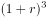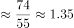。

年均增长率的计算，采用代入排除法，由于B项，优先代入。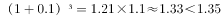。所以年均增长率r应，仅有A项符合。

故正确答案为A。

---

### 第 15 题　qid 1992356 · 综合

根据上述材料，下列描述错误的是：

- **A**. 2007-2012年，农村居民人均纯收入与城镇居民人均可支配收入间的绝对差距呈增大趋势
- **B**. 2007-2012年，农村居民人均纯收入与城镇居民人均可支配收入增长趋势大致相同
- **C**. 2007-2012年，农村居民人均纯收入与城镇居民人均可支配收入相比增速慢的年份有3年　✅
- **D**. 2011年，农村居民人均纯收入与城镇居民人均可支配收入增长速度间的差距最大

**答案**：C

**官方解析**

第一步：分析问题。
根据两个柱状图表进行做题。增长趋势相同是指城乡的增长率同时增长或同时下降，增长趋势大致相同是指可能有部分年份趋势不同，但大部分是相同的。
第二步：定位数据。
两个柱状图表。
第三步：计算过程。
通过计算每年的城乡差额发现2007-2012年间农村和城镇的收入差距越来越大，A项正确；
观察表格发现2007-2011年农村和城镇的收入增长趋势都是相同的（增长-增长-下降-增长），只有2011-2012年的趋势不同，但符合大致相同的说法，B项正确；
2007-2012年，农村居民人均纯收入与城镇居民人均可支配收入相比增速慢的年份有4年，分别是2007、2008、2009、2010四年，C项错误；
2011年，农村居民人均纯收入的增速是12.3%，城镇居民人均可支配收入的增速是8.7%，增长速度相差3.6%，是2007-2012年间增速差距最大的，D项正确。
第四步：再次标注答案 。
本题为选非题，故正确答案为C。

---

## 材料 4

        国家统计局2015年2月25日发布2014年国民经济和社会发展统计公报，各项社会事业取得新的进展。初步核算，全年国内生产总值335353亿元，比上年增长8.7%。

        统计公报分综合、农业、工业和建筑业、固定资产投资、国内贸易、对外经济、交通邮电和旅游、金融、教育和科学技术、文化卫生和体育、人口、人民生活和社会保障，以及资源、环境和安全生产等十二部分，展示了2014年中国国民经济和社会发展状况。

        公报显示，截至2014年年末，国家外汇储备23992亿美元，比上年末增加4531亿美元，增速减慢4个百分点；全年财政收入68477亿元，比上年增加7147亿元，增长11.7%；全国就业人员77995万人，比2013年末增加515万人，比2012年末增加1005万人。

        中国政府2014年推出四万亿元的剌激计划。公报显示，2014年全年全社会固定资产投资224846亿元，比上年增长30.1%。其中，中西部投资增长高于东部和东北地区。

### 第 16 题　qid 4714016 · 增长

根据2014年国民经济和社会发展统计公报初步核算的结果，2014年全年国内生产总值比上年增加了约：

- **A**. 26841亿元　✅
- **B**. 26897亿元
- **C**. 26954亿元
- **D**. 26995亿元

**答案**：A

**官方解析**

方法一：根据题干“······2014年······比上年增加了约”，可判定本题为增长量计算问题。定位文字材料第一段可得：2014年，全年国内生产总值335353亿元，比上年增长8.7%。根据公式：增长量=现期量-基期量=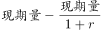，可得2014年全年国内生产总值比上年增加了亿元，与A项最接近。

方法二：根据题干“······2014年······比上年增加了约”，可判定本题为增长量计算问题。定位文字材料第一段可得：2014年，全年国内生产总值335353亿元，比上年增长8.7%。根据公式：增长量，可得2014年全年国内生产总值比上年增加了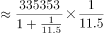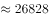亿元，与A项最接近。

故正确答案为A。

---

### 第 17 题　qid 4714068 · 综合

2012年末我国国家外汇储备是：

- **A**. 15288亿元
- **B**. 15676亿元
- **C**. 15288亿美元　✅
- **D**. 15676亿美元

**答案**：C

**官方解析**

根据题干“2012年末我国国家外汇储备是”，结合材料时间为2014年末，可判定本题为基期计算问题。定位文字材料第三段可得：2014年末，国家外汇储备23992亿美元，比上年末增加4531亿美元，增速减慢4个百分点。2013年末国家外汇储备=23992-4531=19461亿美元，根据公式：增长率，可得2014年末国家外汇储备同比增长率：，2013年末国家外汇储备同比增长率=23.2%+4%=27.2%。根据公式：基期量，可得2012年末国家外汇储备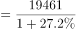亿美元，与C项最接近。

故正确答案为C。

---

### 第 18 题　qid 4714079 · 增长

2013年末就业人员比上年增长了：

- **A**. 2.53%
- **B**. 1.97%
- **C**. 1.26%
- **D**. 0.64%　✅

**答案**：D

**官方解析**

根据题干“2013年末······比上年增长了”，结合选项为百分数，可判定本题为一般增长率计算问题。定位文字材料第三段可得：2014年末，全国就业人员77995万人，比2013年末增加515万人，比2012年末增加1005万人。根据公式：增长率，可得2013年末就业人员比上年增长了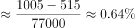，与D项最接近。

故正确答案为D。

---

### 第 19 题　qid 4714082 · 综合

2013年全年全社会固定资产投资约为：

- **A**. 172475亿元
- **B**. 172826亿元　✅
- **C**. 173056亿元
- **D**. 173217亿元

**答案**：B

**官方解析**

根据题干“2013年全年······约为”，结合材料时间为2014年，可判定本题为基期计算问题。定位文字材料第四段可得：2014年全年全社会固定资产投资224846亿元，比上年增长30.1%。根据公式：基期量，则2013年全年全社会固定资产投资亿元，与B项最接近。

故正确答案为B。

---

### 第 20 题　qid 4714084 · 综合

以下说法错误的是：

- **A**. 2014年我国国民经济形势总体回升向好，各项社会事业取得新的进展
- **B**. 2013年全年财政收入为61330亿元
- **C**. 2013年末全国就业人员比2012年末全国就业人员增加490万人
- **D**. 2014年全年中西部的全社会固定资产投资增长低于东部和东北地区　✅

**答案**：D

**官方解析**

A项：定位材料第一段可得：国家统计局发布2014年国民经济和社会发展统计公报，各项社会事业取得新的进展。初步核算，全年国内生产总值335353亿元，比上年增长8.7%。国内生产总值是国民经济核算的核心指标，由于2014年全年国内生产总值同比增长率为正数，即经济形势总体回升向好，正确；
B项：定位材料第三段可得：2014年全年财政收入68477亿元，比上年增加7147亿元。根据公式：基期量=现期量-增长量，则2013年全年财政收入=68477-7147=61330亿元，正确；
C项：定位材料第三段可得：2014年全国就业人员77995万人，比2013年末增加515万人，比2012年末增加1005万人。根据公式：基期量=现期量-增长量，则2013年末全国就业人员为77995-515=77480万人，2012年末全国就业人员为77995-1005=76990万人，那么2013年末全国就业人员比2012年末全国就业人员增加77480-76990=490万人，正确；
D项：定位材料第四段可得：2014年中西部投资增长高于东部和东北地区，错误。
本题为选非题，故正确答案为D。

---
