# 2018年辽宁省公务员录用考试《行测》题（网友回忆版）

> 资料分析 · 20 题 · 辽宁 2018

## 材料 1

        2018年1-7月份，社会消费品零售总额210752亿元，同比增长。其中，限额以上单位消费品零售额81125亿元，同比增长。

        按经营单位所在地分，7月份，城镇消费品零售额26388亿元，同比增长；乡村消费品零售额4345亿元。1-7月份，城镇消费品零售额180480亿元，同比增长；乡村消费品零售额30272亿元，同比增长。

        按消费类型分，7月份，餐饮收入3343亿元，同比增长；商品零售27391亿元，同比增长。1-7月份，餐饮收入22800亿元，同比增长；商品零售187951亿元，同比增长。

        2018年1-7月份，全国网上零售额47863亿元，同比增长。其中，实物商品网上零售额36461亿元，同比增长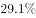，占社会消费品零售总额的比重为；在实物商品网上零售额中，吃、穿和用类商品分别同比增长、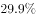和。

### 第 1 题　qid 2307729 · 综合

2017年1-7月，社会消费品零售总额约为（    ）亿元。

- **A**. 28200
- **B**. 193000　✅
- **C**. 201000
- **D**. 243000

**答案**：B

**官方解析**

由题干“2017年1-7月······约为······亿元”，结合材料已知时间为2018年1-7月，可判定本题为基期计算问题。定位文字材料第一段可得：“2018年1-7月份，社会消费品零售总额210752亿元，同比增长”，故2017年1-7月，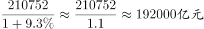，与B项最接近。

故正确答案为B。

---

### 第 2 题　qid 2307731 · 比重

2017年1-7月，限额以上单位消费品零售额占社会消费品零售总额比重约为：

- **A**. 

- **B**. 

- **C**. 

- **D**. 

　✅

**答案**：D

**官方解析**

由题干“2017年1-7月······占······比重约为”，结合材料已知时间为2018年1-7月，可判定本题为基期比重问题。定位文字材料第一段可得：“2018年1-7月份，社会消费品零售总额210752亿元，同比增长。其中，限额以上单位消费品零售额81125亿元，同比增长”，故2017年1-7月，限额以上单位消费品零售额占社会消费品零售总额比重。与D项最接近。

故正确答案为D。

---

### 第 3 题　qid 2307735 · 增长

2018年1-6月，商品零售同比增长约为：

- **A**. 

- **B**. 

- **C**. 

　✅
- **D**. 

**答案**：C

**官方解析**

由题干“2018年1-6月，商品零售同比增长约为”，选项是百分数，结合材料已知2018年7月份商品零售增长率，1-7月份商品零售增长率，可判断本题为混合增长率问题。定位文字材料第三段可得：“7月份，商品零售27391亿元，同比增长。1-7月份，商品零售187951亿元，同比增长”，根据混合增长率大小居中，排除A、B两项。根据线段法，混合前后的增长率之差与基期量成反比，计算时用现期量代替基期量，即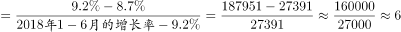，故2018年1-6月，商品零售同比增长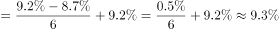。

故正确答案为C。

---

### 第 4 题　qid 2307737 · 增长

2018年1-7月份，实物商品网上零售额同比增长约（    ）亿元。

- **A**. 8128　✅
- **B**. 7256
- **C**. 9133
- **D**. 8977

**答案**：A

**官方解析**

由题干“2018年1-7月份······同比增长约······亿元”，结合材料已知时间为2018年1-7月，可判定本题为增长量计算问题。定位文字材料第四段可得：“2018年1-7月份，实物商品网上零售额36461亿元，同比增长”，故2018年1-7月份，实物商品网上零售额同比增长量亿元。与A项最接近。

故正确答案为A。

---

### 第 5 题　qid 2307744 · 综合

根据上述资料下列说法正确的是：

- **A**. 
2018年1-7月份，在实物商品网上零售额中，吃、穿和用类商品的比重与上一年同期相比均有所上升
　✅
- **B**. 
2018年7月份乡村消费品零售额增幅约为

- **C**. 
2018年1-7月份城镇消费品零售额同比增长约14292亿元

- **D**. 
2018年1-7月份，吃、穿和用类商品销售额占社会消费品零售总额的比重同比没有变化

**答案**：A

**官方解析**

A项：定位文字材料第四段可得：在实物商品网上零售额中，吃类商品同比增长率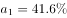，穿类商品同比增长率，用类商品同比增长率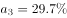，实物商品网上零售额同比增长率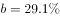，根据两期比重比较结论，当时比重上升，即比重高于上年水平，故2018年1-7月份，在实物商品网上零售额中，吃、穿和用类商品的比重与上一年同期相比均有所上升，正确；

B项：定位文字材料第二、三段可得，按经营单位所在地分，2018年7月份，城镇消费品零售额同比增长8.6%；按消费类型分，2018年7月份，餐饮收入同比增长9.4%，商品零售同比增长8.7%。社会消费品零售总额=城镇消费品零售额+乡村消费品零售额=餐饮收入+商品零售，根据混合增长率口诀“混合居中”可得：（9.4%）＞＞（8.7%）；＞＞（8.6%）。则可知，即2018年7月份乡村消费品零售额增幅大于8.6%，不可能为7.9%，错误；

C项：定位文字材料第二段可得：“2018年1-7月份，城镇消费品零售额180480亿元，同比增长”，故2018年1-7月份城镇消费品零售额同比增长量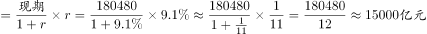，错误；

D项：定位文字材料第四段可得：在实物商品网上零售额中，吃类商品同比增长率，穿类商品同比增长率，用类商品同比增长率。定位材料第一段可得：社会消费品零售总额同比增长率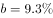，根据两期比重比较结论，当时比重上升，即比重高于上年水平，故2018年1-7月份，吃、穿和用类商品销售额占社会消费品零售总额的比重同比上升，错误。

故正确答案为A。

---

## 材料 2

### 第 6 题　qid 2307727 · 综合

“十二五”时期，我国外商投资企业进出口总额约为（    ）万亿美元。

- **A**. 7.34
- **B**. 7.98
- **C**. 9.26
- **D**. 9.49　✅

**答案**：D

**官方解析**

定位统计图可知2011-2015年各年我国外商投资企业进出口总额，可知“十二五”时期，我国外商投资企业进出口总额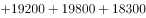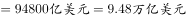，与D选项最接近。

故正确答案为D。

---

### 第 7 题　qid 2307728 · 增长

下列年份中，外商投资企业进出口总额同比增速最快的是：

- **A**. 2008
- **B**. 2010　✅
- **C**. 2011
- **D**. 2017

**答案**：B

**官方解析**

由题干“······同比增速最快的是········”，可判定本题为一般增长率比较问题。代入公式：，可知：

A项：2008年增长率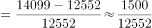

B项：2010年增长率

C项：2011年增长率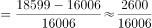

D项：2017年增长率=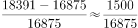

B选项的分子最大，分母最小，故增长率最大。

故正确答案为B。

---

### 第 8 题　qid 2307734 · 增长

2015年外商投资企业进出口总额同比约：

- **A**. 
下降
　✅
- **B**. 
下降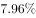

- **C**. 
增长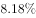

- **D**. 
增长

**答案**：A

**官方解析**

由题干“2015年······同比约······”，结合选项为下降/增长百分数，可判定本题为一般增长率计算问题。定位2014年至2015年的全国外商投资企业进出口总额，代入公式：，，与A项最接近。

故正确答案为A。

---

### 第 9 题　qid 2307738 · 增长

2009年-2017年全国外商投资企业进出口总额及同比增速均高于上年的年度有（    ）个。

- **A**. 3　✅
- **B**. 4
- **C**. 5
- **D**. 6

**答案**：A

**官方解析**

由题干“······同比增速高于上年的年度······”，可判定本题为一般增长率比较问题。定位2009年至2017年的外商投资企业进出口总额，2009年至2017年全国外商投资企业进出口总额高于上年的年度有2010年、2011年、2012年、2013年、2014年、2017年，将以上年度数据代入公式：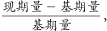

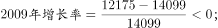

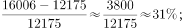

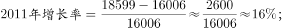

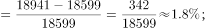

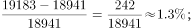

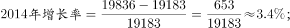

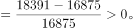

比较上述数据，则2009年至2017年全国外商投资企业进出口总额及同比增速均高于上年的年度有2010年、2014年、2017年，共3个年度。

故正确答案为A。

---

### 第 10 题　qid 2307743 · 综合

能够从上述资料中推出的是：

- **A**. 2010-2011年我国外商投资企业进出口总额超过3.5万亿美元
- **B**. 2011-2014年我国外商投资企业进出口总额年均超过1.9万亿美元　✅
- **C**. 2014年全国外商投资企业进出口总额比2006年翻了一番
- **D**. 图中外商投资企业进出口总额同比下降的年份超过总年数的1/3

**答案**：B

**官方解析**

A项：定位统计图2010年和2011年，则外商投资企业进出口总额万亿美元，错误；

B项：结合106题，2011年至2014年外商投资企业进出口总额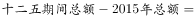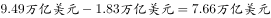，则2011年至2014年外商投资企业进出口年均总额万亿美元，正确；

C项：材料中未见2006年数据，错误；

D项：材料中总年数2007年至2017年，材料无2006年数据，所以同比的年份共10年，其中外商投资企业进出口总额同比下降的年份有2009年、2015年、2016年共三年，占总年数比重，错误。

故正确答案为B。

---

## 材料 3

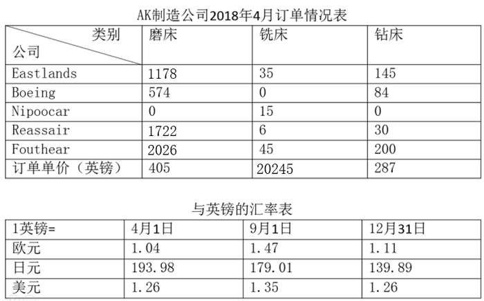

### 第 11 题　qid 2307696 · 综合

如果Nipoocar公司4月1日同意以英镑标注的铣床订单价格，在9月1日付款，那么9月1日付款与4月1日付款费用上大约：

- **A**. 多付4242455日元
- **B**. 多付4546015日元
- **C**. 少付4242455日元
- **D**. 少付4546015日元　✅

**答案**：D

**官方解析**

根据题干“······9月1日付款与4月1日付款费用······”，可判断本题为基期比较问题。定位材料表格，Nipoocar公司4月铣床订单数量为15，单价为20245英镑；4月1日1英镑=193.98日元，9月1日1英镑=179.01日元。则9月1日付款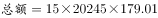日元，4月1日付款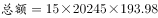日元，对比可知4月1日付款金额高，排除A、B两项。具体数据为：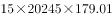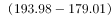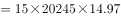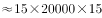日元，与D项最为接近。

故正确答案为D。

---

### 第 12 题　qid 2307697 · 增长

如AK制造公司钻床订单数环比增长率为，若保持此环比增长率不变，AK公司钻床订单达到500件的时间应在：

- **A**. 2018年7月　✅
- **B**. 2018年9月
- **C**. 2018年11月
- **D**. 2019年1月

**答案**：A

**官方解析**

根据题干“······达到500件的时间······”，可判断本题为现期追赶问题。定位表格可知AK制造公司2018年4月钻床的订单件。设个月后AK公司钻床订单数超过500，可得，即为，代入A项，，，即在2018年7月即可达到。

故正确答案为A。

---

### 第 13 题　qid 2307698 · 增长

2018年9月1日磨床的价格比订单价下降了，则下列说法正确的是：

- **A**. Reassair公司使用欧元12月31日按订单价支付比9月1日按现价支付更经济　✅
- **B**. Reassair公司使用欧元9月1日按现价支付比12月31日按订单价支付更经济
- **C**. Reassair公司使用日元9月1日按现价支付额比12月31日按订单价支付额高
- **D**. Reassair公司使用美元12月31日按订单价支付比9月1日按现价支付更经济

**答案**：A

**官方解析**

由2018年9月1日磨床的价格比订单价格下降可得，9月1日的价格为英镑。

A项：定位表格，Reassair公司12月31日使用欧元按订单价为欧元，9月1日现价支付为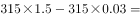欧元，则在12月31日按订单价更加经济，正确；

B项：与A项相反，错误；

C项：定位表格，Reassair公司9月1日使用日元按现价单价为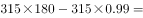日元，12月31日按订单价支付单价为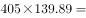日元，则9月1日按现价支付额比12月31日按订单价支付额低，错误；

D项：定位表格，Reassair公司12月31日使用美元按照订单价支付单价为美元，9月1日按现价单价为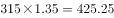美元，则在9月1日按现价支付更加经济，错误。

故正确答案为A。

---

### 第 14 题　qid 2307702 · 综合

Boeing公司钻床订单价占该公司总订单价约为：

- **A**. 

- **B**. 

　✅
- **C**. 

- **D**. 

**答案**：B

**官方解析**

根据题干“······占该公司总订单······”，可判断本题为现期比重问题。定位表格，Boeing公司钻床订单数量为84个，单价为287英镑，磨床订单数量为574，单价为405英镑。则代入比重公式：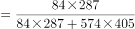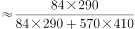。

故正确答案为B。

---

### 第 15 题　qid 2307709 · 综合

AK制造公司铣床的利润为售价的，磨床的利润为售价的，则关于上述所有磨床和铣床订单按英镑计价的利润额阐述正确的有（    ）个。

①磨床的利润额比铣床高了约左右

②铣床的利润额比磨床低了近

③铣床的利润额大约8万元

④磨床的单位成本比铣床的低

- **A**. 1
- **B**. 2
- **C**. 3　✅
- **D**. 4

**答案**：C

**官方解析**

由题意可得：单件铣床利润为英镑，成本为英镑；单件磨床的利润为英镑，成本为英镑；铣床订单数量为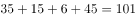件；磨床订单数量为件。

①磨床利润额比铣床高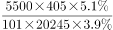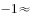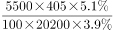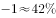，约，正确；

②由①结论可设铣床利润额为10份，则磨床利润额为份，铣床利润额比磨床低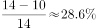，近，正确；

③铣床利润额为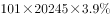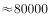英镑，而非80000元，错误；

④铣床单位成本为英镑，磨床单位成本为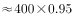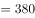英镑，磨床单位成本低，正确。

正确的有3个。

故正确答案为C。

---

## 材料 4

        国家统计局公布的全国粮食生产数据显示，2018年全国粮食播种面积175555万亩，比2017年下降。全国粮食单位面积产量375公斤/亩，比2017年增长。谷物单位面积产量408公斤/亩，比2017年增长。粮食总产量6579亿公斤，比2017年下降；其中谷物（包括稻谷，小麦，玉米、大麦、高粱、荞麦、燕麦等）总产量6102亿公斤，比2017年下降。全年粮食产量虽有所下降，但减幅不大，仍处于高位水平，属于丰收年景。

### 第 16 题　qid 2307724 · 增长

2015-2017年三年，全国粮食总产量平均增长率约为：

- **A**. 

- **B**. 

- **C**. 

　✅
- **D**. 

**答案**：C

**官方解析**

由题干“2015-2017年三年，全国粮食总产量平均增长率约为”，结合选项为百分数，可判定本题为年均增长率计算问题。定位柱状图可得，2014年全国粮食总产量为6396亿公斤，2017年为6616亿公斤。代入年均增长率计算公式，（为年份差,由于题目说的三年，因此），。代入选项验证，，，，，与C项最接近。

故正确答案为C。

---

### 第 17 题　qid 2307730 · 比重

2018年全国谷物总产量占全国粮食总产量的比重，较上一年约：

- **A**. 
增长

- **B**. 
减少
　✅
- **C**. 
增长

- **D**. 
减少

**答案**：B

**官方解析**

由题干“2018年······占······的比重，较上一年约”，结合选项为增长/减少+百分数，可判定本题为两期比重比较问题。定位文字材料及柱状图可得，“2018年全国粮食总产量为6579亿公斤，2017年为6616亿公斤。2018年谷物总产量6102亿公斤，比2017年下降（）。2018年粮食总产量为6579亿公斤，比2017年下降（）”。根据两期比重比较公式可知，，比重下降，且两期比重差，只有B项符合。

故正确答案为B。

---

### 第 18 题　qid 2307742 · 比重

2018年夏粮的播种面积和总产量分别占全国粮食播种面积和总产量的比重约为：

- **A**. 
和

- **B**. 
和

- **C**. 
和

- **D**. 
和
　✅

**答案**：D

**官方解析**

由题干“2018年······分别占······的比重约为”，可判定本题为现期比重计算问题。定位表格可得，2018年全国粮食总播种面积175555万亩，总产量6579亿公斤，夏粮播种面积40055万亩，总产量1388亿公斤，则2018年夏粮的播种面积占全国的比重为，总产量占全国比重为，与D项最接近。

故正确答案为D。

---

### 第 19 题　qid 2307749 · 增长

若2018年稻谷的总产量同比增长，那么稻谷的总产量拉动谷物总产量增长了：

- **A**. 

- **B**. 

- **C**. 

　✅
- **D**. 

**答案**：C

**官方解析**

由题干“若2018年稻谷的总产量同比增长，稻谷的总产量拉动谷物总产量增长了”，结合选项为百分数，可判定本题为拉动增长率计算问题。定位文字材料及表格可知，2018年谷物总产量6102亿公斤，比2017年下降，稻谷总产量2121亿公斤，则2018年稻谷同比增长量=亿公斤，2017年谷物总产量为亿公斤，根据拉动增长率=。

故正确答案为C。

---

### 第 20 题　qid 2307774 · 增长

2014年粮食播种面积同比增长了，2018的粮食播种面积比2013年

- **A**. 
增加了约1653亩

- **B**. 
增加了约2260万亩

- **C**. 
下降了约

- **D**. 
增长了约
　✅

**答案**：D

**官方解析**

由题干“2018的粮食播种面积比2013年”，结合选项为增加多少亩，及增长+百分数，可判定本题为增长率及增长量计算问题。定位柱状图可得，2014年粮食播种面积为176183万亩，2018年为175555万亩。则2013年粮食播种面积为万亩，万亩，增长率为。即2018年粮食播种面积比2013年增长了，增加了1633万亩，只有D项最符合。

故正确答案为D。

---
