# 2018年重庆市公务员录用考试《行测》题（下半年）

> 资料分析 · 20 题 · 重庆 2018

## 材料 1

        2017年，我国发明专利申请量为138.2万件，同比增长。共授权发明专利42.0万件，同比增长。其中，国内发明专利授权32.7万件，同比增长。在国内发明专利授权中，职务发明为30.4万件，占；非职务发明为2.3万件，占。

        截至2017年底，我国国内（不含港澳台）发明专利拥有量共计135.6万件，每万人口发明专利拥有量达到9.8件。我国每万人口发明专利拥有量排名前十位的省（区、市）依次为：北京（94.5件）、上海（41.5件）、江苏（22.5件）、浙江（19.7件）、广东（19.0件）、天津（18.3件）、陕西（8.9件）、福建（8.0件）、安徽（7.7件）和辽宁（7.6件）。

        2017年，我国在“一带一路”沿线国家（不含中国）专利申请公开量为5608件，同比增长。其中，在印度专利申请公开量为2724件，在俄罗斯专利申请公开量为1354件，专利申请初具规模。2017年，“一带一路”沿线国家在华申请专利4319件，同比增长；在华申请专利的“一带一路”沿线国家数达到41个，较2016年增加4个。

        2017年，全国专利行政执法办案总量6.7万件，同比增长。其中，专利纠纷办案2.8万件（包括专利侵权纠纷办案2.7万件），同比增长；查处假冒专利案件3.9万件，同比增长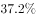。

### 第 1 题　qid 2402470 · 综合

2017年底，每万人口发明专利拥有量排名第二位的省（区、市）比全国每万人口发明专利拥有量高约多少倍？

- **A**. 2
- **B**. 3　✅
- **C**. 4
- **D**. 5

**答案**：B

**官方解析**

根据“2017年底，······比······高约多少倍”，可判定本题为一般增长率问题。定位材料第二段可知，截至2017年底，我国每万人口发明专利拥有量达到9.8件。我国每万人口发明专利拥有量排名第二位的省（区、市）为上海（41.5件）。代入公式，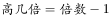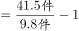倍，与B项最接近。

故正确答案为B。

---

### 第 2 题　qid 2402471 · 比重

2016年，国内发明专利授权占我国授权发明专利的比例为：

- **A**. 

- **B**. 

- **C**. 

- **D**. 
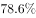
　✅

**答案**：D

**官方解析**

根据“2016年，······占······的比例”，结合材料时间为2017年，可判定本题为基期比重问题。定位材料第一段可知， 2017年，我国共授权发明专利42.0万件，同比增长。其中，国内发明专利授权32.7万件，同比增长。代入公式，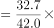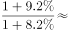，只有D项符合。

故正确答案为D。

---

### 第 3 题　qid 2402474 · 增长

若以2017年的速度增长，到2019年，我国“一带一路”沿线国家（不含中国）专利申请公开量将达到多少件？

- **A**. 6505
- **B**. 6823
- **C**. 7028
- **D**. 7546　✅

**答案**：D

**官方解析**

根据“若以2017年的速度增长，到2019年，······将达到多少件”，可判定本题为现期计算问题。定位材料第三段可知，2017年，我国在“一带一路”沿线国家（不含中国）专利申请公开量为5608件，同比增长。根据公式，，则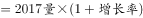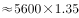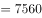，与D项最接近。

故正确答案为D。

---

### 第 4 题　qid 2402476 · 综合

2017年，全国专利纠纷案件数和查处假冒专利案件两者的增量比为：

- **A**. 0.55∶1
- **B**. 0.59∶1
- **C**. 0.69∶1　✅
- **D**. 0.72∶1

**答案**：C

**官方解析**

根据“2017年，······和······比为”，可判定本题为比值计算问题。定位材料最后一段可知，2017年，专利纠纷办案2.8万件，同比增长；查处假冒专利案件3.9万件，同比增长。根据，可得全国专利纠纷案件数增量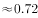万件；查处假冒专利案件增量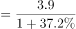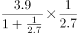万件；则二者比值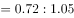。

故正确答案为C。

---

### 第 5 题　qid 2402478 · 综合

下列选项中，不能从给定资料中得出的是：

- **A**. 
2017年，我国每万人口发明专利拥有量与北京的平均水平相差悬殊

- **B**. 
2017年，我国在印度专利申请公开量是在俄罗斯的两倍以上

- **C**. 
2016年，在我国（不含港澳台）申请专利的国家数为37个
　✅
- **D**. 
2016年，全国专利纠纷办案占专利行政执法办案总量超过

**答案**：C

**官方解析**

A项：定位材料第二段，截至2017年底，我国每万人口发明专利拥有量达到9.8件，北京为94.5件，9.8与94.5有近10倍的差距，可以理解为相差悬殊，正确；

B项：定位材料第三段，2017年，我国在印度专利申请公开量为2724件，在俄罗斯专利申请公开量为1354件。倍数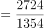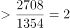，即在两倍以上，正确；

C项：材料只给出在华申请专利的“一带一路”沿线国家数，未给出在我国（不含港澳台）申请专利的国家总数，无法计算，错误；

D项：定位材料最后一段，2017年，全国专利行政执法办案总量6.7万件，同比增长。其中，专利纠纷办案2.8万件，同比增长。代入基期比重公式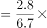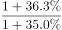，正确。

本题为选非题，故正确答案为C。

---

## 材料 2

### 第 6 题　qid 2402481 · 增长

2018年1—5月，粮油、食品类商品零售额同比增加多少亿元？

- **A**. 70
- **B**. 70.6
- **C**. 463.8　✅
- **D**. 465

**答案**：C

**官方解析**

根据“2018年1—5月，······同比增加多少亿元”，可判定本题为增长量计算问题。定位表格， 粮油食品类1-5月份的绝对量为5505亿元，同比增长。代入公式，增长量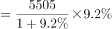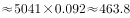亿元。

故正确答案为C。

备注：由于本题A项与B项、Ｃ项与Ｄ项之间差距过小，故只能采用精算法计算。

---

### 第 7 题　qid 2402482 · 增长

2018年5月，下列四类零售商品，高于商品零售额同比增幅的是：

- **A**. 烟酒类
- **B**. 服装鞋帽、针纺织品类
- **C**. 文化办公用品类
- **D**. 家具类　✅

**答案**：D

**官方解析**

同比增幅即同比增长率，根据“高于······同比增幅的是”，可判定本题为直接找数。定位表格第三列，2018年5月，商品零售额同比增长，烟酒类同比增长；服装鞋帽、针纺织品类同比增长；文化办公用品类同比增长；家具类同比增长，则高于商品零售额同比增幅的是家具类。

故正确答案为D。

---

### 第 8 题　qid 2402483 · 综合

2017年5月，城镇消费品零售额比乡村消费品零售额多约多少倍？

- **A**. 3
- **B**. 4
- **C**. 5　✅
- **D**. 6

**答案**：C

**官方解析**

根据“2017年5月，······比······多约多少倍”，可判定本题为基期倍数问题。定位表格，2018年5月城镇消费品零售额为26092亿元，同比增长，乡村消费品零售额为4267亿元，同比增长。先代入公式：基期倍数倍；再代入公式：多几倍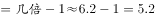倍，与C项最接近。

故正确答案为C。

---

### 第 9 题　qid 2402484 · 综合

2018年1—5月，非限额以上单位餐饮月均收入为多少亿元？

- **A**. 741
- **B**. 1076
- **C**. 2485　✅
- **D**. 2580

**答案**：C

**官方解析**

根据“2018年1—5月······月均收入为多少亿元”，可判定本题为现期平均数问题。定位表格，2018年1-5月餐饮收入为16057亿元，限额以上单位餐饮收入为3630亿元。代入公式:平均数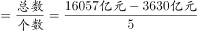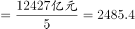亿元，与C项最接近。

故正确答案为C。

---

### 第 10 题　qid 2402485 · 综合

根据上述给定资料，下列关于2018年相关信息表述错误的是：

- **A**. 
5月，限额以上单位消费品零售额占社会消费品零售总额的三成以上

- **B**. 
5月，汽车类商品的零售额同比下降约31亿元

- **C**. 
1—5月，实物商品网上零售额占社会消费品零售额的比重低于
　✅
- **D**. 
1—5月，所有商品零售类别中化妆品类增速最高

**答案**：C

**官方解析**

A项：定位表格，2018年5月限额以上单位消费品零售额为11477亿元，社会消费品零售总额为30359亿元，代入公式，比重，正确；

B项：定位表格，2018年5月汽车类商品的零售额为3109亿元，同比增长，代入公式，增长量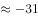亿元，正确；

C项：定位表格，2018年1-5月实物商品网上零售额24819亿元，社会消费品零售总额为149176亿元，代入公式，比重，错误；

D项：定位表格，2018年1-5月化妆品类同比增长，在所有商品零售类别中增速是最高的，正确。

本题为选非题，故正确答案为C。

---

## 材料 3

### 第 11 题　qid 2402487 · 增长

在2013—2016年，我国乡村人口增幅最大的年份是：

- **A**. 2013年　✅
- **B**. 2014年
- **C**. 2015年
- **D**. 2016年

**答案**：A

**官方解析**

根据题干“······增幅最大的年份是”，可判定本题为增长率的比较问题。定位表一，可知2012年至2016年，我国乡村人口数量分别为96809、97262、97378、60346、58973万人，2015年和2016年我国乡村人口数量减少，即增长率为负，排除C、D两项。2013年其增长率为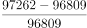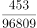，2014年其增长率为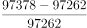，明显2013年的增长率分子大且分母小，故2013年我国乡村人口增幅最大。

故正确答案为A。

---

### 第 12 题　qid 2402488 · 综合

我国乡村从业人员数的拐点在：

- **A**. 2013年
- **B**. 2014年　✅
- **C**. 2015年
- **D**. 2016年

**答案**：B

**官方解析**

拐点在数学上指改变曲线向上或向下方向的点，直观地说，即曲线的凹凸分界点，也就是突然由增长变为下降或由下降变为增长的点。定位表一，可知2012年至2016年，我国乡村就业人员数分别为53858、54013、54026、37041、36175万人，可知2012-2014年我国乡村从业人员数持续增长，2015年为下降，即拐点为2014年。(备注：本题较易误选C项2015年，拐点是即将要突变的点，而非变化之后的点。)
故正确答案为B。

---

### 第 13 题　qid 2402490 · 增长

下列选项中，2016年总产值增速最快的是：

- **A**. 农业总产值
- **B**. 林业总产值
- **C**. 畜牧业总产值
- **D**. 渔业总产值　✅

**答案**：D

**官方解析**

根据题干“······增速最快的是”，可判定本题为增长率的比较问题。2015年农业、林业、畜牧业、渔业总产值分别为57636、4436、29780、10881亿元，2016年农业、林业、畜牧业、渔业总产值分别为59288、4632、31703、11603亿元，则2016年农业、林业、畜牧业、渔业总产值增速分别为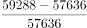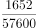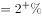、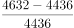、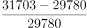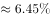、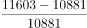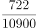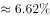，故2016年总产值增速最快的是渔业总产值。

故正确答案为D。

---

### 第 14 题　qid 2402491 · 比重

2013年，各行业总产值占第一产业总产值的比重按从大到小的顺序依次为：

- **A**. 农业总产值，渔业总产值，林业总产值，畜牧业总产值
- **B**. 农业总产值，畜牧业总产值，林业总产值，渔业总产值
- **C**. 农业总产值，畜牧业总产值，渔业总产值，林业总产值　✅
- **D**. 畜牧业总产值，农业总产值，林业总产值，渔业总产值

**答案**：C

**官方解析**

根据题干“······比重按从大到小的顺序依次为”，可判定本题为现期比重。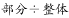，又比较的均是2013年占第一产业总产值的比重，所以只需要比较2013年各部分量的大小即可。定位表二，可知2013年农业、林业、畜牧业、渔业总产值分别为51497、3902、28436、9635亿元，由大到小的排序为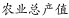。

故正确答案为C。

---

### 第 15 题　qid 2402494 · 增长

2013年至2016年我国乡村从业人员人均第一产业总产值增长率的变化趋势为：

- **A**. 

　✅
- **B**. 
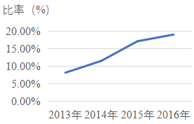

- **C**. 

- **D**. 

**答案**：A

**官方解析**

根据题干“2013年至2016年······人均第一产业总产值增长率的变化趋势为”，可判定本题为平均数的增长率。定位表一，2012年至2016年我国乡村从业人员数分别为：53858、54013、54026、37041、36175万人，定位表二，2012年至2016年的第一产业总产值分别为：89453、96995、102226、107056、112091亿元。

方法一：则2012年我国乡村从业人员人均第一产业总产值为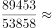万元/人；2013年为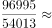万元/人；2014年为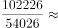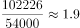万元/人；2015年为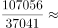万元/人；2016年为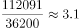万元/人。根据，则2013年我国乡村从业人员人均第一产业总产值增长率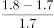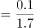；2014年为；2015年为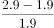；2016年为。明显最大的为2015年，观察选项，增长率最大为2015年的只有A项。

方法二：观察表一和表二可知，我国乡村从业人员数从2014年的54026万人突然下降到2015年的37041万人，而我国第一产业总产值从2014年的102226亿元反而上升到2015年的107056亿元，而2016年无论是乡村从业人员数还是第一产业总产值相对于2015年都没有较大变化，2013年与2014年也是与此类似，故2015年我国乡村从业人员人均第一产业总产值增长率应该是2013年至2016年中最大的，满足其最大的只有A项。

故正确答案为A。

---

## 材料 4

        2018年1-5月，我国软件和信息技术服务业完成软件业务收入23328亿元。1-5月，全行业实现利润总额2822亿元，同比增长，增速同比回落0.9个百分点。

        从分地区运行情况来看，2018年1-5月，中部地区完成软件业务收入976亿元，增长，增速同比提高3.3个百分点；其中河南、安徽、湖北软件业务收入增速持续高于全国平均水平。西部地区完成软件业务收入2645亿元，增长，增速同比回落4个百分点，近年来西部地区首次出现增速低于全国平均水平的情况。东部地区完成软件业务收入18747亿元，同比增长，增速同比提高1.2个百分点；总量居前5名的广东、江苏、北京、浙江、山东完成软件业务收入累计占全国比重为，其中北京和浙江增速分别高出全国平均增速5.3、6.1个百分点。东北地区完成软件业务收入960亿元，同比增长，增速同比提高2.8个百分点，高于1-4月1.7个百分点。

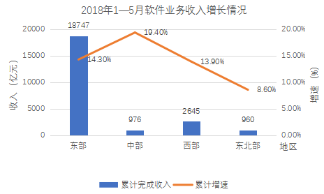

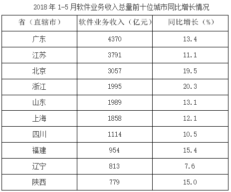

### 第 16 题　qid 2402497 · 增长

2017年1-5月，我国软件和信息技术服务业务全行业利润总额的增速为：

- **A**. 

- **B**. 

　✅
- **C**. 

- **D**. 

**答案**：B

**官方解析**

根据题干“2017年1-5月······增速为······”，可判定本题为增长率问题。定位文字材料第一段可知，2018年1-5月，我国软件和信息技术服务业完成软件业务收入全行业实现利润总额同比增长，增速同比回落0.9个百分点。因此，2017年1-5月，我国软件和信息技术服务业全行业利润总额的增速为。

故正确答案为B。

---

### 第 17 题　qid 2402498 · 增长

根据给定资料，下列关于西部地区软件业务收入增速说法，一定错误的是：

- **A**. 2013年高于全国平均水平
- **B**. 2016年低于全国平均水平　✅
- **C**. 2017年高于全国平均水平
- **D**. 2018年低于全国平均水平

**答案**：B

**官方解析**

定位文字材料第二段：2018年1-5月，西部地区完成软件业务收入2645亿元，增长，增速同比回落4个百分点，近年来西部地区首次出现增速低于全国平均水平的情况。2018年1-5月西部地区首次出现增速低于全国平均水平的情况，则2018年1-5月以前，西部地区完成软件业务收入增速必定大于等于全国平均水平，因此B选项，2016年低于全国平均水平说法错误。（备注：A项严格意义上是不一定正确的，因为近年来不确定具体是近几年，但是B项是一定错误的，而题干要求选择“一定错误的是”，只能为B选项。）

本题为选非题，故正确答案为B。

---

### 第 18 题　qid 2402499 · 比重

2018年1-5月，四川和陕西的软件业务收入总量占全国软件业务收入的比重范围为：

- **A**. 
-

- **B**. 
-
　✅
- **C**. 
-

- **D**. 
-

**答案**：B

**官方解析**

根据题干“2018年1-5月，······占······的比重范围为”，结合材料时间也为2018年1-5月，可判定本题为现期比重问题。定位文字材料第一段可知，2018年1-5月，我国软件和信息技术服务业完成软件业务收入23328亿元；定位表格材料可知，2018年1-5月，四川和陕西的软件业务收入总量分别为1114亿元和779亿元。根据公式，比重，因此所求比重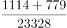，在-之间。

故正确答案为B。

---

### 第 19 题　qid 2402500 · 增长

2018年1—5月，全国软件业务收入平均增速为：

- **A**. 

- **B**. 

　✅
- **C**. 

- **D**. 

**答案**：B

**官方解析**

根据题干“2018年1-5月，全国软件业务收入平均增速为”，判定本题为一般增长率问题。结合文字和表格材料，给出了2018年1-5月，北京完成软件业务收入同比增长，高出全国平均增速5.3个百分点，则题目所求为。

故正确答案为B。

---

### 第 20 题　qid 2402501 · 综合

关于2018年1-5月我国软件业务情况的描述，下列错误的是：

- **A**. 全行业利润保持两位数增长，并且增幅稳定上升　✅
- **B**. 软件业务收入居全国前10位的西部省份，其软件业务收入占到了西部地区该业务收入的七成以上
- **C**. 中部地区软件业务收入增势最为突出
- **D**. 东部地区软件业务收入增速与全国平均水平基本持平

**答案**：A

**官方解析**

A项，定位文字材料第一段，2018年1-5月，我国软件和信息技术服务业全行业实现利润总额2822亿元，同比增长，增速同比回落0.9个百分点。增幅低于去年，并没有稳定上升，错误；

B项，定位表格材料，2018年1-5月软件业务收入居全国前10位的西部省份为四川和陕西，其软件业务收入分别为1114亿元和779亿元；定位文字材料第二段，2018年1-5月西部地区完成软件业务收入2645亿元。根据，因此所求比重，大于七成，正确；

C项，定位折线图，中部地区软件业务收入的增长率为，在四个地区中排名第一，即增势最为突出，正确；

D项，定位折线图，2018年1-5月东部地区软件业务收入的增速为。并且结合119题可知全国平均水平为，两者比较接近、基本持平，正确。

本题为选非题，故正确答案为A。

---
