# 2018年重庆市选调优秀大学生到基层工作考试《行测》题

> 资料分析 · 10 题 · 选调 2018

## 材料 1

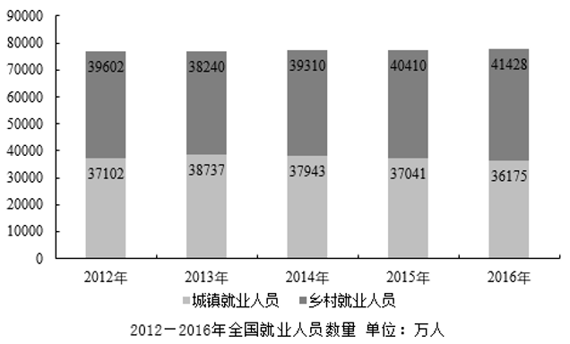

### 第 1 题　qid 4695871 · 综合

2012—2016年，乡村就业人员与城镇就业人员数量相差最大的是哪一年？

- **A**. 2012年
- **B**. 2014年
- **C**. 2015年
- **D**. 2016年　✅

**答案**：D

**官方解析**

定位统计图可得，2012—2016年全国乡村、城镇就业人员数量。计算每年，可得该年份就业人员数量差值。

A项2012年：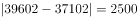万人；B项2014年：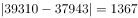万人；C项2015年：万人；D项2016年：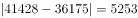万人。比较可知，乡村就业人员与城镇就业人员数量相差最大的是2016年。

故正确答案为D。

---

### 第 2 题　qid 4695874 · 增长

2014年，乡村就业人员数量的同比增长率最接近下列哪一选项？

- **A**. 2.5%
- **B**. 2.8%　✅
- **C**. 3.4%
- **D**. 4.4%

**答案**：B

**官方解析**

根据题干“2014年······同比增长率······”，结合选项为百分数，可判定本题为一般增长率计算问题。定位统计图可得：2013年乡村就业人员数量为38240万人，2014年为39310万人。根据公式：增长率，则所求增长率为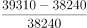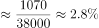。

故正确答案为B。

---

### 第 3 题　qid 4695877 · 比重

2012—2016年，城镇就业人员数量占全国就业人员数量比重最高曾达到约（    ）。

- **A**. 47.8%
- **B**. 48.4%
- **C**. 50.3%　✅
- **D**. 51.6%

**答案**：C

**官方解析**

根据题干“2012—2016年······占······比重······”，结合材料时间为2012—2016年，可判定本题为现期比重问题。定位统计图可得，2012—2016年全国乡村、城镇就业人员数量。城镇就业人员数量占全国就业人员数量比重最高，则城镇就业人员数量应尽量多，乡村就业人员数量尽量少。定位统计图可知，只有2013年城镇就业人员数量＞乡村就业人员数量，则该年所求比重最高，比重为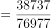。

故正确答案为C。

---

### 第 4 题　qid 4695883 · 增长

2012—2016年，全国就业人员数量同比增长率最高的是哪一年？

- **A**. 2013年
- **B**. 2014年　✅
- **C**. 2015年
- **D**. 2016年

**答案**：B

**官方解析**

根据题干“2012-2016年······同比增长率最高的是哪一年”，可判定本题为一般增长率比较问题。定位统计图可知：2012-2016年城镇就业人员与乡村就业人员人数。则2012-2016年全国就业人员数量分别为39602+37102=76704万人、38240+38737=76977万人、39310+37943=77253万人、40410+37041=77451万人、41428+36175=77603万人。根据公式：增长率，则2013-2016年全国就业人员数量同比增长率分别为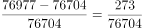、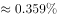、、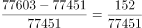，比较可知，2014年全国就业人员数量同比增长率最高。

故正确答案为B。

备注：本题各年全国就业人员数量差距较小，建议加法精确计算。

---

### 第 5 题　qid 4695889 · 综合

以下对图中数据分析正确的是：

- **A**. 2012—2016年，乡村就业人员数量均多于城镇就业人员数量
- **B**. 2012—2016年，乡村就业人员数量占全国就业人员数量比重呈逐年递增趋势
- **C**. 2012—2016年，乡村就业人员数量的同比增长率最高的一年是2015年　✅
- **D**. 假设2017年全国就业人员数量的同比增长率与2016年相同，则2017年全国就业人员数量约为92813万人

**答案**：C

**官方解析**

A项：定位统计图可知：2013年城镇就业人员数量为38737万人，乡村就业人员数量为38240万人，乡村就业人员数量少于城镇就业人员数量，错误；

B项：定位统计图可知：2012年、2013年乡村就业人员数量分别为39602万人、38240万人。城镇就业人员数量分别为37102万人、38737万人。2012年乡村就业人员数量＞城镇就业人员数量，则2012年乡村就业人员数量占全国就业人员数量的比重超过50%；2013年乡村就业人员数量＜城镇就业人员数量，则2013年乡村就业人员数量占比不到50%，比重下降，错误；

C项：定位统计图可知：2012-2016年乡村就业人员数量分别为39602万人、38240万人、39310万人、40410万人、41428万人。根据公式：，则2013-2016年乡村就业人员数量同比增长率分别为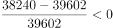、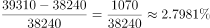、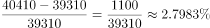、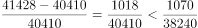，比较可知，2015年乡村就业人员数量同比增长率最高，正确；

D项：由本篇材料第四题可知，2016年、2015年全国就业人员数量分别为77603万人、77451万人。根据公式：，则2016年全国就业人员数量同比增长率。根据公式：现期量=基期量×（1+r），则2017年全国就业人员数量＜77603×（1+10%）＜80000×（1+10%）=88000万人，错误。

故正确答案为C。

备注：对于本题C选项，根据材料数据无法计算2012年乡村就业人员数量同比增长率，因此无法比较2012年与其他年份增长率的大小关系。但结合其他选项的明显错误，粉笔择优选择C项为正确答案。

---

## 材料 2

        2016年我国基础研究经费为822.9亿元，比上年增长14.9%，明显高于应用研究经费（5.4%）和试验发展经费（11.1%）的增速。基础研究、应用研究和试验发展经费所占科技经费总投入比重分别为5.2%、10.3%和84.5%。

        2016年各类企业研发经费支出12144亿元，比上年增长11.6%；政府属研究机构经费支出2260.2亿元，比上年增长5.8%；高等学校科研经费支出1072.2亿元，比上年增长7.4%。企业研发、政府属研究机构、高等学校科研经费支出所占比重分别为77.5%，14.4%和6.8%。

        2016年我国东部地区研发经费为10689.4亿元，首次迈上万亿台阶，比上年增长11%，占全社会研发经费的比重为68.2%；中部、西部和东北地区研发经费分别为2378.1亿元、1944.3亿元和664.9亿元，分别比上年增长10.8%、12.3%和0.4%，所占全社会研发经费的比重分别为15.2%、12.4%和4.2%。

### 第 6 题　qid 4695901 · 综合

2015年我国应用研究经费约为多少亿元？

- **A**. 1546　✅
- **B**. 1683
- **C**. 833
- **D**. 1142

**答案**：A

**官方解析**

根据题干“2015年······约为多少亿元”，结合材料时间为2016年，可判定本题为基期计算问题。定位材料第一段可得：2016年我国基础研究经费为822.9亿元，比上年增长14.9%，明显高于应用研究经费（5.4%）······基础研究、应用研究和试验发展经费所占科技经费总投入比重分别为5.2%、10.3%和84.5%。根据公式：整体量，则2016年我国科技经费总投入为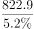亿元，则2016年我国应用研究经费投入为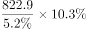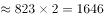亿元。根据公式：基期量，则2015年我国应用研究经费投入为亿元，与A项最接近。

故正确答案为A。

---

### 第 7 题　qid 4695909 · 增长

2016年各类企业研发经费支出增长速度比政府属研究机构经费支出增长速度（    ）。

- **A**. 高1倍　✅
- **B**. 高2倍
- **C**. 高3倍
- **D**. 高4倍

**答案**：A

**官方解析**

根据题干“2016年······比······”，结合选项为高几倍，可判定本题为现期倍数问题。定位文字材料第二段可得：2016年各类企业研发经费支出12144亿元，比上年增长11.6%；政府属研究机构经费支出2260.2亿元，比上年增长5.8%。根据公式：A比B高的倍数，则2016年各类企业研发经费支出增长速度比政府属研究机构经费支出增长速度高倍。

故正确答案为A。

---

### 第 8 题　qid 4695914 · 比重

2016年地区研发经费占全社会研发经费的比重与2015年相比降低了的是（    ）。

- **A**. 东部地区
- **B**. 中部地区
- **C**. 西部地区
- **D**. 东北地区　✅

**答案**：D

**官方解析**

根据题干“2016年······占······的比重与2015年相比降低······”，可判定本题为两期比重问题。定位文字材料第三段可得：2016年我国东部地区研发经费比上年增长11%，中部、西部和东北地区研发经费分别比上年增长10.8%、12.3%和0.4%。根据两期比重比较结论：部分的增长率＜整体的增长率，比重降低。由于题目为单选题，可判定选项四个地区中只有一个地区研发经费占全社会研发经费的比重降低，即只有一个地区研发经费小于全社会研发经费的增长率，应为增长率最小（0.4%）的东北地区。
故正确答案为D。

---

### 第 9 题　qid 4695918 · 比重

若各地区保持2016年研发经费增长速度不变，2017年西部地区研发经费占全社会研发经费的比重约为（    ）。

- **A**. 12%
- **B**. 12.4%
- **C**. 12.6%　✅
- **D**. 13%

**答案**：C

**官方解析**

根据题干“······2017年······占······的比重约为”，可判定本题为现期比重问题。定位文字材料第三段可得：2016年我国东部地区研发经费为10689.4亿元，比上年增长11%，占全社会研发经费的比重为68.2%；中部、西部和东北地区研发经费分别为2378.1亿元、1944.3亿元和664.9亿元，分别比上年增长10.8%、12.3%和0.4%，所占全社会研发经费的比重分别为15.2%、12.4%和4.2%。根据公式：比重，则2017年西部地区研发经费占全社会研发经费的比重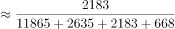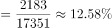，与C项最接近。

故正确答案为C。

---

### 第 10 题　qid 4695922 · 综合

从上述资料中可以推出的是（    ）。

- **A**. 2016年我国应用研究经费比上年增长超过100亿元
- **B**. 2016年各类企业研发经费支出是高等学校科研经费支出的10倍
- **C**. 2016年中部、西部和东北地区累计研发经费还不及东部地区研发经费的一半　✅
- **D**. 各地区研发经费占全社会研发经费的比重是逐年递增的

**答案**：C

**官方解析**

A项：根据本材料第一题可知，2015年我国应用研究经费约为1546亿元，定位文字材料第一段可得，2016年我国应用研究经费经费同比增速为5.4%。根据公式：增长量＝基期量×增长率，则2016年我国应用研究经费比上年增长：1546×5.4%＜1600×6%=96亿元，故增长不足100亿元。错误；

B项：定位文字材料第二段可得，2016年各类企业研发经费支出12144亿元，高等学校科研经费支出1072.2亿元，前者是后者的：倍，即大于11倍。错误；

C项：定位文字材料第三段可得，2016年我国东部地区研发经费占全社会研发经费的比重为68.2%，则中部、西部和东北地区占比应为1-68.2%=31.8%。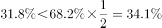。正确；

D项：全国各地区研发经费占全社会研发经费的比重必然是有增有减，不可能所有地区占比全部增加。错误。

故正确答案为C。

---
