# 2018年黑龙江省公务员考试（乡镇）题（网友回忆版）

> 资料分析 · 20 题 · 黑龙江 2018

## 材料 1

根据以下资料，回答以下问题。

注：

1.农村金融机构包括农村商业银行、农村合作银行、农村信用社和新型农村金融机构。

2.其他类金融机构包括政策性银行及国家开发银行、民营银行、外资银行、非银行金融机构、资产管理公司和邮政储蓄银行。

3.净资产额等于总资产额减去总负债额。

### 第 1 题　qid 2187784 · 比重

2017年5月，股份制商业银行总资产占银行业金融机构的比重与上年相比约：

- **A**. 增加了2个百分点
- **B**. 减少了2个百分点
- **C**. 增加了0.2个百分点
- **D**. 减少了0.2个百分点　✅

**答案**：D

**官方解析**

根据题干“……比重与上年相比约”，结合选项为百分点，判定为两期比重问题。定位统计表，可得：2017年5月股份制商业银行总资产亿元，增长率，银行业金融机构总资产亿元，增长率。根据两期比重差公式：，，因此比重下降，排除A、C，代入公式，，D项最为接近。

故正确答案为D。

---

### 第 2 题　qid 2188503 · 综合

2016年5月，银行业金融机构总资产金额约为：

- **A**. 227万亿元
- **B**. 217万亿元
- **C**. 207万亿元　✅
- **D**. 197万亿元

**答案**：C

**官方解析**

根据题干“2016年5月，银行业金融机构总资产金额约为”，结合材料时间是2017年5月，可判定本题为基期计算问题。定位统计表可得：2017年5月银行业金融机构总资产为，同比增速为。根据公式，基期万亿元，与C项最接近。

故正确答案为C。

---

### 第 3 题　qid 2187812 · 综合

2017年5月我国股份制商业银行净资产额约是城市商业银行净资产额的多少倍？

- **A**. 0.5
- **B**. 0.8
- **C**. 1.5　✅
- **D**. 1.8

**答案**：C

**官方解析**

根据题干“2017年5月，······是······的多少倍”，材料已知时间为2017年5月，可判定本题为现期倍数问题。定位统计表可得：2017年5月股份制商业银行的总资产金额为431150亿元，总负债额为402922亿元；城市商业银行的总资产金额为293063亿元，总负债额为273812亿元。根据，可得亿元，亿元，故2017年5月股份制商业银行的净资产额约是城市商业银行的净资产额的倍，C选项最为接近。

故正确答案为C。

---

### 第 4 题　qid 2187805 · 增长

在2017年5月我国银行业金融机构资产负债表中，下列哪一项的总资产同比增长额最高？

- **A**. 大型商业银行　✅
- **B**. 股份制商业银行
- **C**. 城市商业银行
- **D**. 农村金融机构

**答案**：A

**官方解析**

根据题干“……总资产同比增长额最高”，判定为增长量比较问题。定位统计表，可得：2017年5月大型商业银行总资产为839329亿元，同比增速为；股份制商业银行总资产为431150亿元，同比增速为；城市商业银行总资产为293063亿元，同比增速为；农村金融机构总资产为314519亿元，同比增速为。根据公式，，四个选项的增长量分别为：

A项：；B项：；C项：；D项：。

比较发现，四个选项中，A项分母最小，且分子最大，所以A项最大，即2017年5月大型商业银行总资产同比增长额最高。

故正确答案为A。

---

### 第 5 题　qid 2188508 · 综合

关于2017年5月我国银行业金融机构资产负债表，下列说法正确的是：

- **A**. 
股份制商业银行总资产额占银行业金融机构总资产额的以上
　✅
- **B**. 
城市商业银行的总资产同比增长额高于其他类金融机构

- **C**. 
城市商业银行净资产额同比增速为

- **D**. 
大型商业银行净资产额为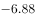万亿元

**答案**：A

**官方解析**

定位统计表可得：

A项：股份制商业银行总资产额为431150亿元，银行业金融机构总资产额为2328934亿元，则股份制商业银行总资产额占银行业金融机构总资产额的比重为，正确；

B项：城市商业银行总资产为293063亿元，增长率为，增长额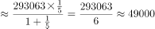亿元。其他类金融机构总资产为450873亿元，增长率为，增长额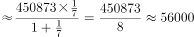亿元。，错误；

C项：，则。城市商业银行总资产额约为29.3万亿元，增长率为；总负债额约为27.4万亿元，增长率为。城市商业银行净资产额约为万亿元。根据混合增长率原理“增长率的距离与量成反比”。量之比为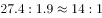，则距离之比，得，错误；

D项：，大型商业银行总资产额为839329亿元，总负债额为770521亿元，总资产额大于总负债额，故净资产额为正，而非负值，错误。

故正确答案为A。

---

## 材料 2

二、根据以下资料，回答106～110题。

        截至2011年末，全国城乡就业人数达到76420万人，比2002年末增加3140万人，其中，城镇就业人数35914万人，增加10755万人；乡村就业人数40506万人，减少7615万人，农民工数量不断扩大，2011年末达到25278万人。

        2011年，城镇居民人均可支配收入21810元元（疑为：多字），比2002年增长1.8倍，扣除价格因素年均实际增长；农村居民人均纯收入6977元，比2002年增长1.8倍，扣除价格因素年均实际增长。2002～2011年，城乡居民收入年均增速超过1979～2011年的年均增速，是历史上增长最快的时期之一。其中，2010年、2011年农村居民人均纯收入增速连续两年快于城镇。

        2011年末（疑为：缺少“年末”），城乡居民家庭恩格尔系数分别为和，分别比2002年降低了1.4和5.8个百分点，主要耐用消费品拥有量大幅增长；2011年末，城镇居民家庭平均每百户拥有家用汽车18.6辆，比2002年末增加17.7辆；拥有移动电话205.3部，增长2.3倍；拥有家用电脑81.9台，增长3.0倍。农村居民家庭平均每百户拥有电冰箱61.5台，增长3.1倍；空调机2.6台，增长8.9倍；拥有移动电话179.7部，增长12.1倍。2011年末，全国电话普及率达到94.9部/百人，比2002年末增长1.8倍。

### 第 6 题　qid 2195843 · 比重

2002年末城镇就业人数占全国城乡就业人数的比重约是：

- **A**. 

- **B**. 

- **C**. 

　✅
- **D**. 

**答案**：C

**官方解析**

根据题干“2002年末······占······比重约是”，结合材料时间“2011年末”，判定本题为基期比重计算问题。定位文字材料第一段可得“截至2011年末，全国城乡就业人数达到76420万人，比2002年末增加3140万人，其中，城镇就业人数35914万人，增加10755万人”，则2002年末全国城乡就业人数为万人，2002年末城镇就业人数为人。根据公式：，则2002年末城镇就业人数占全国城乡就业人数的比重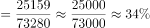。

故正确答案为C。

---

### 第 7 题　qid 2195847 · 增长

与2002年末相比，2011年末以下各项家庭主要耐用消费品拥有量增速最快的是：（    ）

- **A**. 农村居民空调机
- **B**. 农村居民移动电话
- **C**. 城镇居民家用电脑
- **D**. 城镇居民家用汽车　✅

**答案**：D

**官方解析**

由题干“······增速最快”，可判定此题为一般增长率问题。定位文字材料第三段可知“2011年末，城镇居民家庭平均每百户拥有家用汽车18.6辆，比2002年末增加17.7辆；…拥有家用电脑81.9台，增长3.0倍。农村居民家庭平均每百户拥有…空调机2.6台，增长8.9倍；拥有移动电话179.7部，增长12.1倍”。故四个选项与2002年末相比，2011年增速分别为：

A项，农村居民空调机增长8.9倍，即增速为；

B项，农村居民移动电话增长12.1倍，即增速为；

C项，城镇居民家用电脑增长3.0倍，即增速为；

D项，城镇居民家用汽车增速。

所以增速最快的是城镇居民家用汽车。

故正确答案为D。

---

### 第 8 题　qid 2195849 · 综合

2002年末全国电话普及率约为：（    ）

- **A**. 52.7部/百人
- **B**. 50.1部/百人
- **C**. 33.9部/百人　✅
- **D**. 13.7部/百人

**答案**：C

**官方解析**

由题干“2002年末全国电话普及率约为”，结合材料时间“2011年末”，可判定本题为基期计算问题。定位文字材料第三段可知“2011年末，全国电话普及率达到94.9部/百人，比2002年末增长1.8倍”。增长1.8倍，即增长率为1.8。根据公式，，2002年末全国电话普及率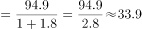部/百人。

故正确答案为C。

---

### 第 9 题　qid 2195854 · 综合

以下指标能够从材料中推出的是：（    ）

- **A**. 2002年农村居民户均纯收入
- **B**. 2002年城乡居民家庭恩格尔系数差　✅
- **C**. 2002年乡村就业人数同比增速
- **D**. 2002年全国农民工数量

**答案**：B

**官方解析**

A项：文字材料第二段只给出了2011年农村居民人均纯收入，及其相对于2002年的增长率，“人均”不等于“户均”，故无法求得2002年农村居民户均纯收入，错误。

B项：文字材料第三段给出了“2011年末城乡居民家庭恩格尔系数分别为和，分别比2002年降低了1.4和5.8个百分点”，故2002年城乡居民家庭恩格尔系数差为，能够推出，正确。

C项：文字材料第一段只给出了2011年末乡村就业人数，及其相对于2002年末的增长量，并没有2001年末相关数据，无法推出2002年乡村就业人数同比增速，错误。

D项：文字材料第一段只给出“2011年末…农民工数量不断扩大”，并没有给出具体数值，无法推出2002年全国农民工数量，错误。

故正确答案为B。

---

### 第 10 题　qid 2195856 · 综合

根据上述材料，下列说法正确的是：（    ）

- **A**. 2002年全国农村居民平均每百户拥有冰箱的数量在19～20台之间
- **B**. 2002年末平均每百户城镇居民拥有移动电话数量超过农村居民的3倍　✅
- **C**. 2011年全国农村居民人均纯收入比2002年实际增长1.8倍
- **D**. 2010年农村居民人均纯收入增速高于2011年

**答案**：B

**官方解析**

A项：定位文字材料第三段可知，2011年末农村居民家庭平均每百户拥有电冰箱61.5台，相比2002年末增长3.1倍，即增长率为3.1。根据， 2002年全国农村居民平均每百户拥有冰箱的数量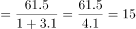台，而非19～20台，错误。

B项：定位文字材料第三段可知，2011年末，城镇居民家庭平均每百户拥有移动电话205.3部，比2002年末增长2.3倍；农村居民家庭平均每百户拥有移动电话179.7部，增长12.1倍。根据，2002年末城镇、农村居民家庭平均每百户拥有移动电话数量分别为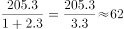、，，正确。

C项：定位文字材料第二段可知，2011年，农村居民人均纯收入比2002年增长1.8倍，扣除价格因素年均实际增长，而非比2002年实际增长1.8倍，错误。

D项：文字材料第二段只给出了2011年农村居民人均纯收入相对于2002年的增速，以及扣除价格因素年均实际增速，并没有给出2010年和2011年农村居民人均纯收入同比增速相关数据，无法推出，错误。

故正确答案为B。

---

## 材料 3

        2015年末，我国规模以上高技术制造业共有企业26894家，比2010年增加1077家；占规模以上制造业企业数的比重为，比2010年提高1.3个百分点。2015年末，我国高技术制造业从业人员1293.7万人，比2010年增长；占全部制造业从业人员的比重为，比2010年提高2.9个百分点。

        2015年我国高技术制造业实现主营业务收入116048.9亿元，比2010年增长；占全部制造业企业的比重为，比2010年提高0.8个百分点。2015年我国高技术制造业实现利润总额7233.7亿元，比2010年增长，增幅比其他制造业平均水平高出11.5个百分点；高技术制造业利润总额占全部制造业的比重为，比2010年提高0.5个百分点。

        2015年我国规模以上高技术制造业投入研发经费2034.3亿元，比2010年增长，增幅比其他制造业平均水平高8.7个百分点。2015年我国高技术制造业申请发明专利7.4万件，比2010年增长；实现新产品销售收入3.1万亿元，比2010年增长。

### 第 11 题　qid 2188573 · 综合

2010年，我国高技术制造业实现新产品销售收入约多少万亿元？

- **A**. 1.4　✅
- **B**. 1.5
- **C**. 1.6
- **D**. 1.7

**答案**：A

**官方解析**

根据题干“2010年······万亿元”，结合材料时间为2015年，可判定本题为基期计算问题。定位文字第三段材料：“实现新产品销售收入3.1万亿元，比2010年增长。”故2010年，我国高技术制造业实现新产品销售收入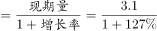万亿元，与A项最为接近。

故正确答案为A。

---

### 第 12 题　qid 2188575 · 增长

与2010年相比，2015年下列高技术制造业的指标中哪项增长最快？

- **A**. 利润总额
- **B**. 新产品销售收入
- **C**. 主营业务收入
- **D**. 申请发明专利数　✅

**答案**：D

**官方解析**

定位第二段、第三段材料可知：2015年我国高技术制造业实现利润总额比2010年增长、新产品销售收入比2010年增长、主营业务收入比2010年增长、申请发明专利比2010年增长。所以增长最快的是申请专利发明数。

故正确答案为D。

---

### 第 13 题　qid 2188568 · 增长

2015年，我国高技术制造业主营业务收入比2010年增加约多少万亿元？

- **A**. 5
- **B**. 6　✅
- **C**. 7
- **D**. 8

**答案**：B

**官方解析**

根据题干“······增加······万亿元”，可判定本题为增长量计算问题。定位文字第二段材料可知：“2015年我国高技术制造业实现主营业务收入116048.9亿元，比2010年增长。”与2010年相比，2015年我国高技术制造业主营业务收入的增长量，与B项最为接近。

故正确答案为B。

---

### 第 14 题　qid 2188572 · 综合

2010年，我国制造业实现利润总额约多少万亿元？

- **A**. 1.3
- **B**. 1.7
- **C**. 2.2　✅
- **D**. 2.8

**答案**：C

**官方解析**

根据题干“2010年······万亿元”，结合材料时间为2015年，可判定本题为基期计算问题。定位文字第二段材料：“2015年我国高技术制造业实现利润总额7233.7亿元，比2010年增长”，则2010年我国高技术制造业实现利润总额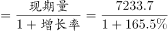亿元；“高技术制造业利润总额占全部制造业的比重为，比2010年提高0.5个百分点”，则2010年高技术制造业利润总额占全部制造业的比重为；故2010年我国制造业实现利润总额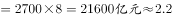万亿元。

故正确答案为C。

---

### 第 15 题　qid 2188577 · 综合

根据上述资料，下列说法错误的是：

- **A**. 2010年，我国高技术制造业申请发明专利达3万件　✅
- **B**. 2010年末，高技术制造业从业人员占全部制造业从业人员的比重为12.2%
- **C**. 2015年末，我国规模以上制造企业数是规模以上高技术制造业企业数的10倍以上
- **D**. 2015年，我国规模以上高技术制造业投入的研发经费比2010年增加了1000亿元以上

**答案**：A

**官方解析**

A项：定位材料第三段：2015年我国高技术制造业申请发明专利7.4万件，比2010年增长。故2010年高技术制造业申请发明专利数万件，错误；

B项：定位材料第一段：2015年末，我国高技术制造业从业人员占全部制造业从业人员的比重为，比2010年提高2.9个百分点。故2010年末高技术制造业从业人员占全部制造业从业人员的比重为，正确；

C项：定位材料第一段：2015年末，我国规模以上高技术制造业共有企业26894家，占规模以上制造业企业数的比重为。则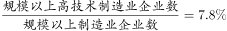，故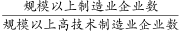，即我国规模以上制造业企业数是规模以上高技术制造业企业数的10倍以上，正确；

D项：定位材料第三段：2015年我国规模以上高技术制造业投入研发经费2034.3亿元，比2010年增长。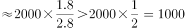，即增加了1000亿元以上，正确。

本题为选非题，故正确答案为A。

---

## 材料 4

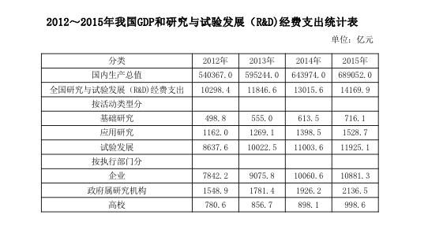

### 第 16 题　qid 2188580 · 平均数

2013～2015年，试验发展经费支出年平均增加：

- **A**. 不到800亿元
- **B**. 800多亿元
- **C**. 900多亿元　✅
- **D**. 1000亿元以上

**答案**：C

**官方解析**

根据题干“2013～2015年······年平均增加”，结合选项带单位，可判定本题为年均增长量问题。定位表格材料可知，2013年的试验发展为10022.5亿元，2015年试验发展为11925.1亿元。故2013～2015年试验发展经费支出年平均增加量=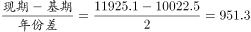亿元，C项符合。

故正确答案为C。

---

### 第 17 题　qid 2188583 · 增长

2013～2015年间，企业研究与试验发展经费支出同比增量大于1000亿元的年份有几个？

- **A**. 0
- **B**. 1　✅
- **C**. 2
- **D**. 3

**答案**：B

**官方解析**

根据题干“2013～2015年间……同比增量”，可判定本题为增长量计算问题。定位表格材料倒数第三行，由增长量=现期-基期可得，2013年增长量=9075.8-7842.2=1233.6亿元，2014年增长量=10060.6-9075.8=984.8亿元，2015年增长量=10881.3-10060.6=820.7亿元。综上，2013～2015年企业研究与试验发展经费支出同比增量大于1000亿元的年份仅有2013年1个。
故正确答案为B。

---

### 第 18 题　qid 2188582 · 综合

2015年，我国研究与试验发展经费投入强度（研究与试验发展经费支出与国内生产总值之比）约为：

- **A**. 

- **B**. 

　✅
- **C**. 

- **D**. 

**答案**：B

**官方解析**

根据题干“2015年······（······与······之比）”，结合材料给出2015年的数值，可判定本题为比值计算问题。定位表格材料可知，2015年国内生产总值为689052.0亿元，研究与试验发展经费支出为14169.9亿元。故投入强度=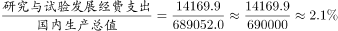。

故正确答案为B。

---

### 第 19 题　qid 2188584 · 比重

2012～2015年，基础研究经费支出占全国研究与试验发展经费支出比重最大的年份是：

- **A**. 2012年
- **B**. 2013年
- **C**. 2014年
- **D**. 2015年　✅

**答案**：D

**官方解析**

根据题干“2012～2015年，······占······比重”,可判定本题为现期比重问题。定位表格材料可得：各年份比重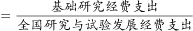，故2012年；2013年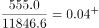；2014年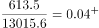；2015年，因此2015年基础研究经费支出占全国研究与试验发展经费支出比重最大。

故正确答案为D。

---

### 第 20 题　qid 2188585 · 综合

根据资料，下列选项错误的是：

- **A**. 2012～2015年，基础研究经费支出年均不到600亿元
- **B**. 2013～2015年，应用研究经费支出年增量逐年增大
- **C**. 2015年，企业的研究与试验发展经费支出比政府属研究机构高5倍多　✅
- **D**. 2012～2015年，我国高校的研究与试验发展经费支出呈逐年递增趋势

**答案**：C

**官方解析**

A项：定位表格材料可得：2012～2015年，基础研究经费年均支出亿元，不到600亿元，正确；

B项：定位表格材料可得：各年份应用研究经费支出年增量分别为 2013年增量亿元；2014年增量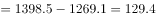亿元；2015年增量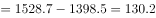亿元，因此2013～2015年应用研究经费支出年增量逐年增大，正确；

C项：定位表格材料可得：2015年企业的研究与试验发展经费为10881.3亿元；政府属研究机构为2136.5亿元；故所求倍数为倍，选项描述为企业的研究与试验发展经费比政府属研究机构高5倍多，即前者是后者的6倍多，与结果不符，错误；

D项：定位表格材料最后一行可得：2012～2015年，我国高校的研究与试验发展经费支出是逐年增加的，正确。

本题为选非题，故正确答案为C。

---
