# 2018深圳市公务员录用考试《行测》题（网友回忆版）

> 资料分析 · 15 题 · 深圳市考 2018

## 材料 1

        从银行结售汇数据看，2014年，银行累计结汇116422亿元人民币（等值18958亿美元），剔除汇率因素影响（下同），较上年增长，累计售汇108707亿元人民币（等值17702亿美元），增长，累计结售汇顺差7715亿元人民币（等值1256亿美元），下降。其中，银行代客累计结汇113339亿元人民币，累计售汇103742亿元人民币，累计结售汇顺差9597亿元人民币；银行自身累计结汇3084亿元人民币，累计售汇4965亿元人民币，累计结售汇逆差1882亿元人民币。一季度银行结售汇顺差1592亿美元，二季度降至290亿美元，三季度转为逆差160亿美元，四季度扩大为466亿美元。同期，银行代客累计远期结汇签约18442亿元人民币，累计远期售汇签约15015亿元人民币，累计远期净结汇3427亿元人民币，较上年下降。

        从银行代客涉外收付款数据看，2014年，银行代客累计涉外收入203855亿元人民币（等值33201亿美元），较上年增长，累计对外付款201375亿元人民币（等值32797亿美元），增长，累计涉外收付款顺差2480亿元人民币（等值404亿美元），下降。一、二季度累计涉外收付款顺差分别为455亿和407亿美元，三、四季度转为逆差200亿和258亿美元。衡量企业和个人结汇意愿的银行代客结汇占涉外外汇收入的比重（即结汇率）总体下降，由一季度的降至二、三季度的，四季度略有回升至，全年平均为，结汇率比上年回落了1个百分点；衡量购汇动机的银行代客售汇占涉外外汇支付的比重（即售汇率）逐季上升，由一季度的升至四季度的，全年为，售汇率比上年上升了6个百分点。

注：上述资料统计时，不同币种间价格换算采用当年平均汇率。

### 第 1 题　qid 2166218 · 综合

2013年，银行累计结售汇顺差（    ）。

- **A**. 5042亿元人民币
- **B**. 16415亿元人民币　✅
- **C**. 2370亿美元
- **D**. 2560亿美元

**答案**：B

**官方解析**

由题意“2013年，银行累计结售汇顺差”，且材料时间是2014年，判定此题为基期计算问题。定位文字材料第一段，“2014年，······累计结售汇顺差7715亿元人民币（等值1256亿美元），下降。”可知2013年银行累计结售汇顺差亿元人民币。

故正确答案为B。

---

### 第 2 题　qid 2166219 · 平均数

2014年，100美元的年平均价约为（    ）元人民币。

- **A**. 664
- **B**. 683
- **C**. 614　✅
- **D**. 无法计算

**答案**：C

**官方解析**

由题干“······的年平均价为······”，可判定本题为现期平均数问题。定位文字材料第一段，“2014年，银行累计结汇116422亿元人民币（等值18958亿美元）”，可知100美元的年平均价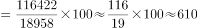元人民币，与C项最接近。

故正确答案为C。

---

### 第 3 题　qid 2166220 · 增长

剔除汇率因素影响，下列项目2014年同比涨跌幅度最大的是（    ）。

- **A**. 银行代客累计涉外收入
- **B**. 银行代客累计对外付款　✅
- **C**. 银行累计结售汇顺差
- **D**. 银行代客累计远期结售汇签约顺差

**答案**：B

**官方解析**

定位文字材料第一段与第二段可得：2014年银行代客累计涉外收入较上年增长；累计对外付款增长；累计结售汇顺差下降；银行代客累计远期净结汇(即签约顺差)较上年下降。同比涨跌幅度最大即同比增长率最大，因，则2014年同比涨跌幅度最大的是银行代客累计对外付款。

故正确答案为B。

---

### 第 4 题　qid 2166221 · 综合

2013年，银行代客结汇率比售汇率（    ）。

- **A**. 低3个百分点
- **B**. 高2个百分点
- **C**. 高7个百分点
- **D**. 高9个百分点　✅

**答案**：D

**官方解析**

定位文字材料第二段，“衡量企业和个人结汇意愿的银行代客结汇占涉外外汇收入的比重（即结汇率）总体下降，······全年平均为，结汇率比上年回落了1个百分点；衡量购汇动机的银行代客售汇占涉外外汇支付的比重（即售汇率）逐季上升，······全年为，售汇率比上年上升了6个百分点。”可知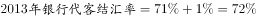，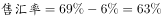，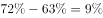，即2013年银行代客结汇率比售汇率高9个百分点。

故正确答案为D。

---

### 第 5 题　qid 2166222 · 综合

根据上文，下列说法正确的是（    ）。

- **A**. 2014年一季度银行结售汇顺差比全年银行结售汇顺差的1.2倍还多　✅
- **B**. 2014年银行代客累计涉外收入增长额大于银行代客累计对外付款增长额
- **C**. 2014年二季度银行结售汇逆差为290亿美元
- **D**. 2014年涉外外汇收入超过21万亿元人民币

**答案**：A

**官方解析**

A项：定位文字材料第一段，“2014年······累计结售汇顺差7715亿元人民币（等值1256亿美元）······一季度银行结售汇顺差1592亿美元”，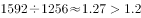，正确；

B项：定位文字材料第二段，2014年，银行代客累计涉外收入203855亿元人民币（等值33201亿美元），较上年增长，约同比增长亿美元；累计对外付款201375亿元人民币（等值32797亿美元），增长，约同比增长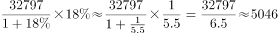亿美元。收入小于付款，错误；

C项：定位文字材料第一段，“2014年，一季度银行结售汇顺差1592亿美元，二季度降至290亿美元”，即2014年二季度银行结售汇顺差为290亿美元，错误；

D项：定位文字材料，“2014年，银行代客累计结汇113339亿元人民币…衡量企业和个人结汇意愿的银行代客结汇占涉外外汇收入的比重（即结汇率）总体下降，······全年平均为”，则，错误。

故正确答案为A。

---

## 材料 2

### 第 6 题　qid 2166223 · 增长

2016年全国女性人口较2012年增长（  ）。

- **A**. 

- **B**. 

- **C**. 

- **D**. 

　✅

**答案**：D

**官方解析**

由题干“2016年全国女性人口较2012年增长······”，可判定此题为一般增长率计算问题。定位统计图中2016年和2012年的柱形图，已知2016年总人口138271万人，男性人口70815万人，则；已知2012年总人口135404万人，男性人口69395万人，则万人；根据增长率公式可得2016年全国女性人口较2012年增长率。

故正确答案为D。

---

### 第 7 题　qid 2166224 · 综合

2012-2016年，全国乡村人口年均减少约（  ）万人。

- **A**. 1050
- **B**. 1312　✅
- **C**. 1445
- **D**. 1501

**答案**：B

**官方解析**

由题干“2012-2016年，全国乡村人口年均减少约······”，可判定此题为年均增长量计算问题。定位统计图2016年和2012年总人口，可得2016年总人口较2012年增加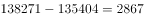万人；定位统计图下面的注可得2016年城镇人口较2012年增加8116万人，则2012-2016年，全国乡村人口年均减少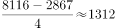万人。

故正确答案为B。

---

### 第 8 题　qid 2166225 · 比重

下列年份中，人口占总人口比重最高的是（  ）年。

- **A**. 2013
- **B**. 2014
- **C**. 2015　✅
- **D**. 2016

**答案**：C

**官方解析**

由题干“15-64岁人口占总人口比重最高的是······年”，可判定此题为现期比重比较问题。定位统计图中15-64岁人口和总人口相关柱形图，根据现期比重公式可得，2013年15-64岁人口占总人口比重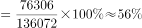；2014年15-64岁人口占总人口比重；2015年15-64岁人口占总人口比重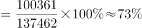；2016年15-64岁人口占总人口比重。故15-64岁人口占总人口比重最高的是2015年。

故正确答案为C。

---

### 第 9 题　qid 2166226 · 增长

若2011年人口出生率是，那么2011-2016年人口出生率年均增速约为（  ）。

- **A**. 

- **B**. 

- **C**. 
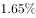
　✅
- **D**. 
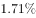

**答案**：C

**官方解析**

由题干“2011-2016年人口出生率年均增速约为······”，可判定此题为年均增长率问题。定位统计图,2016年人口出生率。根据年均增速公式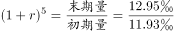，可计算出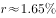。

故正确答案为C。

---

### 第 10 题　qid 2166227 · 综合

根据上图，下列说法正确的是（  ）。

- **A**. 
2012-2016年，65岁以上人口逐年增加，而人口逐年减少

- **B**. 
2016年总人口较2012年增长

- **C**. 
2012-2016年，城镇人口中男性人口始终高于女性人口

- **D**. 
2013-2016年，男性人口和女性人口年增长量最大的年份均为2016年
　✅

**答案**：D

**官方解析**

A项：定位统计图中65岁以上人口和15-64岁人口相关柱形图，可得65岁以上人口逐年增加，而15-64岁人口在2012年-2015年是逐年增加，在2016年是下降，错误；

B项：定位统计图中2016年和2012年，可得2016年总人口较2012年增长，错误；

C项：统计图中只提供历年总人数和男性人数，并没有提供城镇人口中男性和女性人口数情况，故无法判断，错误；

D项：定位统计图，2013年男性人口增长量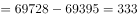万人，女性人口增长量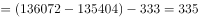万人；2014年男性人口增长量万人，女性人口增长量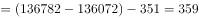万人；2015年男性人口增长量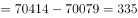万人，女性人口增长量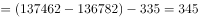万人；2016年男性人口增长量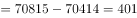万人；女性人口增长量万人，男性人口和女性人口年增长量最大的年份均为2016年，正确。

故正确答案为D。

---

## 材料 3

### 第 11 题　qid 2166228 · 增长

下列季度中，装饰装修产值季度累计值同比增幅最大的是（  ）。

- **A**. 2016年四季度
- **B**. 2017年二季度　✅
- **C**. 2017年三季度
- **D**. 2017年四季度

**答案**：B

**官方解析**

由题干“…同比增幅最大的是······”，可判定此题为一般增长率比较问题。定位统计表中第三行装饰装修产值，2016年四季度累计11295亿元、2015年四季度累计10508亿元，2017年二季度累计4793亿元、2016年二季度累计4446亿元，2017年三季度累计7623亿元、2016年三季度累计7153亿元，2017年四季度累计12017亿元、2016年四季度累计11295亿元。根据公式：，可得：

2016年四季度累计同比增幅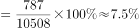；

2017年二季度累计同比增幅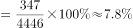；

2017年三季度累计同比增幅；

2017年四季度累计同比增幅。比较可得，2017年二季度增幅最大。

故正确答案为B。

---

### 第 12 题　qid 2166229 · 综合

下列季度中，当季建筑工程产值最高的是（  ）。

- **A**. 2016年三季度
- **B**. 2016年四季度
- **C**. 2017年三季度
- **D**. 2017年四季度　✅

**答案**：D

**官方解析**

定位统计表中第五行建筑工程产值，2016年四季度累计值171864亿元、三季度累计值111924亿元、二季度累计值68701亿元，2017年四季度累计值189161亿元、三季度累计值123540亿元、二季度累计值76122亿元。故2016年三季度当季建筑工程产值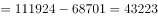亿元；2016年四季度当季建筑工程产值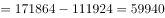亿元；2017年三季度当季建筑工程产值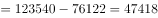亿元；2017年四季度当季建筑工程产值亿元。比较可得，2017年四季度当季建筑工程产值最高。

故正确答案为D。

---

### 第 13 题　qid 2166230 · 增长

若建筑业总产值继续保持2015-2017年间的增速，则2019年建筑业总产值约为（  ）亿元。

- **A**. 243377
- **B**. 253248　✅
- **C**. 219966
- **D**. 236488

**答案**：B

**官方解析**

由题干“…保持2015-2017年间的增速…则2019年建筑业总产值约为······”，可判定此题为现期计算问题。定位统计表中第二行，2015年建筑业总产值（即四季度累计值）180757亿元，2017年建筑业总产值（即四季度累计值）213954亿元。若保持2015-2017年间的增速，则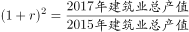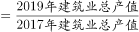，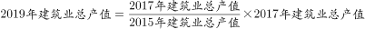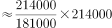亿元，与B项最接近。

故正确答案为B。

---

### 第 14 题　qid 2166231 · 综合

2017年，按总产值计算的建筑业劳动生产率为（  ）。

- **A**. 无法计算
- **B**. 323705元/人
- **C**. 336229元/人
- **D**. 347441元/人　✅

**答案**：D

**官方解析**

由题干“2017年，按总产值计算的建筑业劳动生产率为”，可判定此题为现期平均数问题。定位统计表第二行，2017年建筑业总产值为213954亿元，定位统计表倒数第三行，2017年生产经营活动平均人数为6158万人。万元/人，与D项347441元/人最接近。

故正确答案为D。

---

### 第 15 题　qid 2166232 · 综合

根据上表，下列说法错误的是（  ）。

- **A**. 2015-2017年，平均每个建筑业企业单位每年的总产值都超过2亿元
- **B**. 2016年，建筑工程产值占建筑业总产值的八成以上
- **C**. 2017年上半年，建筑业生产经营活动人员人均房屋建筑施工面积约216平方米
- **D**. 2015-2017年，建筑业生产经营活动人员人均竣工产值最大的是2017年　✅

**答案**：D

**官方解析**

A项：定位统计表第二行和倒数第四行，2015年建筑业总产值180757亿元，建筑业企业单位数80911个，2015年平均每个建筑业企业单位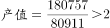亿元；2016年建筑业总产值193567亿元，建筑业企业单位数83017个，2016年平均每个建筑业企业单位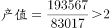亿元；2017年建筑业总产值213954亿元，建筑业企业单位数88059个，2017年平均每个建筑业企业单位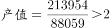亿元。2015-2017年均超过2亿元，正确；

B项：定位统计表第二行和第五行，2016年建筑业总产值为193567亿元；2016年建筑工程产值为171864亿元。可计算出2016年，建筑工程产值占建筑业总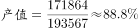，八成以上，正确；

C项：定位统计表倒数第二行和第三行，2017年二季度累计值，房屋建筑施工面积为969740万平方米；生产经营活动平均人数为4484万人。可计算出2017年上半年，建筑业生产经营活动人员人均房屋建筑施工平方米，正确；

D项：定位统计表倒数第五行和倒数第三行，2015-2017年建筑业竣工产值分别为110116亿元、112893亿元、116792亿元；2015-2017年生产经营活动平均人数分别为5584万人、5757万人、6158万人。可计算出2015年，建筑业生产经营活动人员人均竣工产值；2016年，建筑业生产经营活动人员人均竣工产值；2017年，建筑业生产经营活动人员人均竣工产值。比较可知，最大的是2015年，错误。

本题为选非题，故正确答案为D。

---
