# 2019年420联考《行测》题（云南卷）（网友回忆版）

> 资料分析 · 15 题 · 云南 2019

## 材料 1

根据所给资料，回答下列问题。

        2016年全国供用水总量为6040.2亿立方米，较上年减少63.0亿立方米。其中，地表水源供水量4912.4亿立方米，占供水总量的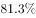；地下水源供水量1057.0亿立方米，占供水总量的；其他水源供水量70.8亿立方米，占供水总量的。与2015年相比，地表水源供水量减少57.1亿立方米，地下水源供水量减少12.2亿立方米，其他水源供水量增加6.3亿立方米。

        2016年，全国生活用水821.6亿立方米，占用水总量的；工业用水1308.0亿立方米，占用水总量的；农业用水3768.0亿立方米，占用水总量的；人工生态环境补水142.6亿立方米，占用水总量的。与2015年相比，农业用水量减少84.2亿立方米，生活用水量及人工生态环境补水量分别增加28.1亿立方米和19.9亿立方米。

        2016年全国万元国内生产总值（当年份）用水量81立方米，万元工业增加值（当年份）用水量52.8立方米，农田灌溉水有效利用系数0.542。按可比价计算，万元国内生产总值用水量和万元工业增加值用水量分别比2015年下降和。

        注：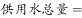

### 第 1 题　qid 2377064 · 综合

2015年全国供用水总量为：

- **A**. 6040.2亿立方米
- **B**. 6103.2亿立方米　✅
- **C**. 5977.2亿立方米
- **D**. 1057.2亿立方米

**答案**：B

**官方解析**

根据题干所求“2015年全国···为”，结合材料时间为2016年，可判定此题为基期计算问题。定位第1段文字材料可知，2016年全国供用水总量为6040.2亿立方米，较上年减少63.0亿立方米，则2015年全国供用水总量为亿立方米。

故正确答案为B。

---

### 第 2 题　qid 2377067 · 比重

下列选项中，占2016年全国用水总量最大比重的是：

- **A**. 生活用水
- **B**. 工业用水
- **C**. 农业用水　✅
- **D**. 人工生态环境补水

**答案**：C

**官方解析**

定位第二段文字材料可得，生活用水占2016年全国用水总量比重为；工业用水占2016年全国用水总量比重为；农业用水占2016年全国用水总量比重为；人工生态环境补水占2016年全国用水总量比重为。则最大比重为农业用水。

故正确答案为C。

---

### 第 3 题　qid 2377073 · 综合

与上一年相比，2016年用水量减少的两大领域是：

- **A**. 生活用水和农业用水
- **B**. 工业用水和农业用水　✅
- **C**. 农业用水和人工生态环境补水
- **D**. 人工生态环境补水和生活用水

**答案**：B

**官方解析**

定位第2段文字材料“与2015年相比，农业用水量减少84.2亿立方米，生活用水量及人工生态环境补水量分别增加28.1亿立方米和19.9亿立方米”可知，农业用水量减少，生活用水量及人工生态环境补水量增加，排除A、C、D三项。
故正确答案为B。

---

### 第 4 题　qid 2377076 · 增长

2015年，我国万元国内生产总值用水量和万元工业增加值用水量之比约为：

- **A**. 

　✅
- **B**. 

- **C**. 

- **D**. 
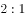

**答案**：A

**官方解析**

根据题干“2015年······之比约为”，结合材料给出2016年的数据，可判定本题为基期比值计算问题。定位文字材料第三段可知，2016年全国万元国内生产总值用水量为81立方米，比2015年下降，则2015年万元国内生产总值用水量为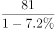立方米；2016年万元工业增加值用水量52.8立方米，比2015年下降，则2015年万元工业增加值用水量为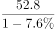。故2015年两者比值为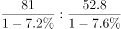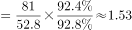，与A项最接近。

故正确答案为A。

---

### 第 5 题　qid 2377078 · 综合

能够从上述资料中推出的是：

- **A**. 2017年，农业用水量将持续减少
- **B**. 2017年，人工生态环境补水量会增加
- **C**. 2016年，地下水源供水是我国供水的主体
- **D**. 2016年，我国水资源利用效率比上年有所提高　✅

**答案**：D

**官方解析**

A项：定位文字材料第二段可知，2016年农业用水量为3768.0亿立方米，但整篇材料找不到2017年数据，无法推断2017年增减情况，A项错误；

B项：定位文字材料第二段可知，2016年人工生态环境补水142.6亿立方米，但整篇材料找不到2017年数据，无法推断2017年增减情况，B项错误；

C项：定位文字材料第一段可知，2016年地下水源供水量占供水总量，而地表水源供水量占比为，地下水源供水占比远低于地表水源供水，故地表水源供水是我国供水的主体，C项错误；

D项：定位文字材料第三段可知，2016年万元国内生产总值用水量和万元工业增加值用水量均比2015年下降，用水量下降可推出2016年水资源利用效率提高，D项正确。（备注：水资源利用效率在材料中并没有明确表述，同学们在考场上可以先跳过D，排除ABC后确定选D）

故正确答案为D。

---

## 材料 2

根据所给资料，回答下列问题。

        某水产公司共销售甲、乙、丙、丁四种鱼类产品。其在两个季度的销售额和销售量情况如下：

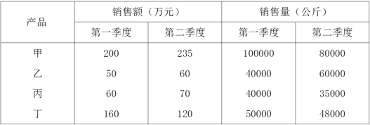

### 第 6 题　qid 2377187 · 综合

第二季度与第一季度相比，四种鱼类产品销售情况的变化是：

- **A**. 销售总额增加，销售总量增加
- **B**. 销售总额增加，销售总量减少　✅
- **C**. 销售总额减少，销售总量增加
- **D**. 销售总额减少，销售总量减少

**答案**：B

**官方解析**

根据题干“第二季度与第一季度相比，四种鱼类产品销售情况的变化”，结合选项，可判定本题为增长量计算问题。定位表格可得：四种鱼类产品销售额的增长量分别为35、10、10、-40，销售量的增长量分别为-20000、20000、-5000、-2000，则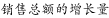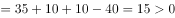，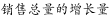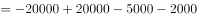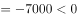，故销售总额增加，销售总量减少。

故正确答案为B。

---

### 第 7 题　qid 2377188 · 增长

在第二季度，其销售额较上一季度增长最快的是：

- **A**. 甲
- **B**. 乙　✅
- **C**. 丙
- **D**. 丁

**答案**：B

**官方解析**

根据题干“在第二季度，······较上一季度增长最快的是”，可判定本题为增长率比较问题。定位表格可得甲、乙、丙、丁第一季度和第二季度的销售额，根据，可得：甲增长率为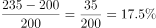、乙增长率为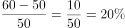、丙增长率为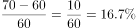、丁增长率为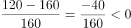。故增长最快的是乙。

故正确答案为B。 

---

### 第 8 题　qid 2377189 · 综合

在第二季度，其销售价格较上一季度涨幅最大的是：

- **A**. 甲　✅
- **B**. 乙
- **C**. 丙
- **D**. 丁

**答案**：A

**官方解析**

根据题干“在第二季度，其销售价格较上一季度涨幅最大的是”，可判定本题为一般增长率问题。定位表格可得：

甲第一、二季度的销售价格（万元/吨）分别为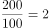、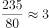，则；

乙第一、二季度的销售价格（万元/吨）分别为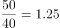、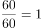，则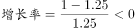；

丙第一、二季度的销售价格（万元/吨）分别为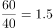、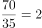，则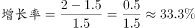；

丁第一、二季度的销售价格（万元/吨）分别为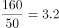、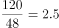，则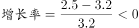。则增长率最大的为甲。

故正确答案为A。

---

### 第 9 题　qid 2377190 · 增长

在第二季度，乙和丙的销售额都比第一季度增加了10万元，描述其产品销售额变动情况正确的是：

- **A**. 乙产品销售量增加和价格上涨都导致销售额增加
- **B**. 丙产品销售量增加和价格上涨都导致销售额增加
- **C**. 乙产品销售量的增加抵消了价格下降的不利影响　✅
- **D**. 丙产品销售量的增加抵消了价格下降的不利影响

**答案**：C

**官方解析**

根据表格材料可知：第二季度丙产品销售量35000公斤相对于一季度的40000公斤是减少的，排除B、D两项；根据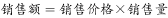可知：第一季度乙产品销售价格为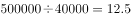元；第二季度乙产品销售价格为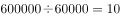元，所以第二季度乙产品销售价格下降，排除A项，C项当选。

故正确答案为C。

---

### 第 10 题　qid 2377191 · 综合

根据上述资料，下列说法正确的是：

- **A**. 第二季度水产公司鱼类产品单位公斤价格较上季度上涨　✅
- **B**. 甲销量下滑的主要原因是其价格上涨
- **C**. 乙是四类鱼产品中唯一降价的产品
- **D**. 水产公司的鱼类产品利润提高

**答案**：A

**官方解析**

A项：定位表格材料数据，根据可知：第一季度水产公司鱼产品单位公斤价格为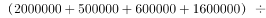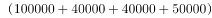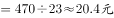；第二季度水产公司鱼产品单位公斤价格为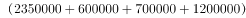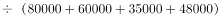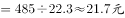，故第二季度水产公司鱼产品单位公斤价格较上季度上涨，正确；

B项：定位表格材料数据，根据销售额=销售价格×销售量可知：甲产品第二季度销售额上涨，但销售量有所减少，则其销售价格一定上涨。但是价格上涨是不是甲销量下滑的主要原因，根据材料无法得知，错误；

C项：定位表格材料数据，根据销售额=销售价格×销售量可知：甲、丙两产品第二季度销售额上涨，但销售量有所减少，则其销售价格一定上涨；第一季度丁产品销售价格为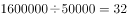元；第二季度丁产品销售价格为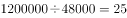元，所以第二季度丁产品销售价格下降，乙并不是四类鱼产品中唯一降价的产品，错误；

D项：题目中只给出鱼类的销售额和销售量，未给出利润相关数据。所以无法判断，错误。

故正确答案为A。

---

## 材料 3

根据以下资料，回答下列问题。

        CIER指数用来反映就业市场景气程度，其计算方法是：。根据有关机构发布的数据，2018年第一季度CIER指数为1.91，第二季度为1.88，第三季度为1.97，第四季度为2.38。2018年第三季度，招聘需求人数环比下降，求职申请人数环比下降；第四季度招聘需求人数环比增加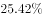，求职申请人数环比增加。

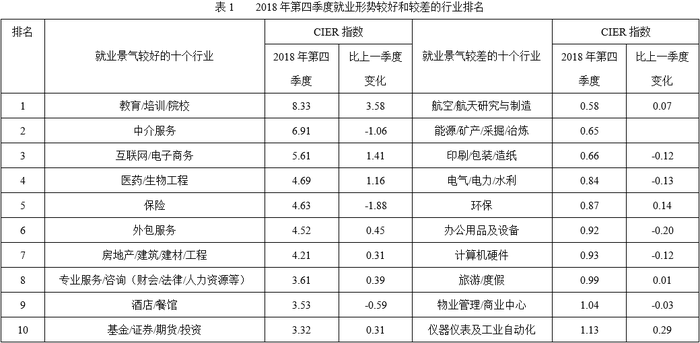

### 第 11 题　qid 2377065 · 综合

2018年第四季度的CIER指数比第三季度有所上升，对其原因表述正确的是：

- **A**. 招聘需求人数增加比率大于求职申请人数增加比率　✅
- **B**. 招聘需求人数增加比率小于求职申请人数增加比率
- **C**. 招聘需求人数增加比率大于求职申请人数减少比率
- **D**. 招聘需求人数增加比率小于求职申请人数减少比率

**答案**：A

**官方解析**

定位文字材料，“”，及“第四季度招聘需求人数环比增加，求职申请人数环比增加”，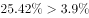，可知招聘需求人数增加比率大于求职申请人数增加比率。

故正确答案为A。

---

### 第 12 题　qid 2377070 · 综合

与第三季度相比，第四季度CIER指数上升最快的职业是：

- **A**. 社区/居民/家政服务
- **B**. 教育/培训　✅
- **C**. 技工/操作工
- **D**. 高级管理

**答案**：B

**官方解析**

根据题干“与第三季度相比，第四季度CIER指数上升最快的职业是”，可判定本题为增长率比较问题。定位表格2可得：2018年第四季度社区/居民/家政服务、教育/培训、技工/操作工、高级管理的指数分别为12.99、16.24、25.67、1.07，比上一季度变化量分别为4.78、8.51、0.82、-0.32。根据，可得各项增长率分别为：

A项，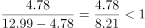；

B项，；

C项，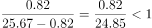；

D项，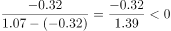。

可知增长率最大的为B项，即上升最快的职业为教育/培训。

故正确答案为B。

---

### 第 13 题　qid 2377192 · 综合

2018年下列行业中第三季度CIER指数最高的是:

- **A**. 教育/培训/院校
- **B**. 医药/生物工程
- **C**. 互联网/电子商务
- **D**. 中介服务　✅

**答案**：D

**官方解析**

由题干“2018年下列行业中第三季度CIER指数最高的是”且材料时间为2018年第四季度，判定本题为基期计算问题。定位表1，可知各行业2018年第四季度CIER指数及较上一季度变化值，故可求2018年第三季度CIER指数：教育/培训/院校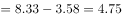，医药/生物工程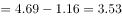，互联网/电子商务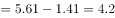，中介服务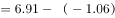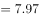。中介服务行业2018年第三季度CIER指数最高，对应D项。

故正确答案为D。

---

### 第 14 题　qid 2377072 · 综合

已列职业中，在第三季度CIER指数不低于1.5的个数为：

- **A**. 10
- **B**. 11
- **C**. 12　✅
- **D**. 13

**答案**：C

**官方解析**

题干“已列职业中，在第三季度CIER指数不低于1.5的个数为”，结合表格材料2给出的第四季度数据及比上一季度变化量，可判定本题为基期计算问题。根据，通过表格可知，就业景气较好的10个职业在第三季度的CIER指数均大于1.5；在就业景气较差的十个职业中，IT管理/项目协调、汽车制造这2个职业在第三季度的CIER指数分别为：、也均大于1.5。故已列职业中，在第三季度CIER指数不低于1.5的个数为12。

故正确答案为C。

---

### 第 15 题　qid 2377193 · 综合

下列关于2018年第三、第四季度的相关信息说法错误的是：

- **A**. 在第四季度，技工/操作工位于就业景气较好职业榜首，且与其它职位相比，其就业市场景气程度季度波动较小
- **B**. 在第四季度，市场对教育/培训类人才需求量增大　✅
- **C**. 航空/航天研究与制造位居第四季度就业景气较差行业榜首，说明该行业人才并不稀缺
- **D**. 在第三季度，已列职业中，就业景气最差的是信托/担保/拍卖/典当

**答案**：B

**官方解析**

A项：定位表2，2018年第四季度技工/操作工CIER指数最高，且与上一季度相比变化较小，即波动较小，正确；

B项：定位表2，可知第四季度教育/培训类人才CIER指数大于第三季度，但只知道指数变化，无法得知人才需求量的变化，错误；

C项：根据文字材料第一段，CIER指数用来反映就业市场的景气程度，，定位表1，航空/航天研究与制造CIER指数小于1，说明该行业市场招聘需求人数小于市场求职申请人数，即市场求职申请人数相对于招聘需求人数较饱和（供大于求），故该行业人才并不稀缺，正确；

 D项：定位表2，2018年第三季度，信托/担保/拍卖/典当，是已列职业中指数最低的，反映就业景气最差，正确；

本题为选非题，故正确答案为B。

---
