# 2019年420联考《行测》题（内蒙古卷）（网友回忆版）

> 资料分析 · 15 题 · 内蒙古 2019

## 材料 1

根据以下资料，回答下列问题。

        2014年我国实施“单独两孩”生育政策，出生人口1687万人，比上年增加47万人。2016 年实施“全面两孩”生育政策，出生人口1786万人，比上年增加131万人；出生率与“十二五”时期年平均出生率相比，提高了0.84个千分点。2017 年我国出生人口1723万人，虽然比上年减少63万人，但比“十二五”时期年平均出生人口多出79万人；出生率为，比上一年降低0.52个千分点。2017年二孩数量进一步上升至883万人，二孩占全部出生人口的比重达到，比2016年的占比提高了11个百分点。

        2017年出生人口最多的省份是山东，出生人口174.98万人，但是比2016年减少2.08万人。广东和河南出生人口也超过百万，其中广东出生人口151.63万人，同比增加22.18万人；河南出生人口140.13 万人，较上年减少2.48万人。此外，出生人口排名前十的省份依次还有河北、四川、湖南、安徽、广西、江苏、湖北。其中，河北、四川、湖南出生人口超90万人，湖北最少，为74.26万人。

        从人口增量来看，2017年广东出生人口增量最大，出生人口较2016年增加22.18万人。安徽、四川、河北出生人口增量超过5万，此外，江苏、湖南、山东、河南出生人口较2016年有所减少。其中，河南减少最多，出生人口减少2.48万人。

### 第 1 题　qid 2376541 · 综合

2016年我国二孩出生人口约为：

- **A**. 883万人
- **B**. 742万人
- **C**. 718万人　✅
- **D**. 693万人

**答案**：C

**官方解析**

根据题干“2016年我国二孩出生人口约为”，结合材料时间为2017年，且已知二孩出生人口占全部出生人口的比重，可判定题为基期比重问题。定位文字材料第一段“2016年实施‘全面两孩’生育政策，出生人口1786万人······2017年······二孩占全部出生人口的比重达到，比2016年的占比提高了11个百分点”，故2016年二孩占全部出生人口的比重为，则2016年我国二孩出生人口为万人，C项最接近。

故正确答案为C。

---

### 第 2 题　qid 2376538 · 平均数

“十二五”时期我国年平均出生率为：

- **A**. 

- **B**. 

　✅
- **C**. 

- **D**. 

**答案**：B

**官方解析**

定位文字资料第一段“2016年······出生率与‘十二五’时期年平均出生率相比，提高了0.84个千分点；2017年······出生率为，比上一年降低0.52个千分点”，可知“十二五”期间年平均出生率为。

故正确答案为B。

---

### 第 3 题　qid 2376539 · 增长

2015年我国出生人口同比：

- **A**. 
增长

- **B**. 
降低

- **C**. 
增长

- **D**. 
降低
　✅

**答案**：D

**官方解析**

根据题干“2015年……同比”，结合选项为，可判定本题为一般增长率问题。定位文字资料第一段“2014年……我国出生人口1687万人，2016年……我国出生人口1786万人，比上年增加131万人”，可知2015年我国人口为万人。代入公式：，即2015年我国出生人口同比降低。

故正确答案为D。

---

### 第 4 题　qid 2376758 · 比重

2016年山东、广东和河南三省出生人口之和占当年全国出生人口的比重约为：

- **A**. 

- **B**. 

　✅
- **C**. 

- **D**. 

**答案**：B

**官方解析**

根据问题“2016年······占······的比重约为······”，且材料时间为2017年，可判定此题为基期比重问题。定位文字材料第一段可得“2016年······出生人口1786万人”；定位第二段可得“2017年出生人口最多的省份是山东，出生人口174.98万人，但是比2016年减少2.08万人······广东出生人口151.63万人，同比增加22.18万人；河南出生人口140.13万人，较上年减少2.48万人”则2016年山东省出生人口为万人，广东省出生人口为万人，河南省出生人口为万人。则2016年，三省出生人口之和占当年全国出生人口的比重为。

故正确答案为B。

---

### 第 5 题　qid 2376546 · 综合

能够从上述资料中推出的是：

- **A**. 
2016、2017两年山东出生人口数量均超过当年全国出生人口数量的

- **B**. 
2016年广东出生人口数量超过2017年湖北出生人口数量的2倍

- **C**. 
2017年出生人口增量超过5万的省份只有3个

- **D**. 
2017年出生人口比2013年增长超过
　✅

**答案**：D

**官方解析**

A项：定位文字材料第一段“2016年实施‘全面两孩’生育政策，出生人口1786万人······2017年我国出生人口1723万人”，定位文字材料第二段“2017年出生人口最多的省份是山东，出生人口174.98万人，但是比2016年减少2.08万人”。 2017年：；2016年：，则2016年山东出生人口数量没有超过当年全国出生人口数量的，错误；

B项：定位文字材料第二段“2017年出生人口······其中广东出生人口151.63万人，同比增加22.18万人······湖北最少，为74.26万人”，，错误；

C项：定位文字材料第三段“2017年广东出生人口增量最大，出生人口较2016年增加22.18万人。安徽、四川、河北出生人口增量超过5万”，可得2017年出生人口增量超过5万的省份至少有4个，错误；

D项：定位文字材料第一段可知：2014年出生人口1687万人，比上年增加47万人。2017年出生人口1723万人。可得2013年出生人口为万人，代入增长率公式：，故2017年出生人口比2013年增长了，正确。

故正确答案为D。

---

## 材料 2

根据以下资料，回答下列问题。

        2017年全国举办马拉松赛事达1102场，其中，中国田径协会举办的A类赛事223场，B类赛事33场。2017年马拉松赛事的参与人次达到了498万人次，2016年、2015年马拉松赛事的参与人次分别为280万人次、150万人次。 

        2017年全年马拉松直接从业人口数72万，间接从业人口数200万。年度产业总规模达700亿元，比去年同期增长约，中国田径协会设置的发展目标是到2020年，全国马拉松规模赛事超过1900场，其中中国田径协会认证赛事达到350场，各类赛事参赛人数超过1000万人次，马拉松运动产业规模达到1200亿元。

        规模赛事数量方面，2017年排名前三的省份为浙江省、江苏省和广东省，分别为152场、149场和103场，而2016年的前三名分别为江苏省37场，北京市33场，广东省25场。

        从2017年全年赛事的覆盖区域来看，马拉松赛事地域分布更为广泛，中国境内马拉松及相关赛事已经涵盖了含西藏在内的全国31个省、区、市的234个城市，较上年增加了101个城市。

        在赛事类型方面，2017年1102场规模赛事中，全程马拉松参赛人次最高，突破了235万人次，其次为半程马拉松赛事，参赛人次超过134万人次。在中国田径协会认证的A类、B类赛事中，2017年全程马拉松项目完赛26.89万人次，同比增长；半程马拉松项目完赛45.29万人次，同比减少了0.03万人次。

        按照跑者户籍所在地统计，2017年参加中国田径协会认证赛事的跑者中，来自江苏的数量最多，共有76469人参赛，在全国占比。湖北、广东、山东、福建、浙江等省紧随其后。而在全部参赛选手中，共有3663人次的男选手在全程项目中跑进3小时，772人次女选手跑进3小时20分。

### 第 6 题　qid 2376600 · 增长

2017年我国马拉松赛事场次比2011年增加了：

- **A**. 约47倍
- **B**. 约49倍　✅
- **C**. 约51倍
- **D**. 约53倍

**答案**：B

**官方解析**

根据题干“2017年···比2011年增加了”，结合选项，可判定本题为一般增长率问题。定位图1可得：2017年、2011年我国马拉松赛场次分别为1102场、22场。根据增长率，可得2017年的增长率为倍。

故正确答案为B。

---

### 第 7 题　qid 2376602 · 综合

在中国田径协会认证的A类、B类赛事中，2016年全程马拉松项目完赛人次比同期半程马拉松项目完赛人次：

- **A**. 多23万
- **B**. 少23万
- **C**. 多21万
- **D**. 少21万　✅

**答案**：D

**官方解析**

根据题干“······2016年全程马拉松项目完赛人次比同期半程马拉松项目完赛人次”，并结合选项为“”，且材料数据为2017年，可判定本题为基期和差问题。定位文字材料第五段可得：“在中国田径协会认证的A类、B类赛事中，2017年全程马拉松项目完赛26.89万人次，同比增长；半程马拉松项目完赛人次45.29万人次，同比减少了0.03万人次”，代入基期量公式：，则2016年全程马拉松项目完赛人次为：万人次，2016年半程马拉松项目完赛人次为：万人次，故2016年全程马拉松项目完赛人次与同期半程马拉松项目完赛人次差为：，即少21万人次。

故正确答案为D。

---

### 第 8 题　qid 2376574 · 比重

2017年中国田径协会举办的A类与B类赛事占全国马拉松赛事的比例约为：

- **A**. 

- **B**. 

　✅
- **C**. 

- **D**. 

**答案**：B

**官方解析**

根据题干“2017年，···占···的比例约为”，结合材料中给了2017年的数据，可判定本题为现期比重问题。定位文字材料第一段可得：2017年全国举办马拉松赛事达1102场，其中，中国田径协会举办的A类赛事223场，B类赛事33场。根据比重，可得2017年的比重为。与B项最接近。

故正确答案为B。

---

### 第 9 题　qid 2376601 · 增长

2017年马拉松赛事参与人次的同比增速比2016年：

- **A**. 快约9个百分点
- **B**. 慢约9个百分点　✅
- **C**. 快约7个百分点
- **D**. 慢约7个百分点

**答案**：B

**官方解析**

根据题干“2017年···的同比增速比2016年”，可判定本题为一般增长率问题。定位文字材料第一段可得：2017年、2016年、2015年马拉松赛事的参与人次分别为498万人次、280万人次、150万人次。根据增长率，可得2017年的增长率为，2016年的增长率为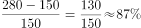，则，即2017年同比增速比2016年慢约9个百分点。

故正确答案为B。

---

### 第 10 题　qid 2376605 · 综合

能够从上述资料中推出的是：

- **A**. 
2017年马拉松运动年度产业规模比2016年多200亿元

- **B**. 
2017年参加中国田径协会认证赛事的全国跑者数量少于75万人

- **C**. 
2011年至2016年我国马拉松赛事场次之和超过2017年赛事场次的
　✅
- **D**. 
在2016年与2017年马拉松规模赛事数量上，江苏省、北京市都有进入前三名

**答案**：C

**官方解析**

A项：定位文字材料第二段可得：“2017年全年马拉松······年度产业总规模达700亿元，比去年同期增长约。” 故2017年马拉松运动年度产业规模比2016年多：亿元，错误；

B项：定位文字材料第六段可得：“2017年参加中国田径协会认证赛事的跑者中，来自江苏的数量最多，共有76469人，在全国占比”，故2017年参加中国田径协会认证赛事的全国跑者数量为万，错误；

C项：定位图形材料可得：“2011年至2017年我国马拉松赛事场次分别为22、33、39、51、134、328、1102”，故2011年至2016年我国马拉松赛事场次之和：，2017年赛事场次的为，前者大于后者，正确；

D项：定位文字材料第三段可得：“规模赛事数量方面，2017年排名前三的省份为浙江省、江苏省和广东省······而2016年的前三名分别为江苏省、北京市、广东省”，故在2016年和2017年马拉松规模赛事数量上，北京市没有都进入前三名，错误。

故正确答案为C。

---

## 材料 3

根据以下资料，回答下列问题。

（注：顺差是指在国际收支上，一定时期内收入大于支出的差额；逆差指的是在国际收支上，一定时期内支出大于收入的差额；表中同比数据为正的代表同比增长，同比数据为负的代表同比下降）

### 第 11 题　qid 2376556 · 综合

2011年至2017年，我国服务进出口逆差最大的年份是：

- **A**. 2017年　✅
- **B**. 2016年
- **C**. 2015年
- **D**. 2014年

**答案**：A

**官方解析**

定位表格材料1，根据“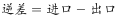”可知，A项：2017年逆差，B项：2016年逆差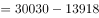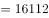，C项：2015年逆差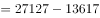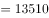，D项：2014年逆差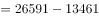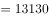，因此逆差最大年份为2017年。

故正确答案为A。

---

### 第 12 题　qid 2376599 · 综合

2016年我国保险和养老金服务进出口额约为：

- **A**. 857亿元人民币
- **B**. 1112亿元人民币
- **C**. 1134亿元人民币　✅
- **D**. 1158亿元人民币

**答案**：C

**官方解析**

根据题干“2016年······进出口额”，材料给的是2017年的数据，可以判定本题为基期计算问题。定位表格材料2：2017年保险和养老金服务进出口额976.0亿元，同比增长率为，根据，可得2016年保险和养老金服务进出口额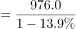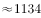亿元。

故正确答案为C。

---

### 第 13 题　qid 2376544 · 增长

按照2017年的同比增速，2018年知识产权使用费出口额约为：

- **A**. 992亿元人民币
- **B**. 1014亿元人民币
- **C**. 1336亿元人民币　✅
- **D**. 1588亿元人民币

**答案**：C

**官方解析**

根据题干“按照2017年的同比增速，2018年······出口额”材料给的是2017年的数据，可以判定本题为现期计算问题。定位表格材料2：2017年知识产权使用费出口额322.0亿元，同比增长率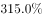，根据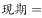，可得2018年知识产权使用费出口额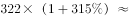亿元，与C选项最接近。

故正确答案为C。

---

### 第 14 题　qid 2377416 · 比重

2016年个人、文化和娱乐服务进口额占同期服务进口总额的比重约为：

- **A**. 0.1个百分点
- **B**. 0.3个百分点
- **C**. 0.5个百分点　✅
- **D**. 0.7个百分点

**答案**：C

**官方解析**

根据题干“2016年……占……比重为”，定位表格材料2的数据时间为2017年，可判定本题为基期比重问题。定位表格材料1可得2016年我国服务进口总额为30030亿元，定位表格材料2可得2017年个人文化娱乐进口额为186亿元，同比增长，根据，2016年个人文化娱乐进口额为，则2016年个人文化娱乐进口额占同期服务进口总额比重为：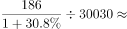。

故正确答案为C。

---

### 第 15 题　qid 2376552 · 综合

能够从上述资料中推出的是：

- **A**. 2011年至2017年，我国进出口总是出现逆差
- **B**. 2016年我国建筑服务进出口实现顺差1039亿元人民币
- **C**. 2017年我国服务进出口中，其他商业服务进出口实现的顺差最多　✅
- **D**. 2017年我国服务进出口中，别处未提及的政府服务进出口额占比最小

**答案**：C

**官方解析**

A项：定位表格材料一，材料中只给出了2011年至2017年我国服务进出口额，而非我国进出口额，故无法推出，错误；

B项：定位表格材料二，2017年我国建筑服务出口1618.0亿元，同比增长；进口579.0亿元，同比增长。则2016年我国建筑服务出口额=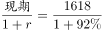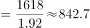亿元，进口额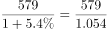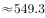亿元，故2016年我国建筑服务进出口实现顺差约293.4亿元，错误；

C项：定位表格材料二，2017年我国服务进出口中，实现顺差的有：加工服务：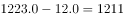亿元；维护和维修服务：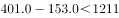亿元；建筑：1亿元；金融服务：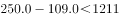亿元；电信、计算机和信息服务：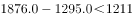亿元；其他商业服务：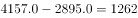亿元亿元。故2017年我国服务进出口中，实现顺差最多的为其他商业服务，正确。

D项：定位表格材料一，2017年我国服务进出口额46991亿元；定位表格材料二，2017年别处未提及的政府服务进出口额348亿元。根据公式：，别处未提及的政府服务进出口占比，而个人、文化和娱乐服务进出口占比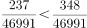，故别处未提及的政府服务进出口占比并非最小，错误。

故正确答案为C。

---
