# 2019年420联考《行测》题（吉林乙级）（网友回忆版）

> 资料分析 · 10 题 · 吉林 2019

## 材料 1

根据以下资料，回答下列问题。 

        初步核算，2018年我国国内生产总值90.03万亿元，按可比价格计算，比上年增长，实现了左右的预期发展目标。分产业看，第一产业增加值6.47万亿元，比上年增长；第二产业增加值36.60万亿元，增长；第三产业增加值46.96万亿元，增长。

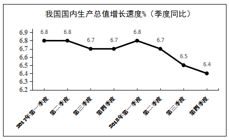

        其中，全国建筑业总产值23.51万亿元，同比增长；全国建筑业房屋建筑施工面积140.9亿平方米，同比增长。

        2018年全国固定资产投资（不含农户）63.56万亿元，比上年增长，增速比前三季度加快0.5个百分点。其中，民间投资39.41万亿元，增长，比上年加快2.7个百分点。分产业看，第一产业投资增长，比上年加快1.1个百分点；第二产业投资增长，加快3.0个百分点，其中制造业投资增长，加快4.7个百分点；第三产业投资增长，其中基础设施投资增长。

        此外，2018年全国房地产开发投资12.03万亿元，比上年增长。全国商品房销售面积17.17亿平方米，增长，其中住宅销售面积增长。全国商品房销售额约15万亿元，增长，其中住宅销售额增长。

### 第 1 题　qid 2376633 · 增长

2018年与2017年相比，我国固定资产投资（不含农户）增速

- **A**. 提高0.7个百分点
- **B**. 提高1.3个百分点
- **C**. 降低1.3个百分点　✅
- **D**. 降低0.7个百分点

**答案**：C

**官方解析**

定位图“固定资产投资（不含农户）同比增速%”可得，2018年1-12月增速为，2017年1-12月增速为，则2018年我国固定资产投资（不含农户）增速与2017年相比为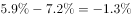，即降低1.3个百分点。

故正确答案为C。

---

### 第 2 题　qid 2376637 · 增长

2018年我国第三产业增加值同比约增加了

- **A**. 1.3万亿元
- **B**. 3.8万亿元
- **C**. 2.9万亿元
- **D**. 3.3万亿元　✅

**答案**：D

**官方解析**

根据题干所求“2018年······同比约增加了”，结合选项为具体带单位数值，可判定此题为增长量计算问题。定位第一段文字材料可得，第三产业增加值46.96万亿元，同比增长。故2018年我国第三产业增加值同比增长量为万亿元，与D项最接近。

故正确答案为D。

---

### 第 3 题　qid 2376666 · 综合

关于2018年我国三大产业发展状况，下列说法正确的是：

- **A**. 增长速度均超过国内生产总值
- **B**. 第三产业增加值同比增加最多　✅
- **C**. 第二产业增加值同比增加最少
- **D**. 第一产业的发展速度最快

**答案**：B

**官方解析**

A项：定位文字材料第一段，“2018年我国国内生产总值······比上年增长”，“第一产业…比上年增长”，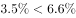，错误；

B项：定位文字材料第一段，“第一产业增加值6.47万亿元，比上年增长；第二产业增加值36.60万亿元，增长；第三产业增加值46.96万亿元，增长”，根据增长量比较中大大则大原则可知，第三产业增加值最大，增长率最大，故增长量最大，正确；

C项：定位文字材料第一段，“第一产业增加值6.47万亿元，比上年增长；第二产业增加值36.60万亿元，增长；第三产业增加值46.96万亿元，增长”，根据增长量比较中大大则大原则可知，第一产业增加值最小，增长率最小，故第一产业增长量最小，不是第二产业，错误；

D项：定位文字材料第一段，“第一产业增加值6.47万亿元，比上年增长；第二产业增加值36.60万亿元，增长；第三产业增加值46.96万亿元，增长”，发展速度为，即增长率+1，故直接找增长率最大即可，由已知，第三产业增加值增长率为最大，故第三产业的发展速度最快，错误。

故正确答案为B。

---

### 第 4 题　qid 2376670 · 综合

2018年我国商品房销售均价约为：

- **A**. 8700元/平方米　✅
- **B**. 9700元/平方米
- **C**. 6700元/平方米
- **D**. 5700元/平方米

**答案**：A

**官方解析**

根据题干所求“2018年······销售均价约为”，结合材料时间为2018年，可判定此题为现期平均数问题。定位文字材料第4段可得，2018年全国商品房销售面积为17.17亿平方米，销售额约15万亿元，则销售均价约为元/平方米。

故正确答案为A。

---

### 第 5 题　qid 2376672 · 综合

下列说法正确的是：

- **A**. 2018年我国国内生产总值增长速度快于2017年
- **B**. 2018年我国第二产业中制造业固定资产投资增速最快
- **C**. 2018年全国商品房销售情况显示，住宅销售前景看好　✅
- **D**. 2018年国内生产总值各季度增速呈现逐步提高的态势

**答案**：C

**官方解析**

A项：定位文字材料第一段可知2018年国内生产总值增长速度为，从第一个折线图可知2017年各个季度的生产总值增速分别为、、、，均高于，根据混合增长率“混合居中”原理，2017年增速介于与之间，大于2018年增速，故A项错误；

B项：定位文字材料第三段可知，2018年第二产业投资增速为，其中制造业投资增长，第二产业中其他行业的增速并不知道，也没法算出，故B项无法判断；

C项：定位文字材料第四段可知，2018年全国商品房住宅销售面积、销售额增速均为正数，是上升趋势，前景看好，故C项正确；

D项：定位第一个折线图可知2018年各个季度的生产总值增速依次为、、、，2018年各季度增速逐步下降，故D项错误。

故正确答案为C。

---

## 材料 2

根据以下资料，回答下列问题。

        据统计，按当年价格计算，2017年我国全社会渔业经济总产值2.48万亿元，其中渔业产值1.23万亿元，渔业工业和建筑业产值0.57万亿元，渔业流通和服务业产值0.68万亿元。

        渔业产值中，海洋捕捞产值1987.65亿元，海水养殖产值3307.40亿元，淡水捕捞产值461.75亿元，淡水养殖产值5876.25亿元，水产苗种产值680.80亿元。

        渔业产值中（不含苗种），海水产品与淡水产品的产值比例为，养殖产品与捕捞产品的产值比例为。

        据对全国1万户渔民家庭收支情况调查，2017年全国渔民人均纯收入18452.78元，比上年增长。

        2017年，全国水产品总产量6445.33万吨，比上年增长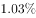。其中，养殖产量4905.99万吨，同比增长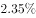；捕捞产量1539.34万吨，同比降低；养殖产品与捕捞产品的产量比例为，海水产品产量3321.74万吨，同比增长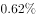；淡水产品产量3123.59万吨，同比增长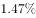；海水产品与淡水产品的产量比例为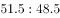。

        2017年，全国水产品人均占有量46.37千克（总人口139008万人），比上年减少0.23千克，降低。

### 第 6 题　qid 2376607 · 综合

反映渔业内部三个产业产值构成时，最合适的统计图是

- **A**. 直方图
- **B**. 柱形图
- **C**. 饼形图　✅
- **D**. 折线图

**答案**：C

**官方解析**

题干要求反映三个产业产值的构成情况，需要反映出三个产业产值之间以及它们与渔业整体的关系，而饼状图可以比较清楚地反映出部分与部分、部分与整体之间的关系。用饼状图来表示可以清晰体现出三个产业产值的构成情况。
故正确答案为C。

---

### 第 7 题　qid 2376614 · 比重

2017年渔业产值中，养殖产值占比约为

- **A**. 

- **B**. 

　✅
- **C**. 

- **D**. 

**答案**：B

**官方解析**

根据题干“2017年……中……占比约为”，可判定本题为现比重问题。定位文字材料第二段可得：“海水养殖产值3307.40亿元，……，淡水养殖产值5876.25亿元”，故养殖产值亿元。定位文字材料第一段可得：“渔业产值1.23万亿元”，故2017年渔业产值中，养殖产值的占比为：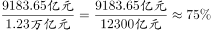。

故正确答案为B。

---

### 第 8 题　qid 2376579 · 综合

2017年捕捞水产的单位产值约为

- **A**. 1.59万元/吨　✅
- **B**. 1.88万元/吨
- **C**. 1.29万元/吨
- **D**. 0.30万元/吨

**答案**：A

**官方解析**

根据题干“2017年……单位产值约为”，可判定本题为现期平均数问题。定位文字材料第二段可得：“渔业产值中，海洋捕捞产值1987.65亿元，……，淡水捕捞产值461.75亿元”，故亿元。定位文字材料第五段可得：“捕捞产量1539.34万吨”，故2017年捕捞水产的单位产值为：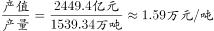。

故正确答案为A。

---

### 第 9 题　qid 2376597 · 增长

2017年全国渔民人均纯收入同比增加约为

- **A**. 1550元　✅
- **B**. 1700元
- **C**. 1850元
- **D**. 1900元

**答案**：A

**官方解析**

根据题干“同比增加······”，结合选项带具体单位，可判定本题为增长量计算问题。定位文字材料第四段“2017年全国渔民人均纯收入18452.78元，比上年增长”，2017年的增长量元，与A项最接近。

故正确答案为A。

---

### 第 10 题　qid 2376606 · 综合

下列说法正确的是

- **A**. 2017年全国水产品产量中，海水产品产量增量大于淡水产品产量增量
- **B**. 2017年全国水产品产量中，养殖产品产量占比高于捕捞产品产量占比　✅
- **C**. 近年来，全国水产品人均占有量持续增长
- **D**. 2017年海水产品产值在渔业产值中占绝大比重

**答案**：B

**官方解析**

A项：定位材料第五段，海水产品产量3321.74万吨，同比增长；淡水产品产量3123.59万吨，同比增长。海水产品产量增量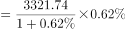万吨；淡水产品产量增量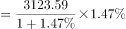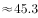万吨，因此海水产品产量增量小于淡水产品产量增量，错误；

B项：定位材料第五段，养殖产品与捕捞产品的产量比例为，因此养殖产品产量占比高于捕捞产品产量占比，正确；

C项：定位材料第六段，2017年，全国水产品人均占有量46.37千克，比上年减少0.23千克，则水产品人均占有量没有增长，且选项所说“近年来”时间不明确，所以不能判定为持续增长，错误；

D项：定位材料第三段，渔业产值中，海水产品与淡水产品的产值比例为，因此海水产品产值在渔业产值中占较小比重，而非绝大比重，错误。

故正确答案为B。

---
