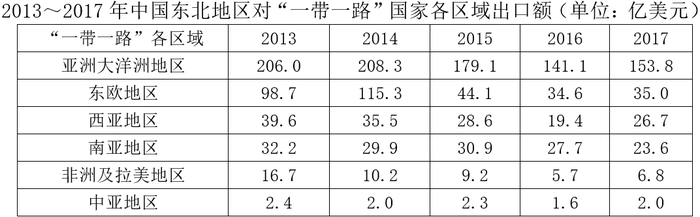
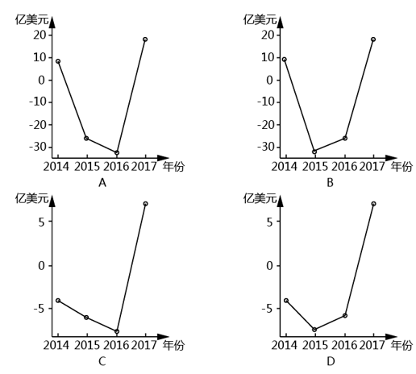
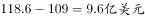
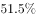
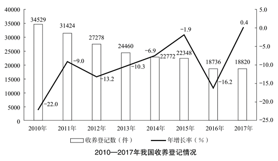
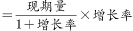

# 2019年420联考《行测》题（吉林甲级）（网友回忆版）

> 资料分析 · 2 题 · 吉林 2019

## 材料 1

根据以下资料，回答下列问题。

        自2013年习近平主席提出“一带一路”的战略构想以来，中国东北地区积极参与其中，取得了丰硕成果，2013年至2017年中国东北地区对“一带一路”国家各区域进出口额如下：

### 第 1 题　qid 2376732 · 增长

以下可以准确表现2014-2017年中国东北地区与西亚地区进口额同比增减变化情况的折线图是：

- **A**. A
- **B**. B　✅
- **C**. C
- **D**. D

**答案**：B

**官方解析**

由题干“······同比增减变化情况······”，可判定本题为增长量比较。定位第二个表格材料可知，2013—2017年中国东北地区与西亚地区进口额分别为：109亿美元，118.6亿美元，85.7亿美元，59.2亿美元，77.9亿美元。因此，2014年增长量为：，结合趋势图的纵坐标数据，排除C、D两项；2015年增长量为：，结合趋势图的纵坐标数据，排除A项。

故正确答案为B。

---

## 材料 2

根据以下资料，回答下列问题。 

        截至2018年底，全国60周岁及以上老年人口24949万人，占总人口的，其中65周岁及以上老年人口16658万人，占总人口的。全国共有老龄事业单位1600个，老年法律援助中心2.0万个，老年维权协调组织6.4万个，老年学校4.9万所，在校学习人员704.0万人，各类老年活动室35.0万个；享受高龄补贴的老年人2682.2万人，比上年增长；享受护理补贴的老年人61.3万人，比上年增长；享受养老服务补贴的老年人354.4万人，比上年增长。

        截至2017年底，全国共有孤儿41.0万人，其中集中供养孤儿8.6万人，社会散居孤儿32.4万人，2017年全国办理收养登记近1.9万件，其中内地居民收养登记近1.7万件，港澳台华侨收养登记103件，外国人收养登记2228件。

        截至2017年底，全国共有农村特困人员466.9万人，比上年减少。全年各级财政共支出农村特困人员救助供养资金269.4亿元，比上年增长。全国共有城市特困人员25.4万人，全年各级财政共支出城市特困人员救助供养资金21.2亿元。

### 第 2 题　qid 2376734 · 增长

2018年我国享受护理补贴的老年人同比增加约为：

- **A**. 10万人
- **B**. 20万人　✅
- **C**. 30万人
- **D**. 40万人

**答案**：B

**官方解析**

根据题干“2018年······同比增加约为”可判断本题为增长量计算。定位文字材料第一段可知“享受护理补贴的老年人61.3万人，比上年增长”，根据增长量计算公式：增长量，2018年我国享受护理补贴的老年人同比增加约为≈万人，与B项最接近。

故正确答案为B。

---
