# 2019年420联考《行测》题（宁夏卷）（网友回忆版）

> 资料分析 · 20 题 · 宁夏 2019

## 材料 1

根据以下资料，回答下列问题。

图1 2000-2017年中国人工智能专利授权情况（单位：件）

图2 2017年中国人工智能专利授权量排名前20国内专利权人（单位：件）

注：排名前20名的高校、科研院校有：北京工业大学、电子科技大学、哈尔滨工业大学、清华大学、北京航空航天大学、华南理工大学、浙江大学、西安电子科技大学及中国科学院，其余均为企业。

### 第 1 题　qid 2377310 · 综合

从历年专利授权量变化趋势来看，2014至2017年我国人工智能领域专利处于：

- **A**. 起步萌芽期
- **B**. 发展停滞期
- **C**. 缓慢发展期
- **D**. 快速发展期　✅

**答案**：D

**官方解析**

根据题干“从历年专利授权量变化趋势来看······”，可以判定本题为直接找数问题。定位图1，2014年到2017年专利授权状况分别为，3753件，7359件，12952件，17477件，由此可以判出2014年到2017年专利授权量呈快速上涨趋势，对应选项为快速发展期。
故正确答案为D。

---

### 第 2 题　qid 2377075 · 增长

下列年份中，中国人工智能专利授权量增速最快的是：

- **A**. 2007年
- **B**. 2012年
- **C**. 2015年　✅
- **D**. 2017年

**答案**：C

**官方解析**

根据题干“······增速最快”，可判断本题为增长率比较问题。根据增长率计算公式：，定位材料图1可得2007年的，2012年的，2015年的，2017年的，所以增长最快的为2015年。

故正确答案为C。

---

### 第 3 题　qid 2377080 · 比重

在位列中国人工智能专利授权量前20位的国内专利权人中，浙江大学专利授权量占比约为：

- **A**. 

- **B**. 

　✅
- **C**. 

- **D**. 

**答案**：B

**官方解析**

根据题干“······占比约为”，可判断本题为现期比重问题。定位图2，可得2017年浙江大学中国人工智能专利授权量为186件，位列中国人工智能专利授权量前20位的国内总量为。故位列中国人工智能专利授权量前20位的国内专利权人中，浙江大学专利授权量占比为，与B项最接近。

故正确答案为B。

---

### 第 4 题　qid 2377081 · 综合

在位列中国人工智能专利授权量前20位的国内专利权人中，企业和高校、科研院校的授权量之比约为：

- **A**. 1:1　✅
- **B**. 2:3
- **C**. 1:2
- **D**. 1:3

**答案**：A

**官方解析**

由题干“企业和高校、科研院校的授权量之比约为”，可判定本题为比值计算问题。定位图2可得人工智能专利授权量排名前20国内专利权人及其专利授权量，定位文字材料可知，排名前20名的高校、科研院校有：北京工业大学、电子科技大学、哈尔滨工业大学、清华大学、北京航天航空大学、华南理工大学、浙江大学、西安电子科技大学及中国科学院，其余均为企业。则高校、科研院校的授权量为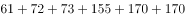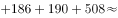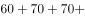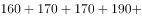，结合本篇第3题，位列中国人工智能专利授权量前20位的国内总量为3046，可计算出企业的授权量约为。则企业和高校、科研院校的授权量之比约为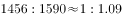，与A项最接近。

故正确答案为A。

---

### 第 5 题　qid 2377082 · 综合

根据资料，下列关于我国2000-2017年相关信息说法正确的是：

- **A**. 
2014年是人工智能专利研发的第一个井喷年

- **B**. 
2014年至2017年人工智能领域专利授权量年均增速为

- **C**. 
2017年排名前20的国内专利权人，其人工智能专利授权量占当年人工智能专利授权总量的比例超过了

- **D**. 
中国科学院仅2017年的人工智能专利授权量就接近2000年到2004年5年全国授权量的总和
　✅

**答案**：D

**官方解析**

A项：定位图1可得，2000-2014年间人工智能专利授权量平缓上升，2015年增速大幅提高。可知2015年是人工智能专利研发的第一个井喷年，并非2014年，错误；

B项：定位图1可得，2014年人工智能领域专利授权量3753件，2017年为17477件。代入公式：，（），，。可知2014年至2017年人工智能领域专利授权量年均增速并非，错误；

C项：结合本篇第3题可知，2017年排名前20的国内专利权人，其人工智能专利授权量为3046件，，错误；

D项：定位图1可得，2000年到2004年5年全国授权量的总和为件；定位图2可得，中国科学院2017年的人工智能专利授权量为508件。中国科学院2017年的人工智能专利授权量接近2000年到2004年5年全国授权量的总和，正确。

故正确答案为D。

---

## 材料 2

根据所给资料，回答下列问题。

        某水产公司共销售甲、乙、丙、丁四种鱼类产品。其在两个季度的销售额和销售量情况如下：

### 第 6 题　qid 2377188 · 增长

在第二季度，其销售额较上一季度增长最快的是：

- **A**. 甲
- **B**. 乙　✅
- **C**. 丙
- **D**. 丁

**答案**：B

**官方解析**

根据题干“在第二季度，······较上一季度增长最快的是”，可判定本题为增长率比较问题。定位表格可得甲、乙、丙、丁第一季度和第二季度的销售额，根据，可得：甲增长率为、乙增长率为、丙增长率为、丁增长率为。故增长最快的是乙。

故正确答案为B。 

---

### 第 7 题　qid 2377189 · 综合

在第二季度，其销售价格较上一季度涨幅最大的是：

- **A**. 甲　✅
- **B**. 乙
- **C**. 丙
- **D**. 丁

**答案**：A

**官方解析**

根据题干“在第二季度，其销售价格较上一季度涨幅最大的是”，可判定本题为一般增长率问题。定位表格可得：

甲第一、二季度的销售价格（万元/吨）分别为、，则；

乙第一、二季度的销售价格（万元/吨）分别为、，则；

丙第一、二季度的销售价格（万元/吨）分别为、，则；

丁第一、二季度的销售价格（万元/吨）分别为、，则。则增长率最大的为甲。

故正确答案为A。

---

### 第 8 题　qid 2377190 · 增长

在第二季度，乙和丙的销售额都比第一季度增加了10万元，描述其产品销售额变动情况正确的是：

- **A**. 乙产品销售量增加和价格上涨都导致销售额增加
- **B**. 丙产品销售量增加和价格上涨都导致销售额增加
- **C**. 乙产品销售量的增加抵消了价格下降的不利影响　✅
- **D**. 丙产品销售量的增加抵消了价格下降的不利影响

**答案**：C

**官方解析**

根据表格材料可知：第二季度丙产品销售量35000公斤相对于一季度的40000公斤是减少的，排除B、D两项；根据可知：第一季度乙产品销售价格为元；第二季度乙产品销售价格为元，所以第二季度乙产品销售价格下降，排除A项，C项当选。

故正确答案为C。

---

### 第 9 题　qid 2377451 · 综合

在第二季度丁的销售额比第一季度减少了40万元，关于其原因下列表述正确的是：

- **A**. 价格虽然上涨但销售量减少，导致销售额减少
- **B**. 价格虽然没变但销售量减少，导致销售额减少
- **C**. 价格下降导致销售额减少是第一原因　✅
- **D**. 销售量减少导致销售额减少是第一原因

**答案**：C

**官方解析**

已知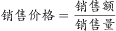，根据表格数据可知，第一季度价格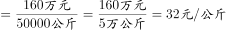，第二季度价格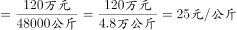，因此，丁的价格下降，排除AB。对比销售量和价格的下降幅度，销售量的下降幅度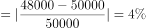；价格的下降幅度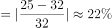，价格的下降幅度更大，因此价格下降是导致销售额减少的第一原因。

故正确答案为C。

---

### 第 10 题　qid 2377191 · 综合

根据上述资料，下列说法正确的是：

- **A**. 第二季度水产公司鱼类产品单位公斤价格较上季度上涨　✅
- **B**. 甲销量下滑的主要原因是其价格上涨
- **C**. 乙是四类鱼产品中唯一降价的产品
- **D**. 水产公司的鱼类产品利润提高

**答案**：A

**官方解析**

A项：定位表格材料数据，根据可知：第一季度水产公司鱼产品单位公斤价格为；第二季度水产公司鱼产品单位公斤价格为，故第二季度水产公司鱼产品单位公斤价格较上季度上涨，正确；

B项：定位表格材料数据，根据销售额=销售价格×销售量可知：甲产品第二季度销售额上涨，但销售量有所减少，则其销售价格一定上涨。但是价格上涨是不是甲销量下滑的主要原因，根据材料无法得知，错误；

C项：定位表格材料数据，根据销售额=销售价格×销售量可知：甲、丙两产品第二季度销售额上涨，但销售量有所减少，则其销售价格一定上涨；第一季度丁产品销售价格为元；第二季度丁产品销售价格为元，所以第二季度丁产品销售价格下降，乙并不是四类鱼产品中唯一降价的产品，错误；

D项：题目中只给出鱼类的销售额和销售量，未给出利润相关数据。所以无法判断，错误。

故正确答案为A。

---

## 材料 3

根据所给资料，回答下列问题。

        2016年全国供用水总量为6040.2亿立方米，较上年减少63.0亿立方米。其中，地表水源供水量4912.4亿立方米，占供水总量的；地下水源供水量1057.0亿立方米，占供水总量的；其他水源供水量70.8亿立方米，占供水总量的。与2015年相比，地表水源供水量减少57.1亿立方米，地下水源供水量减少12.2亿立方米，其他水源供水量增加6.3亿立方米。

        2016年，全国生活用水821.6亿立方米，占用水总量的；工业用水1308.0亿立方米，占用水总量的；农业用水3768.0亿立方米，占用水总量的；人工生态环境补水142.6亿立方米，占用水总量的。与2015年相比，农业用水量减少84.2亿立方米，生活用水量及人工生态环境补水量分别增加28.1亿立方米和19.9亿立方米。

        2016年全国万元国内生产总值（当年份）用水量81立方米，万元工业增加值（当年份）用水量52.8立方米，农田灌溉水有效利用系数0.542。按可比价计算，万元国内生产总值用水量和万元工业增加值用水量分别比2015年下降和。

        注：

### 第 11 题　qid 2377064 · 综合

2015年全国供用水总量为：

- **A**. 6040.2亿立方米
- **B**. 6103.2亿立方米　✅
- **C**. 5977.2亿立方米
- **D**. 1057.2亿立方米

**答案**：B

**官方解析**

根据题干所求“2015年全国···为”，结合材料时间为2016年，可判定此题为基期计算问题。定位第1段文字材料可知，2016年全国供用水总量为6040.2亿立方米，较上年减少63.0亿立方米，则2015年全国供用水总量为亿立方米。

故正确答案为B。

---

### 第 12 题　qid 2377073 · 综合

与上一年相比，2016年用水量减少的两大领域是：

- **A**. 生活用水和农业用水
- **B**. 工业用水和农业用水　✅
- **C**. 农业用水和人工生态环境补水
- **D**. 人工生态环境补水和生活用水

**答案**：B

**官方解析**

定位第2段文字材料“与2015年相比，农业用水量减少84.2亿立方米，生活用水量及人工生态环境补水量分别增加28.1亿立方米和19.9亿立方米”可知，农业用水量减少，生活用水量及人工生态环境补水量增加，排除A、C、D三项。
故正确答案为B。

---

### 第 13 题　qid 2377076 · 增长

2015年，我国万元国内生产总值用水量和万元工业增加值用水量之比约为：

- **A**. 

　✅
- **B**. 

- **C**. 

- **D**. 

**答案**：A

**官方解析**

根据题干“2015年······之比约为”，结合材料给出2016年的数据，可判定本题为基期比值计算问题。定位文字材料第三段可知，2016年全国万元国内生产总值用水量为81立方米，比2015年下降，则2015年万元国内生产总值用水量为立方米；2016年万元工业增加值用水量52.8立方米，比2015年下降，则2015年万元工业增加值用水量为。故2015年两者比值为，与A项最接近。

故正确答案为A。

---

### 第 14 题　qid 2377078 · 综合

能够从上述资料中推出的是：

- **A**. 2017年，农业用水量将持续减少
- **B**. 2017年，人工生态环境补水量会增加
- **C**. 2016年，地下水源供水是我国供水的主体
- **D**. 2016年，我国水资源利用效率比上年有所提高　✅

**答案**：D

**官方解析**

A项：定位文字材料第二段可知，2016年农业用水量为3768.0亿立方米，但整篇材料找不到2017年数据，无法推断2017年增减情况，A项错误；

B项：定位文字材料第二段可知，2016年人工生态环境补水142.6亿立方米，但整篇材料找不到2017年数据，无法推断2017年增减情况，B项错误；

C项：定位文字材料第一段可知，2016年地下水源供水量占供水总量，而地表水源供水量占比为，地下水源供水占比远低于地表水源供水，故地表水源供水是我国供水的主体，C项错误；

D项：定位文字材料第三段可知，2016年万元国内生产总值用水量和万元工业增加值用水量均比2015年下降，用水量下降可推出2016年水资源利用效率提高，D项正确。（备注：水资源利用效率在材料中并没有明确表述，同学们在考场上可以先跳过D，排除ABC后确定选D）

故正确答案为D。

---

### 第 15 题　qid 2377350 · 综合

下列说法正确的是：

- **A**. 2016年，农业用水产值低于工业用水产值
- **B**. 2016年，我国三大产业水资源利用率均有所提高
- **C**. 2016年，供水减少的主要原因是地下水源供水减少
- **D**. 2016年，其他水源供水量占供水总量比重较上年提升　✅

**答案**：D

**官方解析**

A项：材料中只有农业用水量，没有农业产值相关数据，故无法推出，错误。
B项：三大产业水资源利用率均有所提高，即农业、工业、服务业每种类型的水资源利用率都大于上年。材料中即无水资源利用率与上年相比的变化数据，也无工业和服务业的水资源利用率相关数据，故无法推出，错误。
 C项： 定位文字材料第一段“2016年……与2015年相比，地表水源供水量减少57.1亿立方米，地下水源供水量减少12.2亿立方米，其他水源供水量增加6.3亿立方米”，故2016年，供水减少的主要原因是地表水源供水减少，错误；
D项： 定位文字材料第一段“2016年全国供用水总量为6040.2亿立方米，较上年减少63.0亿立方米……其他水源供水量70.8亿立方米，占供水总量的1.2%……与2015年相比……其他水源供水量增加6.3亿立方米”，可得2016年全国供水总量减少，则总体增长率b＜0，其他水源供水量增加，则部分增长率a＞0，根据两期比重结论：部分增长率a（其他水源）＞整体增长率b（全国供水），比重上升，故2016年，其他水源供水量占供水总量比重较上年提升，正确。
故正确答案为D。

---

## 材料 4

根据以下资料，回答下列问题。

        某机械加工企业下设四个生产车间生产加工同种类型和型号的产品，并以人均产量评价劳动生产率。

### 第 16 题　qid 2377056 · 比重

本车间中中级工占比最大的是：

- **A**. 甲　✅
- **B**. 乙
- **C**. 丙
- **D**. 丁

**答案**：A

**官方解析**

由题干“本车间······占比最大的是”，可判定此题为现期比重比较问题。

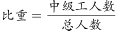，定位表格可得，甲：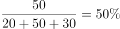；乙：；丙：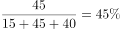；丁： ，则甲车间中中级工占比最大。

故正确答案为A。

---

### 第 17 题　qid 2377059 · 综合

高级工劳动生产率最高的车间是：

- **A**. 甲
- **B**. 乙　✅
- **C**. 丙
- **D**. 丁

**答案**：B

**官方解析**

根据题干“劳动生产率最高的是”，结合文字材料“以人均产量评价劳动生产率”可判定本题为现期平均数比较问题。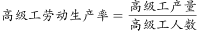，定位表格可得，甲：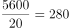；乙：；丙：；丁：，则乙车间高级工劳动生产率最高。

故正确答案为B。

---

### 第 18 题　qid 2377060 · 综合

车间劳动生产率从高到低依次排列正确的是：

- **A**. 

- **B**. 
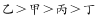
　✅
- **C**. 

- **D**. 

**答案**：B

**官方解析**

根据题干“劳动生产率从高到低排序正确的是”，结合文字材料“以人均产量评价劳动生产率”可判定本题为现期平均数比较问题。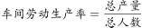，定位表格可得，

甲：；乙：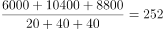；

丙：；丁：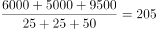。

则车间劳动生产率从高到低排序为：乙甲丙丁。

故正确答案为B。

---

### 第 19 题　qid 2377062 · 综合

同车间中，初级工较高级工劳动率差距最小的是：

- **A**. 甲
- **B**. 乙
- **C**. 丙
- **D**. 丁　✅

**答案**：D

**官方解析**

根据题干中“初级工较高级工劳动率差距最小”，可判定此题为平均数比较问题。定位图表，甲车间初级工劳动率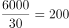，高级工劳动率，两者差距为80；乙车间初级工劳动率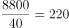，高级工劳动率，两者差距为80；丙车间初级工劳动率，高级工劳动率，两者差距为60；丁车间初级工劳动率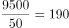，高级工劳动率，两者差距为50；因此丁车间劳动率差距最小。

故正确答案为D。

---

### 第 20 题　qid 2377063 · 综合

根据资料，下列说法正确的是：

- **A**. 车间总产量占企业总产量比重最大的是甲车间
- **B**. 按工人级别来分，劳动生产率最高的是中级工
- **C**. 该企业最应当加强对丁车间工人的劳动生产率培训　✅
- **D**. 只有丙车间的劳动生产率低于所在企业的平均劳动生产率

**答案**：C

**官方解析**

A项：比重比较，总体相同，只需要比较部分量即可。定位统计表，甲车间生产总量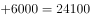；乙车间生产总量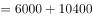。此时可知，甲车间生产总量并非最大，因此比重也并非最大，错误；

B项：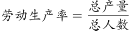，定位统计表，高级工劳动生产率=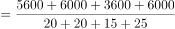；中级工劳动生产率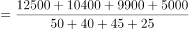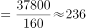；初级工劳动生产率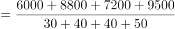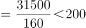。因此，劳动生产率最高的为高级工，并非中级工，错误；

C项：加强对丁车间工人的劳动生产率培训，说明丁车间工人的劳动生产率最低。定位统计表，甲车间劳动生产率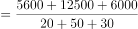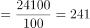；乙车间劳动生产率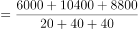；丙车间劳动生产率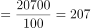；丁车间劳动生产率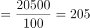；可以发现丁车间工人的劳动生产率最低，因此，最应当加强对丁车间工人的劳动生产率培训，正确；

D项：由C选项可知，丁车间的劳动生产率是最低的，因此不可能只有丙车间劳动生产率低于所在企业的平均劳动生产率，错误。

故正确答案为C。

---
