# 2019年420联考《行测》题（山东卷）（网友回忆版）

> 资料分析 · 20 题 · 山东 2019

## 材料 1

根据以下资料，回答下列问题。 

        党的十八大以来，党中央，国务院实施精准扶贫、精准脱贫基本方略，深入实施东西部扶贫协作，区域性整体贫困明显缓解，为实现到2020年现行标准下农村贫困人口脱贫，贫困县全部摘帽，解决区域性整体贫困打下了坚实基础。

        从地区看，东部地区已率先基本脱贫，中西部地区贫困人口数量全面下降，2017年末，东部地区农村贫困人口300万人，比2012年末减少1067万人，五年累计下降；农村贫困发生率由2012年末的下降到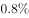，下降3.1个百分点，已率先基本实现脱贫。中部地区农村贫困人口由2012年末的3446万人减少到2017年末的1112万人，累计减少2334万人，下降幅度为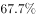。农村贫困发生率由下降到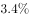，下降7.1个百分点。西部地区农村贫困人口由2012年末的5086万人减少到2017年末的1634万人，累计减少3452万人，下降幅度为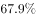；农村贫困发生率由2012年末的下降到2017年末的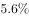，下降12.0个百分点。

        从贫困区域看，贫困地区、集中连片特困地区，民族八省区减贫成效更加突出，区域性整体贫困明显缓解。贫困地区2017年末农村贫困人口1900万人，比2012年末减少4139万人，减贫规模占全国农村减贫总规模的六成；农村贫困发生率从2012年末的下降至2017年末的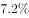，五年累计下降16.0个百分点，年均下降3.2个百分点。集中连片特困地区2017年末农村贫困人口1540万人，比2012年末减少3527万人，下降幅度为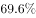；农村贫困发生率从2012年末的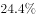下降至2017年末的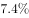，累计下降17.0个百分点，年均下降3.4个百分点。内蒙古、广西、贵州、云南、西藏、青海、宁夏、新疆等民族八省区2017年末农村贫困人口1032万人，比2012年末减少2089万人，下降幅度为，减贫规模占全国农村减贫规模的三成；农村贫困发生率从2012年末的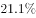下降至2017年末的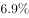，累计下降14.2个百分点，年均下降2.8个百分点。

### 第 1 题　qid 2376883 · 综合

2012年末和2017年末我国农村贫困人口总数分别为多少万人?

- **A**. 6853  4513
- **B**. 8532  2746
- **C**. 9599  3813
- **D**. 9899  3046　✅

**答案**：D

**官方解析**

定位文字材料第二段“2017年末，东部地区农村贫困人口300万人，比2012年末减少1067万人······中部地区农村贫困人口由2012年末的3446万人减少到2017年末的1112万人······西部地区农村贫困人口由2012年末的5086万人减少到2017年末的1634万人”，由于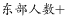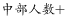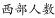，则2017年末我国农村贫困人口总数为万人，2012年末我国农村贫困人口总数为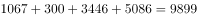万人。

故正确答案为D。

---

### 第 2 题　qid 2376884 · 比重

贫困发生率指的是低于贫困线的人口占总人口的比例，由材料数据可知，与2012年末相比，我国中部地区2017年末农村总人口：

- **A**. 减少了约113万人　✅
- **B**. 减少了约280万人
- **C**. 增加了约113万人
- **D**. 增加了约280万人

**答案**：A

**官方解析**

根据题干“贫困发生率指的是低于贫困线的人口占总人口的比例”，结合材料给出贫困人口，求两年总人口的差，可判定本题为现期比重问题。定位文字材料第二段“中部地区农村贫困人口由2012年末的3446万人减少到2017年末的1112万人，······农村贫困发生率由下降到”，由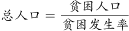可得，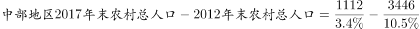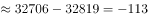万人，即与2012年末相比，我国中部地区2017年末农村总人口减少了约113万人。

故正确答案为A。

---

### 第 3 题　qid 2376885 · 增长

按贫困发生率年均下降幅度计算，2015年末我国集中连片特困地区农村贫困发生率为：

- **A**. 

- **B**. 

- **C**. 

　✅
- **D**. 

**答案**：C

**官方解析**

定位文字材料第三段“集中连片特困地区2017年末······农村贫困发生率从2012年末的下降至2017年末的······年均下降3.4个百分点”，则按贫困发生率的年均下降幅度计算，2015年末我国集中连片特困地区农村贫困发生率。

故正确答案为C。

---

### 第 4 题　qid 2376886 · 比重

下列关于2012年末和2017年末我国西部地区农村贫困人口占全国农村贫困人口比重的说法，描述正确的是：

- **A**. 
2017年末高于2012年末，且2012年低于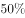

- **B**. 
2017年末高于2012年末，且均高于
　✅
- **C**. 
2017年末低于2012年末，且2017年低于

- **D**. 
2017年末低于2012年末，但均高于

**答案**：B

**官方解析**

根据题干“2012年末和2017年末我国西部地区农村贫困人口占全国农村贫困人口比重”，可判定本题为两期比重的计算问题。定位文字材料第二段“西部地区农村贫困人口由2012年末的5086万人减少到2017年末的1634万人”，结合本篇第101题，2012年末和2017年末我国农村贫困人口总数分别为9899万人、3046万人，则2012年末我国西部地区农村贫困人口占全国农村贫困人口比重为，2017年末为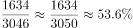，故2017年末比重高于2012年末，且均高于。

故正确答案为B。

---

### 第 5 题　qid 2376887 · 综合

关于农村贫困人口数据，无法由以上材料推出的是：

- **A**. 
按2012年末至2017年末西部年均农村贫困人口减少量计算，2019年末我国西部地区农村贫困人口将少于300万人

- **B**. 
2012年末至2017年末，集中连片特困地区减贫规模占全国农村减贫总规模的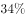
　✅
- **C**. 
2012年末至2017年末，农村减贫幅度东部地区要大于民族八省区

- **D**. 
按照中部地区农村贫困发生率下降速率计算，中部地区要达到2017年末东部地区农村贫困发生率水平还需要约2年时间

**答案**：B

**官方解析**

A项：定位文字材料第二段“西部地区农村贫困人口由2012年末的5086万人减少到2017年末的1634万人，累计减少3452万人”，可得2012年末至2017年末西部年均农村贫困人口减少量为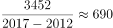万人，按此计算，2019年西部地区农村贫困人口约为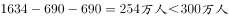，正确；

B项：定位文字材料第三段可知：贫困地区2017年末农村贫困人口比2012年末减少4139万人，减贫规模占全国农村减贫总规模的六成，集中连片特困地区2017年末农村贫困人口比2012年末减少3527万人。则2012年末至2017年末，集中连片特困地区减贫规模占全国农村减贫总规模的比重为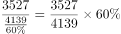，并非34%，错误；

C项：定位文字材料第二段可知：东部地区农村贫困人口五年累计下降，定位文字材料第三段可知：民族八大省农村贫困人口下降幅度为，则农村减贫幅度东部地区要大于民族八大省，正确；

D项：定位文字材料第二段可知：2017年末东部地区农村贫困发生率为，中部地区农村贫困发生率由2012年的下降到2017年的，下降7.1个百分点。则中部地区农村贫困发生率下降速率为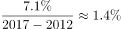，按此计算，中部地区要达到2017年末东部地区农村贫困发生率，还需要年，正确。

本题为选非题，故正确答案为B。

---

## 材料 2

根据以下资料，回答下列问题。

        2017年末，全国医疗卫生机构床位794.0万张，其中：医院612.0万张（占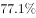），基层医疗卫生机构152.9万张（占）。医院中，公立医院床位占，民营医院床位占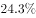。与上年比较，床位增加53.0万张，其中：医院床位增加43.1万张，基层医疗卫生机构床位增加8.7万张。每千人口医疗卫生机构床位数由2016年5.37张增加到2017年5.72张。

### 第 6 题　qid 2376888 · 综合

2016年末，全国基层医疗卫生机构拥有床位数量为多少万张？

- **A**. 714
- **B**. 568.9
- **C**. 152.9
- **D**. 144.2　✅

**答案**：D

**官方解析**

根据题干“2016年末······床位数量”，及材料给的是2017年末的数据，可以判定本题为基期计算问题。定位文字材料第一段：“2017年末，基层医疗卫生机构152.9万张······，与上年比较，基层医疗卫生机构床位增加8.7万张”，根据可得，2016年末全国基层医疗卫生机构拥有床位数为万张。

故正确答案为D。

---

### 第 7 题　qid 2376889 · 增长

虽然2014-2016年间全国医疗卫生机构床位数增长速度持续下滑，但2016年床位数仍然比2014年增加了：

- **A**. 

　✅
- **B**. 

- **C**. 

- **D**. 
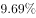

**答案**：A

**官方解析**

根据题干“······2016年床位数仍然比2014年增加了”，及选项为百分数，可判定本题为间隔增长率问题。定位统计图，2016年全国医疗卫生机构增速为，2015年全国医疗卫生机构增速为，根据间隔增长率的计算公式：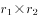，可得全国医疗卫生机构2016年相较于2014年增长率为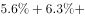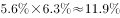，与A项最接近。

故正确答案为A。

---

### 第 8 题　qid 2376890 · 比重

2017年末公立医院床位数占全国医疗卫生机构床位数的比重为：

- **A**. 

- **B**. 

- **C**. 
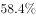
　✅
- **D**. 
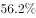

**答案**：C

**官方解析**

根据题干“2017年末······占······的比重为”，可判定本题为现期比重问题。定位文字材料第一段：“全国医疗卫生机构床位794.0万张，其中：医院612.0万张（占）”以及下文“医院中，公立医院床位占”，可得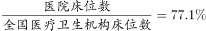，，因此，2017年末公立医院床位数占全国医疗卫生机构床位数的比重为：，与C项最接近。

故正确答案为C。

---

### 第 9 题　qid 2376891 · 增长

从所给数据资料中可以推算，2017年末全国人口总数比2016年末增加量最接近：

- **A**. 741万
- **B**. 822万　✅
- **C**. 895万
- **D**. 938万

**答案**：B

**官方解析**

根据题干“······增加量最接近”，结合选项带单位，可判定本题为增长量计算问题。定位文字材料可得：2017年末，全国医疗卫生机构床位794.0万张，每千人口医疗卫生机构床位数由2016年5.37张增加到2017年5.72张。定位图形材料可得：2016年末，全国医疗卫生机构床位741万张。根据公式：每千人口医疗卫生机构床位数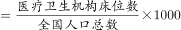可得，全国人口总数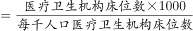。根据公式：，2017年末全国人口总数比2016年末增加量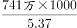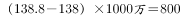万，与B项最接近。

故正确答案为B。

---

### 第 10 题　qid 2376892 · 综合

下列说法正确的是:

- **A**. 2013-2017年间，全国医疗卫生机构床位数增加幅度持续下降
- **B**. 从全国医疗卫生机构床位统计数据中可以知道医疗卫生机构由公立医院、民营医院和基层医疗卫生机构三部分组成
- **C**. 2014-2017年，全国医疗卫生机构床位增加量最大的年份是2017年　✅
- **D**. 2017年，床位增加率基层医疗卫生机构大于医院

**答案**：C

**官方解析**

A项：定位图形材料，2013-2017年全国医疗卫生机构床位数增加幅度分别为、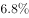、、、，并非持续下降，错误；

B项：定位文字材料，2017年末，全国医疗卫生机构床位794.0万张，其中：医院612.0万张（占77.1%），基层医疗卫生机构152.9万张（占19.3%）。医院中，公立医院床位占，民营医院床位占。由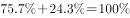，可知医院包括公立医院和民营医院两部分，故公立医院、民营医院和基层医疗卫生机构三部分的床位数占比=77.1%+19.3%=96.4%&lt;100%，错误；

C项：定位图形材料，2013-2017年全国医疗卫生机构床位数分别为618.2万张、660.1万张、701.5万张、741万张、794万张。根据公式：，2014年增长量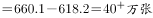，2015年增长量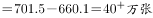，2016年增长量，2017年增长量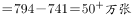，故增加量最大的年份为2017年，正确；

D项：定位文字材料，2017年末，医院床位数612.0万张，基层医疗卫生机构152.9万张。与上年比较，医院床位增加43.1万张，基层医疗卫生机构增加8.7万张。根据公式：增长率，2017年基层医疗卫生机构床位增长率，医院床位增长率，故基层医疗卫生机构床位增长率小于医院，并非大于，错误。

故正确答案为C。

---

## 材料 3

根据以下资料，回答下列问题 

        2018年1-12月，社会消费品零售总额380987亿元，比上年增长（扣除价格因素实际增长，以下除特殊说明外均为名义增长）。

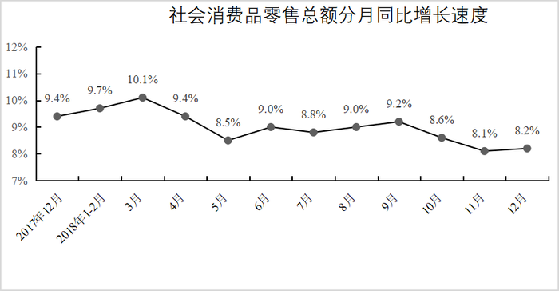

        2018年，限额以上零售业单位中的超市、百货店、专业店和专卖店零售额比上年分别增长、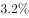、和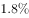。

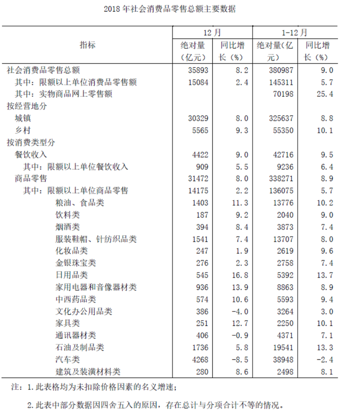

### 第 11 题　qid 2376990 · 增长

下列月份中，社会消费品零售总额分月同比名义增长速度最快的是：

- **A**. 2017年12月　✅
- **B**. 2018年5月
- **C**. 2018年7月
- **D**. 2018年9月

**答案**：A

**官方解析**

定位折线图可得：2017年12月、2018年5月、7月、9月的分月同比名义增长速度分别为、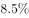、、，则增长速度最快的是，即2017年12月。

故正确答案为A。

---

### 第 12 题　qid 2376996 · 综合

按2017年价格计算2018年社会消费品零售总额约为：

- **A**. 349529亿元
- **B**. 356396亿元
- **C**. 373647亿元　✅
- **D**. 409223亿元

**答案**：C

**官方解析**

根据题干“按2017年价格计算2018年社会消费品零售总额为”，可判定本题为现期计算问题。定位为文字材料第一段可得：2018年1-12月，社会消费品零售总额380987亿元，名义增长率为，扣除价格因素实际增长。“按2017年价格计算”，即扣除2018年价格上涨因素造成的增长，也就是按2017年的实际增长率来计算。2017年社会消费品零售总额为，按2017年的实际增长率来计算，2018年社会消费品零售总额为亿元，与C项最接近。

故正确答案为C。

---

### 第 13 题　qid 2377004 · 比重

2017年12月，乡村消费品零售额占社会消费品零售总额的比重约是:

- **A**. 
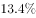

- **B**. 

　✅
- **C**. 
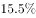

- **D**. 

**答案**：B

**官方解析**

根据题干“2017年12月，······占······的比重约是”，结合材料时间为2018年，可判定本题为基期比重问题。定位表格可得：2018年12月乡村消费品零售额为5565亿元，增长率为，社会消费品零售总额为35893亿元，增长率为，根据基期比重，则2017年12月乡村消费品零售额占社会消费品零售总额的比重为。

故正确答案为B。

---

### 第 14 题　qid 2377010 · 比重

2017年12月，商品零售额中限额以上单位商品零售所占比重约是：

- **A**. 

- **B**. 

　✅
- **C**. 

- **D**. 

**答案**：B

**官方解析**

根据题干“2017年······所占比重约是”，结合材料数据为2018年，可判定本题为基期比重问题。定位表格材料可得：“2018年12月，商品零售额为31472亿元，同比增长；限额以上单位商品零售额为14175，同比增长”，代入基期比重公式：，与B项最接近。

故正确答案为B。

---

### 第 15 题　qid 2377014 · 综合

根据所给资料，下列说法错误的是：

- **A**. 2018年餐饮收入中，限额以上单位餐饮收入所占比例不足一半
- **B**. 2018年限额以上零售业单位中专业店的零售额增长幅度高于百货店
- **C**. 2018年12月份，限额以上单位商品零售中的文化办公用品类零售额同比减少
- **D**. 2018年全国实物商品网上零售额同比增长速度高出社会消费品零售总额同比增长速度的两倍多　✅

**答案**：D

**官方解析**

A项：定位表格材料可得：“2018年1-12月餐饮收入为42716亿元，限额以上单位餐饮收入为9236亿元”， 故2018年餐饮收入中，限额以上单位餐饮收入所占比例，正确；

B项：定位文字材料第二段可知，2018年限额以上零售业单位中的百货店和专业店的零售额的增长幅度分别为和，故专业店的零售额增长幅度高于百货店，正确；

C项：定位表格材料可知，2018年12月份限额以上单位商品零售中的文化办公用品类零售额同比增长，故文化办公用品类零售额同比减少，正确；

D项：定位表格材料可知，2018年全国社会消费品零售总额和实物商品网上零售额的同比增长速度分别为和，则全国实物商品网上零售额同比增长速度是社会消费品零售总额同比增长速度的倍，高出倍，错误。

本题为选非题，故正确答案为D。

---

## 材料 4

根据以下资料，回答下列问题 

 

### 第 16 题　qid 2376972 · 增长

2012-2015年我国人口增长率最高的年份是哪一年？

- **A**. 2012
- **B**. 2013
- **C**. 2014　✅
- **D**. 2015

**答案**：C

**官方解析**

根据人口增长率=人口出生率-人口死亡率，定位表格第三行和第四行可知2011-2015年我国每年的人口出生率和死亡率，可得：2012年人口增长率，2013年人口增长率 ，2014年人口增长率，2015年人口增长率， 故2014年人口增长率最高。

 故正确答案为C。

---

### 第 17 题　qid 2376975 · 增长

2012-2015年，我国65岁及以上人口年均增长量大约是多少万人？

- **A**. 414
- **B**. 425
- **C**. 531
- **D**. 553　✅

**答案**：D

**官方解析**

根据题干所求“2012-2015年，······年均增长量······万人”可判定此题为年均增长量计算问题。定位表格可得，2012、2015年我国65岁及以上人口分别为12728万人、14386万人。根据年均增长量的公式：年均增长量=万人，与D项最接近。

故正确答案为D。

---

### 第 18 题　qid 2376997 · 增长

社会总抚养比可以衡量社会人均劳动年龄人口的抚养负担情况，是测度一个国家人口红利的重要指标之一。若社会总抚养比=（0-14岁人口数+65岁及以上人口数）/15-64岁劳动年龄人口数，那么按照2015年各年龄段人口绝对量和增长率计算，2017年年底我国社会总抚养比是多少？

- **A**. 

- **B**. 

- **C**. 

- **D**. 

　✅

**答案**：D

**官方解析**

由题干“2017年年底我国社会总抚养比······”，可判定本题为比值计算问题。定位表格最后一列可得，2015年0-14岁人口数为22715万人，增长率为，2015年15-64岁人口数为100361万人，增长率为，2015年65岁及以上人口数为14386万人，增长率为。则2017年0-14岁人口数万人，2017年15-64岁人口数万人，2017年65岁及以上人口数约为万人。根据社会总抚养比=（0-14岁人口数+65岁及以上人口数）/15-64岁劳动年龄人口数，则2017年年底我国社会总抚养比。

故正确答案为D。

---

### 第 19 题　qid 2377016 · 增长

下列哪一幅图能反映出2012-2015年65岁及以上人口中净增人口变化情况？

- **A**. A　✅
- **B**. B
- **C**. C
- **D**. D

**答案**：A

**官方解析**

根据题干“······65岁及以上人口中净增人口变化情况”，可判定本题为增长量比较问题。定位表格，2012—2015年的增长量分别为12728-12261=467万人、13199-12728=471万人、万人、万人，根据计算结果可判定A项趋势图符合。

故正确答案为A。

---

### 第 20 题　qid 2377017 · 综合

根据所给资料信息可以推断出：

- **A**. 由于我国每年都有大量新生婴儿出生，所以0-14岁人口一直保持持续增长状态
- **B**. 2011-2015年我国65岁及以上人口占总人口比重持续增加　✅
- **C**. 2011-2015年我国总人口增长量均不超过700万人
- **D**. 按2015年人口净增长量计算，2018年年底我国人口将超过14亿人

**答案**：B

**官方解析**

A项：定位表格中数据，2011—2015年，0—14岁人口分别：22231万人、22342万人、22316万人、22569万人、22715万人，可见2013年人口数小于2012年，并非一直保持持续增长状态，错误；

B项：根据，定位表格中数据，2011—2015年65岁及以上人口占总人口比重分别为、、、、，即比重持续增加，正确；

C项：定位表格中数据，2014年我国总人口增长量，错误；

D项：定位表格中数据，2015年人口净增长量为万人，按照2015年人口净增量计算，2018年年底我国人口137462+680×3=137462+2040&lt;140000万人（14亿人），错误。

故正确答案为B。

---
