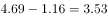
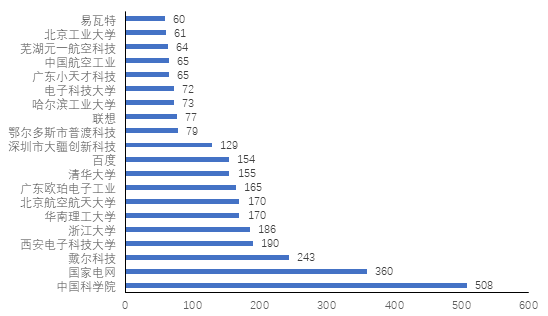
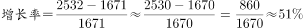
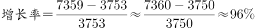
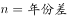
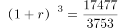
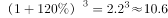
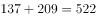

# 2019年420联考《行测》题（福建卷）（网友回忆版）

> 资料分析 · 15 题 · 福建 2019

## 材料 1

根据所给资料，回答下列问题。

        2016年全国供用水总量为6040.2亿立方米，较上年减少63.0亿立方米。其中，地表水源供水量4912.4亿立方米，占供水总量的；地下水源供水量1057.0亿立方米，占供水总量的；其他水源供水量70.8亿立方米，占供水总量的。与2015年相比，地表水源供水量减少57.1亿立方米，地下水源供水量减少12.2亿立方米，其他水源供水量增加6.3亿立方米。

        2016年，全国生活用水821.6亿立方米，占用水总量的；工业用水1308.0亿立方米，占用水总量的；农业用水3768.0亿立方米，占用水总量的；人工生态环境补水142.6亿立方米，占用水总量的。与2015年相比，农业用水量减少84.2亿立方米，生活用水量及人工生态环境补水量分别增加28.1亿立方米和19.9亿立方米。

        2016年全国万元国内生产总值（当年份）用水量81立方米，万元工业增加值（当年份）用水量52.8立方米，农田灌溉水有效利用系数0.542。按可比价计算，万元国内生产总值用水量和万元工业增加值用水量分别比2015年下降和。

        注：

### 第 1 题　qid 2377064 · 综合

2015年全国供用水总量为：

- **A**. 6040.2亿立方米
- **B**. 6103.2亿立方米　✅
- **C**. 5977.2亿立方米
- **D**. 1057.2亿立方米

**答案**：B

**官方解析**

根据题干所求“2015年全国···为”，结合材料时间为2016年，可判定此题为基期计算问题。定位第1段文字材料可知，2016年全国供用水总量为6040.2亿立方米，较上年减少63.0亿立方米，则2015年全国供用水总量为亿立方米。

故正确答案为B。

---

### 第 2 题　qid 2377067 · 比重

下列选项中，占2016年全国用水总量最大比重的是：

- **A**. 生活用水
- **B**. 工业用水
- **C**. 农业用水　✅
- **D**. 人工生态环境补水

**答案**：C

**官方解析**

定位第二段文字材料可得，生活用水占2016年全国用水总量比重为；工业用水占2016年全国用水总量比重为；农业用水占2016年全国用水总量比重为；人工生态环境补水占2016年全国用水总量比重为。则最大比重为农业用水。

故正确答案为C。

---

### 第 3 题　qid 2377073 · 综合

与上一年相比，2016年用水量减少的两大领域是：

- **A**. 生活用水和农业用水
- **B**. 工业用水和农业用水　✅
- **C**. 农业用水和人工生态环境补水
- **D**. 人工生态环境补水和生活用水

**答案**：B

**官方解析**

定位第2段文字材料“与2015年相比，农业用水量减少84.2亿立方米，生活用水量及人工生态环境补水量分别增加28.1亿立方米和19.9亿立方米”可知，农业用水量减少，生活用水量及人工生态环境补水量增加，排除A、C、D三项。
故正确答案为B。

---

### 第 4 题　qid 2377076 · 增长

2015年，我国万元国内生产总值用水量和万元工业增加值用水量之比约为：

- **A**. 

　✅
- **B**. 

- **C**. 

- **D**. 

**答案**：A

**官方解析**

根据题干“2015年······之比约为”，结合材料给出2016年的数据，可判定本题为基期比值计算问题。定位文字材料第三段可知，2016年全国万元国内生产总值用水量为81立方米，比2015年下降，则2015年万元国内生产总值用水量为立方米；2016年万元工业增加值用水量52.8立方米，比2015年下降，则2015年万元工业增加值用水量为。故2015年两者比值为，与A项最接近。

故正确答案为A。

---

### 第 5 题　qid 2377350 · 综合

下列说法正确的是：

- **A**. 2016年，农业用水产值低于工业用水产值
- **B**. 2016年，我国三大产业水资源利用率均有所提高
- **C**. 2016年，供水减少的主要原因是地下水源供水减少
- **D**. 2016年，其他水源供水量占供水总量比重较上年提升　✅

**答案**：D

**官方解析**

A项：材料中只有农业用水量，没有农业产值相关数据，故无法推出，错误。
B项：三大产业水资源利用率均有所提高，即农业、工业、服务业每种类型的水资源利用率都大于上年。材料中即无水资源利用率与上年相比的变化数据，也无工业和服务业的水资源利用率相关数据，故无法推出，错误。
 C项： 定位文字材料第一段“2016年……与2015年相比，地表水源供水量减少57.1亿立方米，地下水源供水量减少12.2亿立方米，其他水源供水量增加6.3亿立方米”，故2016年，供水减少的主要原因是地表水源供水减少，错误；
D项： 定位文字材料第一段“2016年全国供用水总量为6040.2亿立方米，较上年减少63.0亿立方米……其他水源供水量70.8亿立方米，占供水总量的1.2%……与2015年相比……其他水源供水量增加6.3亿立方米”，可得2016年全国供水总量减少，则总体增长率b＜0，其他水源供水量增加，则部分增长率a＞0，根据两期比重结论：部分增长率a（其他水源）＞整体增长率b（全国供水），比重上升，故2016年，其他水源供水量占供水总量比重较上年提升，正确。
故正确答案为D。

---

## 材料 2

根据以下资料，回答下列问题。

        CIER指数用来反映就业市场景气程度，其计算方法是：。根据有关机构发布的数据，2018年第一季度CIER指数为1.91，第二季度为1.88，第三季度为1.97，第四季度为2.38。2018年第三季度，招聘需求人数环比下降，求职申请人数环比下降；第四季度招聘需求人数环比增加，求职申请人数环比增加。

### 第 6 题　qid 2377068 · 综合

下列选项中，对2018年四个季度CIER指数变化表达正确的是：

- **A**. A
- **B**. B
- **C**. C　✅
- **D**. D

**答案**：C

**官方解析**

定位文字材料可得：2018年第一季度CIER指数为1.91，第二季度为1.88，第三季度为1.97，第四季度为2.38。可知CIER的指数是一个先略微下降、再略微上升、再大幅上升的过程，C选项满足要求。
故正确答案为C。

---

### 第 7 题　qid 2377070 · 综合

与第三季度相比，第四季度CIER指数上升最快的职业是：

- **A**. 社区/居民/家政服务
- **B**. 教育/培训　✅
- **C**. 技工/操作工
- **D**. 高级管理

**答案**：B

**官方解析**

根据题干“与第三季度相比，第四季度CIER指数上升最快的职业是”，可判定本题为增长率比较问题。定位表格2可得：2018年第四季度社区/居民/家政服务、教育/培训、技工/操作工、高级管理的指数分别为12.99、16.24、25.67、1.07，比上一季度变化量分别为4.78、8.51、0.82、-0.32。根据，可得各项增长率分别为：

A项，；

B项，；

C项，；

D项，。

可知增长率最大的为B项，即上升最快的职业为教育/培训。

故正确答案为B。

---

### 第 8 题　qid 2377071 · 综合

根据第四季度数据，可以推断下列行业在第三季度CIER指数最高的是：

- **A**. 教育/培训/院校
- **B**. 医药/生物工程
- **C**. 互联网/电子商务
- **D**. 中介服务　✅

**答案**：D

**官方解析**

由题干“根据第四季度数据，可以推断······在第三季度CIER指数最高的是”，结合表格材料1给出的第四季度数据及比上一季度变化量，可判定本题为基期比较问题。，可知各选项第三季度CIER指数分别为：

A项，；

B项，

C项，；

D项，。

可知第三季度CIER指数最高的是D项。

故正确答案为D。

---

### 第 9 题　qid 2377072 · 综合

已列职业中，在第三季度CIER指数不低于1.5的个数为：

- **A**. 10
- **B**. 11
- **C**. 12　✅
- **D**. 13

**答案**：C

**官方解析**

题干“已列职业中，在第三季度CIER指数不低于1.5的个数为”，结合表格材料2给出的第四季度数据及比上一季度变化量，可判定本题为基期计算问题。根据，通过表格可知，就业景气较好的10个职业在第三季度的CIER指数均大于1.5；在就业景气较差的十个职业中，IT管理/项目协调、汽车制造这2个职业在第三季度的CIER指数分别为：、也均大于1.5。故已列职业中，在第三季度CIER指数不低于1.5的个数为12。

故正确答案为C。

---

### 第 10 题　qid 2377193 · 综合

下列关于2018年第三、第四季度的相关信息说法错误的是：

- **A**. 在第四季度，技工/操作工位于就业景气较好职业榜首，且与其它职位相比，其就业市场景气程度季度波动较小
- **B**. 在第四季度，市场对教育/培训类人才需求量增大　✅
- **C**. 航空/航天研究与制造位居第四季度就业景气较差行业榜首，说明该行业人才并不稀缺
- **D**. 在第三季度，已列职业中，就业景气最差的是信托/担保/拍卖/典当

**答案**：B

**官方解析**

A项：定位表2，2018年第四季度技工/操作工CIER指数最高，且与上一季度相比变化较小，即波动较小，正确；

B项：定位表2，可知第四季度教育/培训类人才CIER指数大于第三季度，但只知道指数变化，无法得知人才需求量的变化，错误；

C项：根据文字材料第一段，CIER指数用来反映就业市场的景气程度，，定位表1，航空/航天研究与制造CIER指数小于1，说明该行业市场招聘需求人数小于市场求职申请人数，即市场求职申请人数相对于招聘需求人数较饱和（供大于求），故该行业人才并不稀缺，正确；

 D项：定位表2，2018年第三季度，信托/担保/拍卖/典当，是已列职业中指数最低的，反映就业景气最差，正确；

本题为选非题，故正确答案为B。

---

## 材料 3

根据以下资料，回答下列问题。

图1 2000-2017年中国人工智能专利授权情况（单位：件）

图2 2017年中国人工智能专利授权量排名前20国内专利权人（单位：件）

注：排名前20名的高校、科研院校有：北京工业大学、电子科技大学、哈尔滨工业大学、清华大学、北京航空航天大学、华南理工大学、浙江大学、西安电子科技大学及中国科学院，其余均为企业。

### 第 11 题　qid 2377310 · 综合

从历年专利授权量变化趋势来看，2014至2017年我国人工智能领域专利处于：

- **A**. 起步萌芽期
- **B**. 发展停滞期
- **C**. 缓慢发展期
- **D**. 快速发展期　✅

**答案**：D

**官方解析**

根据题干“从历年专利授权量变化趋势来看······”，可以判定本题为直接找数问题。定位图1，2014年到2017年专利授权状况分别为，3753件，7359件，12952件，17477件，由此可以判出2014年到2017年专利授权量呈快速上涨趋势，对应选项为快速发展期。
故正确答案为D。

---

### 第 12 题　qid 2377075 · 增长

下列年份中，中国人工智能专利授权量增速最快的是：

- **A**. 2007年
- **B**. 2012年
- **C**. 2015年　✅
- **D**. 2017年

**答案**：C

**官方解析**

根据题干“······增速最快”，可判断本题为增长率比较问题。根据增长率计算公式：，定位材料图1可得2007年的，2012年的，2015年的，2017年的，所以增长最快的为2015年。

故正确答案为C。

---

### 第 13 题　qid 2377080 · 比重

在位列中国人工智能专利授权量前20位的国内专利权人中，浙江大学专利授权量占比约为：

- **A**. 

- **B**. 

　✅
- **C**. 

- **D**. 

**答案**：B

**官方解析**

根据题干“······占比约为”，可判断本题为现期比重问题。定位图2，可得2017年浙江大学中国人工智能专利授权量为186件，位列中国人工智能专利授权量前20位的国内总量为。故位列中国人工智能专利授权量前20位的国内专利权人中，浙江大学专利授权量占比为，与B项最接近。

故正确答案为B。

---

### 第 14 题　qid 2377364 · 综合

下列选项中，在2017年中国人工智能专利授权量最多的是：

- **A**. 易瓦特
- **B**. 国家电网　✅
- **C**. 戴尔科技
- **D**. 联想

**答案**：B

**官方解析**

根据题干“在2017年中国人工智能专利授权量最多的是”可以判定本题为直接找数问题。易瓦特为60，国家电网为360，戴尔科技为243，联想为77，则最多的是国家电网。
故正确答案为B。

---

### 第 15 题　qid 2377082 · 综合

根据资料，下列关于我国2000-2017年相关信息说法正确的是：

- **A**. 
2014年是人工智能专利研发的第一个井喷年

- **B**. 
2014年至2017年人工智能领域专利授权量年均增速为

- **C**. 
2017年排名前20的国内专利权人，其人工智能专利授权量占当年人工智能专利授权总量的比例超过了

- **D**. 
中国科学院仅2017年的人工智能专利授权量就接近2000年到2004年5年全国授权量的总和
　✅

**答案**：D

**官方解析**

A项：定位图1可得，2000-2014年间人工智能专利授权量平缓上升，2015年增速大幅提高。可知2015年是人工智能专利研发的第一个井喷年，并非2014年，错误；

B项：定位图1可得，2014年人工智能领域专利授权量3753件，2017年为17477件。代入公式：，（），，。可知2014年至2017年人工智能领域专利授权量年均增速并非，错误；

C项：结合本篇第3题可知，2017年排名前20的国内专利权人，其人工智能专利授权量为3046件，，错误；

D项：定位图1可得，2000年到2004年5年全国授权量的总和为件；定位图2可得，中国科学院2017年的人工智能专利授权量为508件。中国科学院2017年的人工智能专利授权量接近2000年到2004年5年全国授权量的总和，正确。

故正确答案为D。

---
