# 2019年420联考《行测》题（陕西卷）（网友回忆版）

> 资料分析 · 20 题 · 陕西 2019

## 材料 1

根据以下资料，回答下列问题。

        2014年我国实施“单独两孩”生育政策，出生人口1687万人，比上年增加47万人。2016 年实施“全面两孩”生育政策，出生人口1786万人，比上年增加131万人；出生率与“十二五”时期年平均出生率相比，提高了0.84个千分点。2017 年我国出生人口1723万人，虽然比上年减少63万人，但比“十二五”时期年平均出生人口多出79万人；出生率为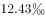，比上一年降低0.52个千分点。2017年二孩数量进一步上升至883万人，二孩占全部出生人口的比重达到，比2016年的占比提高了11个百分点。

        2017年出生人口最多的省份是山东，出生人口174.98万人，但是比2016年减少2.08万人。广东和河南出生人口也超过百万，其中广东出生人口151.63万人，同比增加22.18万人；河南出生人口140.13 万人，较上年减少2.48万人。此外，出生人口排名前十的省份依次还有河北、四川、湖南、安徽、广西、江苏、湖北。其中，河北、四川、湖南出生人口超90万人，湖北最少，为74.26万人。

        从人口增量来看，2017年广东出生人口增量最大，出生人口较2016年增加22.18万人。安徽、四川、河北出生人口增量超过5万，此外，江苏、湖南、山东、河南出生人口较2016年有所减少。其中，河南减少最多，出生人口减少2.48万人。

### 第 1 题　qid 2376539 · 增长

2015年我国出生人口同比：

- **A**. 
增长

- **B**. 
降低

- **C**. 
增长

- **D**. 
降低
　✅

**答案**：D

**官方解析**

根据题干“2015年……同比”，结合选项为，可判定本题为一般增长率问题。定位文字资料第一段“2014年……我国出生人口1687万人，2016年……我国出生人口1786万人，比上年增加131万人”，可知2015年我国人口为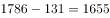万人。代入公式：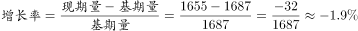，即2015年我国出生人口同比降低。

故正确答案为D。

---

### 第 2 题　qid 2376538 · 平均数

“十二五”时期我国年平均出生率为：

- **A**. 

- **B**. 

　✅
- **C**. 

- **D**. 

**答案**：B

**官方解析**

定位文字资料第一段“2016年······出生率与‘十二五’时期年平均出生率相比，提高了0.84个千分点；2017年······出生率为，比上一年降低0.52个千分点”，可知“十二五”期间年平均出生率为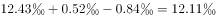。

故正确答案为B。

---

### 第 3 题　qid 2376541 · 综合

2016年我国二孩出生人口约为：

- **A**. 883万人
- **B**. 742万人
- **C**. 718万人　✅
- **D**. 693万人

**答案**：C

**官方解析**

根据题干“2016年我国二孩出生人口约为”，结合材料时间为2017年，且已知二孩出生人口占全部出生人口的比重，可判定题为基期比重问题。定位文字材料第一段“2016年实施‘全面两孩’生育政策，出生人口1786万人······2017年······二孩占全部出生人口的比重达到，比2016年的占比提高了11个百分点”，故2016年二孩占全部出生人口的比重为，则2016年我国二孩出生人口为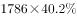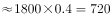万人，C项最接近。

故正确答案为C。

---

### 第 4 题　qid 2376758 · 比重

2016年山东、广东和河南三省出生人口之和占当年全国出生人口的比重约为：

- **A**. 

- **B**. 

　✅
- **C**. 

- **D**. 

**答案**：B

**官方解析**

根据问题“2016年······占······的比重约为······”，且材料时间为2017年，可判定此题为基期比重问题。定位文字材料第一段可得“2016年······出生人口1786万人”；定位第二段可得“2017年出生人口最多的省份是山东，出生人口174.98万人，但是比2016年减少2.08万人······广东出生人口151.63万人，同比增加22.18万人；河南出生人口140.13万人，较上年减少2.48万人”则2016年山东省出生人口为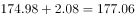万人，广东省出生人口为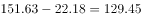万人，河南省出生人口为万人。则2016年，三省出生人口之和占当年全国出生人口的比重为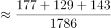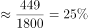。

故正确答案为B。

---

### 第 5 题　qid 2376546 · 综合

能够从上述资料中推出的是：

- **A**. 
2016、2017两年山东出生人口数量均超过当年全国出生人口数量的

- **B**. 
2016年广东出生人口数量超过2017年湖北出生人口数量的2倍

- **C**. 
2017年出生人口增量超过5万的省份只有3个

- **D**. 
2017年出生人口比2013年增长超过
　✅

**答案**：D

**官方解析**

A项：定位文字材料第一段“2016年实施‘全面两孩’生育政策，出生人口1786万人······2017年我国出生人口1723万人”，定位文字材料第二段“2017年出生人口最多的省份是山东，出生人口174.98万人，但是比2016年减少2.08万人”。 2017年：；2016年：，则2016年山东出生人口数量没有超过当年全国出生人口数量的，错误；

B项：定位文字材料第二段“2017年出生人口······其中广东出生人口151.63万人，同比增加22.18万人······湖北最少，为74.26万人”，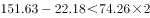，错误；

C项：定位文字材料第三段“2017年广东出生人口增量最大，出生人口较2016年增加22.18万人。安徽、四川、河北出生人口增量超过5万”，可得2017年出生人口增量超过5万的省份至少有4个，错误；

D项：定位文字材料第一段可知：2014年出生人口1687万人，比上年增加47万人。2017年出生人口1723万人。可得2013年出生人口为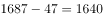万人，代入增长率公式：，故2017年出生人口比2013年增长了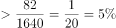，正确。

故正确答案为D。

---

## 材料 2

根据以下资料，回答下列问题

        2008与2018年我国居民一天主要活动平均时间   单位：分钟

注：1.部分数据因四舍五入的原因，存在总计与分项合计不等的情况；

2.2008年数据根据2018年统计口径有所合并和调整。

### 第 6 题　qid 2377381 · 增长

与2008年相比，2018年我国（  ）居民花费在睡觉休息上的平均时间的增速最低。

- **A**. 男　✅
- **B**. 女
- **C**. 城镇
- **D**. 农村

**答案**：A

**官方解析**

根据题干所求“与2008年相比，2018年……增速最低”，可判定此题为一般增长率比较问题。根据增长率公式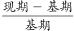，定位表格材料可得：男增速为；女增速为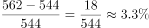；城镇增速为；农村增速为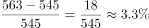，故增速最低为男。

故正确答案为A。

---

### 第 7 题　qid 2377383 · 平均数

与2008年相比，2018年全国居民花费在（  ）上的平均时间减少幅度最大。

- **A**. 家庭生产经营活动
- **B**. 家务劳动
- **C**. 看电视
- **D**. 交通活动　✅

**答案**：D

**官方解析**

根据题干所求“与2008年相比，2018年……减少幅度最大”，可判定此题为增长率比较问题，比较减少幅度最大，即找降幅最大的活动。定位表格材料可得，家庭生产经营活动减少幅度为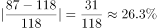；家务劳动减少幅度为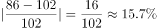；看电视减少幅度为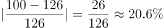；交通活动减少幅度为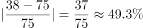，故减少幅度最大为交通活动。

故正确答案为D。

---

### 第 8 题　qid 2377385 · 平均数

2018年，我国男性居民和女性居民花费在（  ）活动上的平均时间的绝对差异最大。

- **A**. 就业工作
- **B**. 家庭生产经营活动
- **C**. 家务劳动　✅
- **D**. 陪伴照料家人

**答案**：C

**官方解析**

定位表格材料可得，2018年我国男性居民和女性居民花费在就业工作活动上的平均时间的绝对差异为217-139=78；家庭生产经营活动为98-76=22；家务劳动为126-45=81；陪伴照料家人为75-30=45，故绝对差异最大为家务劳动。
故正确答案为C。

---

### 第 9 题　qid 2377386 · 平均数

2018年，我国城镇居民和农村居民花费在上表中主要活动上的平均时间的占比均由高到低排序正确的是（  ）。

- **A**. 睡觉休息＞就业工作＞用餐或其他饮食＞看电视
- **B**. 就业工作＞用餐或其他饮食＞家务劳动＞休闲娱乐　✅
- **C**. 用餐或其他饮食＞看电视＞家务劳动＞休闲娱乐
- **D**. 家务劳动＞休闲娱乐＞陪伴照料家人＞个人卫生护理

**答案**：B

**官方解析**

根据题干“2018年……占比……”，结合材料给出2018年数据，可判定此题为现期比重问题。代入比重公式，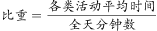，公式的分母均为1440分钟，故直接比较分子（各类活动平均时间）大小即可。

A项：农村：睡觉休息（563）、就业工作（145）、用餐或其他饮食（103）、看电视（104），用餐或其他饮食看电视，错误；

B项：城镇：就业工作（197）、用餐或其他饮食（105）、家务劳动（79）、休闲娱乐（69），正确；农村：就业工作（145）、用餐或其他饮食（103）、家务劳动（97）、休闲娱乐（58），正确；

C项：农村：用餐或其他饮食（103）、看电视（104）、家务劳动（97）、休闲娱乐（58），用餐或其他饮食看电视，错误；

D项：农村：家务劳动（97）、休闲娱乐（58）、陪伴照料家人（45）、个人卫生护理（47），陪伴照料家人个人卫生护理，错误。

故正确答案为B。

---

### 第 10 题　qid 2377387 · 综合

根据以上资料，下列说法正确的是（  ）。

- **A**. 与2008年相比，2018年我国男性居民花费在8项活动上的平均时间有所增加，其中花费在陪伴家人上的平均时间的增速最高
- **B**. 与2008年相比，2018年我国女性居民花费在家庭生产经营活动上的平均时间减少最多，而陪伴照料家人的时间增长最多
- **C**. 与2008年相比，2018年我国城镇居民花费在工作和劳动上（就业工作、家庭生产经营活动、家务劳动的合计数）的平均时间减少了，花费在休闲活动上（健身锻炼、听广播和音乐、看电视、阅读书报期刊、休闲娱乐的合计数）的平均时间增加了
- **D**. 与2008年相比，2018年我国农村居民花费在休息睡觉、个人卫生护理、就业工作和休闲娱乐这四项活动上的平均时间的增幅均高于同期同类活动的全国居民平均水平的增幅　✅

**答案**：D

**官方解析**

A项： 2018年我国男性居民花费平均时间增加的有睡觉休息、个人卫生护理、就业工作、陪伴照料家人、健身锻炼、听广播或音乐、休闲娱乐、社会交往、教育培训共9项活动，不是8项，错误；

B项：2018年我国女性居民花费在家庭生产经营活动上的平均时间减少分钟，而交通活动时间减少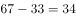，交通活动时间减少更多，错误；

C项：定位表格可知，2018年我国城镇居民花费在工作和劳动上的平均时间为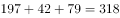,2008年为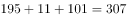，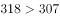，故平均时间增加，错误；

D项：定位表格可知，与2008年相比，2018年我国农村居民花费在休息睡觉活动上的平均时间的增幅为；同期休息睡觉活动全国居民平均水平的增幅为，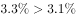，满足要求；2018年我国农村居民花费在个人卫生护理的平均时间的增幅为；同期个人卫生护理活动全国居民平均水平的增幅为，，满足要求；

2018年我国农村居民花费在就业工作的平均时间的增幅为；同期就业工作活动全国居民平均水平的增幅为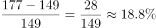，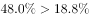，满足要求；

2018年我国农村居民花费在休闲娱乐的平均时间的增幅为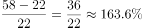；同期休闲娱乐全国居民平均水平的增幅为，，满足要求。

故正确答案为D。

---

## 材料 3

 根据以下资料，回答下列问题 

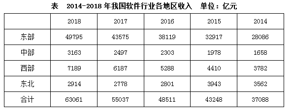

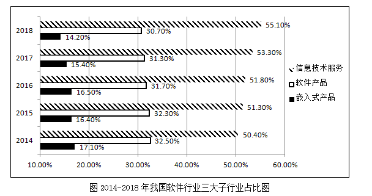

### 第 11 题　qid 2377372 · 增长

我国西部地区的软件行业总收入2018年比2014年的增长额较同期中部地区的增长额多达约（  ）

- **A**. 1800亿元
- **B**. 1900亿元　✅
- **C**. 2000亿元
- **D**. 2100亿元

**答案**：B

**官方解析**

由题干“西部地区的……增长额较同期中部地区的增长额多达约”，可判定本题为增长量计算问题。定位表格可知：增长量=现期量-基期量，故西部地区增长额=7189-3782=3407，中部地区增长额=3163-1658=1505。则西部地区增长额较中部地区增长额多3407-1505=1902亿元。
故正确答案为B。

---

### 第 12 题　qid 2377375 · 增长

2018年软件行业总收入较2015年的同比增速高于的地区有（  ）

- **A**. 1个
- **B**. 2个
- **C**. 3个　✅
- **D**. 4个

**答案**：C

**官方解析**

根据题干“同比增速高于50%的有”，可判定本题为一般增长率问题。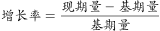，定位表格可得，东部地区：；中部地区：；西部地区：；东北地区：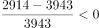，故同比增速高于的有3个。

故正确答案为C。

---

### 第 13 题　qid 2377377 · 比重

2018年软件行业总收入中占比最高的地区的总收入是同年软件行业总收入中占比最低的子行业的总收入的约（  ）

- **A**. 4倍
- **B**. 6倍　✅
- **C**. 8倍
- **D**. 10倍

**答案**：B

**官方解析**

根据题干“2018年……的总收入是……的总收入”，结合选项为倍数，可判定本题为现期倍数问题。定位表格，根据总体相同时部分量最大的比重最大，可知占比最高的地区为东部地区，总收入为49795亿元。定位统计图可知，2018年总收入占比最低的子行业为嵌入式产品，占比为，且根据表格可知2018年总收入为63061亿元，故2018年嵌入式产品总收入亿元。则现期倍数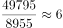倍。

故正确答案为B。

---

### 第 14 题　qid 2377380 · 增长

2014-2018年，我国软件产品这一子行业收入的环比增速最高的年份是（  ）

- **A**. 2018年
- **B**. 2017年
- **C**. 2016年
- **D**. 2015年　✅

**答案**：D

**官方解析**

根据题干中“……的环比增速最高的年份是”，可判定此题为增长率比较问题。定位统计表及统计图，现期值、基期值已知，，故只需要比较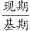即可。

2018年：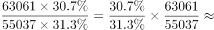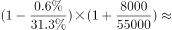

2017年：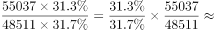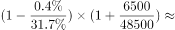

2016年：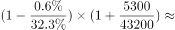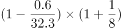

2015年：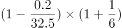

四个式子比较大小，乘号前后均为2015年最大，所以2015年的值最大，即2015年的r最大。

故正确答案为D。

---

### 第 15 题　qid 2377382 · 综合

根据以上资料，下列说法中正确的是（  ）

- **A**. 2015-2018年，每年我国中部地区软件行业总收入较2014年的年度同比增速高于同期东部地区软件行业总收入较2014年的年度同比增速
- **B**. 2015-2018年，每年我国西部地区软件行业总收入的年度环比增速低于同期全国软件行业总收入的年度环比增速
- **C**. 2015-2018年，每年我国信息技术服务的总收入较2014年的年度同比增速都高于同期全国软件行业总收入较2014年的年度同比增速　✅
- **D**. 2015-2018年，每年我国软件产品总收入的年度环比增速都高于同期嵌入式产品总收入的年度环比增速

**答案**：C

**官方解析**

A项：定位统计表，15年中部地区的增长率为，东部地区增长率为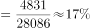，满足；16年中部地区的增长率为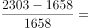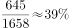，东部地区增长率为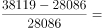，满足；17年中部地区的增长率为，东部地区的增长率为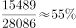，可以发现17年东部地区增长率大于中部地区，错误；

B项：定位统计表，15年西部地区的增长率为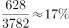，全国的增长率为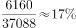；16年西部地区增长率为，全国的增长率为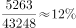，由此可以发现16年西部地区增速明显高于全国，错误； 

C项：定位图形和表格，现期值、基期值已知，，故只需要比较即可。，，则只需要比较信息技术即可。因为基期不变，都是14年，14年占比为，15-18年占比均大于，所以15-18年每年信息技术增速大于全国增速，正确；

D项：与C项同理，增长率比较，软件产品、嵌入式产品总体相同，只需要比较占比即可。15年，，满足；16年，，不满足，错误。

故正确答案为C。

---

## 材料 4

        2017年我国成年国民图书阅读率为，比上年增加0.3个百分点；报纸阅读率为，比上年降低2.1个百分点；期刊阅读率为，比上年增加1个百分点。 

        2017年我国成年国民数字化阅读方式(网络在线阅读、手机阅读、电子阅读器阅读、平板电脑阅读等)的接触率为。其中，网络在线阅读接触率为，比上年增加4.4个百分点；手机阅读接触率为，比上年增加4.9个百分点；电子阅读器阅读接触率为，比上年增加6.5个百分点；平板电脑阅读接触率为，比上年增加2.2个百分点。

        传统纸质媒介中，2017年我国成年国民人均每天阅读纸质图书时长为20.38分钟，人均每天阅读报纸时长为12.00分钟，人均每天阅读期刊时长为6.88分钟。

### 第 16 题　qid 2376766 · 综合

2016年我国成年国民报纸阅读率比期刊阅读率高：

- **A**. 11.1个百分点
- **B**. 12.3个百分点
- **C**. 15.4个百分点　✅
- **D**. 17.5个百分点

**答案**：C

**官方解析**

由题干“成年国民报纸阅读率比期刊阅读率高多少百分点”，可判定本题为简单加减计算问题。定位文字材料第一段“2017年报纸阅读率为，比上年降低2.1个百分点；2017年期刊阅读为，比上年增加1个百分点”，故2016年报纸阅读率为；2016年期刊阅读率为。因此，2016年我国成年国民报纸阅读率比期刊阅读率高，即15.4个百分点。

故正确答案为C。

---

### 第 17 题　qid 2376750 · 综合

2016年我国成年国民数字化阅读四个方式的接触率按从高到低排列正确的是：

- **A**. 
网络在线阅读手机阅读电子阅读器阅读平板电脑阅读

- **B**. 
手机阅读网络在线阅读电子阅读器阅读平板电脑阅读

- **C**. 
网络在线阅读手机阅读平板电脑阅读电子阅读器阅读

- **D**. 
手机阅读网络在线阅读平板电脑阅读电子阅读器阅读
　✅

**答案**：D

**官方解析**

定位文字材料第二段可得，2017年我国成年国民网络在线阅读接触率为，比上年增加4.4个百分点，则2016年接触率为；手机阅读接触率为，比上年增加4.9个百分点，则2016年接触率为；电子阅读器阅读接触率为，比上年增加6.5个百分点，则2016年接触率为；平板电脑阅读接触率为，比上年增加2.2个百分点，则2016年接触率为。接触率从高到低排列为手机阅读网络在线阅读平板电脑阅读电子阅读器阅读，与D项一致。

故正确答案为D。

---

### 第 18 题　qid 2376767 · 平均数

2017年我国成年国民阅读一本纸质图书平均需要：

- **A**. 20.8小时
- **B**. 22.3小时
- **C**. 24.1小时
- **D**. 26.6小时　✅

**答案**：D

**官方解析**

由题干“2017年我国成年国民阅读一本纸质图书平均需要”，可判定本题为现期平均数计算。阅读一本纸质图书平均需要的时间=总时间÷书的数量。定位文字材料第三段可知，2017年我国成年国民每天阅读纸质图书为20.38分钟，则全年阅读纸质图书的总时间为；定位表格，2017年成年国民纸质图书人均阅读量为4.66（本）。因此，阅读一本书平均需要分钟，即 小时。

故正确答案为D。

---

### 第 19 题　qid 2376772 · 平均数

2013年至2017年我国成年国民人均期刊阅读量超过这五年平均水平的年份有：

- **A**. 2个
- **B**. 3个　✅
- **C**. 4个
- **D**. 5个

**答案**：B

**官方解析**

由题干“2013年至2017年···超过这五年平均水平的年份有”可知，本题为平均数问题。定位表格第五行，由公式可得，这五年人均期刊阅读的平均水平，2013年至2017年期刊人均阅读量超过这五年平均水平的有3个年份，分别为2013年、2014年、2015年。

故正确答案为B。

---

### 第 20 题　qid 2376773 · 综合

能够从上述资料中推出的是：

- **A**. 2013年至2017年我国成年国民人均电子书阅读量逐年上升
- **B**. 2016年我国成年国民图书阅读率低于当年网络在线阅读接触率
- **C**. 2017年我国成年国民人均每天阅读纸质图书时长低于阅读报纸与阅读期刊时长之和
- **D**. 2014年至2017年我国成年国民人均期刊阅读量，增长率最高的年份为2017年　✅

**答案**：D

**官方解析**

A项：定位表格材料，2013年至2017年我国成年国民人均电子书阅读量分别为2.48、3.22、3.26、3.21和3.12。可见，2016年与2017年均比上年有所下降，错误；

B项：定位文字材料第一段和第二段可得，2017年我国成年国民图书阅读率为，比上年增加0.3个百分点，网络在线阅读接触率为，比上年增加4.4个百分点。则2016年我国成年国民图书阅读率为，2016年网络在线阅读接触率为，，错误；

C项：定位文字材料第三段可得，2017年我国成年国民人均每天阅读纸质图书时长为20.38分钟，人均每天阅读报纸时长为12.00分钟，人均每天阅读期刊时长为6.88分钟。则我国成年国民人均每天阅读报纸与阅读期刊时长之和为，，错误；

D项：定位表格材料，2013年至2017年每年我国成年国民人均期刊阅读量均已知，根据可得，2014年我国成年国民人均期刊阅读量增长率，2015年我国成年国民人均期刊阅读量增长率，2016年我国成年国民人均期刊阅读量增长率，2017年我国成年国民人均期刊阅读量增长率，2017年增长率最高，正确。

故正确答案为D。

---
