# 2019年420联考《行测》题（黑龙江公检法卷）（网友回忆版）

> 资料分析 · 20 题 · 黑龙江 2019

## 材料 1

        2017年我国成年国民图书阅读率为，比上年增加0.3个百分点；报纸阅读率为，比上年降低2.1个百分点；期刊阅读率为，比上年增加1个百分点。 

        2017年我国成年国民数字化阅读方式(网络在线阅读、手机阅读、电子阅读器阅读、平板电脑阅读等)的接触率为。其中，网络在线阅读接触率为，比上年增加4.4个百分点；手机阅读接触率为，比上年增加4.9个百分点；电子阅读器阅读接触率为，比上年增加6.5个百分点；平板电脑阅读接触率为，比上年增加2.2个百分点。

        传统纸质媒介中，2017年我国成年国民人均每天阅读纸质图书时长为20.38分钟，人均每天阅读报纸时长为12.00分钟，人均每天阅读期刊时长为6.88分钟。

### 第 1 题　qid 2376766 · 综合

2016年我国成年国民报纸阅读率比期刊阅读率高：

- **A**. 11.1个百分点
- **B**. 12.3个百分点
- **C**. 15.4个百分点　✅
- **D**. 17.5个百分点

**答案**：C

**官方解析**

由题干“成年国民报纸阅读率比期刊阅读率高多少百分点”，可判定本题为简单加减计算问题。定位文字材料第一段“2017年报纸阅读率为，比上年降低2.1个百分点；2017年期刊阅读为，比上年增加1个百分点”，故2016年报纸阅读率为；2016年期刊阅读率为。因此，2016年我国成年国民报纸阅读率比期刊阅读率高，即15.4个百分点。

故正确答案为C。

---

### 第 2 题　qid 2376750 · 综合

2016年我国成年国民数字化阅读四个方式的接触率按从高到低排列正确的是：

- **A**. 
网络在线阅读手机阅读电子阅读器阅读平板电脑阅读

- **B**. 
手机阅读网络在线阅读电子阅读器阅读平板电脑阅读

- **C**. 
网络在线阅读手机阅读平板电脑阅读电子阅读器阅读

- **D**. 
手机阅读网络在线阅读平板电脑阅读电子阅读器阅读
　✅

**答案**：D

**官方解析**

定位文字材料第二段可得，2017年我国成年国民网络在线阅读接触率为，比上年增加4.4个百分点，则2016年接触率为；手机阅读接触率为，比上年增加4.9个百分点，则2016年接触率为；电子阅读器阅读接触率为，比上年增加6.5个百分点，则2016年接触率为；平板电脑阅读接触率为，比上年增加2.2个百分点，则2016年接触率为。接触率从高到低排列为手机阅读网络在线阅读平板电脑阅读电子阅读器阅读，与D项一致。

故正确答案为D。

---

### 第 3 题　qid 2376767 · 平均数

2017年我国成年国民阅读一本纸质图书平均需要：

- **A**. 20.8小时
- **B**. 22.3小时
- **C**. 24.1小时
- **D**. 26.6小时　✅

**答案**：D

**官方解析**

由题干“2017年我国成年国民阅读一本纸质图书平均需要”，可判定本题为现期平均数计算。阅读一本纸质图书平均需要的时间=总时间÷书的数量。定位文字材料第三段可知，2017年我国成年国民每天阅读纸质图书为20.38分钟，则全年阅读纸质图书的总时间为；定位表格，2017年成年国民纸质图书人均阅读量为4.66（本）。因此，阅读一本书平均需要分钟，即 小时。

故正确答案为D。

---

### 第 4 题　qid 2376772 · 平均数

2013年至2017年我国成年国民人均期刊阅读量超过这五年平均水平的年份有：

- **A**. 2个
- **B**. 3个　✅
- **C**. 4个
- **D**. 5个

**答案**：B

**官方解析**

由题干“2013年至2017年···超过这五年平均水平的年份有”可知，本题为平均数问题。定位表格第五行，由公式可得，这五年人均期刊阅读的平均水平，2013年至2017年期刊人均阅读量超过这五年平均水平的有3个年份，分别为2013年、2014年、2015年。

故正确答案为B。

---

### 第 5 题　qid 2376773 · 综合

能够从上述资料中推出的是：

- **A**. 2013年至2017年我国成年国民人均电子书阅读量逐年上升
- **B**. 2016年我国成年国民图书阅读率低于当年网络在线阅读接触率
- **C**. 2017年我国成年国民人均每天阅读纸质图书时长低于阅读报纸与阅读期刊时长之和
- **D**. 2014年至2017年我国成年国民人均期刊阅读量，增长率最高的年份为2017年　✅

**答案**：D

**官方解析**

A项：定位表格材料，2013年至2017年我国成年国民人均电子书阅读量分别为2.48、3.22、3.26、3.21和3.12。可见，2016年与2017年均比上年有所下降，错误；

B项：定位文字材料第一段和第二段可得，2017年我国成年国民图书阅读率为，比上年增加0.3个百分点，网络在线阅读接触率为，比上年增加4.4个百分点。则2016年我国成年国民图书阅读率为，2016年网络在线阅读接触率为，，错误；

C项：定位文字材料第三段可得，2017年我国成年国民人均每天阅读纸质图书时长为20.38分钟，人均每天阅读报纸时长为12.00分钟，人均每天阅读期刊时长为6.88分钟。则我国成年国民人均每天阅读报纸与阅读期刊时长之和为，，错误；

D项：定位表格材料，2013年至2017年每年我国成年国民人均期刊阅读量均已知，根据可得，2014年我国成年国民人均期刊阅读量增长率，2015年我国成年国民人均期刊阅读量增长率，2016年我国成年国民人均期刊阅读量增长率，2017年我国成年国民人均期刊阅读量增长率，2017年增长率最高，正确。

故正确答案为D。

---

## 材料 2

根据以下资料，回答下列问题。

（注：顺差是指在国际收支上，一定时期内收入大于支出的差额；逆差指的是在国际收支上，一定时期内支出大于收入的差额；表中同比数据为正的代表同比增长，同比数据为负的代表同比下降）

### 第 6 题　qid 2376556 · 综合

2011年至2017年，我国服务进出口逆差最大的年份是：

- **A**. 2017年　✅
- **B**. 2016年
- **C**. 2015年
- **D**. 2014年

**答案**：A

**官方解析**

定位表格材料1，根据“”可知，A项：2017年逆差，B项：2016年逆差，C项：2015年逆差，D项：2014年逆差，因此逆差最大年份为2017年。

故正确答案为A。

---

### 第 7 题　qid 2376599 · 综合

2016年我国保险和养老金服务进出口额约为：

- **A**. 857亿元人民币
- **B**. 1112亿元人民币
- **C**. 1134亿元人民币　✅
- **D**. 1158亿元人民币

**答案**：C

**官方解析**

根据题干“2016年······进出口额”，材料给的是2017年的数据，可以判定本题为基期计算问题。定位表格材料2：2017年保险和养老金服务进出口额976.0亿元，同比增长率为，根据，可得2016年保险和养老金服务进出口额亿元。

故正确答案为C。

---

### 第 8 题　qid 2376544 · 增长

按照2017年的同比增速，2018年知识产权使用费出口额约为：

- **A**. 992亿元人民币
- **B**. 1014亿元人民币
- **C**. 1336亿元人民币　✅
- **D**. 1588亿元人民币

**答案**：C

**官方解析**

根据题干“按照2017年的同比增速，2018年······出口额”材料给的是2017年的数据，可以判定本题为现期计算问题。定位表格材料2：2017年知识产权使用费出口额322.0亿元，同比增长率，根据，可得2018年知识产权使用费出口额亿元，与C选项最接近。

故正确答案为C。

---

### 第 9 题　qid 2377416 · 比重

2016年个人、文化和娱乐服务进口额占同期服务进口总额的比重约为：

- **A**. 0.1个百分点
- **B**. 0.3个百分点
- **C**. 0.5个百分点　✅
- **D**. 0.7个百分点

**答案**：C

**官方解析**

根据题干“2016年……占……比重为”，定位表格材料2的数据时间为2017年，可判定本题为基期比重问题。定位表格材料1可得2016年我国服务进口总额为30030亿元，定位表格材料2可得2017年个人文化娱乐进口额为186亿元，同比增长，根据，2016年个人文化娱乐进口额为，则2016年个人文化娱乐进口额占同期服务进口总额比重为：。

故正确答案为C。

---

### 第 10 题　qid 2376552 · 综合

能够从上述资料中推出的是：

- **A**. 2011年至2017年，我国进出口总是出现逆差
- **B**. 2016年我国建筑服务进出口实现顺差1039亿元人民币
- **C**. 2017年我国服务进出口中，其他商业服务进出口实现的顺差最多　✅
- **D**. 2017年我国服务进出口中，别处未提及的政府服务进出口额占比最小

**答案**：C

**官方解析**

A项：定位表格材料一，材料中只给出了2011年至2017年我国服务进出口额，而非我国进出口额，故无法推出，错误；

B项：定位表格材料二，2017年我国建筑服务出口1618.0亿元，同比增长；进口579.0亿元，同比增长。则2016年我国建筑服务出口额=亿元，进口额亿元，故2016年我国建筑服务进出口实现顺差约293.4亿元，错误；

C项：定位表格材料二，2017年我国服务进出口中，实现顺差的有：加工服务：亿元；维护和维修服务：亿元；建筑：1亿元；金融服务：亿元；电信、计算机和信息服务：亿元；其他商业服务：亿元亿元。故2017年我国服务进出口中，实现顺差最多的为其他商业服务，正确。

D项：定位表格材料一，2017年我国服务进出口额46991亿元；定位表格材料二，2017年别处未提及的政府服务进出口额348亿元。根据公式：，别处未提及的政府服务进出口占比，而个人、文化和娱乐服务进出口占比，故别处未提及的政府服务进出口占比并非最小，错误。

故正确答案为C。

---

## 材料 3

根据以下资料，回答下列问题

        2018年1季度，全国粗钢产量21215万吨，同比增长，增速同比提高0.8个百分点；钢材产量24693万吨，增长，提高2.6个百分点；铁合金产量815万吨，增长，提高6.6个百分点；焦炭产量10285万吨，下降，去年同期为增长。

        2018年1季度，钢材出口1515万吨，同比下降；进口345万吨，下降；铁矿砂进口27051万吨，下降；焦炭出口227万吨，增长。

        2018年3月份，6.5mm高线、1.0mm冷轧板卷平均价格分别为3963元/吨和4741元/吨，比上月下跌121元/吨和66元/吨；20mm中板平均价格为4233元/吨，比上月上涨70元/吨。

        2018年1季度，全国十种有色金属产量1339万吨，同比增长，增速同比回落6.6个百分点。其中，铜产量221万吨，增长，提高1.4个百分点；电解铝产量812万吨，增长，回落10.6个百分点；铅产量127万吨，增长，提高1.2个百分点；锌产量142万吨，增长，回落1.3个百分点；氧化铝产量1589万吨，下降，去年同期为增长。

        2018年3月份，上海期货交易所当月期货铜、电解铝、铅、锌平均价格分别为52038元/吨、14103元/吨、18906元/吨和25797元/吨，比上月下跌、、和，同比上涨、、和。

### 第 11 题　qid 2377418 · 增长

将以下产品按2017年1季度产量同比增速从高到低排序，正确的是：

- **A**. 铁合金＞粗钢＞钢材＞焦炭
- **B**. 粗钢＞铁合金＞钢材＞焦炭
- **C**. 钢材＞粗钢＞焦炭＞铁合金
- **D**. 焦炭＞粗钢＞铁合金＞钢材　✅

**答案**：D

**官方解析**

定位文字材料第一段，可知2018年1季度全国粗钢、钢材、铁合金、焦炭产量同比增速及变化百分点。加减计算可得2017年1季度各产品的同比增速，粗钢：；钢材：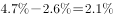；铁合金：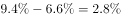；焦炭为。显然焦炭增长最快，只有D项符合。

故正确答案为D。

---

### 第 12 题　qid 2377414 · 平均数

2018年2月平均每吨1.0mm冷轧板卷价格比20mm中板：

- **A**. 高504元
- **B**. 高512元
- **C**. 高644元　✅
- **D**. 低662元

**答案**：C

**官方解析**

根据题干“2018年2月平均每吨1.0mm冷轧板卷价格比20mm中板”，而材料为2018年3月对应数据，因此判定本题为基期计算问题。定位文字材料第三段，可知2018年3月份，1.0mm冷轧板卷平均价格为4741元/吨，比上月下跌66元/吨，则2月份的平均价格=4741+66=4807元/吨；20mm中板平均价格为4233元/吨，比上月上涨70元/吨，则2月份的平均价格=4233-70=4163元/吨。前者平均每吨的价格比后者高4807-4163=644元。
故正确答案为C。

---

### 第 13 题　qid 2377415 · 增长

2018年1季度全国铜产量同比增量是同期锌产量同比增量的：

- **A**. 不到2倍
- **B**. 2～4倍之间
- **C**. 4～6倍之间
- **D**. 6倍以上　✅

**答案**：D

**官方解析**

由题干“2018年1季度全国铜产量同比增量是……同比增量的多少倍”可判定本题为增长量计算问题。定位材料第四段可知：铜产量221万吨，增长，锌产量142万吨，增长。则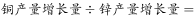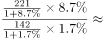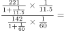。

故正确答案为D。

---

### 第 14 题　qid 2377408 · 综合

某企业2017年3月和2018年2月以上海期货交易所当月均价分别购买价值1280万元的电解铝，则该企业第二次购买的量比第一次：

- **A**. 
少不到

- **B**. 
少以上
　✅
- **C**. 
多不到

- **D**. 
多以上

**答案**：B

**官方解析**

由题干“某企业2017年3月和2018年2月……第二次购买的量比第一次”结合选项是多/少+，可判定本题为一般增长率问题。定位材料第五段，可知2018年3月份电解铝平均价格为14103，比上月下跌，同比增长。根据公式，可知2017年3月份电解铝平均价格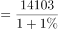，2018年2月份电解铝平均价格 。根据公式，可知第二次购买量比第一次增长了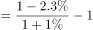。 

故正确答案为B。

---

### 第 15 题　qid 2377411 · 综合

能够从上述资料中推出的是：

- **A**. 
2018年1季度，钢材产量超过了粗钢、焦炭产量之和

- **B**. 
2017年1季度，钢材进出口总量突破了2000万吨
　✅
- **C**. 
2018年3月，钢材中6.5mm高线价格同比降低约

- **D**. 
2018年1季度，铜、铅、锌产量占十种有色金属产量比重均高于上年水平

**答案**：B

**官方解析**

A项：定位材料第一段，2018年1季度，钢材产量24693万吨，粗钢产量21215万吨，焦炭产量10285万吨，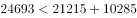，即钢材产量低于粗钢和焦炭之和，错误；

B项：定位材料第二段，2018年1季度，钢材出口1515万吨，同比下降，进口345万吨，下降，则2017年1季度，钢材进出口总量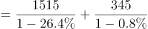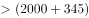万吨，即超过2000万吨，正确；

C项：定位材料第三段，2018年3月，6.5mm高线平均价格为3963元/吨，比上月下跌121元/吨，无同比相关数据，无法推出同比情况，错误；

D项：两期比重问题，只需比较部分增长率和总体增长率的大小即可。定位文字材料第四段，2018年1季度，铜、铅、锌产量同比增速分别为、、，十种有色金属产量增长率为，由， ，则铜、铅占比均高于上年；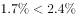，则锌占比低于上年，则非均高于上年，错误；

故正确答案为B。

---

## 材料 4

根据以下资料，回答下列问题

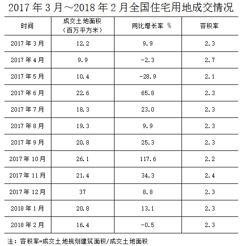

### 第 16 题　qid 2377284 · 综合

2017年第二季度成交土地规划建筑面积：

- **A**. 不到0.8亿平方米
- **B**. 在0.8~1.2亿平方米之间　✅
- **C**. 在1.2~1.6亿平方米之间
- **D**. 超过1.6亿平方米

**答案**：B

**官方解析**

根据题干所求“2017年第二季度成交土地规划建筑面积”，并根据容积率公式，可判定本题为现期比重问题。定位表格材料可得2017年第二季度（4-6月）成交土地面积和容积率，根据容积率=成交土地规划建筑面积/成交土地面积，则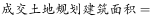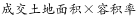。故2017年第二季度成交土地规划建筑面积=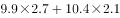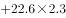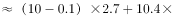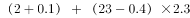，在0.8~1.2亿平方米区间内。

 故正确答案为B。

---

### 第 17 题　qid 2377286 · 综合

2017年第一季度成交土地面积：

- **A**. 不到0.3 亿平方米
- **B**. 在0.3～0.4亿平方米之间
- **C**. 在0.4～0.5亿平方米之间　✅
- **D**. 超过0.5亿平方米

**答案**：C

**官方解析**

根据题干所求“2017年第一季度成交土地面积”，并结合材料时间为2017年3月~2018年2月，可判定此题为基期和差问题。定位表格材料可得2017年3月成交土地面积为12.2百万平方米，2018年1月成交土地面积为20.8百万平方米、增长率为；2018年2月成交土地面积为16.4百万平方米、增长率为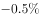。则2017年第一季度（1、2、3月）成交土地面积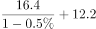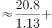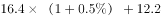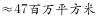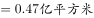，在0.4~0.5亿平方米区间内。

 故正确答案为C。

---

### 第 18 题　qid 2377287 · 综合

2017年3～6月间，全国住宅销售价格最贵的月份是：

- **A**. 3月
- **B**. 4月
- **C**. 5月　✅
- **D**. 6月

**答案**：C

**官方解析**

根据题干所求“2017年3～6月间，全国住宅销售价格最贵的月份”，并根据溢价率公式，可判定本题为现期比重问题。定位柱状图可得2017年3~6月楼面价和溢价率，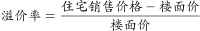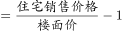，则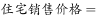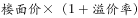。故2017年3~6月全国住宅销售价格分别为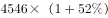、、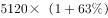和，5月份楼面价和溢价率均是这4个月中最大，则2017年3～6月间，全国住宅销售价格最贵的月份是5月份。

故正确答案为C。

---

### 第 19 题　qid 2377290 · 增长

下列折线图中，能准确反映2017年第四季度各月全国住宅用地楼面价环比增长率变化趋势的是：

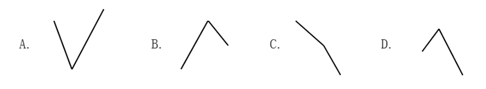

- **A**. A
- **B**. B　✅
- **C**. C
- **D**. D

**答案**：B

**官方解析**

根据题干“能准确反映2017年第四季度······环比增长率变化趋势”，判定本题为一般增长率问题。定位统计图可得：2017年9月、10月、11月、12月的全国住宅用地楼面价分别为6540元/平方米、4706元/平方米、5229元/平方米、4660元/平方米，根据，可得2017年第四季度即10月、11月、12月的环比增速分别为：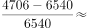、、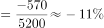，根据计算结果可判定B项趋势图符合。

故正确答案为B。

---

### 第 20 题　qid 2377291 · 综合

能够从上述资料中推出的是：

- **A**. 2017年12月，全国住宅销售价格高于10月水平
- **B**. 2017年下半年，全国住宅用地成交土地面积环比下降的月份有且仅有2个　✅
- **C**. 2017年下半年，全国住宅用地成交土地面积最高和容积率最高的月份是同一个
- **D**. 2017年下半年，全国住宅用地楼面价超过5000元/平方米的月份有且仅有3个

**答案**：B

**官方解析**

A项：，可得，定位统计图可得，2017年12月全国住宅销售价格为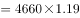，2017年10月全国住宅销售价格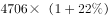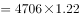，则全国住宅销售价格，错误；

B项：定位统计表可知，2017年下半年即7-12月，全国住宅用地成交土地面积（百万平方米）有：、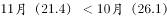，故环比下降的月份有且仅有7月和11月2个，正确；

C项：定位统计表可知，2017年下半年全国住宅用地成交土地面积最高的月份为12月，容积率最高的月份是11月，并非同一个，错误；

D项：定位统计图可知，2017年下半年即7-12月，其中全国住宅用地楼面价超过5000元/平方米的有：7月、8月、9月、11月，即有4个，错误。

故正确答案为B。

---
