# 2019年420联考《行测》题（黑龙江县乡卷）（网友回忆版）

> 资料分析 · 20 题 · 黑龙江 2019

## 材料 1

根据以下资料，回答下列问题。

        2014年我国实施“单独两孩”生育政策，出生人口1687万人，比上年增加47万人。2016 年实施“全面两孩”生育政策，出生人口1786万人，比上年增加131万人；出生率与“十二五”时期年平均出生率相比，提高了0.84个千分点。2017 年我国出生人口1723万人，虽然比上年减少63万人，但比“十二五”时期年平均出生人口多出79万人；出生率为，比上一年降低0.52个千分点。2017年二孩数量进一步上升至883万人，二孩占全部出生人口的比重达到，比2016年的占比提高了11个百分点。

        2017年出生人口最多的省份是山东，出生人口174.98万人，但是比2016年减少2.08万人。广东和河南出生人口也超过百万，其中广东出生人口151.63万人，同比增加22.18万人；河南出生人口140.13 万人，较上年减少2.48万人。此外，出生人口排名前十的省份依次还有河北、四川、湖南、安徽、广西、江苏、湖北。其中，河北、四川、湖南出生人口超90万人，湖北最少，为74.26万人。

        从人口增量来看，2017年广东出生人口增量最大，出生人口较2016年增加22.18万人。安徽、四川、河北出生人口增量超过5万，此外，江苏、湖南、山东、河南出生人口较2016年有所减少。其中，河南减少最多，出生人口减少2.48万人。

### 第 1 题　qid 2376539 · 增长

2015年我国出生人口同比：

- **A**. 
增长

- **B**. 
降低

- **C**. 
增长

- **D**. 
降低
　✅

**答案**：D

**官方解析**

根据题干“2015年……同比”，结合选项为，可判定本题为一般增长率问题。定位文字资料第一段“2014年……我国出生人口1687万人，2016年……我国出生人口1786万人，比上年增加131万人”，可知2015年我国人口为万人。代入公式：，即2015年我国出生人口同比降低。

故正确答案为D。

---

### 第 2 题　qid 2376538 · 平均数

“十二五”时期我国年平均出生率为：

- **A**. 

- **B**. 

　✅
- **C**. 

- **D**. 

**答案**：B

**官方解析**

定位文字资料第一段“2016年······出生率与‘十二五’时期年平均出生率相比，提高了0.84个千分点；2017年······出生率为，比上一年降低0.52个千分点”，可知“十二五”期间年平均出生率为。

故正确答案为B。

---

### 第 3 题　qid 2376541 · 综合

2016年我国二孩出生人口约为：

- **A**. 883万人
- **B**. 742万人
- **C**. 718万人　✅
- **D**. 693万人

**答案**：C

**官方解析**

根据题干“2016年我国二孩出生人口约为”，结合材料时间为2017年，且已知二孩出生人口占全部出生人口的比重，可判定题为基期比重问题。定位文字材料第一段“2016年实施‘全面两孩’生育政策，出生人口1786万人······2017年······二孩占全部出生人口的比重达到，比2016年的占比提高了11个百分点”，故2016年二孩占全部出生人口的比重为，则2016年我国二孩出生人口为万人，C项最接近。

故正确答案为C。

---

### 第 4 题　qid 2376758 · 比重

2016年山东、广东和河南三省出生人口之和占当年全国出生人口的比重约为：

- **A**. 

- **B**. 

　✅
- **C**. 

- **D**. 

**答案**：B

**官方解析**

根据问题“2016年······占······的比重约为······”，且材料时间为2017年，可判定此题为基期比重问题。定位文字材料第一段可得“2016年······出生人口1786万人”；定位第二段可得“2017年出生人口最多的省份是山东，出生人口174.98万人，但是比2016年减少2.08万人······广东出生人口151.63万人，同比增加22.18万人；河南出生人口140.13万人，较上年减少2.48万人”则2016年山东省出生人口为万人，广东省出生人口为万人，河南省出生人口为万人。则2016年，三省出生人口之和占当年全国出生人口的比重为。

故正确答案为B。

---

### 第 5 题　qid 2376546 · 综合

能够从上述资料中推出的是：

- **A**. 
2016、2017两年山东出生人口数量均超过当年全国出生人口数量的

- **B**. 
2016年广东出生人口数量超过2017年湖北出生人口数量的2倍

- **C**. 
2017年出生人口增量超过5万的省份只有3个

- **D**. 
2017年出生人口比2013年增长超过
　✅

**答案**：D

**官方解析**

A项：定位文字材料第一段“2016年实施‘全面两孩’生育政策，出生人口1786万人······2017年我国出生人口1723万人”，定位文字材料第二段“2017年出生人口最多的省份是山东，出生人口174.98万人，但是比2016年减少2.08万人”。 2017年：；2016年：，则2016年山东出生人口数量没有超过当年全国出生人口数量的，错误；

B项：定位文字材料第二段“2017年出生人口······其中广东出生人口151.63万人，同比增加22.18万人······湖北最少，为74.26万人”，，错误；

C项：定位文字材料第三段“2017年广东出生人口增量最大，出生人口较2016年增加22.18万人。安徽、四川、河北出生人口增量超过5万”，可得2017年出生人口增量超过5万的省份至少有4个，错误；

D项：定位文字材料第一段可知：2014年出生人口1687万人，比上年增加47万人。2017年出生人口1723万人。可得2013年出生人口为万人，代入增长率公式：，故2017年出生人口比2013年增长了，正确。

故正确答案为D。

---

## 材料 2

根据所给资料，回答下列问题。

        2018年4月全国手机产量达14366.7万部，同比增长；2018年1～4月全国手机累计产量为56479.3万部，累计增长。

### 第 6 题　qid 2377296 · 综合

2018年4月，手机产量最高的3个省市手机产量约占全国总产量的：

- **A**. 五成
- **B**. 六成
- **C**. 七成　✅
- **D**. 八成

**答案**：C

**官方解析**

根据题干“2018年4月······占······”结合材料相应时间的数据，可以判定本题为现期比重问题。定位文字材料“2018年4月全国手机产量达14366.7万部”，定位表格材料可得手机产量最高的3个省分别为广东7093.52万部，河南1688.16万部，重庆1313.21万部。占比为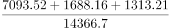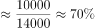，约为七成。

故正确答案为C。

---

### 第 7 题　qid 2377297 · 平均数

2018年4月手机产量前12位的省市中，4月手机产量高于1~3月平均水平的有几个？

- **A**. 5
- **B**. 6　✅
- **C**. 7
- **D**. 8

**答案**：B

**官方解析**

根据题干“2018年4月······4月手机产量高于1-3月平均水平”，表格材料给出2018年4月和1-4月对应数据，可以判定此题为现期平均数问题。，即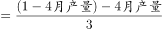，不等式化简可得，，结合表格数据，广东：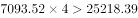，浙江：，江西：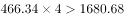，上海：，四川：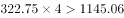，贵州：，共6个省份满足条件。

故正确答案为B。

---

### 第 8 题　qid 2377298 · 综合

如将2018年4月手机产量前12位的省市按2018年1~4月产量重新排列，有几个省市的位次将不会发生变化？

- **A**. 5
- **B**. 6　✅
- **C**. 7
- **D**. 8

**答案**：B

**官方解析**

根据题干“······按2018年1-4月产量重新排列，有几个省市的位次将不会发生变化”可知本题是将12个省份按1-4月产量进行排序和之前按4月产量的排序进行比较，因此本题为直接找数比较问题。将12个省份按1-4月产量重新排列从大到小为：广东、河南、重庆、北京、江苏、江西、上海、浙江、天津、湖北、四川、贵州。位次没有发生变化的有：广东、河南、重庆、北京、江西、上海这6个省份。
故正确答案为B。

---

### 第 9 题　qid 2377299 · 增长

2018年4月四个直辖市的手机产量之和同比：

- **A**. 上升了不到1000万部
- **B**. 上升了1000万部以上
- **C**. 下降了不到1000万部
- **D**. 下降了1000万部以上　✅

**答案**：D

**官方解析**

根据题干“2018年4月······同比”，结合选项“上升/下降”带单位，可判定本题为增长量计算问题。定位表格材料可得：2018年4月重庆、北京、上海、天津四个直辖市的手机产量和同比增速。根据公式：，2018年4月四个直辖市的手机产量同比增长量如下，重庆：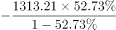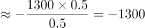万部；北京：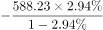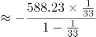万部；上海：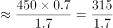万部；天津：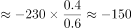万部。故2018年4月四个直辖市的手机产量之和同比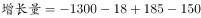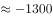万部，即同比下降了1000万部以上。

故正确答案为D。

---

### 第 10 题　qid 2377300 · 增长

关于2018年4月手机产量前12位的省市手机产量，以下信息能够从上述资料中推出的有几条？
①2018年1~4月，有3个省市手机产量分别占全国的一成以上
②2018年1季度，广东手机产量高于上年同期水平
③2018年4月和2018年1~4月手机产量增速最高的省市不是同一个
④江西2018年4月手机产量占同年1~4月产量的比重高于2017年水平

- **A**. 1　✅
- **B**. 2
- **C**. 3
- **D**. 4

**答案**：A

**官方解析**

①：定位文字材料，2018年1~4月全国手机累计产量为56479.3万部。占全国的一成以上即超过万部，定位表格材料可知，广东、河南、重庆三个省市符合条件，正确；

②：定位表格材料，可知2018年4月及1~4月广东手机产量和同比增速，可知万部。根据公式：，，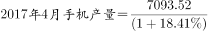万部。故万部＞18100万部，即2018年一季度广东手机产量低于上年同期水平，并非高于，错误；

③：定位表格材料，2018年4月及1~4月手机产量增速最高的均为四川，是同一个，错误；

④：定位表格材料，可知2018年4月江西手机产量同比增速为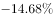，1~4月同比增速为。根据两期比重差结论，部分量增长率小于总量增长率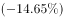时，今年比重下降，则江西2018年4月手机产量占1~4月的比重低于2017年水平，并非高于，错误。

综上，只有①一个说法正确。

故正确答案为A。

---

## 材料 3

根据以下资料，回答下列问题。

        2016年全年全国互联网保险收入为2299亿元，同比增加，占全国总保费收入的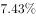，较2016年上半年占比减少。其中互联网财产险收入为502亿元，同比减少，占全国财产险保费收入的，较2016年上半年占比减少；互联网人身险收入为1797亿元，同比增加，占全国人身险保费收入的，较2016年上半年占比增加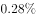。

        2017年上半年全国互联网保险收入为1346亿元，同比减少，占全国总保费收入的。其中互联网财产险收入为238亿元，同比减少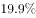，占全国财产险保费收入的；互联网人身险收入为1108亿元，同比减少，占全国人身险保费收入的。

### 第 11 题　qid 2377292 · 综合

2016年全年全国总保费收入在以下哪个范围内？

- **A**. 不到2万亿元
- **B**. 2～4万亿元之间　✅
- **C**. 4～6万亿元之间
- **D**. 6万亿元以上

**答案**：B

**官方解析**

根据题干“2016年全年全国总保费收入……”，结合材料给出2016年全年全国互联网保险收入及其占全国总保费收入的比重，可判定本题为现期比重问题。定位文字材料第一段“2016年全年全国互联网保险收入为2299亿元，……，占全国总保费收入的”，则2016年全年全国总保费，在2~4万亿元之间。

故正确答案为B。

---

### 第 12 题　qid 2377294 · 综合

2016年下半年全国互联网财产险收入约为多少亿元？

- **A**. 145
- **B**. 205　✅
- **C**. 264
- **D**. 304

**答案**：B

**官方解析**

根据题干“2016年下半年……亿元”，结合材料给出2016年全年和2017年上半年数据，可判定本题为基期计算问题。定位文字材料第一段可知：2016年全年互联网财产险收入为502亿元；定位文字材料第二段可知：2017年上半年互联网财产险收入为238亿元，同比减少。代入公式基期量，可得：2016年上半年互联网财产险收入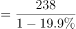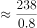亿元，则2016年下半年互联网财产险收入约为亿元，与B项最为接近。

故正确答案为B。

---

### 第 13 题　qid 2377295 · 增长

2017年上半年互联网人身险收入占全国人身险保费收入的比重同比约下降了：

- **A**. 1.50个百分点　✅
- **B**. 1.78个百分点
- **C**. 2.06个百分点
- **D**. 2.30个百分点

**答案**：A

**官方解析**

定位文字材料第一段可知：2016年全年互联网人身险收入占全国人身险保费收入的，较2016年上半年占比增加；则2016年上半年互联网人身险收入占全国人身保险费收入的占比为；定位文字材料第二段可知：2017年上半年互联网人身险收入占全国人身险保费收入的。则题干所求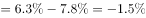，即2017年上半年互联网人身险收入占全国人身险保费收入的比重同比约下降了1.5个百分点。

故正确答案为A。

---

### 第 14 题　qid 2377302 · 比重

以下饼图中，最能准确反映2015年财产险（黑色）和人身险（白色）在互联网保险收入中占比状况的是：

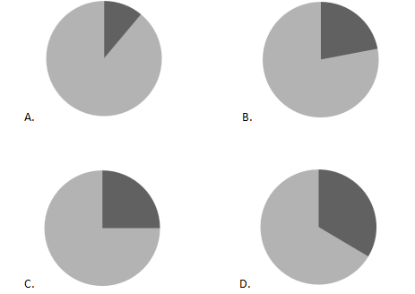

- **A**. A
- **B**. B
- **C**. C
- **D**. D　✅

**答案**：D

**官方解析**

根据题干“2015年财产险（黑色）和人身险（白色）在互联网保险收入中占比状况”，结合材料时间2016年，可判定本题为基期比重问题。定位文字材料第一段“2016年全年全国互联网保险收入为2299亿元，同比增加，······其中互联网财产收入为502亿元，同比减少，······互联网人身险收入为1797亿元，同比增加”，根据基期比重公式：，可得2015年财产险在互联网保险收入中占比为，和D项最为接近。

故正确答案为D。

---

### 第 15 题　qid 2377405 · 综合

能够从上述资料中推出的是：

- **A**. 2016年全国总保费收入低于2015年水平
- **B**. 2016年全国财产险保费收入超过人身险保费收入的一半
- **C**. 2015年全国互联网财产险收入超过700亿元　✅
- **D**. 2017年上半年互联网财产险收入在同期互联网保险收入中的占比高于两成

**答案**：C

**官方解析**

A项：定位文字材料第一段“2016年全年全国互联网保险收入为2299亿元，同比增加，占全国总保费收入的，较2016年上半年占比减少”，没有2015年全国总保费相关的数据，故无法推出，错误；

B项：定位文字材料第一段可知：2016年全年互联网财产险收入为502亿元，占全国财产险保费收入的，互联网人身险收入为1797亿元，同比增加，占全国人身险保费收入。则2016年全国财产险保费收入为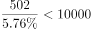亿元，2016年全国人身险保费收入为亿元，故财产险保费收入小于人身险保费收入的一半，错误；

C项：定位文字材料第一段“2016年全年······互联网财产险收入为502亿元，同比减少”，根据基期公式：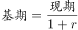，可得2015年全国互联网财产险收入为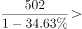亿元，正确；

 D项：定位文字材料第二段“2017年上半年全国互联网保险收入为1346亿元，······互联网财产险收入为238亿元”，故2017年上半年互联网财产险收入在同期互联网保险收入中占比为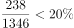，错误。

故正确答案选C。

---

## 材料 4

根据以下资料，回答下列问题。

        2017年全国举办马拉松赛事达1102场，其中，中国田径协会举办的A类赛事223场，B类赛事33场。2017年马拉松赛事的参与人次达到了498万人次，2016年、2015年马拉松赛事的参与人次分别为280万人次、150万人次。 

        2017年全年马拉松直接从业人口数72万，间接从业人口数200万。年度产业总规模达700亿元，比去年同期增长约，中国田径协会设置的发展目标是到2020年，全国马拉松规模赛事超过1900场，其中中国田径协会认证赛事达到350场，各类赛事参赛人数超过1000万人次，马拉松运动产业规模达到1200亿元。

        规模赛事数量方面，2017年排名前三的省份为浙江省、江苏省和广东省，分别为152场、149场和103场，而2016年的前三名分别为江苏省37场，北京市33场，广东省25场。

        从2017年全年赛事的覆盖区域来看，马拉松赛事地域分布更为广泛，中国境内马拉松及相关赛事已经涵盖了含西藏在内的全国31个省、区、市的234个城市，较上年增加了101个城市。

        在赛事类型方面，2017年1102场规模赛事中，全程马拉松参赛人次最高，突破了235万人次，其次为半程马拉松赛事，参赛人次超过134万人次。在中国田径协会认证的A类、B类赛事中，2017年全程马拉松项目完赛26.89万人次，同比增长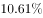；半程马拉松项目完赛45.29万人次，同比减少了0.03万人次。

        按照跑者户籍所在地统计，2017年参加中国田径协会认证赛事的跑者中，来自江苏的数量最多，共有76469人参赛，在全国占比。湖北、广东、山东、福建、浙江等省紧随其后。而在全部参赛选手中，共有3663人次的男选手在全程项目中跑进3小时，772人次女选手跑进3小时20分。

### 第 16 题　qid 2376574 · 比重

2017年中国田径协会举办的A类与B类赛事占全国马拉松赛事的比例约为：

- **A**. 

- **B**. 

　✅
- **C**. 

- **D**. 

**答案**：B

**官方解析**

根据题干“2017年，···占···的比例约为”，结合材料中给了2017年的数据，可判定本题为现期比重问题。定位文字材料第一段可得：2017年全国举办马拉松赛事达1102场，其中，中国田径协会举办的A类赛事223场，B类赛事33场。根据比重，可得2017年的比重为。与B项最接近。

故正确答案为B。

---

### 第 17 题　qid 2376600 · 增长

2017年我国马拉松赛事场次比2011年增加了：

- **A**. 约47倍
- **B**. 约49倍　✅
- **C**. 约51倍
- **D**. 约53倍

**答案**：B

**官方解析**

根据题干“2017年···比2011年增加了”，结合选项，可判定本题为一般增长率问题。定位图1可得：2017年、2011年我国马拉松赛场次分别为1102场、22场。根据增长率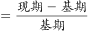，可得2017年的增长率为倍。

故正确答案为B。

---

### 第 18 题　qid 2376755 · 平均数

在2017年马拉松运动年度产业总规模的基础上，从2018年开始，每年需要平均增长多少才能实现中国田径协会设置的2020年马拉松运动产业规模目标？

- **A**. 

- **B**. 

- **C**. 

　✅
- **D**. 

**答案**：C

**官方解析**

根据问题“从2018年开始，每年需要平均增长······才能实现······”结合选项为百分数，可判定本题为年均增长率问题。定位材料第二段“2017年······年度产业总规模达到700亿元······到2020年······产业规模达到1200亿元”。代入公式 ，，以2017年为基期的基础上，实现2020年的目标，所以年份差为3。。优先代入居中且好算（例如整十的数）的选项，即C选项，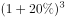，和1.71接近。

故正确答案为C。

---

### 第 19 题　qid 2376602 · 综合

在中国田径协会认证的A类、B类赛事中，2016年全程马拉松项目完赛人次比同期半程马拉松项目完赛人次：

- **A**. 多23万
- **B**. 少23万
- **C**. 多21万
- **D**. 少21万　✅

**答案**：D

**官方解析**

根据题干“······2016年全程马拉松项目完赛人次比同期半程马拉松项目完赛人次”，并结合选项为“”，且材料数据为2017年，可判定本题为基期和差问题。定位文字材料第五段可得：“在中国田径协会认证的A类、B类赛事中，2017年全程马拉松项目完赛26.89万人次，同比增长；半程马拉松项目完赛人次45.29万人次，同比减少了0.03万人次”，代入基期量公式：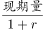，则2016年全程马拉松项目完赛人次为：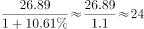万人次，2016年半程马拉松项目完赛人次为：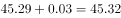万人次，故2016年全程马拉松项目完赛人次与同期半程马拉松项目完赛人次差为：，即少21万人次。

故正确答案为D。

---

### 第 20 题　qid 2376605 · 综合

能够从上述资料中推出的是：

- **A**. 
2017年马拉松运动年度产业规模比2016年多200亿元

- **B**. 
2017年参加中国田径协会认证赛事的全国跑者数量少于75万人

- **C**. 
2011年至2016年我国马拉松赛事场次之和超过2017年赛事场次的
　✅
- **D**. 
在2016年与2017年马拉松规模赛事数量上，江苏省、北京市都有进入前三名

**答案**：C

**官方解析**

A项：定位文字材料第二段可得：“2017年全年马拉松······年度产业总规模达700亿元，比去年同期增长约。” 故2017年马拉松运动年度产业规模比2016年多：亿元，错误；

B项：定位文字材料第六段可得：“2017年参加中国田径协会认证赛事的跑者中，来自江苏的数量最多，共有76469人，在全国占比”，故2017年参加中国田径协会认证赛事的全国跑者数量为万，错误；

C项：定位图形材料可得：“2011年至2017年我国马拉松赛事场次分别为22、33、39、51、134、328、1102”，故2011年至2016年我国马拉松赛事场次之和：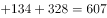，2017年赛事场次的为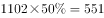，前者大于后者，正确；

D项：定位文字材料第三段可得：“规模赛事数量方面，2017年排名前三的省份为浙江省、江苏省和广东省······而2016年的前三名分别为江苏省、北京市、广东省”，故在2016年和2017年马拉松规模赛事数量上，北京市没有都进入前三名，错误。

故正确答案为C。

---
