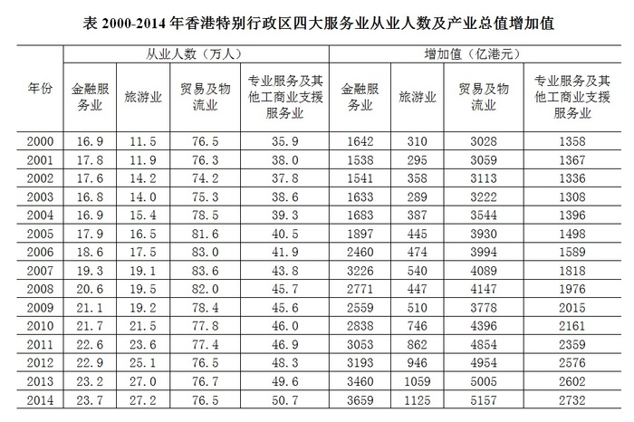
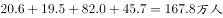
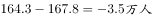
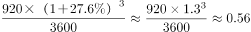

# 2019年上海市公务员录用考试《行测》题（B类）（网友回忆版）

> 资料分析 · 2 题 · 上海 2019

## 材料 1

### 第 1 题　qid 2295367 · 综合

与2008年相比，2009年香港特别行政区四大服务业从业人数      。

- **A**. 增加了0.5万人
- **B**. 增加了3.5万人
- **C**. 减少了0.5万人
- **D**. 减少了3.5万人　✅

**答案**：D

**官方解析**

根据题干“与2008年相比，2009年······”，结合选项“增加······万人”、“减少······万人”，可知本题为增长量计算问题。定位表格可知，2008年香港特别行政区四大服务业从业人数为，2009年香港特别行政区四大服务业从业人数为。，即2009年比2008年减少了3.5万人。

故正确答案为D。

---

## 材料 2

        2017年1月17日国家能源局公布《能源发展“十三五”规划》《天然气“十三五”规划》，首次明确“发挥市场配置资源的决定性作用”，到2020年天然气综合保供能力应达到3600亿立方米以上，天然气消费占一次能源消费比例达到-。

        2017年，我国天然气消费总量2373亿立方米，同比增长；全年天然气进口量920亿立方米，同比增长。

### 第 2 题　qid 2295393 · 增长

假设2020年全国天然气消费总量达到3600亿立方米，且2017-2020年天然气进口量同比增速相同，则2020年天然气进口量将达到消费总量的      。

- **A**. 不到两成
- **B**. 三成多
- **C**. 五成多　✅
- **D**. 八成以上

**答案**：C

**官方解析**

由题干“······2020年天然气进口量将达到消费总量的多少成”可判断本题为现期比重问题。定位文字材料第二段“2017年···全年天然气进口量920亿立方米，同比增长”，且2017-2020年天然气进口量同比增速相同，根据可得，则，故2020年天然气进口量将达到消费总量的比重为，为五成多。

故正确答案为C。

---
