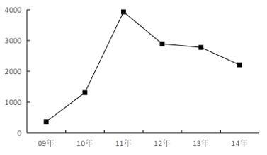
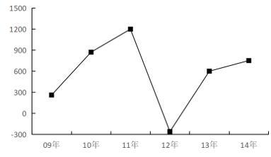
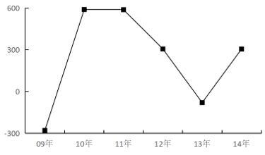

# 2019年上海市行政执法类考试《行测》试题（网友回忆版）

> 资料分析 · 4 题 · 上海 2019

## 材料 1

### 第 1 题　qid 5665989 · 增长

2009-2014年间，国内增值税同比增量超过2000亿元的年份有        个。

- **A**. 2
- **B**. 3
- **C**. 4
- **D**. 5　✅

**答案**：D

**官方解析**

根据题干“2009-2014年间······同比增量超过2000亿元的年份······”，可判定本题为增长量计算问题。定位表格材料可得：2008-2014年，国内增值税分别为17997亿元、18481亿元、21093亿元、24267亿元、26416亿元、28810亿元、30850亿元。根据公式：增长量=现期量-基期量，则2009-2014年国内增值税同比增量分别为18481-17997=484亿元、21093-18481=2612亿元、24267-21093=3174亿元、26416-24267=2149亿元、28810-26416=2394亿元、30850-28810=2040亿元，超过2000亿元的为2010-2014年，共5个年份。
故正确答案为D。

---

### 第 2 题　qid 5665991 · 增长

2010年各项税收中，同比增速最快的项目是        。

- **A**. 营业税
- **B**. 国内消费税
- **C**. 关税　✅
- **D**. 个人所得税

**答案**：C

**官方解析**

根据题干“2010年······同比增速最快的项目是”，可判定本题为一般增长率问题。定位表格可得：2010年全国营业税、国内消费税、关税、个人所得税分别为11158亿元、6072亿元、2028亿元、4837亿元，2009年分别为9014亿元、4761亿元、1484亿元、3949亿元。根据公式：增长率=，则2010年营业税同比增速为；国内消费税同比增速为；关税同比增速为；个人所得税同比增速为。比较可知，2010年选项各项税收中同比增速最快的项目是关税。

故正确答案为C。

---

### 第 3 题　qid 5665993 · 增长

表中个人所得税同比下降的年份中，国内增值税增长了        。

- **A**. 1000多亿元
- **B**. 2000多亿元　✅
- **C**. 3000多亿元
- **D**. 4000多亿元

**答案**：B

**官方解析**

根据题干“······国内增值税增长了”，结合选项有具体单位，可判定本题为增长量计算问题。定位表格材料可得：表中个人所得税同比下降的年份为2012年，2012年国内增值税为26416亿元，2011年国内增值税为24267亿元。根据公式：增长量=现期量-基期量，则2012年国内增值税同比增量为26416-24267=2149亿元，在B项范围内。
故正确答案为B。

---

### 第 4 题　qid 12118354 · 增长

2009-2014年，企业所得税同比增量变化最符合以下        个折线图（图中纵轴单位为亿元）。

- **A**. 

　✅
- **B**. 

- **C**. 

- **D**. 
暂缺

**答案**：A

**官方解析**

根据题干“2009-2014年······同比增量变化最符合······”，可判定本题为增长量比较问题。定位统计表可得2008-2014年各年企业所得税。根据公式：增长量=现期量-基期量，可得2009-2014年企业所得税同比增量分别为：
2009年，11537-11176=361亿元；
2010年，12844-11537=1307亿元；
2011年，16770-12844=3926亿元；
2012年，19655-16770=2885亿元；
2013年，22427-19655=2772亿元；
2014年，24632-22427=2205亿元。
综上可知，2009-2014年企业所得税同比增量呈先上升后下降的趋势，且2009年同比增量最低，2011年同比增量最高，与A项变化趋势一致。
故正确答案为A。

---
