# 2019年北京市公务员录用考试《行测》题（网友回忆版）

> 资料分析 · 20 题 · 北京 2019

## 材料 1

<b>根据下列统计资料回答问题</b>

### 第 1 题　qid 2274520 · 综合

“十二五”（2011～2015年）期间，我国总共举办了约多少万场展览会？

- **A**. 3.2
- **B**. 3.9　✅
- **C**. 4.5
- **D**. 5.0

**答案**：B

**官方解析**

定位材料，可知2011年举办展览会6830场，2012年举办展览会7189场，2013年举办展览会7319场，2014年举办展览会8009场，2015年举办展览会9283场，故“十二五”（2011-2015年）期间，，约3.9万场。

故正确答案为B。

---

### 第 2 题　qid 2274521 · 平均数

2009～2015年间，有几个年份平均每个出境参展项目的参展净面积超过400平方米？

- **A**. 3
- **B**. 4
- **C**. 5　✅
- **D**. 6

**答案**：C

**官方解析**

由题干“2009-2015年间，有几个年份平均每个······”，结合材料已知时间为2009-2015年，可判定本题为现期平均数问题。定位材料，将单位“万平方米”化为“平方米”，可得：

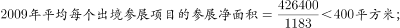

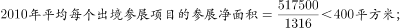

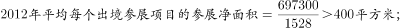

故正确答案为C。

---

### 第 3 题　qid 2274523 · 增长

2010～2015年间，我国展览会展出面积同比增速最快的一年，展览会展出面积较上年约增加了

- **A**. 

- **B**. 
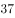

- **C**. 

- **D**. 

　✅

**答案**：D

**官方解析**

由题干“2010-2015年间，……展览会展出面积较上年约增加了”，结合材料已知时间为2009-2015，结合选项为百分数，可判定本题为一般增长率问题。定位材料可得：

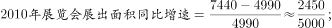

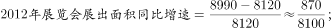

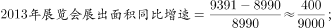

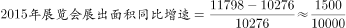，分子最大，分母最小，可得2010-2015年间，我国展览会展出面积同比增速最快的为2010年，故2010-2015年间，我国展览会展出面积同比增速最快的一年，，即为D选项。

实际上如果大家看出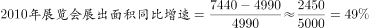，已经是四个选项中最大的D选项，后面几年的同比增速就不需要列出了。

故正确答案为D。

---

### 第 4 题　qid 2274526 · 增长

以下哪项的折线图可以准确表现2011～2014年间，我国会展业总产值同比增量的变化情况（单位：亿元）？

- **A**. A　✅
- **B**. B
- **C**. C
- **D**. D

**答案**：A

**官方解析**

由题干“……我国会展业总产值同比增量的变化情况”，可判定本题为增长量计算问题。定位材料可得，

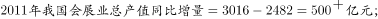

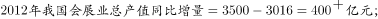

；

即2011-2014年间，我国会展业总产值同比增量逐年下降，只有A项的折线图可以准确表现。

故正确答案为A。

---

### 第 5 题　qid 2274528 · 综合

能够从上述资料中推出的是

- **A**. 
2010年我国出境参展企业数较上年增加了两成多

- **B**. 
2009～2015年间，我国出境参展企业和出境参展项目数量最多的年份相同

- **C**. 
2011年平均每场展览会展出面积比上年扩大了以上

- **D**. 
2013～2015年，我国平均每天举办的展览会数量超过20场
　✅

**答案**：D

**官方解析**

A项：定位材料可得，2010年我国出境参展企业数较上年增加了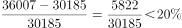，不到两成，错误；

B项：定位统计表可得，2009-2015年间，我国出境参展企业数量最多的年份为2014年，出境参展项目数量最多的年份为2012年，故2009-2015年间，我国出境参展企业和出境参展项目数量最多的年份不同，错误；

C项：定位统计表可得，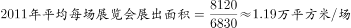，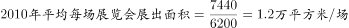，故2011年平均每场展览会展出面积比上年降低了，错误；

D项：定位材料可得，2013年举办展览会7319场，2014年举办展览会8009场，2015年举办展览会9283场，故2013-2015年，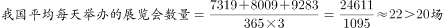，正确。

故正确答案为D。

---

## 材料 2

<b>根据下列统计资料回答问题</b>

        2016年全国餐饮收入35799亿元，同比增长，餐饮收入占社会消费品零售总额的比重为。2016年全社会餐饮业经营单位为365.5万个，同比下降；从业人数为1846.0万人，同比增长。

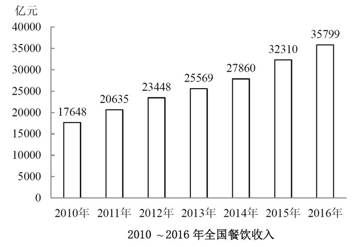

### 第 6 题　qid 2274533 · 综合

2016年社会消费品零售总额约为多少万亿元？

- **A**. 27
- **B**. 33　✅
- **C**. 39
- **D**. 45

**答案**：B

**官方解析**

由题干“2016年社会消费品零售总额约为多少万亿元”，结合材料给出2016年全国餐饮收入及其占社会消费品零售总额的比重，可判定本题为给定部分与比重求整体的现期比重问题。定位文字材料可得，2016年全国餐饮收入35799亿元，占社会消费品零售总额的比重为。，则，与B项最接近。

故正确答案为B。

---

### 第 7 题　qid 2274536 · 平均数

2016年全社会餐饮业平均每个经营单位的从业人数比上年约

- **A**. 
减少了

- **B**. 
减少了

- **C**. 
增加了

- **D**. 
增加了
　✅

**答案**：D

**官方解析**

由题干“2016年全社会餐饮业平均每个经营单位的从业人数比上年约”，结合选项为百分数，可判定本题为平均数的增长率计算问题。定位文字材料可得，2016年全社会餐饮业经营单位为365.5万个，同比下降（b）；从业人数为1846.0万人，同比增长（a）。代入平均数增长率计算公式可得，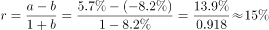，即增加了。

故正确答案为D。

---

### 第 8 题　qid 2274538 · 增长

2011～2016年间，全国餐饮收入同比增量超过3000亿元的年份有几个？

- **A**. 2　✅
- **B**. 3
- **C**. 4
- **D**. 5

**答案**：A

**官方解析**

定位柱状图可得各年份全国餐饮收入，代入计算即可。

2011年：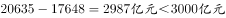；

2012年：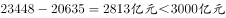；

2013年：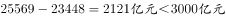；

2014年：；

2015年：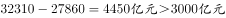；

2016年：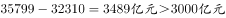。

同比增量超过3000亿元的年份有2015、2016年，共计两年。

故正确答案为A。

---

### 第 9 题　qid 2274541 · 平均数

2016年全国餐饮收入约相当于“十二五”（2011～2015年）期间年平均值的多少倍？

- **A**. 1.2
- **B**. 1.4　✅
- **C**. 1.6
- **D**. 1.8

**答案**：B

**官方解析**

由题干“2016年全国餐饮收入约相当于‘十二五’(2011～2015年)期间年平均值的多少倍”，可判定本题为现期倍数计算问题。定位柱状图可得， 2016年全国餐饮收入35799亿元，2011-2015年分别为20635、23448、25569、27860、32310亿元。“十二五”期间全国餐饮收入年平均值为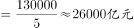，所求倍数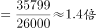。

故正确答案为B。

---

### 第 10 题　qid 2274545 · 综合

能够从上述资料中推出的是

- **A**. 
2016年平均每个餐饮业经营单位创造的餐饮收入超过100万元

- **B**. 
2016年餐饮业经营单位从业人员同比增长了200万人以上

- **C**. 
2016年全国餐饮收入比2010年翻了一番以上
　✅
- **D**. 
2013年全国餐饮收入同比增速超过

**答案**：C

**官方解析**

A项：定位文字材料可得，2016年全国餐饮收入35799亿元，全社会餐饮业经营单位为365.5万个，则，错误；

B项：定位文字材料可得，2016年全社会餐饮从业人数为1846.0万人，同比增长5.7%。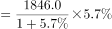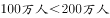，错误；

C项：定位柱状图可得，2016年全国餐饮收入为35799亿元，2010年为17648亿元。，可知2016年全国餐饮收入比2010年翻了一番以上，正确； 

D项：定位柱状图可得，2013年全国餐饮收入25569亿元，2012年为23448亿元，增长率，错误。

故正确答案为C。 

---

## 材料 3

<b>根据下列统计资料回答问题</b>

        2014年某区限额以上第三产业单位共674家，实际收入1059.1亿元，同比增长；实现利润总额13.5亿元，同比增长；从业人员达到58631人，同比下降。

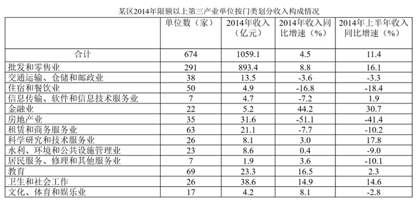

### 第 11 题　qid 2274478 · 平均数

2014年该区限额以上第三产业单位平均每名从业人员创造的利润比上年约

- **A**. 
下降了

- **B**. 
下降了

- **C**. 
上升了

- **D**. 
上升了
　✅

**答案**：D

**官方解析**

由题干“2014年······平均每名从业人员创造的利润比上年约”，结合选项下降了/上升了，判定本题为平均数的增长率问题。定位文字材料可知，2014年该区限额以上第三产业单位实现利润总额13.5亿元，同比增长(a)，从业人员达到58631人，同比下降(b)。根据，题目所求为：。

故正确答案为D。

---

### 第 12 题　qid 2274480 · 平均数

如2013年该区限额以上金融业单位数量与2014年一样，则该区2013年平均每家限额以上金融业单位实现收入约多少亿元？

- **A**. 0.16　✅
- **B**. 0.24
- **C**. 0.39
- **D**. 0.65

**答案**：A

**官方解析**

由题干“2013年平均每家限额以上金融业单位实现收入······”，结合材料所给时间为2014年，判定本题为基期平均数问题。定位表格材料，结合题干可知，2013年该区限额以上金融业单位数量也为22家，2014年实现收入5.2亿元，同比增速。根据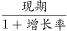，题目所求为：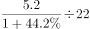亿元，与A项最接近。

故正确答案为A。

---

### 第 13 题　qid 2274483 · 综合

表中所列各类限额以上第三产业单位中，按单位数从多到少排列，排在前三位的三个门类单位数之和约占到该区限额以上第三产业单位总数的

- **A**. 

- **B**. 

- **C**. 

　✅
- **D**. 

**答案**：C

**官方解析**

由题干“······排在前三位······单位数之和约占到······总数的”，判定本题为现期比重问题。定位表格材料可知，按单位数从多到少排列，排在前三位的为：批发和零售业291个，教育69个，租赁和商务服务业63个，限额以上第三产业单位总数674个。根据，题目所求为：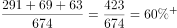。

故正确答案为C。

---

### 第 14 题　qid 2274485 · 增长

表中所列各类限额以上第三产业单位中，2014年收入与2013年收入相比呈正增长，且2014年下半年收入同比增速高于上半年的有几类？

- **A**. 5
- **B**. 6　✅
- **C**. 7
- **D**. 8

**答案**：B

**官方解析**

由题干“······2014年下半年收入同比增速高于上半年······”，结合表格材料已知全年及上半年增长率，判定本题为混合增长率问题。根据“混合增长率，大小居中”、“全年=上半年+下半年”及“2014年下半年收入同比增速高于上半年”，可得所求需满足，下半年增速＞全年增速＞上半年增速。根据“2014年收入与2013年收入相比呈正增长”，需找出2014年全年增长率为正的单位；定位表格材料可知，同时满足以上两条件的有：金融业（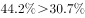），水利、环境和公共设施管理业（），居民服务、修理和其他服务业（），教育（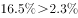），卫生和社会工作（），文化、体育和娱乐业（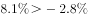），共计6个。

故正确答案为B。

---

### 第 15 题　qid 2274486 · 综合

关于2014年该区限额以上第三产业单位，能够从上述资料中推出的是

- **A**. 2014年该区限额以上第三产业单位整体利润率（利润/收入）较上年有所下降
- **B**. 平均每家住宿和餐饮业单位收入不到1000万元　✅
- **C**. 2014年收入降幅最大的门类平均每家单位收入超亿元
- **D**. 卫生和社会工作类平均每家单位的收入为各门类中最高

**答案**：B

**官方解析**

A项：定位文字材料可知，2014年该区限额以上第三产业单位实际收入1059.1亿元，同比增长；实现利润总额13.5亿元，同比增长；根据两期比重判定法则：利润增长率（）＞收入增长率（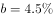），利润率较上年有所上升，错误；

B项：定位表格材料可知，住宿和餐饮业单位50家，收入4.9亿元，平均每家住宿和餐饮业单位收入=，正确；

C项：定位表格材料可知，2014年降幅最大的门类为房地产业，单位数为35家，收入31.6亿元，平均每家单位收入=亿元，错误。

D项：定位表格材料可知，卫生和社会工作类26家收入38.6亿元，平均每家单位的收入为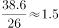亿元批发和零售业平均每家收入=亿元，错误。

故正确答案为B。

---

## 材料 4

<b>根据下列统计资料回答问题</b>

        2017年上半年，B市全市第三产业实现增加值10198.2亿元，按可比价计算，同比增长。

上半年，信息传输、软件和信息技术服务业实现增加值1319.5亿元，同比增长；累计完成电信业务量361.1亿元，同比增长；科学研究和技术服务业实现增加值1211.8亿元，同比增长，比一季度增幅扩大1.4个百分点。

        上半年，旅客周转量同比增长；货物周转量由上年的下降转为增长，其中铁路同比增长，民航同比增长。上半年，快递业务量累计达到9.9亿件，同比增长；交通运输、仓储和邮政业实现增加值554.2亿元，同比增长，增幅比上年同期扩大7.8个百分点。

        上半年，批发和零售业实现增加值1190.6亿元，同比增长，增幅比上年同期扩大7.1个百分点。第二季度，全市实现电子商务交易额8324.5亿元，同比增长。

        上半年，B市规模以上文化创意产业法人单位、战略性新兴产业法人单位、高技术服务业法人单位分别实现收入6902.7亿元、3870.0亿元和6924.9亿元，同比分别增长、和。

        上半年，服务业扩大开放六大重点领域的规模以上非公有制经济单位实现收入7864.6亿元，同比增长，快于六大重点领域整体增速8.0个百分点，占六大重点领域整体收入的比重为，比上年同期提高1.1个百分点。

### 第 16 题　qid 2274494 · 综合

2016年上半年，B市累计完成电信业务量约为多少亿元？

- **A**. 180
- **B**. 220
- **C**. 260　✅
- **D**. 300

**答案**：C

**官方解析**

由题干“2016年上半年······约为多少亿元”，结合材料时间为2017年上半年，判定本题为基期计算问题。定位文字材料第二段可得“2017年上半年，B市累计完成电信业务量361.1亿元，同比增长”。代入公式：，可得：2016年上半年，B市累计完成电信业务量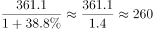亿元。

故正确答案为C。

---

### 第 17 题　qid 2274495 · 增长

2017年上半年，B市信息传输、软件和信息技术服务业实现增加值同比增速比第三产业实现增加值同比增速

- **A**. 低2.1个百分点
- **B**. 高2.1个百分点　✅
- **C**. 低31.6个百分点
- **D**. 高31.6个百分点

**答案**：B

**官方解析**

定位文字材料第二段可得“2017年上半年，信息传输、软件和信息技术服务业实现增加值同比增长”；定位材料第一段可得“2017年上半年，B市第三产业实现增加值同比增长”。则个百分点，即高2.1个百分点。

故正确答案为B。

---

### 第 18 题　qid 2274497 · 增长

2017年第二季度，B市科学研究和技术服务业实现增加值的同比增速的范围是

- **A**. 
小于

- **B**. 
等于

- **C**. 
大于且小于等于

- **D**. 
大于
　✅

**答案**：D

**官方解析**

由题干“2017年第二季度，B市······同比增速的范围是”，定位文字材料第二段可得“2017年上半年，科学研究和技术服务业实现增加值······同比增长，比一季度增幅扩大1.4个百分点”，即2017年一季度增速为。由于“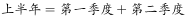”，故上半年增速为第一季度和第二季度增速的混合增速，判定本题为混合增长率问题。根据结论“混合增长率，大小居中”，可得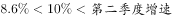。即2017年第二季度同比增速的范围是大于。

故正确答案为D。

---

### 第 19 题　qid 2274498 · 增长

2017年上半年，B市规模以上文化创意产业法人单位实现收入同比增量约是战略性新兴产业法人单位的多少倍？

- **A**. 0.7
- **B**. 1.3　✅
- **C**. 1.8
- **D**. 2.6

**答案**：B

**官方解析**

由题干“2017年上半年，······约是······的多少倍”，判定本题为现期倍数计算问题。定位文字材料第五段可得2017年上半年，B市规模以上文化创意产业法人单位实现收入6902.7亿元，同比增长；战略性新兴产业法人单位3870.0亿元，同比增长。代入公式：，可得：2017年上半年，B市规模以上文化创意产业法人单位实现收入同比增量是战略性新兴产业法人单位的倍，与B项最接近。

故正确答案为B。

---

### 第 20 题　qid 2274499 · 综合

关于B市第三产业情况，下列说法中正确的是：

- **A**. 2016年上半年批发和零售业实现增加值同比增量不到10亿元　✅
- **B**. 2017年上半年服务业扩大开放六大重点领域整体收入少于2万亿元
- **C**. 2016年第二季度，全市实现电子商务交易额高于8000亿元
- **D**. 2015年上半年该市货物周转量低于2016年上半年

**答案**：A

**官方解析**

A项：定位文字材料第四段“上半年，批发和零售业实现增加值1190.6亿元，同比增长，增幅比上年同期扩大7.1个百分点”,可知2016年上半年批发和零售业实现增加值=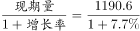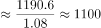亿元，2016年上半年批发和零售业实现增加值同比增长率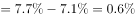；故所求2016年增长量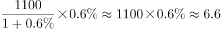亿元10亿元，正确；

B项：定位文字材料最后一段“上半年，服务业扩大开放六大重点领域的规模以上非公有制经济单位实现收入7864.6亿元······占六大重点领域整体收入的比重为”，代入公式，可得：2017年上半年服务业扩大开放六大重点领域整体收入，错误；

C项：根据文字材料第四段“第二季度，全市实现电子商务交易额8324.5亿元，同比增长”，代入公式，可得2016年第二季度全市实现电子商务交易额亿元8000亿元，错误；

D项：根据文字材料第三段“货物周转量由上年的下降转为增长”，可知2016年上半年货物周转量增长率，即负增长，故2015年上半年该市货物周转量高于2016年上半年，错误。

故正确答案为A。

---
