# 2019年四川省公务员录用考试《行测》题（下半年）（网友回忆版）

> 资料分析 · 15 题 · 四川 2019

## 材料 1

        2016年4月，保监会机关及各保监局共接收各类涉及保险消费者权益的有效投诉总量为2989件，同比上升，环比上升。其中，接收保险公司投诉2980件，其他非保险公司投诉9件。接收保险公司投诉中，涉及保险公司合同纠纷类投诉2721件；涉嫌保险公司违法违规类投诉259件。

        所接收的2980件保险公司投诉中，财产险公司的投诉为1510件。其中，投诉量位居前10的财产险公司的投诉总和占投诉所有公司投诉总量的。人身险公司的投诉为1470件。其中，投诉量位居前10的人身险公司的投诉量总和占所有公司投诉总量的。另外，人身险涉及保险合同纠纷的投诉有1281件，其中销售纠纷481件，理赔纠纷357件，保全纠纷237件。

### 第 1 题　qid 2444691 · 增长

2016年4月，保监会机关及各保监局接收各类涉及保险消费者权益的有效投诉总件数较上月增加的数量最接近以下哪个数字？

- **A**. 384
- **B**. 451
- **C**. 587　✅
- **D**. 756

**答案**：C

**官方解析**

根据题干“2016年4月···增加···数量”，可判定本题为增长量计算问题。定位文字材料第一段可知，2016年4月，保监会机关及各保监局共接收各类涉及保险消费者权益的有效投诉总量为2989件，环比上升。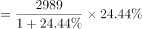。与C项最接近。

故正确答案为C。

---

### 第 2 题　qid 2444695 · 综合

2016年4月，涉及财产险公司违法违规类的投诉为多少件？

- **A**. 70　✅
- **B**. 119
- **C**. 189
- **D**. 259

**答案**：A

**官方解析**

定位文字材料第一段可知，接收保险公司投诉2980件，其中涉及保险公司合同纠纷类投诉2721件，涉嫌保险公司违法违规类投诉259件。即接收保险公司的投诉合同纠纷类违法违规类。

定位文字材料第二段可知，接收的2980件保险公司投诉又可分为财产险公司投诉（1510件）和人身险公司的投诉（1470件）。人身险公司的投诉中，合同纠纷的投诉有1281件，则人身险公司投诉中的违法违规类投诉为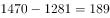件。则涉及财产险公司违法违规类的投诉为件。

列表梳理如下：

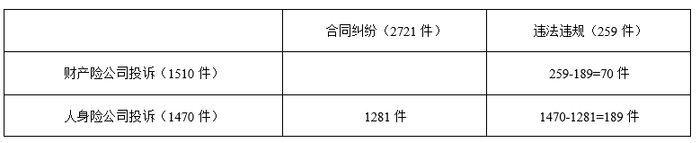

故正确答案为A。

---

### 第 3 题　qid 2444698 · 综合

2016年4月，针对投诉量位居前10的财产险公司的投诉共有多少件？

- **A**. 1188　✅
- **B**. 1255
- **C**. 1281
- **D**. 1510

**答案**：A

**官方解析**

题干所求为2016年4月对投诉量位居前10的财产险公司的投诉件数，且材料给了其占财产险公司投诉总量的比重，可判定本题为现期比重问题。定位文字材料第二段可知，2016年4月，财产险公司投诉为1510件。其中，投诉量位居前10的财产险公司的投诉总和占投诉所有公司投诉总量的。根据公式：，则所求件。只有A项满足。

故正确答案为A。

---

### 第 4 题　qid 2444704 · 综合

2016年4月，人身险涉及保险合同的理赔纠纷投诉量和保全纠纷投诉量之和约占当月保监会机关及各保监局接收所有有效投诉总量的：

- **A**. 一成
- **B**. 两成　✅
- **C**. 三成
- **D**. 四成

**答案**：B

**官方解析**

根据题干“2016年4月···占···”结合选项“···成”，判定本题为现期比重问题。定位文字材料第一段可知，2016年4月，保监会机关及各保监局共接收各类涉及保险消费者权益的有效投诉总量为2989件，定位文字材料第二段可知，人身险涉及保险合同的理赔纠纷投诉量和保全纠纷投诉量分别为357件和237件。代入公式：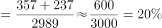，即约占两成。

故正确答案为B。

---

### 第 5 题　qid 2444706 · 综合

关于2016年4月保监会机关及各保监局接受的各类涉及保险消费者权益的有效投诉情况，能够从上述资料中推出的是：

- **A**. 投诉总量较上年同月增加1000件以上
- **B**. 针对财产险公司的投诉占总有效投诉的比重不到一半
- **C**. 涉及保险公司合同纠纷类投诉占总有效投诉的比重不到九成
- **D**. 人身险合同投诉中，销售纠纷投诉量超过保全纠纷投诉量的2倍　✅

**答案**：D

**官方解析**

A项：定位文字材料第一段可知，2016年4月，保监会机关及各保监局共接收各类涉及保险消费者权益的有效投诉总量为2989件，同比上升。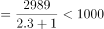件，并非为1000件以上，错误；

B项：定位文字材料第一段可知，2016年4月，保监会机关及各保监局共接收各类涉及保险消费者权益的有效投诉总量为2989件，定位文字材料第二段可知，财产险公司投诉为1510件。故后者占前者的比重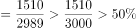，并非不到一半，错误；

C项：定位文字材料第一段可知，2016年4月，保监会机关及各保监局共接收各类涉及保险消费者权益的有效投诉总量为2989件，其中涉及保险公司合同纠纷类投诉2721件。故后者占前者的比重，即超过九成，错误；

D项：定位文字材料第二段可知，2016年4月，人身险合同投诉中，销售纠纷481件，保全纠纷237件。，即销售纠纷投诉量超过保全纠纷投诉量的2倍，正确。

故正确答案为D。

---

## 材料 2

        2016年末，全国23027万农户中，的农户拥有自己的住房。其中，拥有1处住房的20030万户，占；拥有2处住房的2677万户，占；拥有3处及以上住房的196万户，占；拥有商品房的1997万户，占。

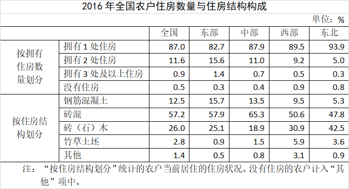

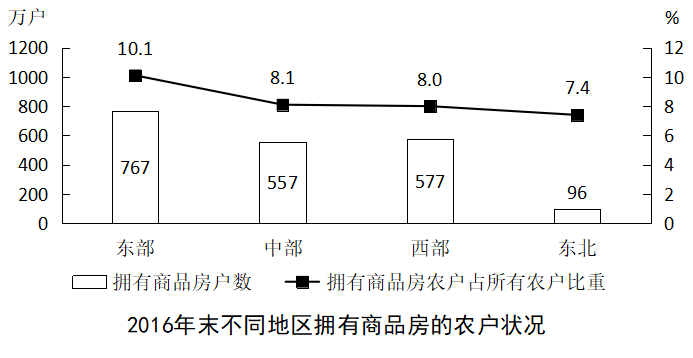 

### 第 6 题　qid 2444688 · 比重

将全国不同地区按照拥有2处及以上住房的农户占该地区农户总数比重从高到低的次序排列，以下正确的是：

- **A**. 东部、西部、中部、东北
- **B**. 东部、中部、西部、东北　✅
- **C**. 中部、东部、东北、西部
- **D**. 中部、东北、东部、西部

**答案**：B

**官方解析**

定位表格材料可知，拥有2处及以上住房的农户占该地区农户总数的比重为拥有2处住房和拥有3处及以上住房的比重之和，东部为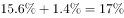；中部为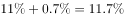；西部为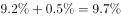；东北为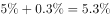。由上述数字可以推出，东部＞中部＞西部＞东北，B项符合。

故正确答案为B。

---

### 第 7 题　qid 2444694 · 综合

2016年末，全国约有多少亿户农户居住在钢筋混凝土和砖混结构房屋中？

- **A**. 1.6　✅
- **B**. 1.7
- **C**. 1.8
- **D**. 1.9

**答案**：A

**官方解析**

根据题干“2016年末···约有多少亿农户居住在钢筋混凝土和砖混结构房屋”，结合材料时间为2016年末，表格材料给的数据为比重可判定本题为现期比重问题。定位文字材料第一段，“2016年末，全国23027万农户”，结合表格材料数据农户居住钢筋混凝土的比重为，砖混为。根据，则所求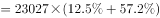万户亿户，与A项最接近。

故正确答案为A。

---

### 第 8 题　qid 2444699 · 综合

2016年末，中部地区农户数约是东北地区的多少倍？

- **A**. 4.3
- **B**. 4.8
- **C**. 5.3　✅
- **D**. 5.8

**答案**：C

**官方解析**

根据题干“2016年末······是······多少倍”，结合材料时间为2016年末，可判定本题为现期倍数问题。定位图形材料，根据拥有商品房户数及其占所有农户的比重可得，农户数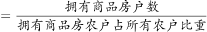，则中部地区农户数，东北地区农户数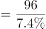，则倍数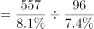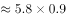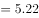，与C项最接近。

故正确答案为C。

---

### 第 9 题　qid 2444703 · 比重

2016年末，拥有商品房的农户数量第二多的地区，居住在砖（石）木结构住房中的农户占该地区所有农户的比重在全国4个地区中排第几？

- **A**. 1
- **B**. 2　✅
- **C**. 3
- **D**. 4

**答案**：B

**官方解析**

定位图形材料，拥有商品房的农户数量第二多的是西部地区，再定位表格材料砖（石）木所在行，西部地区农户占该地区所有农户的比重为，仅次于东北地区的，则排名第2。

故正确答案为B。

---

### 第 10 题　qid 2444708 · 综合

根据2016年末全国农户住房情况，能够从上述资料可以推出：

- **A**. 西部地区农户数量少于中部地区
- **B**. 中部地区平均每70个农户中，就有1个以上拥有3处及以上住房
- **C**. 东北地区仅拥有1处砖混结构住房的农户占当地农户总数4成以上　✅
- **D**. 砖混住房和钢筋混凝土住房分别占该地区所有住房比重最高的地区是同一个

**答案**：C

**官方解析**

A项：西部地区农户数量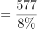，中部地区农户数量，前者分子大于后者，分母小于后者，则前者数据大，即西部地区农户数量高于中部地区，错误；

B项：平均每70个农户中，就有1个以上拥有3处及以上住房，即拥有3处及以上住房的农户占总数的比重大于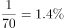；表格中中部地区对应数据为，错误；

C项：东北地区仅拥有1处住房的农户比重为，砖混结构住房的农户比重为，根据容斥原理: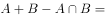，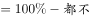；，则所求比重至少为，是4成以上，正确；

D项：定位表格材料，砖混住房占该地区所有住房比重最高的地区为中部地区，钢筋混凝土住房比重最高的为东部地区，不是同一地区，错误。

故正确答案为C。

---

## 材料 3

        2017年全年，我国乘用车产量为2483.1万辆，同比增长，销量为2474.4万辆，同比增长。

### 第 11 题　qid 2444743 · 综合

2017年3月我国多功能乘用车(MPV)的产量

- **A**. 不到15万辆
- **B**. 在15～18万辆之间
- **C**. 在18～23万辆之间　✅
- **D**. 多于23万辆

**答案**：C

**官方解析**

由题干“2017年3月多功能乘用车（MPV）的产量”，结合材料时间2018年1-2月，可判定本题为基期和差问题。定位表格材料，2018年1-2月多功能乘用车（MPV）的产量为29.3万辆，同比增长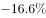；2017年一季度多功能乘用车（MPV）的产量为55.5万辆。根据公式：。2017年1-2月，多功能乘用车（MPV）的产量为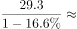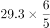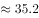万辆，则题目所求为万辆，C项符合。

故正确答案为C。

---

### 第 12 题　qid 2444759 · 增长

已知2018年3月我国乘用车产量为212万辆，则2018年一季度我国乘用车产量比上年同期

- **A**. 
上升了不到

- **B**. 
上升了以上

- **C**. 
下降了不到 
　✅
- **D**. 
下降了以上

**答案**：C

**官方解析**

由题干“2018年乘用车比上年同期”，选项为上升（下降）百分数，可判定本题为一般增长率计算问题。定位题干和表格材料中数据可得，2018年一季度乘用车产量为万辆，2017年一季度乘用车产量为610.7万辆。根据公式：。题目所求为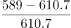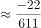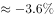，即下降了不到，C项符合。

故正确答案为C。

---

### 第 13 题　qid 2444763 · 综合

2016年第一季度我国运动型多用途乘用车(SUV)销量是多功能乘用车(MPV)销量的多少倍?

- **A**. 1.8
- **B**. 2.9　✅
- **C**. 4.2
- **D**. 6.5

**答案**：B

**官方解析**

由题干“2016年第一季度，···是···多少倍”，结合材料所给时间为2017年一季度，可判定本题为基期倍数问题。定位表格材料，2017年一季度运动型多用途乘用车(SUV)销量为238.6万辆（A），同比增长（a）；多功能乘用车(MPV)销量为55.3万辆（B），同比增长（b）。根据基期倍数公式：。则题目所求为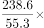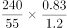倍，B项较为接近。

故正确答案为B。

---

### 第 14 题　qid 2444768 · 比重

以下饼图中，能准确反映2018年1～2月我国四种类型乘用车产量占总产量比重的是

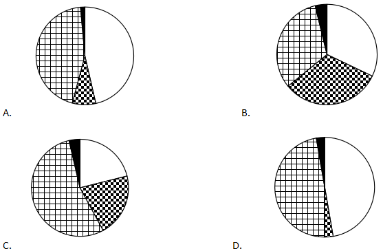

- **A**. A　✅
- **B**. B
- **C**. C
- **D**. D

**答案**：A

**官方解析**

由题干“能准确反映2018年1-2月我国···占···比重的是”，结合材料时间为2018年1-2月，可判定本题为现期比重问题。定位表格材料可得，2018年1-2月，乘用车产量为377.0万辆，轿车产量为174.9万辆，，占比略小于，其扇形图应略小于圆的一半，排除B项和C项。又已知多功能乘用车（MPV）产量为29.3万辆，交叉型乘用车产量为5.4万辆，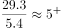，故多功能乘用车（MPV）的扇形面积应超过交叉型乘用车的5倍，排除D项。

故正确答案为A。

注：公考中饼图默认的顺序为从12点钟方向，依次顺时针排列。本题从12点钟方向依次顺时针排列的分别为：轿车、多功能乘用车（MPV）、运动型多用途乘用车（SUV）、交叉型乘用车。

---

### 第 15 题　qid 2444771 · 综合

关于2017年一季度我国乘用车产销量，能够从上述资料中推出的是：

- **A**. 轿车销量增加了2万多辆　✅
- **B**. 该季度产量高于全年各季度平均水平
- **C**. 四种类型乘用车中，产量高于销量的类型正好占一半
- **D**. 运动型多用途乘用车(SUV)产量增加了不到50万辆

**答案**：A

**官方解析**

A项：定位表格材料，2017年一季度，轿车销量为284.0万辆，同比增长。根据公式：，则其销量增加了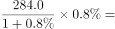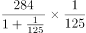万辆，正确；

B项：定位文字材料和表格，2017年一季度，乘用车产量为610.7万辆，全年各季度平均水平为万辆，一季度产量并未高于全年各季度平均水平，错误；

C项：定位表格材料，产量高于销量的有：轿车、多功能乘用车（MPV）、运动型多用途乘用车（SUV），共3种类型，则占比为，并非正好占一半，错误；

D项：定位表格材料，2017年一季度，运动型多用途乘用车(SUV)产量为249.5万辆，同比增长。根据公式：，则其产量增加了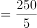万辆，并非不到，错误。

故正确答案为A。

---
