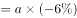
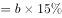
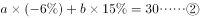
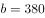
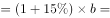
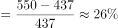

# 2019年四川省选调优秀大学毕业生到基层工作《行测》试题（网友回忆版）

> 资料分析 · 16 题 · 选调 2019

## 材料 1

根据以下资料，回答下列问题。

        2016年全年全国互联网保险收入为2299亿元，同比增加，占全国总保费收入的，较2016年上半年占比减少。其中互联网财产险收入为502亿元，同比减少，占全国财产险保费收入的，较2016年上半年占比减少；互联网人身险收入为1797亿元，同比增加，占全国人身险保费收入的，较2016年上半年占比增加。

        2017年上半年全国互联网保险收入为1346亿元，同比减少，占全国总保费收入的。其中互联网财产险收入为238亿元，同比减少，占全国财产险保费收入的；互联网人身险收入为1108亿元，同比减少，占全国人身险保费收入的。

### 第 1 题　qid 2377292 · 综合

2016年全年全国总保费收入在以下哪个范围内？

- **A**. 不到2万亿元
- **B**. 2～4万亿元之间　✅
- **C**. 4～6万亿元之间
- **D**. 6万亿元以上

**答案**：B

**官方解析**

根据题干“2016年全年全国总保费收入……”，结合材料给出2016年全年全国互联网保险收入及其占全国总保费收入的比重，可判定本题为现期比重问题。定位文字材料第一段“2016年全年全国互联网保险收入为2299亿元，……，占全国总保费收入的”，则2016年全年全国总保费，在2~4万亿元之间。

故正确答案为B。

---

### 第 2 题　qid 2377294 · 综合

2016年下半年全国互联网财产险收入约为多少亿元？

- **A**. 145
- **B**. 205　✅
- **C**. 264
- **D**. 304

**答案**：B

**官方解析**

根据题干“2016年下半年……亿元”，结合材料给出2016年全年和2017年上半年数据，可判定本题为基期计算问题。定位文字材料第一段可知：2016年全年互联网财产险收入为502亿元；定位文字材料第二段可知：2017年上半年互联网财产险收入为238亿元，同比减少。代入公式基期量，可得：2016年上半年互联网财产险收入亿元，则2016年下半年互联网财产险收入约为亿元，与B项最为接近。

故正确答案为B。

---

### 第 3 题　qid 2377295 · 增长

2017年上半年互联网人身险收入占全国人身险保费收入的比重同比约下降了：

- **A**. 1.50个百分点　✅
- **B**. 1.78个百分点
- **C**. 2.06个百分点
- **D**. 2.30个百分点

**答案**：A

**官方解析**

定位文字材料第一段可知：2016年全年互联网人身险收入占全国人身险保费收入的，较2016年上半年占比增加；则2016年上半年互联网人身险收入占全国人身保险费收入的占比为；定位文字材料第二段可知：2017年上半年互联网人身险收入占全国人身险保费收入的。则题干所求，即2017年上半年互联网人身险收入占全国人身险保费收入的比重同比约下降了1.5个百分点。

故正确答案为A。

---

### 第 4 题　qid 2377302 · 比重

以下饼图中，最能准确反映2015年财产险（黑色）和人身险（白色）在互联网保险收入中占比状况的是：

- **A**. A
- **B**. B
- **C**. C
- **D**. D　✅

**答案**：D

**官方解析**

根据题干“2015年财产险（黑色）和人身险（白色）在互联网保险收入中占比状况”，结合材料时间2016年，可判定本题为基期比重问题。定位文字材料第一段“2016年全年全国互联网保险收入为2299亿元，同比增加，······其中互联网财产收入为502亿元，同比减少，······互联网人身险收入为1797亿元，同比增加”，根据基期比重公式：，可得2015年财产险在互联网保险收入中占比为，和D项最为接近。

故正确答案为D。

---

### 第 5 题　qid 2377405 · 综合

能够从上述资料中推出的是：

- **A**. 2016年全国总保费收入低于2015年水平
- **B**. 2016年全国财产险保费收入超过人身险保费收入的一半
- **C**. 2015年全国互联网财产险收入超过700亿元　✅
- **D**. 2017年上半年互联网财产险收入在同期互联网保险收入中的占比高于两成

**答案**：C

**官方解析**

A项：定位文字材料第一段“2016年全年全国互联网保险收入为2299亿元，同比增加，占全国总保费收入的，较2016年上半年占比减少”，没有2015年全国总保费相关的数据，故无法推出，错误；

B项：定位文字材料第一段可知：2016年全年互联网财产险收入为502亿元，占全国财产险保费收入的，互联网人身险收入为1797亿元，同比增加，占全国人身险保费收入。则2016年全国财产险保费收入为亿元，2016年全国人身险保费收入为亿元，故财产险保费收入小于人身险保费收入的一半，错误；

C项：定位文字材料第一段“2016年全年······互联网财产险收入为502亿元，同比减少”，根据基期公式：，可得2015年全国互联网财产险收入为亿元，正确；

 D项：定位文字材料第二段“2017年上半年全国互联网保险收入为1346亿元，······互联网财产险收入为238亿元”，故2017年上半年互联网财产险收入在同期互联网保险收入中占比为，错误。

故正确答案选C。

---

## 材料 2

根据所给资料，回答下列问题。

        2018年4月全国手机产量达14366.7万部，同比增长；2018年1～4月全国手机累计产量为56479.3万部，累计增长。

### 第 6 题　qid 2377296 · 综合

2018年4月，手机产量最高的3个省市手机产量约占全国总产量的：

- **A**. 五成
- **B**. 六成
- **C**. 七成　✅
- **D**. 八成

**答案**：C

**官方解析**

根据题干“2018年4月······占······”结合材料相应时间的数据，可以判定本题为现期比重问题。定位文字材料“2018年4月全国手机产量达14366.7万部”，定位表格材料可得手机产量最高的3个省分别为广东7093.52万部，河南1688.16万部，重庆1313.21万部。占比为，约为七成。

故正确答案为C。

---

### 第 7 题　qid 2377297 · 平均数

2018年4月手机产量前12位的省市中，4月手机产量高于1~3月平均水平的有几个？

- **A**. 5
- **B**. 6　✅
- **C**. 7
- **D**. 8

**答案**：B

**官方解析**

根据题干“2018年4月······4月手机产量高于1-3月平均水平”，表格材料给出2018年4月和1-4月对应数据，可以判定此题为现期平均数问题。，即，不等式化简可得，，结合表格数据，广东：，浙江：，江西：，上海：，四川：，贵州：，共6个省份满足条件。

故正确答案为B。

---

### 第 8 题　qid 2377298 · 综合

如将2018年4月手机产量前12位的省市按2018年1~4月产量重新排列，有几个省市的位次将不会发生变化？

- **A**. 5
- **B**. 6　✅
- **C**. 7
- **D**. 8

**答案**：B

**官方解析**

根据题干“······按2018年1-4月产量重新排列，有几个省市的位次将不会发生变化”可知本题是将12个省份按1-4月产量进行排序和之前按4月产量的排序进行比较，因此本题为直接找数比较问题。将12个省份按1-4月产量重新排列从大到小为：广东、河南、重庆、北京、江苏、江西、上海、浙江、天津、湖北、四川、贵州。位次没有发生变化的有：广东、河南、重庆、北京、江西、上海这6个省份。
故正确答案为B。

---

### 第 9 题　qid 2377299 · 增长

2018年4月四个直辖市的手机产量之和同比：

- **A**. 上升了不到1000万部
- **B**. 上升了1000万部以上
- **C**. 下降了不到1000万部
- **D**. 下降了1000万部以上　✅

**答案**：D

**官方解析**

根据题干“2018年4月······同比”，结合选项“上升/下降”带单位，可判定本题为增长量计算问题。定位表格材料可得：2018年4月重庆、北京、上海、天津四个直辖市的手机产量和同比增速。根据公式：，2018年4月四个直辖市的手机产量同比增长量如下，重庆：万部；北京：万部；上海：万部；天津：万部。故2018年4月四个直辖市的手机产量之和同比万部，即同比下降了1000万部以上。

故正确答案为D。

---

### 第 10 题　qid 2377300 · 增长

关于2018年4月手机产量前12位的省市手机产量，以下信息能够从上述资料中推出的有几条？
①2018年1~4月，有3个省市手机产量分别占全国的一成以上
②2018年1季度，广东手机产量高于上年同期水平
③2018年4月和2018年1~4月手机产量增速最高的省市不是同一个
④江西2018年4月手机产量占同年1~4月产量的比重高于2017年水平

- **A**. 1　✅
- **B**. 2
- **C**. 3
- **D**. 4

**答案**：A

**官方解析**

①：定位文字材料，2018年1~4月全国手机累计产量为56479.3万部。占全国的一成以上即超过万部，定位表格材料可知，广东、河南、重庆三个省市符合条件，正确；

②：定位表格材料，可知2018年4月及1~4月广东手机产量和同比增速，可知万部。根据公式：，，万部。故万部＞18100万部，即2018年一季度广东手机产量低于上年同期水平，并非高于，错误；

③：定位表格材料，2018年4月及1~4月手机产量增速最高的均为四川，是同一个，错误；

④：定位表格材料，可知2018年4月江西手机产量同比增速为，1~4月同比增速为。根据两期比重差结论，部分量增长率小于总量增长率时，今年比重下降，则江西2018年4月手机产量占1~4月的比重低于2017年水平，并非高于，错误。

综上，只有①一个说法正确。

故正确答案为A。

---

## 材料 3

根据以下资料，回答下列问题

### 第 11 题　qid 2377284 · 综合

2017年第二季度成交土地规划建筑面积：

- **A**. 不到0.8亿平方米
- **B**. 在0.8~1.2亿平方米之间　✅
- **C**. 在1.2~1.6亿平方米之间
- **D**. 超过1.6亿平方米

**答案**：B

**官方解析**

根据题干所求“2017年第二季度成交土地规划建筑面积”，并根据容积率公式，可判定本题为现期比重问题。定位表格材料可得2017年第二季度（4-6月）成交土地面积和容积率，根据容积率=成交土地规划建筑面积/成交土地面积，则。故2017年第二季度成交土地规划建筑面积=，在0.8~1.2亿平方米区间内。

 故正确答案为B。

---

### 第 12 题　qid 2377286 · 综合

2017年第一季度成交土地面积：

- **A**. 不到0.3 亿平方米
- **B**. 在0.3～0.4亿平方米之间
- **C**. 在0.4～0.5亿平方米之间　✅
- **D**. 超过0.5亿平方米

**答案**：C

**官方解析**

根据题干所求“2017年第一季度成交土地面积”，并结合材料时间为2017年3月~2018年2月，可判定此题为基期和差问题。定位表格材料可得2017年3月成交土地面积为12.2百万平方米，2018年1月成交土地面积为20.8百万平方米、增长率为；2018年2月成交土地面积为16.4百万平方米、增长率为。则2017年第一季度（1、2、3月）成交土地面积，在0.4~0.5亿平方米区间内。

 故正确答案为C。

---

### 第 13 题　qid 2377287 · 综合

2017年3～6月间，全国住宅销售价格最贵的月份是：

- **A**. 3月
- **B**. 4月
- **C**. 5月　✅
- **D**. 6月

**答案**：C

**官方解析**

根据题干所求“2017年3～6月间，全国住宅销售价格最贵的月份”，并根据溢价率公式，可判定本题为现期比重问题。定位柱状图可得2017年3~6月楼面价和溢价率，，则。故2017年3~6月全国住宅销售价格分别为、、和，5月份楼面价和溢价率均是这4个月中最大，则2017年3～6月间，全国住宅销售价格最贵的月份是5月份。

故正确答案为C。

---

### 第 14 题　qid 2377290 · 增长

下列折线图中，能准确反映2017年第四季度各月全国住宅用地楼面价环比增长率变化趋势的是：

- **A**. A
- **B**. B　✅
- **C**. C
- **D**. D

**答案**：B

**官方解析**

根据题干“能准确反映2017年第四季度······环比增长率变化趋势”，判定本题为一般增长率问题。定位统计图可得：2017年9月、10月、11月、12月的全国住宅用地楼面价分别为6540元/平方米、4706元/平方米、5229元/平方米、4660元/平方米，根据，可得2017年第四季度即10月、11月、12月的环比增速分别为：、、，根据计算结果可判定B项趋势图符合。

故正确答案为B。

---

### 第 15 题　qid 2377291 · 综合

能够从上述资料中推出的是：

- **A**. 2017年12月，全国住宅销售价格高于10月水平
- **B**. 2017年下半年，全国住宅用地成交土地面积环比下降的月份有且仅有2个　✅
- **C**. 2017年下半年，全国住宅用地成交土地面积最高和容积率最高的月份是同一个
- **D**. 2017年下半年，全国住宅用地楼面价超过5000元/平方米的月份有且仅有3个

**答案**：B

**官方解析**

A项：，可得，定位统计图可得，2017年12月全国住宅销售价格为，2017年10月全国住宅销售价格，则全国住宅销售价格，错误；

B项：定位统计表可知，2017年下半年即7-12月，全国住宅用地成交土地面积（百万平方米）有：、，故环比下降的月份有且仅有7月和11月2个，正确；

C项：定位统计表可知，2017年下半年全国住宅用地成交土地面积最高的月份为12月，容积率最高的月份是11月，并非同一个，错误；

D项：定位统计图可知，2017年下半年即7-12月，其中全国住宅用地楼面价超过5000元/平方米的有：7月、8月、9月、11月，即有4个，错误。

故正确答案为B。

---

### 第 16 题　qid 2377288 · 增长

某市2016年传统制造业和新兴制造业产值共830亿元。2017年该市进一步推进产业转型，传统制造业产值同比下降，新兴制造业产值同比增加，传统制造业和新兴制造业总产值较去年增长30亿元。2018年该市新兴制造业产值增长到了550亿元，则当年新兴制造业产值约增长了：

- **A**. 

- **B**. 

- **C**. 

　✅
- **D**. 

**答案**：C

**官方解析**

设2016年传统制造业产值为亿元，新兴制造业产值为亿元。由“2016年传统制造业和新兴制造业产值共830亿元”可列式：。由“（2017年）传统制造业产值同比下降”，可计算2017年传统制造业产值增长量；同理“（2017年）新兴制造业产值同比增加”，可计算2017年新兴制造业产值增长量。由“（2017年）传统制造业和新兴制造业总产值较去年增长30亿元”可列式：。联立①②两式，解得，。2017年新兴制造业产值。由“2018年该市新兴制造业产值增长到了550亿元”，可计算2018年新兴制造业产值增长率。

故正确答案为C。

---
