# 2019年国家公务员录用考试《行测》题（地市级网友回忆版）

> 资料分析 · 20 题 · 国考 2019

## 材料 1

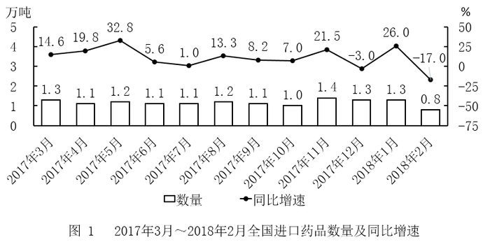 

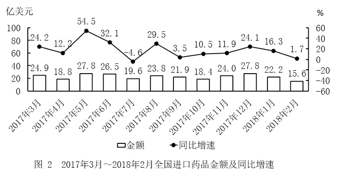

### 第 1 题　qid 2264396 · 平均数

2017年第三季度，全国平均每吨进口药品单价约为多少万美元？

- **A**. 2
- **B**. 19　✅
- **C**. 8
- **D**. 96

**答案**：B

**官方解析**

根据题干“2017年第三季度······平均每吨进口药品单价”，可判定本题为现期平均数问题。第三季度为7—9月。定位图形材料1可得：2017年7—9月进口药品数量分别为1.1万吨、1.2万吨、1.1万吨；定位图形材料2可得：2017年7—9月进口药品金额分别为19.6亿美元、23.8亿美元、21.9亿美元。由，结果在20万美元附近，与B项最接近。

故正确答案为B。

---

### 第 2 题　qid 2264400 · 增长

2017年下半年，全国进口药品数量同比增速低于上月水平的月份有几个？

- **A**. 2
- **B**. 3
- **C**. 4　✅
- **D**. 5

**答案**：C

**官方解析**

根据题干“2017年下半年······同比增速低于上月水平······”结合材料给出了每个月的增长率，可判定本题为直接找数问题。2017年下半年为7—12月，定位图形材料1可得：2017年6—12月增长率分别为、、、、、、。比较可知：7月、9月、10月、12月增速低于上月水平，即有4个月。

故正确答案为C。

---

### 第 3 题　qid 2264417 · 增长

2016年5月，全国进口药品金额环比增速：

- **A**. 
超过

- **B**. 
在之间

- **C**. 
在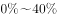之间
　✅
- **D**. 
低于

**答案**：C

**官方解析**

根据题干“2016年5月······环比增速”，结合材料给出的2017年4、5月的数据，可判定本题为一般增长率问题，其中现期是2016年5月，基期是2016年4月。定位图形材料2可得：2017年5月进口药品金额为27.8亿美元，同比增速为；2017年4月进口药品金额为18.8亿美元，同比增速为。由可得：2016年5月进口药品金额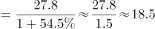亿美元，2016年4月进口药品金额亿美元；由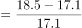，其范围符合C项。

故正确答案为C。

---

### 第 4 题　qid 2264421 · 增长

以下折线图中，能准确反映2017年第四季度各月全国进口药品金额环比增长率的是：

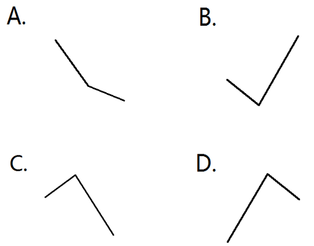

- **A**. A
- **B**. B
- **C**. C
- **D**. D　✅

**答案**：D

**官方解析**

根据题干“2017年第四季度各月······环比增长率”，可判定本题为一般增长率问题。定位图形材料2可得：2017年9月-12月全国进口药品金额分别为21.9亿美元、18.4亿美元、24.0亿美元、27.8亿美元。根据公式：，2017年第四季度各月的环比增长率分别为：10月：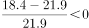；11月：；12月：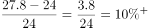。

即10月最小，11月最大。结合图像，D选项符合。

故正确答案为D。

---

### 第 5 题　qid 2264423 · 综合

能够从上述资料中推出的是：

- **A**. 2016年下半年，全国进口药品数量低于1万吨的月份仅有2个
- **B**. 2017年11月，全国平均每吨进口药品单价低于上年同期水平　✅
- **C**. 2017年第二季度，全国进口药品金额超过75亿美元
- **D**. 2017年1月，全国进口药品金额超过20亿美元

**答案**：B

**官方解析**

A项：定位图形材料1，2017年7-12月全国进口药品数量分别为1.1万吨、1.2万吨、1.1万吨、1.0万吨、1.4万吨、1.3万吨；同比增速分别为、、、、、。根据公式：，2016年下半年全国进口药品数量分别为：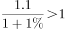，，，，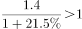，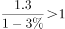，只有10月低于1万吨，错误；

B项：定位图形材料1，2017年11月全国进口药品数量同比增速为；定位图形材料2，2017年11月全国进口药品金额同比增速为。由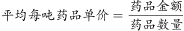，药品金额增长率，药品数量增长率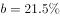，则。根据两期平均数比较结论： 时，平均数低于上年。故2017年11月全国平均每吨进口药品单价低于上年同期水平，正确；

C项：定位图形材料2，2017年4-6月全国进口药品金额分别为18.8亿美元、27.8亿美元、26.5亿美元。故2017年第二季度全国进口药品金额，错误；

D项：定位图形材料2，2018年1月全国进口药品金额为22.2亿美元，同比增速为。根据公式：，2017年1月全国进口药品金额，错误。

故正确答案为B。

---

## 材料 2

        2017年全国二手车累计交易量为1240万辆，同比增长；二手车交易额为8092.7亿元，同比增长。2017年12月，全国二手车市场交易量为123万辆，交易量环比上升，上年同期交易量为108万辆。

### 第 6 题　qid 2264438 · 增长

2011～2017年，全国二手车交易量同比增量低于80万辆的年份有几个？

- **A**. 3
- **B**. 4　✅
- **C**. 5
- **D**. 7

**答案**：B

**官方解析**

根据题干“······同比增量低于80万辆的年份有几个”，可判定本题为增长量的计算问题。定位图1可知2011~2017年每年的二手车交易量，以及2011年增长率为，根据公式：，可得2011年二手车增长量=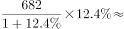。根据公式：，可得：

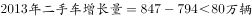

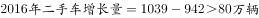

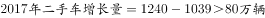

所以，2011~2017年，全国二手车交易量同比增量低于80万辆的年份有2011年、2013年、2014年、2015年这4年。

故正确答案为B。

---

### 第 7 题　qid 2264439 · 综合

“十二五”（2011～2015年）期间，全国二手车总计交易约多少亿辆？

- **A**. 0.46
- **B**. 0.50
- **C**. 0.38
- **D**. 0.42　✅

**答案**：D

**官方解析**

定位图1可知2011~2015年全国二手车每年的交易量，所以“十二五”（2011~2015年）期间，全国二手车总计交易为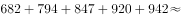，D项当选。

故正确答案为D。

---

### 第 8 题　qid 2264440 · 平均数

2017年1～10月，平均每月全国二手车交易量约为多少万辆？

- **A**. 100　✅
- **B**. 105
- **C**. 90
- **D**. 95

**答案**：A

**官方解析**

根据题干“2017年1~10月，平均每月······万辆”，结合材料时间为2017年，可判定本题为现期平均数问题。定位文字材料“2017年全国二手车累计交易量为1240万辆······2017年12月，全国二手车交易量为123万辆，交易量环比上升”，可得2017年1~10月，平均每月全国二手车交易量约为，与A项最为接近。

故正确答案为A。

---

### 第 9 题　qid 2264441 · 综合

2015年全国二手车交易总金额比2014年：

- **A**. 减少了不到100亿元　✅
- **B**. 减少了100亿元以上
- **C**. 增长了100亿元以上
- **D**. 增长了不到100亿元

**答案**：A

**官方解析**

根据选项“增长/减少······”，结合选项带具体单位，可判定本题为增长量计算问题。定位图1和图2，可知2015和2014年二手车交易量和平均交易价格，则2015年二手车交易总金额2014年二手车交易总金额，故减少不到100亿元。

故正确答案为A。

---

### 第 10 题　qid 2264442 · 综合

能够从上述资料中推出的是：

- **A**. 
2016～2017年，全国二手车平均交易价格在6.1～6.15万元之间

- **B**. 
2011～2017年，全国二手车交易量同比增速第4高的年份，当年二手车平均交易价格高于6万元

- **C**. 
2011～2017年，全国二手车交易量同比增长量最高的年份其增长量是最低年份的9倍多
　✅
- **D**. 
2011～2017年，全国二手车交易量同比增速低于的年份有4个

**答案**：C

**官方解析**

A项：定位图1和图2，可知2016和2017年二手车交易量分别为1039万辆和1240万辆，平均交易价格分别为5.8万元/辆和6.5万元/辆，故2016~2017年全国二手车平均交易价格应在5.8~6.5万元/辆之间。由于，故2016~2017年，全国二手车平均交易价格应更偏向于2017年的平均交易价格，即应大于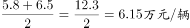 ，即在6.15~6.5万元/辆之间，不在6.1~6.15万元之间，错误；

B项：定位图1，可知全国二手车交易量同比增速第4高的是2016年，对应图2平均交易价格为5.8万元，低于6万元，错误；

C项：定位图1，全国二手车交易量同比增长量最高的年份为2017年，其增长量为，同比增长量最低的年份为2015年，其增长量为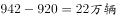，则，正确；

D项：定位图1，全国二手车交易量同比增速低于的年份有2013年()、2014年（）、2015年（），共3个年份符合，错误。

故正确答案为C。

---

## 材料 3

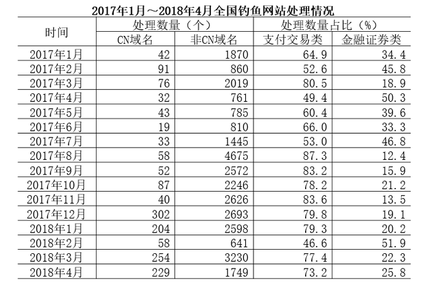

### 第 11 题　qid 2264388 · 综合

2017年，全国处理的支付交易类钓鱼网站数量超过金融证券类钓鱼网站2倍的月份有几个？

- **A**. 5
- **B**. 6　✅
- **C**. 7
- **D**. 8

**答案**：B

**官方解析**

根据题干“2017年···超过···2倍···”，可判定本题为现期倍数问题。定位表格最后两列，给出的数据为每个月支付交易类钓鱼网站和金融证券类钓鱼网站的处理数量占当月总数的比重，每个月总数一定，故只需比较比重即可。则支付交易类钓鱼网站数量超过金融证券类钓鱼网站2倍的月份有：

2017年3月份，

2017年8月份，

2017年9月份，

2017年10月份，

2017年11月份，

2017年12月份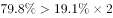，共有6个月份。

故正确答案为B。

---

### 第 12 题　qid 2264402 · 综合

2018年第一季度全国处理钓鱼网站总数：

- **A**. 不到5000个
- **B**. 在5000～6000个之间
- **C**. 在6001～7000个之间　✅
- **D**. 超过7000个

**答案**：C

**官方解析**

题干求2018年一季度全国处理钓鱼网站总数，根据表格可知2018年1月-2018年3月每月处理钓鱼网站的数量，可判定此题为简单加减计算问题。2018年第一季度（1-3月）全国处理钓鱼网站总数，在C项范围内。

故正确答案为C。

---

### 第 13 题　qid 2264414 · 比重

2017年下半年，金融证券类和支付交易类钓鱼网站占当月处理钓鱼网站总数比重最低的月份是：

- **A**. 8月
- **B**. 9月
- **C**. 10月
- **D**. 11月　✅

**答案**：D

**官方解析**

题干求金融证券类和支付交易类钓鱼网站占当月处理钓鱼网站总数比重最低的月份，根据表格可知2017年1月-2018年4月每月金融证券类和支付交易类钓鱼网站占当月处理钓鱼网站总数比重，可判定此题为简单加减计算问题。根据选项及表格可得，8月：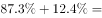，9月：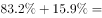，10月：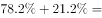，11月：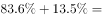。11月最低。

故正确答案为D。

---

### 第 14 题　qid 2264425 · 增长

下列折线图中，能准确反映2018年第一季度CN域名钓鱼网站处理数量同比增速变化趋势的是：

- **A**. A
- **B**. B　✅
- **C**. C
- **D**. D

**答案**：B

**官方解析**

根据题干“2018年第一季度···同比增速变化趋势”，可判定本题为一般增长率比较问题。定位表格材料可得：2017年1月、2月、3月CN域名钓鱼网站处理数量分别为42个、91个、76个，2018年1月、2月、3月CN域名钓鱼网站处理数量分别为204个、58个、254个。根据增长率，可以利用的大小直接判定增长率的大小。2018年第一季度，即1月、2月、3月的分别为：、、，则1月同比增长率最大，2月同比增长率最小。

故正确答案为B。

---

### 第 15 题　qid 2264433 · 综合

能够从上述资料中推出的是：

- **A**. 
2018年3月全国支付交易类钓鱼网站处理数量超过2500个
　✅
- **B**. 
2017年第一季度全国CN域名钓鱼网站处理数量占同期钓鱼网站处理总数的一成以上

- **C**. 
2018年2月全国支付交易类钓鱼网站处理数量环比下降了不到

- **D**. 
2017年全国处理的CN域名钓鱼网站中，超过了一半的网站是在12月处理的

**答案**：A

**官方解析**

A项：定位表格，2018年3月全国共处理钓鱼网站数量为个，支付交易类占比为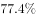，则2018年3月全国支付交易类钓鱼网站处理数量为，正确；

B项：定位表格，2017年第一季度CN域名处理数量为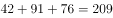个，全国钓鱼网站处理总数为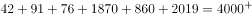个，则2017年第一季度CN域名处理数量占总数的比重为，不到一成，错误；

C项：定位表格，2018年2月全国处理钓鱼网站数量为个，支付交易类占比为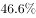，则2018年2月支付交易类处理数量约为个；2018年1月全国处理钓鱼网站数量为个，支付交易类占比为，则2018年1月支付交易类处理数量约为个。那么2018年2月支付交易类钓鱼网站处理数量环比下降，错误；

D项：定位表格，2017年全国共处理CN域名钓鱼网站总数为个，其中12月份处理数量为302个，则12月份占全年的比重为，不到一半，错误。

故正确答案为A。

---

## 材料 4

        2017年，A省完成邮电业务总量6065.71亿元。其中，电信业务总量3575.86亿元，同比增长；邮政业务总量2489.85亿元，增长。

        2017年，A省移动电话期末用户1.48亿户，比上年末增长。其中，4G期末用户达1.18亿户，比上年末增长。互联网宽带接入期末用户3128万户，比上年末增长。移动互联网期末用户1.31亿户，比上年末增长，移动互联网接入流量同比增长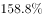。

        2017年，全省全年完成快递业务量100.51亿件，同比增长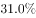。其中，同城快递业务量增长，异地快递业务量增长，国际和港澳台地区快递业务量增长。

        2017年，A省完成客运总量148339万人次，同比增长，增幅比前三季度提高0.2个百分点，比上年提高0.5个百分点；完成旅客周转总量4143.84亿人公里，增长，增幅比前三季度提高0.7个百分点，比上年提高1.8个百分点。

        2017年，A省完成高铁客运量17872万人次，旅客周转量474.64亿人公里，同比分别增长和。高铁客运量和旅客周转量分别占铁路旅客运输总量的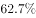和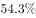，比重比上年分别提高4.3个和3.9个百分点。

### 第 16 题　qid 2264427 · 增长

2017年A省邮电业务总量同比增速在以下哪个范围之内？

- **A**. 
低于

- **B**. 
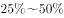之间

- **C**. 
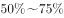之间
　✅
- **D**. 
超过

**答案**：C

**官方解析**

根据“2017年A省邮电业务总量同比增速在以下哪个范围”，且材料已知电信业务和邮政业务的增长率，可判断此题为混合增长率问题。定位文字材料第一段，“2017年，A省完成邮电业务总量6065.71亿元。其中，电信业务总量3575.86亿元，同比增长；邮政业务总量2489.85亿元，增长”，根据混合增长率的口诀：混合居中但不中，偏向基期大的部分。由此可得A省邮电业务总量的增长率应介于和之间，结合选项可排除A。和的中间值为，又电信业务总量基期为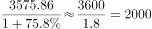亿元，邮政业务总量基期为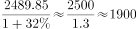亿元，电信业务总量略大于邮政业务总量，所以混合增长率略大于中间值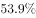，对应C项。

故正确答案为C。

---

### 第 17 题　qid 2264434 · 比重

2017年A省快递业务中，业务量占总业务量比重高于上年水平的分类是：

- **A**. 仅国际和港澳台地区快递
- **B**. 异地快递、国际和港澳台地区快递　✅
- **C**. 仅同城快递
- **D**. 同城快递、异地快递

**答案**：B

**官方解析**

根据“2017年A省快递业务中，······占······比重高于上年水平的分类是···”，可判断此题为两期比重问题。定位文字材料第三段，“2017年，全省全年完成快递业务量100.51亿件，同比增长。其中，同城快递业务量增长，异地快递业务量增长，国际和港澳台地区快递业务量增长”，可知总业务量增长率（b）为。若业务量占总业务量比重高于上年水平，需满足，即大于。所以满足题意的有异地快递业务量，国际和港澳台地区快递业务量，对应选项B。

故正确答案为B。

---

### 第 18 题　qid 2264435 · 增长

2017年前三季度，A省平均每人次客运旅客运输距离（）同比：

- **A**. 
下降了不到

- **B**. 
下降了以上

- **C**. 
上升了不到
　✅
- **D**. 
上升了以上

**答案**：C

**官方解析**

根据“2017年前三季度，A省平均每人次客运旅客运输距离（）同比…”，结合选项上升/下降，可判断此题为平均数的增长率问题。定位文字材料第四段，“2017年，A省完成客运总量···，同比增长，增幅比前三季度提高0.2个百分点···；完成旅客周转总量···，增长，增幅比前三季度提高0.7个百分点···”，可知2017年前三季度，客运总量增长率（b）为，旅客周转量增长率（a）为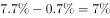。代入平均数的增长率公式：，且大于0，结合选项，C满足题意。

故正确答案为C。

---

### 第 19 题　qid 2264436 · 综合

2016年，A省高铁客运量约是普铁（除高铁外的铁路）客运量的多少倍？

- **A**. 1.4　✅
- **B**. 1.7
- **C**. 0.8
- **D**. 1.1

**答案**：A

**官方解析**

根据题干“2016年···约是···的多少倍”，结合材料时间为2017年，可判定本题为基期倍数问题。定位材料文字第五段可得：2017年A省高铁客运量占铁路旅客运输总量的，比重比上年提高4.3个百分点。可知2016年A省高铁客运量占整体比重为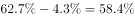，则2016年A省普铁（除高铁外的铁路）占整体比重为。故所求倍数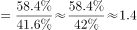倍

故正确答案为A。

---

### 第 20 题　qid 2264437 · 比重

在以下4条关于A省的信息中，能够直接从资料中推出的有几条？
①2017年非4G移动电话用户全年增量
②2017年移动互联网用户日均增量
③2015年客运总量
④2017年铁路旅客运输总量占客运总量比重

- **A**. 1
- **B**. 2
- **C**. 3
- **D**. 4　✅

**答案**：D

**官方解析**

①定位文字材料第二段可得：“2017年，A省移动电话期末用户1.48亿户，比上年末增长。其中，4G期末用户达1.18亿户，比上年末增长”，可推知2017年A省移动电话用户全年增长量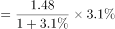亿户，4G用户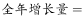亿户，故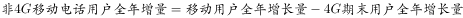，可求；

②定位文字材料第二段可得：“2017年，移动互联网期末用户1.31亿户，比上年末增长”，可推知2017年移动互联网用户全年增长量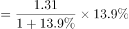亿户，2017年共365天，故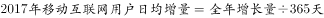，可求；

③定位文字材料第四段可得：“2017年，A省完成客运总量148339万人次，同比增长···，比上年提高0.5个百分点”，可推知2016年增长率，根据间隔增长率公式，可得2017年相对于2015年客运总量的间隔，故2015年客运总量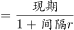，可求；

④定位文字材料第四段可得：“2017年，A省完成客运总量148339万人次”，定位文字材料第五段可得：“2017年A省完成高铁客运量17872万人次，······占铁路旅客运输总量的”，可推知2017年A省铁路旅客运输总量万人次，故2017年铁路旅客运输总量占客运总量比重为，可求。

能够直接从资料中推出的有4条。

故正确答案为D。

---
