# 2019年广东省公务员录用考试《行测》题（乡镇卷）（网友回忆版）

> 资料分析 · 20 题 · 广东 2019

## 材料 1

        过去5年，我国统筹开展交通扶贫和“四好农村路工作”，农村基础设施更加完善，服务乡村振兴成效显著。

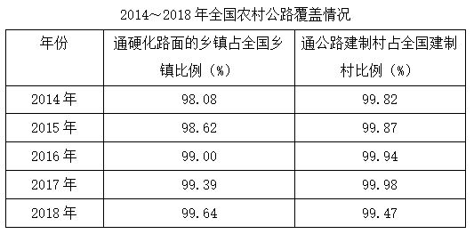

### 第 1 题　qid 2374823 · 综合

2014~2018年，全国新改建农村公路里程共计（    ）万公里。

- **A**. 77.5
- **B**. 97.4
- **C**. 117.2
- **D**. 137.7　✅

**答案**：D

**官方解析**

时间段是2014～2018年，主体是全国新改建农村公路里程，定位折线图，各个年份的数据加和，为万公里。或者观察选项，选项数据与材料数据精度相同，求具体数值，选项尾数不同，可以用尾数法，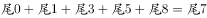，对应D项。

故正确答案为D。

---

### 第 2 题　qid 2374833 · 增长

2015~2018年，全国新改建农村公路里程较上年增加最多的一年是（    ）。

- **A**. 2015
- **B**. 2016　✅
- **C**. 2017
- **D**. 2018

**答案**：B

**官方解析**

根据问题“······增加最多的一年”，可判定本题为增长量比较问题。

A项2015年：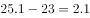万公里；B项2016年：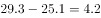万公里；C项2017年为下降，直接排除；D项2018年：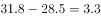万公里。明显B项2016年的增长量最大。

故正确答案为B。

---

### 第 3 题　qid 2374835 · 增长

与2014年相比，2018年我国农村公路总里程增加了（    ）万公里。

- **A**. 9.83
- **B**. 12.87
- **C**. 16.84　✅
- **D**. 22.59

**答案**：C

**官方解析**

根据问题“······增加了（    ）万公里”，可判定本题为增长量计算问题。主体为我国农村公路总里程，定位柱状图，可得：2014年我国农村公路总里程为388.16万公里，2018年我国农村公路总里程为405万公里，增加了万公里。

故正确答案为C。

---

### 第 4 题　qid 2374836 · 比重

2018年，全国通硬化路面的乡镇占全国乡镇比例与2014年相比（    ）个百分点。

- **A**. 增加1.56　✅
- **B**. 增加0.25
- **C**. 减少1.56
- **D**. 减少0.25

**答案**：A

**官方解析**

主体为全国通硬化路面的乡镇占全国乡镇比例，定位表格，可得：2014年全国通硬化路面的乡镇占全国乡镇比例为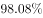，2018年全国通硬化路面的乡镇占全国乡镇比例为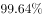，增加了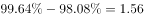个百分点。

故正确答案为A。

---

### 第 5 题　qid 2374837 · 综合

下列说法正确的是：

- **A**. 2014~2018年，我国新改建农村公路里程逐年增加
- **B**. 2014~2018年，我国农村公路总里程逐年增加
- **C**. 2014~2018年，通硬化路面的乡镇占全国乡镇的比例逐年提高　✅
- **D**. 2014~2018年，通公路的建制村占全国建制村的比例逐年提高

**答案**：C

**官方解析**

A项：定位折线图，可得：2016年我国新改建农村公路里程为29.3万公里，2017年我国新改建农村公路里程为28.5万公里，里程数减少，不满足“逐年增加”，错误；

B项：定位柱状图，可得：2015年我国农村公路总里程为398.06万公里，2016年我国农村公路总里程为395.98万公里，里程数减少，不满足“逐年增加”，错误；

C项：定位表格，可发现2014～2018年，通硬化路面的乡镇占全国乡镇的比例逐年提高，正确；

D项：定位表格，可得：2017年通公路的建制村占全国建制村的比例为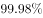，2018年通公路的建制村占全国建制村的比例为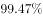，比例降低，不满足“逐年提高”，错误。

故正确答案为C。

---

## 材料 2

        党的十八大以来，脱贫工作取得巨大成效，全国农村贫困人口大幅减少。截至2018年末，全国农村贫困人口从2012年末的9899万人减少至1660万人；农村贫困发生率从2012年的下降至，累计下降8.5个百分点。

        2018年，贫困地区农村居民人均可支配收入10371元，扣除价格因素，实际增长，实际增速高出全国农村居民人均可支配收入实际增速1.7个百分点，圆满完成增长幅度高于全国增速的年度目标任务。

### 第 6 题　qid 2374697 · 综合

从2012年末到2018年末，全国农村贫困人口数减少了（    ）万人。

- **A**. 6239
- **B**. 7239
- **C**. 8239　✅
- **D**. 9230

**答案**：C

**官方解析**

根据题意“······减少了（    ）万人”，可判定本题为增长量计算问题。定位文字材料第一段或柱形图，可得2012年末为9899万人，2018年末为1660万人， ，减少了8239万人。

故正确答案为C。

---

### 第 7 题　qid 2374705 · 增长

2013—2018年，全国农村贫困发生率较上年下降最多的是（    ）年。

- **A**. 2013　✅
- **B**. 2015
- **C**. 2017
- **D**. 2018

**答案**：A

**官方解析**

本题所求“······全国农村贫困发生率较上年下降最多······”，定位折线图，A项2013年：，即下降1.7个百分点；B项2015年： ，即下降1.5个百分点；C项2017年： ，即下降1.4个百分点；D项2018年：，即下降1.4个百分点。则下降最多的为A项2013年。

故正确答案为A。

---

### 第 8 题　qid 2374713 · 平均数

2018年，我国贫困地区农村居民人均工资性收入约占人均可支配收入的（    ）。

- **A**. 

- **B**. 

- **C**. 

- **D**. 

　✅

**答案**：D

**官方解析**

根据问题“······占······”，结合时间为2018年，判定本题为现期比重问题。定位表格，可得：2018年我国贫困地区农村居民人均工资性收入为3627元；定位文字第二段，可得：2018年我国贫困地区农村居民人均可支配收入10371元，则所占比重。

故正确答案为D。

---

### 第 9 题　qid 2374716 · 综合

2018年，我国贫困地区农村居民收入来源中，最高的是（     ）。

- **A**. 人均工资性收入
- **B**. 人均转移净收入
- **C**. 人均经营净收入　✅
- **D**. 人均财产净收入

**答案**：C

**官方解析**

题目所求“2018年我国贫困地区农村居民收入来源最高的”，定位表格，观察数据可得，人均经营净收入3888元最高。
故正确答案为C。

---

### 第 10 题　qid 2374723 · 综合

下列说法不正确的是（    ）。

- **A**. 
2012—2018年，全国农村贫困人口逐年递减

- **B**. 
2018年，全国农村居民人均可支配收入实际增速为

- **C**. 
2018年，贫困地区农村居民各来源的人均收入较上年均有提高

- **D**. 
2017年，贫困地区农村居民人均经营净收入比转移净收入高近1000元
　✅

**答案**：D

**官方解析**

A项：定位柱形图，2012～2018年，全国农村贫困人口逐年递减（根据柱子高度，逐渐降低），说法正确，排除；

B项：定位文字材料，“2018年······人均可支配收入实际增长，高出全国农村居民人均可支配收入实际增速1.7个百分点”，那么2018年全国农村居民人均可支配收入实际增速为，说法正确，排除；

C项：定位表格，比较2018年和2017年的收入来源，发现各个来源的收入均有所提高，说法正确，排除；

D项：定位表格，可得：2017年，贫困地区农村居民人均经营净收入为3723元，转移净收入为2325元，元，即多1398元，所以“近1000元”说法错误，当选。

本题为选非题，故正确答案为D。

---

## 材料 3

        近年来，B省营商环境不断优化，市场活力不断增强，新登记市场主体都保持较快增长势头。2018年，全省新登记市场主体229.74万户，日均新登记市场主体6294户，同比增长。

        全省产业结构也进一步调整优化，新登记市场主体主要集中在第三产业。2018年，全省三大产业新登记市场主体分别为第一产业2.02万户，第二产业24.01万户，第三产业203.71万户。截止2018年12月末，全省三大产业的实有各类市场主体户数分别为9.83万户，157.38万户，978.92万户。

        2018年，全省新登记企业最集中的三个行业分别是批发和零售业、租赁和商务服务业、制造业，新登记企业数分别为36.14万户、15.19万户、9.25万户，分别同比增长、增长、下降。

### 第 11 题　qid 2374807 · 增长

2015-2018年，B省实有各类市场主体数增长了约（    ）万户。

- **A**. 170
- **B**. 270
- **C**. 370　✅
- **D**. 470

**答案**：C

**官方解析**

根据题干“······增长了······万户”，可判定本题为增长量计算问题。定位表格材料可知，2018年实有各类市场主体为1146.13万户，2015年为775.95万户，则增长量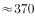万户。

故正确答案为C。

---

### 第 12 题　qid 2374810 · 综合

2018年，B省第三产业新登记市场主体约占全省实有各类市场主体的（    ）。

- **A**. 

- **B**. 

　✅
- **C**. 

- **D**. 

**答案**：B

**官方解析**

根据题干“2018年······占······”，结合选项为百分数，可判定本题为现期比重问题。定位文字材料第二段可知，2018年第三产业新登记市场主体数为203.71万户，定位表格材料可知，2018年实有各类市场主体为1146.13万户，则比重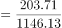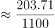，与B项最接近。

故正确答案为B。

---

### 第 13 题　qid 2374811 · 综合

2015-2018年，B省新登记个体工商户最多的是（    ）年。

- **A**. 2015
- **B**. 2016
- **C**. 2017
- **D**. 2018　✅

**答案**：D

**官方解析**

定位表格材料，可知B省各年新登记个体工商户数分别是：2018年131.56万户，2017年104.10万户，2016年82.04万户，2015年77.11万户，则2018年最多。
故正确答案为D。

---

### 第 14 题　qid 2374812 · 增长

2018年，B省租赁和商务服务业新登记企业数较上年增加约（    ）万户。

- **A**. 2.8　✅
- **B**. 3.8
- **C**. 4.8
- **D**. 5.8

**答案**：A

**官方解析**

根据题干“······较上年增加······万户”，可判定本题为增长量计算问题。定位文字材料第三段可知，2018年租赁和商务服务业新登记企业数为15.19万户，同比增长。代入增长量计算公式：增长量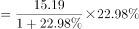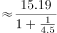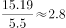万户。

故正确答案为A。

---

### 第 15 题　qid 2374813 · 综合

下列说法正确的是（    ）。

- **A**. 2015-2018年，B省新登记农民专业合作社数量逐年增加
- **B**. 2015-2018年，B省新登记个体工商户均多于新登记企业数　✅
- **C**. 2017年，B省日均新登记市场主体少于4000户
- **D**. 2018年，B省第三产业新登记市场主体数量是第二产业的10倍

**答案**：B

**官方解析**

A项：定位表格数据，2015-2018年新登记农民专业合作社数量分别为0.55、0.49、0.49、0.38，并非逐年增加，错误；

B项：定位表格数据，比较2015-2018年，每年登记个体工商户数量和新登记企业数，2015年，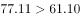，2016年，，2017年，，2018年，，因此新登记个体工商户均多于新登记企业数，正确；

C项：定位表格数据，2017年新登记市场主体数量为195万户，则日均为：，大于4000户，错误；

D项：定位文字材料第二段“2018年，全省三大产业新登记市场主体分别为第一产业2.02万户，第二产业24.01万户，第三产业203.71万户”，则倍数关系应为，错误。

故正确答案为B。

---

## 材料 4

        近年来，A省大力发展绿色无公害农业。2017年，A省农药使用总量5.80万吨，与2016年相比减少；单位耕地面积农药使用量为1.47千克/亩。

        全省新增申报无公害农产品产地认定221个，产品362个，新增绿色食品33个，认证有机食品60个。全省“三品一标”总数达2570个，其中：无公害农产品1710个，绿色食品745个，有机农产品87个，农产品地理标志28个，无公害农产品种植面积总计达1050万亩，生产总量970多万吨。

 

### 第 16 题　qid 2374821 · 增长

2017年，A省“三品一标”总数较上年增加了（    ）个。

- **A**. 8
- **B**. 9　✅
- **C**. 10
- **D**. 11

**答案**：B

**官方解析**

定位表格可知，2017年A省“三品一标”总数为2570个，2016年为2561个。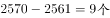，则2017年A省“三品一标”总数较上年增加了9个。

故正确答案为B。

---

### 第 17 题　qid 2374825 · 综合

2017年，A省农药使用总量比2016年减少了（    ）万吨。

- **A**. 0.25
- **B**. 0.3
- **C**. 0.35　✅
- **D**. 0.4

**答案**：C

**官方解析**

定位表格可知，2017年A省农药使用总量为5.80万吨，2016年为6.15万吨。，即2017年A省农药使用总量比2016年减少了0.35万吨。

故正确答案为C。

---

### 第 18 题　qid 2374828 · 综合

2017年，A省单位耕地面积农药使用量比2015年约（    ）。

- **A**. 
增加

- **B**. 
下降
　✅
- **C**. 
增加

- **D**. 
下降

**答案**：B

**官方解析**

由题干“2017年A省单位耕地面积农药使用量比2015年约”，结合选项为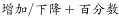，可判定本题为增长率计算问题。定位表格可知，2017年A省单位耕地面积农药使用量为1.47千克/亩，2015年为1.59千克/亩。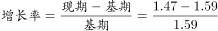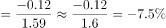，则2017年A省单位耕地面积农药使用量比2015年约下降。

故正确答案为B。

---

### 第 19 题　qid 2374830 · 平均数

2014-2017年，A省平均每年新增申报无公害农产品产地认定（    ）个。

- **A**. 184
- **B**. 202
- **C**. 221
- **D**. 230　✅

**答案**：D

**官方解析**

由题干“2014-2017年A省平均每年新增申报无公害农产品产地认定多少个”，可判定本题为平均数计算问题。定位表格可知，2014-2017年A省新增申报无公害农产品产地认定分别为：270、194、235、221个，则平均每年为。

故正确答案为D。

---

### 第 20 题　qid 2374831 · 综合

下列说法不正确的是（    ）。

- **A**. 2016年，A省有绿色食品712个
- **B**. 2017年，A省无公害农产品种植面积是2014年的3倍多
- **C**. 2014-2017年，A省单位耕地面积农药使用量逐年下降
- **D**. 2017年，A省无公害农产品平均亩产超1吨　✅

**答案**：D

**官方解析**

A项：定位文字材料第二段可知，“（2017年）新增绿色食品33个，全省‘三品一标’总数达2570个，其中：······，绿色食品745个”。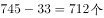，则2016年A省有绿色食品712个，正确；

B项：定位表格可知，2017年A省无公害农产品种植面积1050万亩，2014年为332万亩。，正确；

C项：定位表格可知，2014-2017年，A省单位耕地面积农药使用量（千克/亩）分别为1.66、1.59、1.56、1.47。使用量逐年下降，正确；

D项：定位文字材料第二段可知，“（2017年）无公害农产品种植面积总计达1050万亩，生产总量970多万吨”。则2017年，A省无公害农产品平均亩产为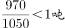，错误。

本题为选非题，故正确答案为D。

---
