# 2019年广东省公务员录用考试《行测》题（县级卷）（网友回忆版）

> 资料分析 · 15 题 · 广东 2019

## 材料 1

        近年来，A省新登记市场主体保持较快增长势头。全省实有各类市场主体从2015年的775.95万户增长到2018年的1146.13万户。2018年，全省新登记市场主体229.74万户，日均新登记市场主体6294户，同比增长。

        2018年，全省新登记企业最集中的三个行业分别是批发和零售业、租赁和商务服务业、制造业，新登记企业数分别为36.14万户、15.19万户、9.25万户，分别同比增长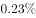、增长、下降。

### 第 1 题　qid 2374706 · 增长

2015—2018年，A省实有各类市场主体数增长了约（    ）万户。

- **A**. 170.2
- **B**. 270.2
- **C**. 370.2　✅
- **D**. 470.2

**答案**：C

**官方解析**

由题干“2015-2018年，······增长了约多少万户”，判定本题为增长量计算问题。定位文字材料第一段可得：“全省实有各类市场主体从2015年的775.95万户增长到2018年的1146.13万户”，故2015-2018年，A省实有各类市场主体数增长量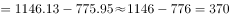万户，与C项最为接近。

故正确答案为C。

---

### 第 2 题　qid 2374708 · 增长

2018年，A省新登记市场主体中，数量较上年增幅最大的是（    ）。

- **A**. 第一产业新登记企业
- **B**. 第二产业新登记企业
- **C**. 第三产业新登记企业
- **D**. 新登记个体工商户　✅

**答案**：D

**官方解析**

由题干“2018年，······增幅最大的是”，判定本题为一般增长率问题。定位表格材料可得，2018年A省新登记市场主体中第一、第二产业新登记企业数，与2017年相比没发生改变，则增幅均为0；第三产业新登记企业数量的增幅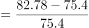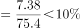；新登记个体工商户数量的增幅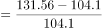，故2018年，A省新登记市场主体中，数量较上年增幅最大的是新登记个体工商户。

故正确答案为D。

---

### 第 3 题　qid 2374711 · 增长

2015—2018年，A省新登记市场主体数年均增长约（    ）万户。

- **A**. 15.1
- **B**. 23.2
- **C**. 30.3　✅
- **D**. 36.4

**答案**：C

**官方解析**

由题干“2015-2018年，······年均增长约多少万户”，判定本题为年均增长量问题。定位表格材料可得： 2018年新登记市场主体为229.74万户；2015年新登记市场主体为138.76万户。故2015-2018年，A省新登记市场主体数年均增长量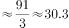万户。

故正确答案为C。

---

### 第 4 题　qid 2374722 · 增长

2018年，租赁和商务服务业新登记企业数较上年增加约（    ）万户。

- **A**. 2.8　✅
- **B**. 3.8
- **C**. 4.8
- **D**. 5.8

**答案**：A

**官方解析**

由题干“2018年，······增加约多少万户”，判定本题为增长量计算问题。定位文字材料第二段可得：2018年租赁和商务服务业新登记企业数为15.19万户，同比增长；故2018年租赁和商务服务业新登记企业数较上年增加万户。

故正确答案为A。

---

### 第 5 题　qid 2374729 · 综合

根据材料，以下说法不正确的是（    ）。

- **A**. 
2015—2018年，A省新登记企业数增长超

- **B**. 
2017年，A省日均新登记市场主体少于4000户
　✅
- **C**. 
2017年，A省新登记企业最集中的行业是批发和零售业

- **D**. 
2015年，A省新登记农民专业合作社多于第一产业新登记企业

**答案**：B

**官方解析**

A项：定位表格材料可得： 2018年A省新登记企业数为97.8万户，2015年A省新登记企业数为61.1万户；故2015—2018年A省新登记企业数增长率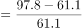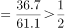，正确；

B项：定位文字材料第一段可得：“2018年，A省日均新登记市场主体6294户，同比增长”，故2017年，A省日均新登记市场主体数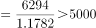户，并非少于4000户，错误；

C项：定位文字材料第二段可得：“2018年，全省新登记企业最集中的三个行业分别是批发和零售业、租赁和商务服务业、制造业，新登记企业数分别为36.14万户、15.19万户、9.25万户，分别同比增长、增长、下降”，故2017年批发和零售业新登记企业数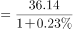万户，租赁和商务服务业新登记企业数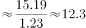万户，制造业新登记企业数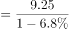万户，根据表格材料2017年新登记企业数90.41万户，则其他所有行业新登记企业数万户，显然2017年，A省批发和零售业新登记企业数最多，即2017年，A省新登记企业最集中的行业是批发和零售业，正确；

D项：定位表格可得：2015年A省新登记农民专业合作社数为0.55万户，第一产业新登记企业数为0.48万户；故2015年A省新登记农民专业合作社多于第一产业新登记企业，正确。

本题为选非题，故正确答案为B。

---

## 材料 2

        党的十八大以来，脱贫工作取得巨大成效，全国农村贫困人口大幅减少。截至2018年末，全国农村贫困人口从2012年末的9899万人减少至1660万人；农村贫困发生率从2012年的下降至，累计下降8.5个百分点。

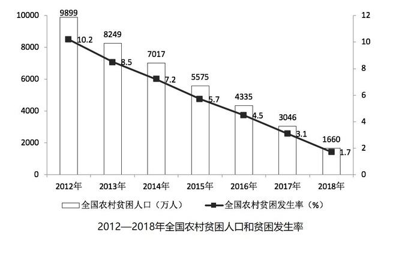

        2018年，贫困地区农村居民人均可支配收入10371元，扣除价格因素，实际增长，实际增速高出全国农村居民人均可支配收入实际增速1.7个百分点，圆满完成增长幅度高于全国增速的年度目标任务。

### 第 6 题　qid 2374697 · 综合

从2012年末到2018年末，全国农村贫困人口数减少了（    ）万人。

- **A**. 6239
- **B**. 7239
- **C**. 8239　✅
- **D**. 9230

**答案**：C

**官方解析**

根据题意“······减少了（    ）万人”，可判定本题为增长量计算问题。定位文字材料第一段或柱形图，可得2012年末为9899万人，2018年末为1660万人， 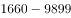，减少了8239万人。

故正确答案为C。

---

### 第 7 题　qid 2374705 · 增长

2013—2018年，全国农村贫困发生率较上年下降最多的是（    ）年。

- **A**. 2013　✅
- **B**. 2015
- **C**. 2017
- **D**. 2018

**答案**：A

**官方解析**

本题所求“······全国农村贫困发生率较上年下降最多······”，定位折线图，A项2013年：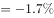，即下降1.7个百分点；B项2015年： 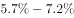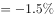，即下降1.5个百分点；C项2017年： 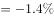，即下降1.4个百分点；D项2018年：，即下降1.4个百分点。则下降最多的为A项2013年。

故正确答案为A。

---

### 第 8 题　qid 2374713 · 平均数

2018年，我国贫困地区农村居民人均工资性收入约占人均可支配收入的（    ）。

- **A**. 

- **B**. 

- **C**. 

- **D**. 

　✅

**答案**：D

**官方解析**

根据问题“······占······”，结合时间为2018年，判定本题为现期比重问题。定位表格，可得：2018年我国贫困地区农村居民人均工资性收入为3627元；定位文字第二段，可得：2018年我国贫困地区农村居民人均可支配收入10371元，则所占比重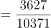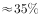。

故正确答案为D。

---

### 第 9 题　qid 2374716 · 综合

2018年，我国贫困地区农村居民收入来源中，最高的是（     ）。

- **A**. 人均工资性收入
- **B**. 人均转移净收入
- **C**. 人均经营净收入　✅
- **D**. 人均财产净收入

**答案**：C

**官方解析**

题目所求“2018年我国贫困地区农村居民收入来源最高的”，定位表格，观察数据可得，人均经营净收入3888元最高。
故正确答案为C。

---

### 第 10 题　qid 2374723 · 综合

下列说法不正确的是（    ）。

- **A**. 
2012—2018年，全国农村贫困人口逐年递减

- **B**. 
2018年，全国农村居民人均可支配收入实际增速为

- **C**. 
2018年，贫困地区农村居民各来源的人均收入较上年均有提高

- **D**. 
2017年，贫困地区农村居民人均经营净收入比转移净收入高近1000元
　✅

**答案**：D

**官方解析**

A项：定位柱形图，2012～2018年，全国农村贫困人口逐年递减（根据柱子高度，逐渐降低），说法正确，排除；

B项：定位文字材料，“2018年······人均可支配收入实际增长，高出全国农村居民人均可支配收入实际增速1.7个百分点”，那么2018年全国农村居民人均可支配收入实际增速为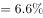，说法正确，排除；

C项：定位表格，比较2018年和2017年的收入来源，发现各个来源的收入均有所提高，说法正确，排除；

D项：定位表格，可得：2017年，贫困地区农村居民人均经营净收入为3723元，转移净收入为2325元，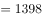元，即多1398元，所以“近1000元”说法错误，当选。

本题为选非题，故正确答案为D。

---

## 材料 3

        2018年，我国全社会用电量68449亿千瓦时，同比增长，增幅同比提高1.9个百分点。具体来看，第一产业用电量728亿千瓦时，同比增长；第二产业用电量47235亿千瓦时，同比增长；第三产业用电量10801亿千瓦时，同比增长；城乡居民生活用电量9685亿千瓦时，同比增长。

        2018年，我国可再生能源发电量达1.87万亿千瓦时，同比增长约1700亿千瓦时；可再生能源发电量占全年发电总量比重为，同比上升0.2个百分点。

### 第 11 题　qid 2374696 · 增长

2018年，我国全社会用电量较2016年增加了约（    ）。

- **A**. 

- **B**. 

　✅
- **C**. 

- **D**. 

**答案**：B

**官方解析**

由题干“2018年我国全社会用电量较2016年增加了约”，结合选项为百分数，可判定本题为间隔增长率计算问题。定位文字材料第一段，“2018年我国全社会用电量68449亿千瓦时，同比增长，增幅同比提高1.9个百分点”，可知，。代入间隔增长率计算公式：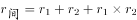，则2018年我国全社会用电量较2016年增加了。

故正确答案为B。

---

### 第 12 题　qid 2374721 · 综合

2017年，我国三大产业及城乡居民生活用电量大小排序正确的是（    ）。

- **A**. 
第二产业用电第三产业用电城乡居民生活用电第一产业用电
　✅
- **B**. 
第三产业用电城乡居民生活用电第一产业用电第二产业用电

- **C**. 
第二产业用电城乡居民生活用电第三产业用电第一产业用电

- **D**. 
第一产业用电第二产业用电第三产业用电城乡居民生活用电

**答案**：A

**官方解析**

由题干“2017年···大小排序正确的是”，结合材料时间为2018年，可判定本题为基期比较问题。定位文字材料第一段可得，“2018年第一产业用电量728亿千瓦时，同比增长；第二产业用电量47235亿千瓦时，同比增长；第三产业用电量10801亿千瓦时，同比增长；城乡居民生活用电量9685亿千瓦时，同比增长”。根据，则2017年三大产业及城乡居民生活用电量分别为：

第一产业：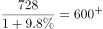亿千瓦时；

第二产业：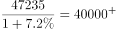亿千瓦时；

第三产业：亿千瓦时；

城乡居民生活：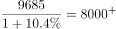亿千瓦时。

则大小排序为：第二产业用电第三产业用电城乡居民生活用电第一产业用电，与A项一致。

故正确答案为A。

---

### 第 13 题　qid 2374727 · 综合

2018年，我国发电总量约为（    ）万亿千瓦时。

- **A**. 1.87
- **B**. 3.70
- **C**. 5.84
- **D**. 7.00　✅

**答案**：D

**官方解析**

由题干“2018年我国发电总量约为多少万亿千瓦时”，结合材料给出2018年可再生能源发电量及其占全年发电总量比重，可判定本题为现期比重问题。定位文字材料第二段，“2018年我国可再生能源发电量达1.87万亿千瓦时，占全年发电总量比重为”，根据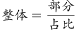，2018年我国发电总量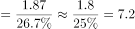万亿千瓦时，与D项最接近。

故正确答案为D。

---

### 第 14 题　qid 2374732 · 增长

2017年，下列可再生能源发电量同比增幅最大的是（    ）。

- **A**. 水电
- **B**. 风电
- **C**. 光伏发电　✅
- **D**. 生物质发电

**答案**：C

**官方解析**

由题干“2017年···同比增幅最大的是”，可判定本题为增长率比较问题。定位表格可知2016年、2017年各项可再生资源发电量，根据，2017年各项增长率分别为：

水电：；

风电：；

光伏发电：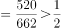；

生物质发电：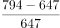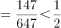。

则同比增幅最大的是光伏发电。

故正确答案为C。

---

### 第 15 题　qid 2374740 · 综合

根据以上材料，下列说法不正确的是（    ）。

- **A**. 
2018年，我国第二产业用电量是第三产业用电量的4倍多

- **B**. 
2017年和2018年，我国风电发电量同比增幅均超过
　✅
- **C**. 
2017年，我国可再生能源发电量占全年发电总量的

- **D**. 
2018年，我国全口径发电设备容量较2016年增加约2.48亿千瓦

**答案**：B

**官方解析**

A项：定位文字材料第一段可知，“（2018年）第二产业用电量47235亿千瓦时，第三产业用电量10801亿千瓦时”。，正确；

B项：定位表格可知，2016年我国风电发电量为2420亿千瓦时，2017年为3057亿千瓦时，2018年为3660亿千瓦时。2017年同比增速为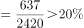，2018年同比增速为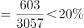，错误；

C项：定位文字材料第二段可知，“（2018年）可再生能源发电量占全年发电总量比重为，同比上升0.2个百分点”。则2017年，我国可再生能源发电量占全年发电总量的比重为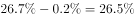，正确；

D项：定位表格可知，2018年我国全口径发电设备容量为189967万千瓦，2016年为165151万千瓦。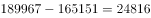万千瓦亿千瓦，正确。

本题为选非题，故正确答案为B。

---
