# 2019年新疆生产建设兵团面向社会招录公务员考试《行测》题（网友回忆版）

> 资料分析 · 20 题 · 新疆 2019

## 材料 1

根据以下资料，回答96～100题。

        截至2018年底，全国注册登记的提供住宿的各类民政服务机构共计3.1万个，其中注册登记为事业单位的1.6万个，同比减少；注册登记为民办非企业单位的1.5万个，同比增加。机构内床位408.1万张，同比减少；年末收留抚养人员211.9万人，同比减少。

       

### 第 1 题　qid 2434309 · 综合

2017年，全国注册登记的提供住宿的各类民政服务机构共计约多少万个？（    ）

- **A**. 2.9
- **B**. 3.1　✅
- **C**. 3.3
- **D**. 3.5

**答案**：B

**官方解析**

根据题干“2017年，全国注册登记······共计约多少万个”，结合材料可得“全国注册登记的提供住宿的各类民政服务机构=注册登记为事业单位的+注册登记为民办非企业单位的”，同时时间为2018年，可判定本题为基期和差问题。

方法一：定位文字材料“截至2018年底，全国注册登记的提供住宿的各类民政服务机构共计3.1万个，其中注册登记为事业单位的1.6万个，同比减少；注册登记为民办非企业单位的1.5万个，同比增加”，则2017年全国注册登记的提供住宿的各类民政服务机构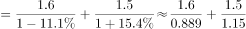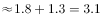万个。

方法二：根据“增长量”可得，2018年注册登记为事业单位的减少量万个；注册登记为民办非企业单位的增长量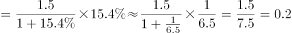万个。则2018年全国注册登记的提供住宿的各类民政服务机构增长量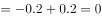，即数量与上年持平，B项满足。

故正确答案为B。

---

### 第 2 题　qid 2434310 · 综合

2017年，全国注册登记的提供住宿的各类民政服务机构收留抚养人员约为多少万人？（    ）

- **A**. 197.3
- **B**. 208.6
- **C**. 228.8　✅
- **D**. 235.7

**答案**：C

**官方解析**

根据题干“2017年，全国······收留抚养人员约为多少万人”，结合材料时间为2018年，可判定本题为基期计算问题。定位文字材料“（2018年）年末收留抚养人员211.9万人，同比减少”，则2017年收留抚养人员总数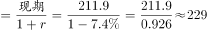，与C项接近。

故正确答案为C。

---

### 第 3 题　qid 2434311 · 增长

提供住宿的民政服务机构的床位数量，2015～2018年4年年增长率的平均值约为（    ）。

- **A**. 

- **B**. 

　✅
- **C**. 
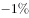

- **D**. 

**答案**：B

**官方解析**

根据题干“2015～2018年4年年增长率的平均值······”，可判定本题为一般增长率问题。定位柱状图可得，2014年-2018年提供住宿的民政服务机构床位数依次为482.3万张、393.2万张、414.0万张、419.6万张、408.1万张。代入公式：，

则2015～2018年4年的增长率依次是：2015年：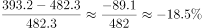；2016年：；2017年：；2018年：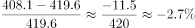。则4年年增长率的平均值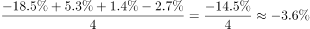。

近似为B项。

故正确答案为B。

---

### 第 4 题　qid 2434317 · 综合

下列哪个饼图能反映2018年提供住宿的民政服务机构的构成情况？（    ）

- **A**. 
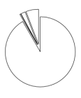
　✅
- **B**. 

- **C**. 

- **D**. 
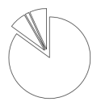

**答案**：A

**官方解析**

根据题干“2018年······民政服务机构的构成情况”，即民政服务机构各部分的占比情况，可判定本题为现期比重问题。定位表格，提供住宿的民政服务机构由养老机构、精神疾病服务机构、儿童福利和救助机构、其他提供住宿机构四个部分构成，其数据之比为。可知第一个数据最大，在总量一定的情况下，占比也最大，排除B选项；第二个数据最小，则占比也最小，排除C、D选项。

故正确答案为A。

---

### 第 5 题　qid 2434318 · 综合

根据上述资料可以推出的是（    ）。

- **A**. 
2018年提供住宿的养老机构中，平均每个机构的床位数约为132张
　✅
- **B**. 
2018年提供住宿的民政服务机构构成中，机构数量最少的床位数量也最少

- **C**. 
2014～2018年中，提供住宿的民政服务机构床位数量同比增长最快的是2017年

- **D**. 
2018年，儿童福利和救助机构的床位数占提供住宿的民政服务机构床位总数的以上

**答案**：A

**官方解析**

A项：定位表格材料可得，2018年提供住宿的养老机构中，平均每个机构的床位数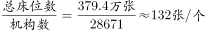，正确；

B项：定位表格，2018年提供住宿的民政服务机构的构成中，机构数最少的是社会福利医院，床位数最少的是未成年人救助保护中心，错误；

C项：定位柱状图，提供住宿的民政服务机构床位数2017年增长率，2016年增长率，2017年并非最快，错误；

D项：2018年，儿童福利和救助机构的床位数为9.7万张，提供住宿的民政服务机构床位总数为408.1万张，故前者所占比重，错误。

故正确答案为A。

---

## 材料 2

        2018年，A省公共财政预算收入1180.07亿元，比上年增长。其中，一般公共预算收入103.82亿元，比上年下降。全年A省实际完成地方税收收入104亿元，中央财政返还68.60亿元，增长。A省一般公共预算支出从2012年的603.2亿元增加到2018年的958.41亿元，2018年同比增长。

        2018年末，A省辖区各项存款余额3051.06亿元，同比增长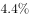。其中，个人存款1491.89亿元，增长；单位存款1531.38亿元，下降；代理财政性存款25.38亿元，增长17.9倍。A省辖区各项贷款余额2574.10亿元，同比增长。其中，个人贷款311.99亿元，下降；单位贷款2202.74亿元，增长；含票据融资59.38亿元，增长。

        2018年，农行A省分行年末各项本外币存款余额1300.85亿元，同比增长，比上年同期下降7个百分点。其中，个人存款645.62亿元，增长；单位存款653.96亿元，下降；同业存款1.26亿元，下降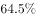。年末各项贷款余额662.92亿元，同比增长，比上年同期下降19个百分点。其中，个人贷款103.52亿元，增长；单位贷款484.65亿元，下降；贸易融资57.59亿元，增长；贴现及转贴现净值17.16亿元，增长155.0倍。

### 第 6 题　qid 2434312 · 综合

2017年，A省一般公共预算收入约占A省公共财政预算收入的（    ）。

- **A**. 

- **B**. 

- **C**. 

　✅
- **D**. 

**答案**：C

**官方解析**

由题干“2017年······约占······”，结合材料时间为2018年，可判定此题为基期比重计算问题。定位文字材料第一段“2018年，A省公共财政预算收入1180.07亿元，比上年增长。其中一般公共预算收入103.82亿元，比上年下降”。根据基期比重公式，代入数据可得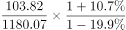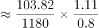，与C项最接近。

故正确答案为C。

---

### 第 7 题　qid 2434313 · 增长

2018年，下列A省的4个金融指标中，同比增量最多的是（    ）。

- **A**. 个人存款　✅
- **B**. 代理财政性存款
- **C**. 单位贷款
- **D**. 含票据融资

**答案**：A

**官方解析**

由题干“2018年······同比增量最多的是”，可判定此题为增长量比较问题。定位文字材料第二段“2018年末，A省辖区个人存款1491.89亿元，增长；代理财政性存款25.38亿元，增长17.9倍；单位贷款2202.74亿元，增长；含票据融资59.38亿元，增长”。根据增长量计算公式，代入数据可得：

A项：个人存款增量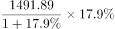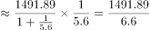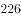亿元

B项：代理财政性存款增量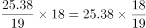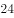亿元；

C项：单位贷款增量亿

D项：含票据融资增量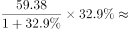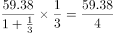亿元；

增量最大的为A项，故正确答案为A。

---

### 第 8 题　qid 2434314 · 综合

2017年末，A省辖区各项存贷款余额之差约在哪个范围内？（    ）

- **A**. 440～480亿元
- **B**. 480～520亿元
- **C**. 520～560亿元
- **D**. 560～600亿元　✅

**答案**：D

**官方解析**

由题干“2017年······存贷款之差”，结合材料时间为2018年，可判定此题为基期和差问题。定位文字材料第二段“2018年末，A省辖区各项存款余额3051.06亿元，同比增长，各项贷款余额2574.10亿元，同比增长”。根据基期量公式“”，代入数据可得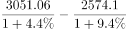亿元，在D项范围内。

故正确答案为D。

---

### 第 9 题　qid 2434315 · 综合

2017年，农行A省单位贷款额是个人贷款额的（    ）。

- **A**. 3～4倍
- **B**. 4～5倍
- **C**. 5～6倍　✅
- **D**. 6～7倍

**答案**：C

**官方解析**

由题干“2017年······是······多少倍”，结合材料时间为2018年，可判定此题为基期倍数计算问题。定位文字材料第三段“2018年，农行A省个人贷款103.52亿元，增长；单位贷款484.65亿元，下降”。根据基期倍数公式，代入数据可得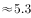倍，在C项范围内。

故正确答案为C。

---

### 第 10 题　qid 2434316 · 综合

下列哪个指标不能从上述资料中推出？（    ）

- **A**. 2012年到2018年A省一般公共预算支出的平均增长率
- **B**. 2017年农行A省分行年末各项本外币存款余额的同比增长量
- **C**. 2016年农行A省分行年末各项贷款余额占A省辖区各项贷款余额的比重　✅
- **D**. 2017年A省个人贷款额和农行A省分行个人贷款额的比值

**答案**：C

**官方解析**

A项：定位材料第一段“A省一般公共预算支出从2012年的603.2亿元增加到2018年的958.41亿元”，结合年均增长率公式：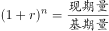，由于现期2018年数据、基期2012年数据以及年份差均已知，故年均增长率可以推出（此处平均增长率即为年均增长率）；

B项：定位材料第三段“2018年，农行A省分行年末各项本外币存款余额1300.85亿元，同比增长，比上年同期下降7个百分点”， 则2017年农行A省分行年末各项本外币存款余额=亿元，又可得2017年农行A省分行年末各项本外币存款余额同比增速，因此其2017年的现期量和同比增速均已知，故其同比增长量可以推出；

C项：定位材料第二段“2018年A省辖区各项贷款余额2574.10亿元，同比增长”，仅能得到2017年A省辖区各项贷款余额的量，缺少同比增速或同比增长量，无法得到其2016年的值，因此2016年的占比无法推出；

D项：定位材料第二三段“2018年末，A省个人贷款311.99亿元，下降；农行A省分行个人贷款103.52亿元，增长”，即2018年两者的现期量和同比增长率均已知，故2017年的比值可以推出。

本题为选非题，故正确答案为C。

---

## 材料 3

        截至2018年底，全国共有社会组织81.7万个，比上年增长，其中社会团体36.6万个，民办非企业单位44.4万个，基金会7034个；吸纳社会各类人员就业980.4万人，比上年增长。

### 第 11 题　qid 2434304 · 平均数

2018年，每个社会组织平均吸纳社会各类人员就业的数量约为多少人？（    ）

- **A**. 10
- **B**. 11
- **C**. 12　✅
- **D**. 13

**答案**：C

**官方解析**

根据题干“2018年，每个······平均······多少人”，可判定本题为现期平均数问题。定位文字材料“截止2018年底，全国共有社会组织81.7万个······吸纳社会各类人员就业980.4万人······”，则每个社会组织平均吸纳社会各类就业人数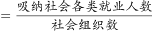个。

故正确答案为C。

---

### 第 12 题　qid 2434305 · 增长

若按2014～2018年社会团体数量的年均增长速度持续增长，2019年的社会团体数量约为（    ）万个。

- **A**. 36.8
- **B**. 37.9
- **C**. 38.1　✅
- **D**. 40.2

**答案**：C

**官方解析**

根据题干“若按······年均增长速度持续增长······2019年的······数量”，可判定本题为现期计算问题。定位图1，2014社会团体数量为31.0万个，2018年为36.6万个。根据年均增长率计算公式：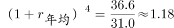，则。根据，则2019年社会团体数量万个。

故正确答案为C。

---

### 第 13 题　qid 2434306 · 增长

能反映2015～2018年民办非企业单位数量增长率的折线图是（    ）。

- **A**. 

- **B**. 

　✅
- **C**. 

- **D**. 

**答案**：B

**官方解析**

根据题干“2015～2018年······增长率”，可判定本题为一般增长率问题。定位图1，民办非企业单位数2015～2018年增长率分别为：2015年增长率；2016年增长率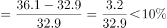；2017年增长率；2018年增长率。可见大小关系为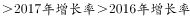，结合选项最接近的为B项。

故正确答案为B。

---

### 第 14 题　qid 2434307 · 综合

2015～2017年，不具有公开募捐资格的基金会和具有公开募捐资格的基金会，数量差值排序从高到低依次是（    ）。

- **A**. 

　✅
- **B**. 

- **C**. 

- **D**. 

**答案**：A

**官方解析**

定位图2， 2015差值个，2016差值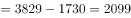个，2017差值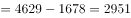个，显然。

故正确答案为A。

---

### 第 15 题　qid 2434308 · 综合

根据上述资料可以推出的是（    ）。

- **A**. 
2018年，基金会数量约占全国社会组织总数的

- **B**. 
2017年，民办非企业单位数量增量高于社会团体增量
　✅
- **C**. 
2015～2018年，基金会增长率最低的年份，社会团体的增长率也最低

- **D**. 
2014～2018年，不具有公开募捐资格的基金会数量占基金会总量的比重逐年增加

**答案**：B

**官方解析**

A项：定位文字材料“截止2018年底，全国共有社会组织81.7万个······基金会7034个”，则基金会数量约占全国社会组织总数的比重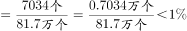，错误；

B项：定位图1，2017年民办非企业单位数量增量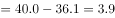万个，2017年社会团体增量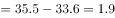万个，故，正确；

C项：定位图2，基金会数量，则2014～2018年基金会数量分别为：2014年个，2015年个，2016年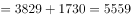个，2017年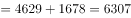个，2018年个。则2015～2018年基金会增长率分别为：2015年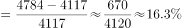；2016年；2017年；2018年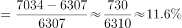，增长率最低的年份为2018年。定位图1，2018年社会团体的增长率，但2016年社会团体的增长率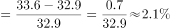，显然基金会增长率最低的2018年，社会团体的增长率并非最低，错误；

D项：定位图2，结合C项的计算结果，2017年、2018年不具有公开募捐资格的基金会数量占基金会总量的比重分别为，，可见比重并非逐年增加，错误。

故正确答案为B。

---

## 材料 4

根据以下资料，回答111～115题。

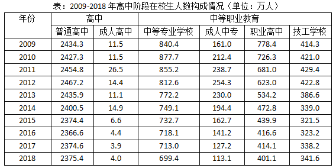

### 第 16 题　qid 2434289 · 综合

2009～2018年，高中在校生人数超过2400万的年份有（    ）个。

- **A**. 5
- **B**. 6　✅
- **C**. 7
- **D**. 8

**答案**：B

**官方解析**

定位表格材料第二、三列可得：

2009年高中在校生人数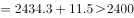万人；

2010年高中在校生人数万人；

2011年高中在校生人数万人；

2012年高中在校生人数万人；

2013年高中在校生人数万人；

2014年高中在校生人数万人；

2015年高中在校生人数万人；

2016年高中在校生人数万人；

2017年高中在校生人数万人；

2018年高中在校生人数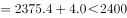万人。

据此，高中在校生人数超过2400万的年份为2009年——2014年，共6年。

故正确答案为B。

---

### 第 17 题　qid 2434291 · 综合

2018年，高中阶段在校生总人数约为（    ）万人。

- **A**. 3764
- **B**. 3811
- **C**. 3935　✅
- **D**. 4062

**答案**：C

**官方解析**

定位表格材料最后一行可得：2018年，高中阶段在校生总人数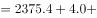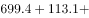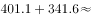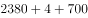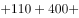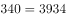万人。与C项最接近。

故正确答案为C。

---

### 第 18 题　qid 2434294 · 综合

2017年，职业高中在校生人数约占中等职业教育在校生人数的（    ）。

- **A**. 

- **B**. 

- **C**. 

　✅
- **D**. 

**答案**：C

**官方解析**

由题干“2017年，······占······”，可判定本题为现期比重问题。定位表格材料倒数第二行可得：2017年中等专业学校、成人中专、技工学校在校生人数分别为713.0万人、127.2万人、338.2万人，职业高中在校生人数为414.1万人。则2017年职业高中在校生人数约占中等职业教育在校生人数的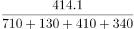。

故正确答案为C。

---

### 第 19 题　qid 2434297 · 增长

下列哪个折线图能够反映2014～2017年成人高中在校生人数增长率的情况？（    ）

- **A**. A
- **B**. B
- **C**. C
- **D**. D　✅

**答案**：D

**官方解析**

由题干“······2014~2017年成人高中······增长率······”，可判定本题为一般增长率计算问题。定位表格材料第三列可得：2013年-2017年成人高中在校生人数分别为11.1万人、14.9万人、6.6万人、4.4万人、3.9万人。根据公式，增长率，可得：

2014年增长率为；

2015年增长率为；

2016年增长率为；

2017年增长率为。

由此可知，最小的是2015年（即第二个点最低），观察四个选项排除A、B两项。对比C、D项，第一个点和第四个点对应2014年的和2017年的，而C项两个点差不多高，与实际数值不符，排除C项。 

故正确答案为D。

---

### 第 20 题　qid 2434301 · 综合

根据上述资料可以推出的是（    ）。

- **A**. 
2010～2013年，成人中专在校生人数的减少量绝对值逐年增加

- **B**. 
2009年，高中在校生人数占高中阶段在校生总人数一半以上
　✅
- **C**. 
2014～2018年，中等专业学校在校生人数最少的一年，技工学校在校生人数也最少

- **D**. 
2016～2018年，成人中专在校生人数年平均增长率超过

**答案**：B

**官方解析**

A项，定位表格材料第五列，2010年、2011年成人中专在校生人数分别为212.4万人、238.7万人。可以看出2011年的人数2010年的人数，增长量为正，不存在减少量。错误；

B项，定位表格材料第三行，2009年普通高中、成人高中在校生人数分别为2434.3万人、11.5万人；中等专业学校、成人中专、职业高中、技工学校在校生人数分别为840.4万人、161.0万人、778.4万人、414.3万人。根据公式：比重，则2009年，高中在校生人数占高中阶段在校生总人数。正确；

C项，定位表格材料第四列，2014-2018年，中等专业学校在校生人数最少的一年是2018年（699.4万人）。定位表格材料最后一列，2014-2018年，技工学校在校生人数最少的一年是2015年（321.5万人），并非同一年。错误；

D项，定位表格材料第五列，2016-2018年，成人中专在校生人数分别为141.2万人、127.2万人、113.1万人。人数在减少，年平均增长率为负，应小于。错误。

故正确答案为B。

---
