# 2019年江苏省公务员录用考试《行测》题（A类）（网友回忆版）

> 资料分析 · 20 题 · 江苏 2019

## 材料 1

        2018年国家统计局组织开展了第二次全国时间利用的随机抽样调查，共调查48580人。结果显示，受访居民在一天的活动中，有酬劳动平均用时4小时24分钟。其中，男性5小时15分钟，女性3小时35分钟；城镇居民3小时59分钟，农村居民5小时1分钟；工作日4小时50分钟，休息日3小时19分钟。受访居民有酬劳动的参与率为，其中城镇居民。受访居民无酬劳动平均用时2小时42分钟。其中，女性3小时48分钟；农村居民2小时39分钟；工作日2小时34分钟。受访居民无酬劳动的参与率为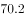，其中男性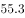。

        无酬劳动包括家务劳动、陪伴照料孩子生活、护送辅导孩子学习、陪伴照料成年家人、购买商品或服务、看病就医和公益活动。受访居民家务劳动平均用时1小时26分钟，参与率为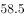。其中，女性2小时6分钟，参与率。受访居民陪伴照料孩子生活平均用时36分钟，参与率为；护送辅导孩子学习平均用时9分钟，参与率为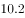；陪伴照料成年家人平均用时8分钟，参与率为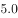；看病就医平均用时4分钟，参与率为；公益活动平均用时3分钟，参与率为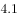。

### 第 1 题　qid 2368023 · 平均数

受访农村居民每日无酬劳动平均用时占其劳动平均用时的比重为

- **A**. 

- **B**. 

　✅
- **C**. 

- **D**. 

**答案**：B

**官方解析**

“居民在一天的活动中，有酬劳动······农村居民5小时1分钟；无酬劳动······农村居民2小时39分钟”，统一单位为分钟，则受访农村居民在一天的活动中，有酬劳动301分钟；无酬劳动159分钟，故受访农村居民每日无酬劳动平均用时占其劳动平均用时的比重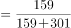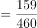。

故正确答案为B。

---

### 第 2 题　qid 2367767 · 平均数

下列活动的排列中，受访居民每日平均用时依次减少的是

- **A**. 护送辅导孩子学习、购买商品或服务、看病就医
- **B**. 护送辅导孩子学习、看病就医、购买商品或服务
- **C**. 购买商品或服务、护送辅导孩子学习、看病就医　✅
- **D**. 购买商品或服务、看病就医、护送辅导孩子学习

**答案**：C

**官方解析**

由题干“······受访居民每日平均用时依次减少的是”，可判定本题为排序类问题。定位材料第一段可得：“受访居民无酬劳动平均用时2小时42分钟”，定位材料第二段可得：“无酬劳动包括家务劳动、陪伴照料孩子生活、护送辅导孩子学习、陪伴照料成年家人、购买商品或服务、看病就医和公益活动。受访居民家务劳动平均用时1小时26分钟······。受访居民陪伴照料孩子生活平均用时36分钟······；护送辅导孩子学习平均用时9分钟······；陪伴照料成年家人平均用时8分钟······；看病就医平均用时4分钟······；公益活动平均用时3分钟······”，统一时间单位为分钟，则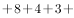购买商品或服务平均用时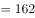，购买商品或服务平均用时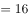分钟，故受访居民每日平均用时依次减少的是购买商品或服务、护送辅导孩子学习、看病就医，C项符合。

故正确答案为C。

---

### 第 3 题　qid 2367768 · 平均数

参与有酬劳动的受访城镇居民，每日有酬劳动的平均用时为

- **A**. 5小时50分钟
- **B**. 6小时40分钟
- **C**. 7小时30分钟　✅
- **D**. 8小时20分钟

**答案**：C

**官方解析**

由题干“参与有酬劳动的受访城镇居民，每日有酬劳动的平均用时为”，题目所求，判定本题为现期平均数问题。结合材料第一段可得：2018年，受访城镇居民一天的活动中有酬劳动平均用时为3小时59分钟，即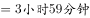；受访的城镇居民有酬劳动的参与率为，即，则题目所求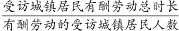。

故正确答案为C。

---

### 第 4 题　qid 2368026 · 综合

受访的男性居民约有

- **A**. 2.4万人　✅
- **B**. 2.6万人
- **C**. 2.9万人
- **D**. 3.0万人

**答案**：A

**官方解析**

由题干“受访的男性居民约有”，结合材料给出整体平均时间，及男女平均时间，可判定本题为混合平均数计算问题。定位材料第一段可得，“···共调查48580人。结果显示，受访居民在一天的活动中，有酬劳动平均用时4小时24分钟。其中，男性5小时15分钟，女性3小时35分钟”。根据“混合居中但不中，距离与量成反比”可知，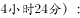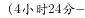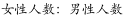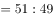。则男性人数为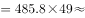万人，与A项最为接近。

故正确答案为A。

---

### 第 5 题　qid 2367772 · 综合

从上述资料中能够推出的是

- **A**. 
受访居民休息日无酬劳动平均用时多于3小时
　✅
- **B**. 
受访女性居民无酬劳动的参与率介于和之间

- **C**. 
受访居民中，有酬劳动和无酬劳动都参与的占比至少为

- **D**. 
受访居民不同类型无酬劳动的平均用时和参与率呈正相关

**答案**：A

**官方解析**

A项：定位材料第一段可得，“受访居民在一天的活动中，有酬劳动平均用时4小时24分钟。其中······工作日4小时50分钟，休息日3小时19分钟。······受访居民无酬劳动平均用时2小时42分钟。其中······工作日2小时34分钟”。根据“混合居中但不中，距离与量成反比”可知。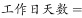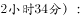，解得休息日无酬劳动时长为3小时2分钟3小时，正确；

B项：定位材料第一段可得，“受访居民无酬劳动的参与率为，其中男性”。根据“混合居中不正中”可知，受访女性居民无酬劳动参与率大于，错误；

C项：定位材料第一段可得“受访居民有酬劳动的参与率为，······无酬劳动的参与率为”，根据“两集合容斥原理”计算公式可知，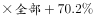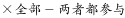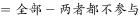。当两者都不参与取最低值0时，都参与的人数也为最低值，为全部人数的，错误；

D项：定位材料第二段可得，“看病就医平均用时4分钟，参与率为；公益活动平均用时3分钟，参与率为”。4分钟3分钟，，可知并非参与时间越长，参与率越高，错误。

故正确答案为A。

---

## 材料 2

        2018年江苏第一、二、三产业增加值分别为4142亿元、41248亿元和47205亿元；城镇常住居民人均可支配收入47200元，增长8.2，农村常住居民人均可支配收入20845元，增长8.8；一般公共预算收入8630亿元，一般公共预算支出11658亿元。

### 第 6 题　qid 2367761 · 增长

2018年江苏第三产业增加值比第二产业多

- **A**. 
12.6

- **B**. 
14.4
　✅
- **C**. 
15.1

- **D**. 
16.2

**答案**：B

**官方解析**

根据题干“2018年江苏第三产业增加值比第二产业多”，结合选项都是百分数，可判定本题为一般增长率问题。定位文字材料可知，2018年江苏第二、三产业增加值分别为41248亿元和47205亿元。根据公式：r，则题干所求为，与B项最接近。

故正确答案为B。

---

### 第 7 题　qid 2367762 · 综合

上表所有指标中，2017年苏南与苏北地区指标数值相差不到一倍的有

- **A**. 5项
- **B**. 6项　✅
- **C**. 7项
- **D**. 8项

**答案**：B

**官方解析**

根据题干“……2017年苏南与苏北地区指标数值相差不到一倍的有”，结合表格材料时间为2017年，可判定本题为现期倍数问题。定位表格材料可知2017年苏南与苏北地区部分社会经济发展指标数据。苏南与苏北地区指标数值相差不到一倍，即为两者之间倍数&lt;2倍。则表中苏南与苏北地区各指标倍数分别为：

一般公共预算收入：倍&gt;2倍，排除；

一般公共预算支出：倍&lt;2倍，符合；

乡村从业人员：倍&gt;2倍，排除；

农林牧渔业总产值：倍&gt;2倍，排除；

高速公路：倍&lt;2倍，符合；

私人汽车拥有量：倍&gt;2倍，排除；

社会消费品零售总额：倍&gt;2倍，排除；

出口：&gt;10倍，排除；

进口：&gt;10倍，排除；

旅游外汇收入：&gt;10倍，排除；

城镇常住居民人均可支配收入：倍&lt;2倍，符合；

城镇常住居民人均生活消费支出：倍&lt;2倍，符合；

农村常住居民人均可支配收入：倍&lt;2倍，符合；

农村常住居民人均生活消费支出：倍&lt;2倍，符合。

综上，满足条件的指标有：一般公共预算支出、高速公路、城镇常住居民人均可支配收入、城镇常住居民人均生活消费支出、农村常住居民人均可支配收入、农村常住居民人均生活消费支出，共6项。

故正确答案为B。

---

### 第 8 题　qid 2367763 · 增长

2018年江苏一般公共预算收入比上年增加

- **A**. 963亿元　✅
- **B**. 988亿元
- **C**. 1963亿元
- **D**. 1971亿元

**答案**：A

**官方解析**

根据题干“2018年······比上年增加”，结合选项带单位，可判定本题为增长量计算问题。定位文字材料可知，2018年江苏一般公共预算收入8630亿元；定位表格材料可知，2017年苏南、苏中、苏北一般公共预算收入分别为4913亿元、1246亿元、1508亿元。则2017年江苏一般公共预算收入为4913+1246+1508=7667亿元。根据公式：增长量=现期量-基期量，则题干所求为8630-7667=963亿元。
故正确答案为A。

---

### 第 9 题　qid 2367764 · 平均数

2017年苏南、苏中、苏北地区就业人员人均产业增加值最大的是

- **A**. 苏中第三产业
- **B**. 苏南第二产业
- **C**. 苏南第三产业　✅
- **D**. 苏北第二产业

**答案**：C

**官方解析**

根据题干“2017年……人均产业增加值最大的是”，结合材料给出2017年相关数据 ，可判定本题为现期平均数问题。定位图1、图2可知2017年江苏三大区域三次产业就业人数及三次产业增加值。根据公式：就业人员人均产业增加值，则各选项就业人员人均产业增加值分别为：

苏中第三产业，万元；

苏南第二产业，万元；

苏南第三产业，万元；

苏北第二产业，万元。

综上，2017年苏南、苏中、苏北地区就业人员人均产业增加值最大的是苏南第三产业。

故正确答案为C。

---

### 第 10 题　qid 2367765 · 综合

从上述资料中能够推出的是

- **A**. 2017年苏中地区高速公路的里程不足全省的五分之一
- **B**. 2017年苏北和苏中地区进口额之和不及苏南的八分之一
- **C**. 2018年江苏城镇和农村常住居民人均可支配收入的绝对差距比上年有所缩小
- **D**. 2017年苏中农村常住居民人均生活消费支出与人均可支配收入的比值大于苏南　✅

**答案**：D

**官方解析**

A项：定位表格材料可知，2017年苏南、苏中、苏北高速公路里程分别为1870公里、948公里、1870公里。根据公式：比重，则2017年苏中高速公路里程占全省的比重为，即超过五分之一，错误；

B项：定位表格材料可知，2017年苏南、苏中、苏北进口额分别为1993.0亿美元、175.5亿美元、109.9亿美元。则2017年苏中和苏北进口额之和与苏南的比例为，即大于八分之一，错误；

C项：定位文字材料可知，2018年江苏城镇常住居民人均可支配收入47200元，增长8.2%，农村常住居民人均可支配收入20845元，增长8.8%。则2018年江苏城镇和农村常住居民人均可支配收入的绝对差距为元。根据公式：基期量，则2017年江苏城镇和农村常住居民人均可支配收入的绝对差距为，即2018年江苏城镇和农村常住居民人均可支配收入的绝对差距比上年有所增大，错误；

D项：定位表格材料可知，2017年苏中农村常住居民人均可支配收入与人均生活消费支出分别为20000元、14644元，苏南分别为26759元、18872元。则2017年苏中农村常住居民人均生活消费支出与人均可支配收入的比值为，苏南农村常住居民人均生活消费支出与人均可支配收入的比值为，即2017年苏中农村常住居民人均生活消费支出与人均可支配收入的比值大于苏南，正确。

故正确答案为D。

---

## 材料 3

        2018年全国互联网业务收入9562亿元，比上年增长。其中，广东、上海、北京互联网业务收入分别增长、和。2018年互联网企业信息服务收入8594亿元，比上年增长。其中，电子商务平台收入3667亿元，增长；网络游戏业务收入1948亿元，增长。2018年互联网行业研发投入490亿元，比上年增长。

### 第 11 题　qid 2368028 · 综合

2017年全国互联网企业电子商务平台收入为

- **A**. 2938亿元
- **B**. 3012亿元
- **C**. 3076亿元
- **D**. 3242亿元　✅

**答案**：D

**官方解析**

由题干“2017年……为多少亿元”，结合材料时间为2018年，判定本题为基期计算问题。定位文字部分可得“2018年……其中，电子商务平台收入3667亿元，增长”。代入公式：，则2017年，全国互联网企业电子商务平台收入=，与D项最接近。

故正确答案为D。

---

### 第 12 题　qid 2367780 · 比重

2018年全国互联网企业信息服务收入占互联网业务收入的比重为

- **A**. 
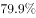

- **B**. 
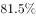

- **C**. 

　✅
- **D**. 
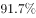

**答案**：C

**官方解析**

由题干“2018年……的比重为”，判定本题为现期比重问题。定位文字部分 “2018年全国互联网业务收入9562亿元，………互联网企业信息服务收入8594亿元”。代入公式：，则所求比重=

故正确答案为C。

---

### 第 13 题　qid 2367782 · 增长

2013—2018年全国互联网业务收入增加最少的年份是

- **A**. 2013年　✅
- **B**. 2014年
- **C**. 2015年
- **D**. 2016年

**答案**：A

**官方解析**

由提问“增加最少的年份”，判定本题为增长量比较问题。定位柱形图部分，可知2013-2018年每一年全国互联网业务收入及同比增速，因选项只有2013年至2016年，则只需比较这四年即可。

2013年的增长量：代入公式“”，可得：；

2014年的增长量：代入公式“”，可得：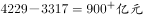；

同理可得， 2015年增长量：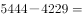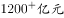；

2016年增长量：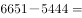；

增长量最小的年份为2013年。

故正确答案为A。

---

### 第 14 题　qid 2367783 · 增长

若从2019年起每年均按2014—2018年的平均增速增长，则2023年全国互联网业务收入将达到

- **A**. 21620亿元
- **B**. 27565亿元　✅
- **C**. 30147亿元
- **D**. 31829亿元

**答案**：B

**官方解析**

根据题干“······2023年全国互联网业务收入将达到······”，结合材料时间为2018年，判定本题为现期计算问题。定位柱状图可得，2013年与2018年全国互联网业务收入分别为3317亿元、9562亿元。根据题意可知，2019—2023年的平均增速与2014—2018年的相同，故有：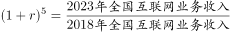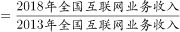，则2023年全国互联网业务收入为：亿元，与B项最接近。

故正确答案为B。

---

### 第 15 题　qid 2367785 · 综合

从上述资料中能够推出的是

- **A**. 
2014—2018年全国互联网业务收入年平均增量为1067亿元

- **B**. 
2018年广东、上海、北京的互联网业务收入总和比上年增长

- **C**. 
2018年全国互联网行业研发投入与互联网业务收入的比值小于上年
　✅
- **D**. 
2018年全国互联网企业各类信息服务收入年增长最慢的是电子商务平台收入

**答案**：C

**官方解析**

A项：定位柱状图可得，2013年与2018年全国互联网业务收入分别为3317亿元、9562亿元，代入公式：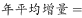，错误；

B项：定位文字材料可得，2018年广东、上海、北京互联网业务收入分别增长、和，但没有给出各市互联网业务收入数值，无法求出混合增长率，属于无中生有，错误；

C项：定位文字材料可得，2018年互联网行业研发投入与互联网业务收入增长率分别为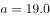、，，故比值低于上年，正确；

D项：定位文字材料可得，2018年互联网企业信息服务收入8594亿元，比上年增长。其中，电子商务平台收入3667亿元，增长；网络游戏业务收入1948亿元，增长。，可知材料没有给出互联网企业信息服务的全部类别，故无法判断年增长最慢的是否为电子商务平台收入，错误。

故正确答案为C。

---

## 材料 4

        2018年我国硫酸、烧碱、纯碱和乙烯产量分别为5496万吨、3159万吨、2651万吨和129万吨。2016年一季度至2018年四季度我国硫酸、烧碱、纯碱和乙烯产量见下图。

### 第 16 题　qid 2367897 · 增长

2018年我国硫酸、烧碱、纯碱和乙烯产量比上年增加最多的是

- **A**. 硫酸
- **B**. 烧碱　✅
- **C**. 纯碱
- **D**. 乙烯

**答案**：B

**官方解析**

根据题干“2018年······增加最多”，判定本题为增长量比较问题。定位文字材料可得2018年，我国硫酸、烧碱、纯碱和乙烯产量情况；定位折线图可得，2017年一季度至四季度，我国硫酸、烧碱、纯碱和乙烯产量情况。根据公式可得，

2018年硫酸增长量为；

2018年烧碱增长量为万吨；

2018年纯碱增长量为万吨；

2018年乙烯增长量为。

则增长最多的是烧碱。

故正确答案为B。

---

### 第 17 题　qid 2367898 · 综合

2016年一季度至2018年四季度，我国硫酸、烧碱产量最接近的是

- **A**. 2017年一季度
- **B**. 2017年四季度
- **C**. 2018年一季度　✅
- **D**. 2018年三季度

**答案**：C

**官方解析**

定位折线图可得，2016年一季度至2018年四季度，我国硫酸、烧碱产量情况，结合选项：

2017年一季度产量差值为万吨；

2017年四季度产量差值为万吨；

2018年一季度产量差值为万吨；

2018年三季度产量差值为万吨。

比较四个数字，则2018年一季度，我国硫酸、烧碱产量最接近。

故正确答案为C。

---

### 第 18 题　qid 2367899 · 平均数

2016年二季度至2018年四季度，我国烧碱产量的季平均增量是

- **A**. 12.8万吨
- **B**. 14.1万吨
- **C**. 16.7万吨
- **D**. 18.2万吨　✅

**答案**：D

**官方解析**

根据题干“2016年二季度至2018年四季度······季平均增量”，判定本题为年均增长量问题。定位折线图可得，2016年一季度和2018年四季度，我国烧碱产量分别为677万吨和877万吨。则季平均增量万吨。

故正确答案为D。

---

### 第 19 题　qid 2367902 · 增长

设2018年四季度我国硫酸、烧碱、纯碱产量的同比增速分别为、、，则下列关系正确的是

- **A**. 

　✅
- **B**. 

- **C**. 

- **D**. 

**答案**：A

**官方解析**

由题干“同比增速”，选项中有，判定本题为一般增长率比较问题。定位折线图可得：2018年四季度和2017年四季度我国硫酸、烧碱、纯碱的产量。代入公式：，则

；

；

。

比较可得。

故正确答案为A。

---

### 第 20 题　qid 2367904 · 综合

下列判断正确的是

- **A**. 2018年我国乙烯产量增速比上年有所下降　✅
- **B**. 2016年二季度至2018年四季度，我国硫酸和乙烯产量变动方向始终相反
- **C**. 2016年二季度至2018年四季度，我国烧碱和纯碱产量环比正增长的季度个数相同
- **D**. 2016年二季度至2018年四季度，我国纯碱产量环比增速在2017年四季度最小

**答案**：A

**官方解析**

A项：由文字材料可得：我国乙烯产量2018年为129万吨，由折线图可得：2017年万吨，2016年万吨。代入公式：，2018年增速，2017年增速，，即2018年我国乙烯产量增速比上年有所下降，正确； 

B项：由折线图可得：2016年二季度至2016年三季度，硫酸产量由1438万吨降至1420万吨和乙烯产量由42万吨降至41万吨，均下降，变动方向相同，并非始终相反，错误；

C项：由折线图可得：2016年二季度至2018年四季度，我国烧碱产量环比正增长的季度有：2016年二季度、2016年四季度、2017年一季度、2017年三季度、2018年一季度、2018年二季度和2018年四季度，共7个季度；我国纯碱产量环比正增长的季度有：2016年二季度、2016年四季度、2017年二季度、2018年一季度、2018年三季度和2018年四季度，共6个季度，季度个数不同，错误；

D项：由折线图可得：2016年一季度至2018年四季度，我国每个季度的纯碱产量。代入公式：，2017年四季度环比增速；观察各季度数据，发现2017年一季度环比下降较多，优先计算2017年一季度环比增速，，即2017年四季度我国纯碱产量环比增速并非最小，错误。

故正确答案为A。

---
