# 2019年江苏省公务员录用考试《行测》题（C类）（网友回忆版）

> 资料分析 · 20 题 · 江苏 2019

## 材料 1

        2018年我国硫酸、烧碱、纯碱和乙烯产量分别为5496万吨、3159万吨、2651万吨和129万吨。2016年一季度至2018年四季度我国硫酸、烧碱、纯碱和乙烯产量见下图。

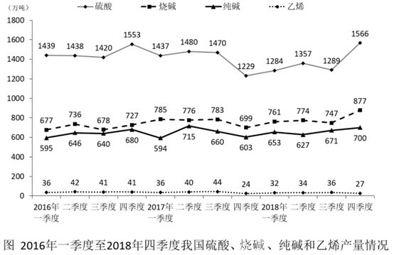

### 第 1 题　qid 2367897 · 增长

2018年我国硫酸、烧碱、纯碱和乙烯产量比上年增加最多的是

- **A**. 硫酸
- **B**. 烧碱　✅
- **C**. 纯碱
- **D**. 乙烯

**答案**：B

**官方解析**

根据题干“2018年······增加最多”，判定本题为增长量比较问题。定位文字材料可得2018年，我国硫酸、烧碱、纯碱和乙烯产量情况；定位折线图可得，2017年一季度至四季度，我国硫酸、烧碱、纯碱和乙烯产量情况。根据公式可得，

2018年硫酸增长量为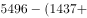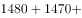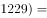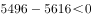；

2018年烧碱增长量为万吨；

2018年纯碱增长量为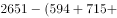万吨；

2018年乙烯增长量为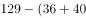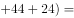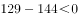。

则增长最多的是烧碱。

故正确答案为B。

---

### 第 2 题　qid 2367898 · 综合

2016年一季度至2018年四季度，我国硫酸、烧碱产量最接近的是

- **A**. 2017年一季度
- **B**. 2017年四季度
- **C**. 2018年一季度　✅
- **D**. 2018年三季度

**答案**：C

**官方解析**

定位折线图可得，2016年一季度至2018年四季度，我国硫酸、烧碱产量情况，结合选项：

2017年一季度产量差值为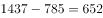万吨；

2017年四季度产量差值为万吨；

2018年一季度产量差值为万吨；

2018年三季度产量差值为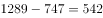万吨。

比较四个数字，则2018年一季度，我国硫酸、烧碱产量最接近。

故正确答案为C。

---

### 第 3 题　qid 2367899 · 平均数

2016年二季度至2018年四季度，我国烧碱产量的季平均增量是

- **A**. 12.8万吨
- **B**. 14.1万吨
- **C**. 16.7万吨
- **D**. 18.2万吨　✅

**答案**：D

**官方解析**

根据题干“2016年二季度至2018年四季度······季平均增量”，判定本题为年均增长量问题。定位折线图可得，2016年一季度和2018年四季度，我国烧碱产量分别为677万吨和877万吨。则季平均增量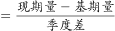万吨。

故正确答案为D。

---

### 第 4 题　qid 2367902 · 增长

设2018年四季度我国硫酸、烧碱、纯碱产量的同比增速分别为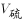、、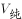，则下列关系正确的是

- **A**. 
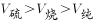
　✅
- **B**. 

- **C**. 
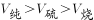

- **D**. 

**答案**：A

**官方解析**

由题干“同比增速”，选项中有，判定本题为一般增长率比较问题。定位折线图可得：2018年四季度和2017年四季度我国硫酸、烧碱、纯碱的产量。代入公式：，则

；

；

。

比较可得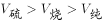。

故正确答案为A。

---

### 第 5 题　qid 2367904 · 综合

下列判断正确的是

- **A**. 2018年我国乙烯产量增速比上年有所下降　✅
- **B**. 2016年二季度至2018年四季度，我国硫酸和乙烯产量变动方向始终相反
- **C**. 2016年二季度至2018年四季度，我国烧碱和纯碱产量环比正增长的季度个数相同
- **D**. 2016年二季度至2018年四季度，我国纯碱产量环比增速在2017年四季度最小

**答案**：A

**官方解析**

A项：由文字材料可得：我国乙烯产量2018年为129万吨，由折线图可得：2017年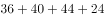万吨，2016年万吨。代入公式：，2018年增速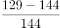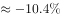，2017年增速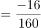，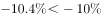，即2018年我国乙烯产量增速比上年有所下降，正确； 

B项：由折线图可得：2016年二季度至2016年三季度，硫酸产量由1438万吨降至1420万吨和乙烯产量由42万吨降至41万吨，均下降，变动方向相同，并非始终相反，错误；

C项：由折线图可得：2016年二季度至2018年四季度，我国烧碱产量环比正增长的季度有：2016年二季度、2016年四季度、2017年一季度、2017年三季度、2018年一季度、2018年二季度和2018年四季度，共7个季度；我国纯碱产量环比正增长的季度有：2016年二季度、2016年四季度、2017年二季度、2018年一季度、2018年三季度和2018年四季度，共6个季度，季度个数不同，错误；

D项：由折线图可得：2016年一季度至2018年四季度，我国每个季度的纯碱产量。代入公式：，2017年四季度环比增速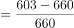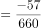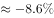；观察各季度数据，发现2017年一季度环比下降较多，优先计算2017年一季度环比增速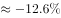，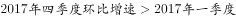，即2017年四季度我国纯碱产量环比增速并非最小，错误。

故正确答案为A。

---

## 材料 2

        2018年11月中旬，某市统计局对全市2000名18-65周岁的常住居民进行了有关“双11”网购情况的电话调查。调查结果显示，的受访者参与了2018年“双11”的网购，其中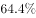的男性和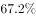的女性表示“有实际购物需求”是其参与“双11”网购的原因之一。

### 第 6 题　qid 2367971 · 综合

该市受访者中，参与2018年“双11”网购的与未参与的相差

- **A**. 100人　✅
- **B**. 114人
- **C**. 120人
- **D**. 131人

**答案**：A

**官方解析**

根据“该市受访者中，参与2018年‘双11’网购的与未参与的相差”，且材料中所给数据为比重数据，判断本题为现期比重问题。定位文字材料，对全市2000名常住居民调查，有的受访者参与了2018年“双11”的网购，则未参与的占比为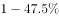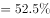。因此所求差值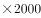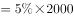人。

故正确答案为A。

---

### 第 7 题　qid 2367972 · 综合

该市恰有551名受访者2018年“双11”网购的商品类别是

- **A**. 服饰类　✅
- **B**. 家电及电子产品
- **C**. 食品饮料
- **D**. 母婴及儿童用品

**答案**：A

**官方解析**

根据“该市恰有551名受访者2018年“双11”网购的商品类别是”，材料中为比重数据，判断本题为现期比重。定位文字材料和第二个图形，对全市2000名常住居民调查，结合上一题，有参与了网购。则受访者中参与网购的有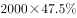人。551名受访者在其中所占的比重为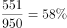，定位第二个图形，正好是服饰类（）。

故正确答案为A。

---

### 第 8 题　qid 2367973 · 综合

该市参与2018年“双11”网购的受访者中，男、女人数的比值最接近

- **A**. 0.47
- **B**. 0.51
- **C**. 0.59
- **D**. 0.65　✅

**答案**：D

**官方解析**

根据“该市参与2018年‘双11’网购的受访者中，男、女人数的比值最接近”，判断本题为比值计算。定位文字材料，有的受访者参与了2018年“双11”的网购，其中的男性和的女性表示“有实际购物需求”是其参与“双11”网购的原因之一。定位图形，有实际购物需求的在受访者总人数中占。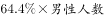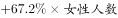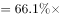，根据线段法，距离与量成反比，可知男性人数：女性人数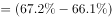：：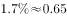。

故正确答案为D。

---

### 第 9 题　qid 2367975 · 比重

该市参与2018年“双11”网购的受访者中，选择3种网购原因的占比至多为

- **A**. 

- **B**. 

　✅
- **C**. 

- **D**. 

**答案**：B

**官方解析**

根据“占比至多为······”，可判定本题为现期比重问题。定位统计图1，某市参与2018年“双11”网购的受访者中，各种原因的比例分别为：、、、、、、、，各占比总和为：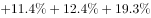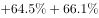。设选择一个选项的受访者占比，选择两个选项的受访者占比，选择三个选项的受访者占比（最多同时选择三项）。则······，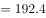······，可得：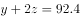，若要最大，则，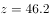。因此选择三种网购原因的占比至多为。

故正确答案为B。

---

### 第 10 题　qid 2367976 · 综合

从上述资料中能够推出的是

- **A**. 参与“双11”网购的受访者中有人网购食品饮料的支出超过0.4万元
- **B**. “双11”网购日用品的受访者都选择了“有实际购物需求”的网购原因
- **C**. 因优惠力度大而参与“双11”网购的受访者中一定有人网购了护肤美容美发用品　✅
- **D**. “双11”网购支出0.8—1.2万元的受访者人数比网购支出1.6—2.0万元的多2倍

**答案**：C

**官方解析**

A项：根据资料，有参与2018年“双11”网购支出超过0.4万元的受访者占比，也有参与2018年“双11”网购食品饮料的受访者占比，但是无法得出有人网购饮料的支出超过0.4万元，无法推出。

B项：定位统计图1和2，“双11”网购日用品的受访者并不一定都选择了“有实际购物需求”的网购原因，无法推出。

C项：定位统计图1和2，某市参与2018年“双11”网购的受访者中有的人网购原因为优惠力度大，有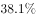的人购买了护肤美容美发用品，若所有不因为优惠力度大而网购的人全部购买了护肤美容美发用品，则有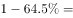，因此必然有因为优惠力度大而网购的受访者购买了护肤美容美发用品，可以推出。

D项：定位统计表，“双11”网购支出0.8-1.2万元的受访者占比为，网购支出1.6-2.0万元的受访者占比为。前者人数比后者人数多倍，但是统计表中显示有的人不确定自己支出为多少，这部分人如果有存在于上述两个区间的话，那么就无法确定前者是否比后者多2倍，无法推出。

故正确答案为C。

---

## 材料 3

        2017年某市调查总队对全市服务业小微企业的抽样调查显示，2017年全市服务业小微样本企业总资产938.6亿元，销售总收入105.4亿元，销售总费用6.8亿元；人员薪酬19.3亿元，比上年增长；从业人员29028人，与上年持平；营业税金及附加1.1亿元，比上年下降；缴纳增值税2.3亿元，比上年增长。

### 第 11 题　qid 2367786 · 增长

2017年该市服务业小微样本企业缴纳增值税比上年增加

- **A**. 0.11亿元
- **B**. 0.15亿元
- **C**. 0.24亿元　✅
- **D**. 0.34亿元

**答案**：C

**官方解析**

根据“2017年······比上年增加”，结合选项有具体单位，可判定本题为增长量计算题型。定位材料文字部分，2017年该市服务业小微样本企业缴纳增值税2.3亿元，比上年增长。根据公式：，可得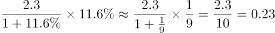亿元，C项最为接近。

故正确答案为C。

---

### 第 12 题　qid 2367793 · 平均数

2017年该市服务业小微样本企业从业人员人均薪酬比上年增长

- **A**. 

- **B**. 

　✅
- **C**. 

- **D**. 

**答案**：B

**官方解析**

方法一：根据“2017年······人均薪酬比上年增长”，结合选项为百分数，可判定本题为平均数的增长率题型。定位材料文字部分，2017年该市服务业小微样本企业人员薪酬19.3亿元，比上年增长，即；从业人员29028人，与上年持平，即。根据公式：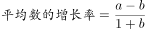，可得：。

方法二：根据“2017年······人均薪酬比上年增长”，结合选项为百分数，可判定本题为平均数的增长率题型。定位材料文字部分，2017年该市服务业小微样本企业人员薪酬19.3亿元，比上年增长；从业人员29028人，与上年持平。人均薪酬为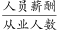，分母不变，分子增长，即2017年该市服务业小微样本企业从业人员人均薪酬比上年增长。

故正确答案为B。

---

### 第 13 题　qid 2367797 · 增长

2013-2017年该市服务业小微样本企业销售总费用增速最快、最慢的年份分别是

- **A**. 2016年、2015年
- **B**. 2014年、2015年
- **C**. 2016年、2017年
- **D**. 2014年、2017年　✅

**答案**：D

**官方解析**

定位材料统计图，2013-2017年该市服务业小微样本企业销售总费用增速分别为：、、、、，其中增速最快的年份为2014年，增速最慢的年份为2017年。

故正确答案为D。

---

### 第 14 题　qid 2367827 · 增长

2017年该市服务业小微样本企业销售总收入比2013年增长

- **A**. 

- **B**. 

　✅
- **C**. 

- **D**. 

**答案**：B

**官方解析**

由“2017年……比2013年增长”可判断本题为一般增长率的计算问题。定位图形材料，根据，可知2017年该市服务业小微样本企业。。

故正确答案为B。

---

### 第 15 题　qid 2367832 · 综合

从上述资料中不能推出的是

- **A**. 2017年该市小微样本企业的销售费用率比上年有所下降
- **B**. 2016年该市小微样本企业营业税金及附加超过1.55亿元
- **C**. 2013-2017年该市小微样本企业销售总收入和销售总费用的变动方向一致　✅
- **D**. 2013-2017年该市小微样本企业销售总收入和总费用增速相差最大的年份是2017年

**答案**：C

**官方解析**

A.根据，定位图形材料，2017年该市小微样本企业的销售总费用比2016年下降，销售总收入比2016年增长，，则2017年的销售费用率比上年有所下降，正确；

B.根据，定位文字材料“2017年······营业税金及附加1.1亿元，比上年下降”， 则2016年该市小微样本企业营业税金及附加，正确；

C. 根据图形材料，2017年该市小微样本企业的销售总费用比2016年下降，销售总收入比2016年增长，一个下降一个增长，变动方向不一致，错误；

D. 2013年该市小微样本企业销售总收入和总费用增速相差个百分点；

2014年该市小微样本企业销售总收入和总费用增速相差个百分点；

2015年该市小微样本企业销售总收入和总费用增速相差个百分点；

2016年该市小微样本企业销售总收入和总费用增速相差个百分点；

2017年该市小微样本企业销售总收入和总费用增速相差个百分点；

2013-2017年该市小微样本企业销售总收入和总费用增速相差最大的年份是2017年，正确。

本题为选非题，故正确答案为C。

---

## 材料 4

        2018年江苏第一、二、三产业增加值分别为4142亿元、41248亿元和47205亿元；城镇常住居民人均可支配收入47200元，增长8.2，农村常住居民人均可支配收入20845元，增长8.8；一般公共预算收入8630亿元，一般公共预算支出11658亿元。

### 第 16 题　qid 2367761 · 增长

2018年江苏第三产业增加值比第二产业多

- **A**. 
12.6

- **B**. 
14.4
　✅
- **C**. 
15.1

- **D**. 
16.2

**答案**：B

**官方解析**

根据题干“2018年江苏第三产业增加值比第二产业多”，结合选项都是百分数，可判定本题为一般增长率问题。定位文字材料可知，2018年江苏第二、三产业增加值分别为41248亿元和47205亿元。根据公式：r，则题干所求为，与B项最接近。

故正确答案为B。

---

### 第 17 题　qid 2367762 · 综合

上表所有指标中，2017年苏南与苏北地区指标数值相差不到一倍的有

- **A**. 5项
- **B**. 6项　✅
- **C**. 7项
- **D**. 8项

**答案**：B

**官方解析**

根据题干“……2017年苏南与苏北地区指标数值相差不到一倍的有”，结合表格材料时间为2017年，可判定本题为现期倍数问题。定位表格材料可知2017年苏南与苏北地区部分社会经济发展指标数据。苏南与苏北地区指标数值相差不到一倍，即为两者之间倍数&lt;2倍。则表中苏南与苏北地区各指标倍数分别为：

一般公共预算收入：倍&gt;2倍，排除；

一般公共预算支出：倍&lt;2倍，符合；

乡村从业人员：倍&gt;2倍，排除；

农林牧渔业总产值：倍&gt;2倍，排除；

高速公路：倍&lt;2倍，符合；

私人汽车拥有量：倍&gt;2倍，排除；

社会消费品零售总额：倍&gt;2倍，排除；

出口：&gt;10倍，排除；

进口：&gt;10倍，排除；

旅游外汇收入：&gt;10倍，排除；

城镇常住居民人均可支配收入：倍&lt;2倍，符合；

城镇常住居民人均生活消费支出：倍&lt;2倍，符合；

农村常住居民人均可支配收入：倍&lt;2倍，符合；

农村常住居民人均生活消费支出：倍&lt;2倍，符合。

综上，满足条件的指标有：一般公共预算支出、高速公路、城镇常住居民人均可支配收入、城镇常住居民人均生活消费支出、农村常住居民人均可支配收入、农村常住居民人均生活消费支出，共6项。

故正确答案为B。

---

### 第 18 题　qid 2367763 · 增长

2018年江苏一般公共预算收入比上年增加

- **A**. 963亿元　✅
- **B**. 988亿元
- **C**. 1963亿元
- **D**. 1971亿元

**答案**：A

**官方解析**

根据题干“2018年······比上年增加”，结合选项带单位，可判定本题为增长量计算问题。定位文字材料可知，2018年江苏一般公共预算收入8630亿元；定位表格材料可知，2017年苏南、苏中、苏北一般公共预算收入分别为4913亿元、1246亿元、1508亿元。则2017年江苏一般公共预算收入为4913+1246+1508=7667亿元。根据公式：增长量=现期量-基期量，则题干所求为8630-7667=963亿元。
故正确答案为A。

---

### 第 19 题　qid 2367764 · 平均数

2017年苏南、苏中、苏北地区就业人员人均产业增加值最大的是

- **A**. 苏中第三产业
- **B**. 苏南第二产业
- **C**. 苏南第三产业　✅
- **D**. 苏北第二产业

**答案**：C

**官方解析**

根据题干“2017年……人均产业增加值最大的是”，结合材料给出2017年相关数据 ，可判定本题为现期平均数问题。定位图1、图2可知2017年江苏三大区域三次产业就业人数及三次产业增加值。根据公式：就业人员人均产业增加值，则各选项就业人员人均产业增加值分别为：

苏中第三产业，万元；

苏南第二产业，万元；

苏南第三产业，万元；

苏北第二产业，万元。

综上，2017年苏南、苏中、苏北地区就业人员人均产业增加值最大的是苏南第三产业。

故正确答案为C。

---

### 第 20 题　qid 2367765 · 综合

从上述资料中能够推出的是

- **A**. 2017年苏中地区高速公路的里程不足全省的五分之一
- **B**. 2017年苏北和苏中地区进口额之和不及苏南的八分之一
- **C**. 2018年江苏城镇和农村常住居民人均可支配收入的绝对差距比上年有所缩小
- **D**. 2017年苏中农村常住居民人均生活消费支出与人均可支配收入的比值大于苏南　✅

**答案**：D

**官方解析**

A项：定位表格材料可知，2017年苏南、苏中、苏北高速公路里程分别为1870公里、948公里、1870公里。根据公式：比重，则2017年苏中高速公路里程占全省的比重为，即超过五分之一，错误；

B项：定位表格材料可知，2017年苏南、苏中、苏北进口额分别为1993.0亿美元、175.5亿美元、109.9亿美元。则2017年苏中和苏北进口额之和与苏南的比例为，即大于八分之一，错误；

C项：定位文字材料可知，2018年江苏城镇常住居民人均可支配收入47200元，增长8.2%，农村常住居民人均可支配收入20845元，增长8.8%。则2018年江苏城镇和农村常住居民人均可支配收入的绝对差距为元。根据公式：基期量，则2017年江苏城镇和农村常住居民人均可支配收入的绝对差距为，即2018年江苏城镇和农村常住居民人均可支配收入的绝对差距比上年有所增大，错误；

D项：定位表格材料可知，2017年苏中农村常住居民人均可支配收入与人均生活消费支出分别为20000元、14644元，苏南分别为26759元、18872元。则2017年苏中农村常住居民人均生活消费支出与人均可支配收入的比值为，苏南农村常住居民人均生活消费支出与人均可支配收入的比值为，即2017年苏中农村常住居民人均生活消费支出与人均可支配收入的比值大于苏南，正确。

故正确答案为D。

---
