# 2019年江西省法检统一考录公务员笔试《行测》题（网友回忆版）

> 资料分析 · 15 题 · 江西 2019

## 材料 1

        2018年我国全年研究与试验发展（R&amp;D）经费支出19657亿元，比上年增长11.6%，与国内生产总值之比为2.18%，其中基础研究经费1118亿元。全年国家重点研发计划共安排1052个项目，国家科技重大专项共安排563个课题，国家自然科学基金共资助44504个项目。截至年底，正在运行的国家重点实验室501个，累计建设国家工程研究中心132个，国家工程实验室217个，国家企业技术中心1480家。国家科技成果转化引导基金累计设立21支子基金，资金总规模313亿元。全年境内外专利申请432.3万件，比上年增长16.9%；授予专利权244.7万件，增长33.3%；PCT专利申请受理量为5.5万件。截至年底，有效专利838.1万件，其中境内有效发明专利160.2万件，每万人口发明专利拥有量11.15件。全年共签订技术合同41.2万项，技术合同成交金额17697亿元，比上年增长31.8%。

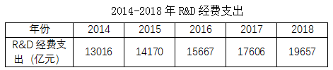

### 第 1 题　qid 2444065 · 综合

2018年基础研究经费占R&D经费支出的百分比是

- **A**. 4.74%
- **B**. 5.32%
- **C**. 5.69%　✅
- **D**. 6.02%

**答案**：C

**官方解析**

根据“2018年…占…的百分比”判定为现期比重问题。定位文字材料“2018年我国全年研究与试验发展（R&amp;D）经费支出19657亿元…其中基础研究经费1118亿元”。根据比重公式可得：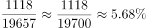，与C项最接近。

故正确答案为C。

---

### 第 2 题　qid 2444066 · 综合

2017年专利授予件数占境内外专利申请件数的百分比是

- **A**. 47.4%
- **B**. 49.6%　✅
- **C**. 50.3%
- **D**. 56.6%

**答案**：B

**官方解析**

根据“2017年···占···的百分比”判定为基期比重问题。定位文字材料“全年境内外专利申请432.3万件，比上年增长16.9%；授予专利权244.7万件，增长33.3%”。根据基期比重公式可得可得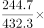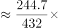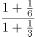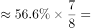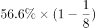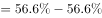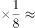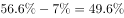。

故正确答案为B。

---

### 第 3 题　qid 2444067 · 增长

2014-2018年R&D经费支出增速最快的是

- **A**. 2015年
- **B**. 2016年
- **C**. 2017年　✅
- **D**. 2018年

**答案**：C

**官方解析**

根据“增速最快”判定为增长率比较问题。定位表格材料，根据增长率公式可得：

2015年增速=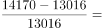

2016年增速=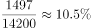

2017年增速=

2018年增速=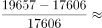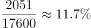

可见2017年增速最快。

故正确答案为C。

---

### 第 4 题　qid 2444068 · 增长

2014-2018年R&D经费支出的年均增长率为

- **A**. 10.9%　✅
- **B**. 10.4%
- **C**. 9.9%
- **D**. 8.9%

**答案**：A

**官方解析**

根据“年均增长率为”，结合选项为百分数，判定为年均增长率计算问题。定位表格材料，2018年R&amp;D经费支出19657亿元，2014年R&amp;D经费支出13016亿元。根据年均增长率公式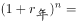可得：，代入数据，有: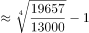。

故正确答案为A。

---

### 第 5 题　qid 2444069 · 增长

①2015年R&D经费支出同比增长8.9%
②2018年国内生产总值901697亿元
③2018年技术合同成交金额较2017年增加2400.9亿元
上述说法不正确的有

- **A**. 0个
- **B**. 1个　✅
- **C**. 2个
- **D**. 3个

**答案**：B

**官方解析**

①：定位表格材料，2015年R&amp;D经费支出14170亿元，2014年R&amp;D经费支出13016亿元，可得增长率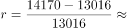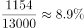，正确；

②：定位文字材料，“2018年我国全年研究与试验发展（R&amp;D）经费支出19657亿元，比上年增长11.6%，与国内生产总值之比为2.18%”，可得2018年国内生产总值=亿元，正确；

③：定位文字材料，“技术合同成交金额17697亿元，比上年增长31.8%”，可得增长量=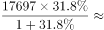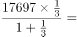亿元，错误。

故正确答案为B。

---

## 材料 2

        2018年C国全年粮食种植面积11704万公顷，比上年减少95万公顷。其中，小麦种植面积2427万公顷，减少24万公顷；稻谷种植面积3019万公顷，减少56万公顷；玉米种植面积4213万公顷，减少27万公顷；棉花种植面积335万公顷，增加16万公顷；油料种植面积1289万公顷，减少33万公顷；糖料种植面积163万公顷，增加9万公顷。

        2018年C国全年粮食产量65789万吨，比上年减少371万吨，减产0.6%。其中，夏粮产量13878万吨，减产2.1%；早稻产量2859万吨，减产4.3%；秋粮产量49052万吨，增产0.1%。全年谷物产量61019万吨，比上年减产0.8%。其中，稻谷产量21213万吨，减产0.3%；小麦产量13143万吨，减产2.2%；玉米产量25733万吨，减产0.7%。

### 第 6 题　qid 2444070 · 综合

2017年稻谷种植面积占全年粮食种植面积的百分比是

- **A**. 20.3%
- **B**. 25.5%
- **C**. 26.1%　✅
- **D**. 27.2%

**答案**：C

**官方解析**

根据“2017年……占……百分比是”判断本题为基期比重问题。定位文字材料第一段“2018年C国全年粮食种植面积11704万公顷，比上年减少95万公顷。……稻谷种植面积3019万公顷，减少56万公顷；”则2017年粮食种植面积=，2017年稻谷种植面积=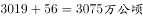，则2017年稻谷占全年粮食种植面积比重=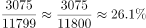 ,即为C项。

故正确答案为C。

---

### 第 7 题　qid 2444071 · 综合

2018年稻谷产量与小麦产量之差是

- **A**. 7080万吨
- **B**. 8070万吨　✅
- **C**. 8090万吨
- **D**. 8080万吨

**答案**：B

**官方解析**

根据“2018年……之差”判断本题为简单加减计算。定位文字材料第二段“（2018年）稻谷产量21213万吨，减产0.3%；小麦产量13143万吨，减产2.2%；”则万吨,即为B项。

故正确答案为B。

---

### 第 8 题　qid 2444072 · 综合

2017年夏粮产量与2018年夏粮产量相差

- **A**. 291万吨
- **B**. 296万吨
- **C**. 289万吨
- **D**. 298万吨　✅

**答案**：D

**官方解析**

根据“2017年夏粮产量与2018年夏粮产量相差”判断本题为增长量计算问题。定位文字材料第二段“2018年……夏粮产量13878万吨，减产2.1%；”根据公式，增长量=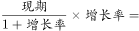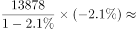-297.7万吨，即相差297.7万吨，与D项最接近。

故正确答案为D。

---

### 第 9 题　qid 2444073 · 综合

2018年玉米产量减产

- **A**. 171万吨
- **B**. 178万吨
- **C**. 181万吨　✅
- **D**. 188万吨

**答案**：C

**官方解析**

根据“2018年……减产”判断本题为增长量计算问题。定位文字材料第二段“（2018年）玉米产量25733万吨，减产0.7%。”则2018年玉米产量减产量=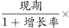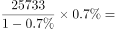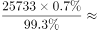万吨。即为C项。

故正确答案为C。

---

### 第 10 题　qid 2444074 · 增长

①2017年糖料种植面积为154万吨
②2017年秋粮产量49003万吨
③2018年小麦、稻谷和玉米的种植面积之和占该年粮食种植面积的82.5%
④2018年棉花种植面积同比增长5.8%
上述说法正确的有

- **A**. 1个
- **B**. 2个　✅
- **C**. 3个
- **D**. 4个

**答案**：B

**官方解析**

①：定位文字材料第一段“糖料种植面积163万公顷，增加9万公顷”，则2017年糖料种植面积=163-9=154万公顷，而非154万吨，错误；

②：定位文字材料第二段“秋粮产量49052万吨，增产0.1%”，根据基期=万吨，正确；

③：定位文字材料“2018年C国全年粮食种植面积11704万公顷，比上年减少95万公顷。其中，小麦种植面积2427万公顷，减少24万公顷；稻谷种植面积3019万公顷，减少56万公顷；玉米种植面积4213万公顷，减少27万公顷”，则2018年小麦、稻谷、玉米产量之和=万公顷，则其占2018年粮食种植面积的比重=，正确。

④定位文字材料第一段“棉花种植面积335万公顷，增加16万公顷”根据增长率=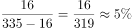，错误。

故正确答案为B。

---

## 材料 3

        我国脱贫攻坚成效显著。按照每人每年2300元（2010年不变价）的农村贫困标准计算，2018年年末农村贫困人口1660万人，比上年末减少1386万人；贫困发生率1.7%，比上年下降1.4个百分点。全年贫困地区农村居民人均可支配收入10371元，比上年增长10.6%，扣除价格因素，实际增长8.3%。

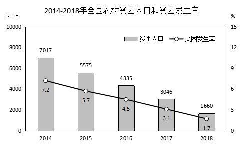

### 第 11 题　qid 2444075 · 综合

2014-2018年脱贫人口最多的是

- **A**. 2015年　✅
- **B**. 2016年
- **C**. 2017年
- **D**. 2018年

**答案**：A

**官方解析**

根据题干“脱贫人口最多”，即贫困人口减少量最大，可判定本题为增长量比较问题。定位统计图中柱状图数据可知各年贫困人口数量，可计算得：2015年贫困人口减少量=，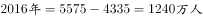，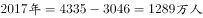；定位文字材料可知2018年年末农村贫困人口比上年末减少1386万人。故题干所求脱贫人口最多的是2015年。

故正确答案为A。

备注：定位各年份数据在柱状图中，比较柱状图数据差距大小，也可以直接看柱状图的高度差。

---

### 第 12 题　qid 2444076 · 增长

2014-2018年全国农村贫困人口同比降速位于第二的是      。

- **A**. 2015年
- **B**. 2016年
- **C**. 2017年　✅
- **D**. 2018年

**答案**：C

**官方解析**

根据题干“同比降速位于第二”，可判定本题为增率比较问题。根据116题计算出的数据可知“2015-2018年贫困人口减少量分别为1442万人、1240万人、1289万人、1386万人”，定位统计图中柱状图数据可知各年贫困人口数量，根据公式：降速=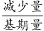，可计算得：2015年贫困人口降速=，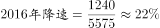，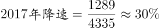，。故题干所求降速位于第二的是2017年。

故正确答案为C。

---

### 第 13 题　qid 2444077 · 平均数

2017年贫困地区农村居民人均年可支配收入为

- **A**. 9407元
- **B**. 9377元　✅
- **C**. 9368元
- **D**. 9102元

**答案**：B

**官方解析**

根据题干“2017年……”，结合材料时间为2018年，可判定本题为基期计算问题。定位材料文字部分可得：2018年全年贫困地区农村居民人均可支配收入10371元，比上年增长10.6%。根据公式：。故题干所求2017年贫困地区农村居民人均年可支配收入为9377元。

故正确答案为B。

---

### 第 14 题　qid 2444078 · 增长

2014-2018年贫困人口年均下降率为

- **A**. 20%
- **B**. 25.5%
- **C**. 30.3%　✅
- **D**. 32.5%

**答案**：C

**官方解析**

根据题干“……年均下降率为”，可判定本题为年均增长率问题。定位柱状图可得2018年贫困人口数量为1660万人，2014年为7017万人。代入年均增长率公式：，。优先代入居中且好算（例如接近整十的数）的数，若下降率为30%，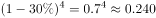，与0.237接近，说明下降率非常接近30%，C选项30.3%满足。

故正确答案为C。

---

### 第 15 题　qid 2444079 · 平均数

①2017年脱贫人口最少是1289万人
②2018年农村居民人均可支配收入比2017年增加994元
③2014-2018年贫困人口年均下降量是1330万人
上述说法不正确的有

- **A**. 0个
- **B**. 3个
- **C**. 2个　✅
- **D**. 1个

**答案**：C

**官方解析**

①经过第116题计算可知2017年贫困人口减少量是1289万人，如果在这一年中有一些人变成了贫困人口，那么2016年贫困、在2017年脱贫的人数会比1289万人更多。所以①正确；

②定位材料文字部分可得：2018年全年贫困地区农村居民人均可支配收入10371元。而题干问2018年农村居民人均可支配收入，这个主体不一致，材料中没有相关数据。所以②不正确；

③定位柱状图可得2018年贫困人口数量为1660万人，2014年为7017万人。代入公式：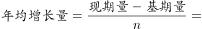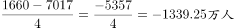，即年均减少1339.25万人。 所以③不正确。

此题为选非题，故正确答案为C。

---
