# 2019年河北省公务员录用考试《行测》题（县级+乡镇）（网友回忆版）

> 资料分析 · 20 题 · 河北 2019

## 材料 1

2018年末，河北省电话用户总数8865.6万户，其中移动电话用户8195.6万户。

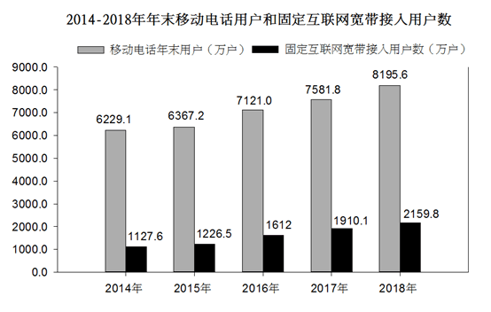

### 第 1 题　qid 2388027 · 增长

与2015年相比，2018年固定互联网宽带接入用户约增长了：

- **A**. 

　✅
- **B**. 

- **C**. 
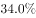

- **D**. 

**答案**：A

**官方解析**

根据题干“与2015年相比···约增长了”结合选项有，可判定本题为一般增长率的计算问题。定位统计图可知，固定互联网宽带接入用户数：2018年为2159.8万户，2015年为1226.5万户。由，则与2015年相比，2018年固定互联网宽带接入用户增长率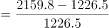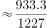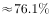。

备注：本题A、B两项差距极小，若分母截三位易错选为B，建议分母截四位或精算。

故正确答案为A。

---

### 第 2 题　qid 2388030 · 增长

与2017年相比，2018年移动电话用户净增数比固定互联网宽带用户净增数多多少万户？

- **A**. 364.1　✅
- **B**. 486.7
- **C**. 526.8
- **D**. 531.0

**答案**：A

**官方解析**

根据题干“与2017年相比，2018年···多多少万户”可判定本题为增长量的计算问题。定位统计图数据可得：移动电话用户数，2018年为8195.6万户，2017年为7581.8万户，则2018年移动电话用户净增数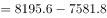万户；固定互联网宽带用户数，2018年为2159.8万户，2017年为1910.1万户，则2018年固定互联网宽带用户净增数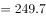万户。则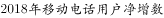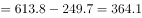万户。

备注：本题考场可列综合算式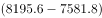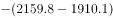，根据尾数为1选择A项。

故正确答案为A。

---

### 第 3 题　qid 2388032 · 增长

2015～2018年固定互联网宽带接入用户增长率超过的年份有多少个？

- **A**. 1
- **B**. 2
- **C**. 3　✅
- **D**. 4

**答案**：C

**官方解析**

根据题干“2015～2018年···增长率超过···”可判定本题为增长率的比较问题。定位统计图，固定互联网宽带接入用户数（万户），2014～2018年分别为：1127.6、1226.5、1612、1910.1、2159.8，根据，可得：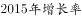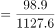，不满足；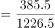，满足；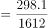，满足；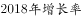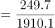，满足；则2015～2018年固定互联网宽带接入用户增长率超过的年份有3个。

故正确答案为C。

---

### 第 4 题　qid 2388036 · 增长

2015～2018年，移动电话用户增速最快的年份是：

- **A**. 2015年
- **B**. 2016年　✅
- **C**. 2017年
- **D**. 2018年

**答案**：B

**官方解析**

由题干“2015～2018年···增速最快的年份是”，判定本题为一般增长率比较问题。定位柱状图可知2014～2018年移动电话年末用户数据，根据：，可得：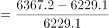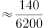，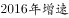，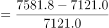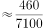，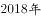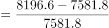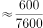。可见，增速最快的为2016年。

故正确答案为B。

---

### 第 5 题　qid 2388039 · 综合

能够从上述资料中推出的是：

- **A**. 
2015～2018年移动电话用户年净增数逐年增加

- **B**. 
2015～2018年固定互联网宽带接入用户年净增数逐年增加

- **C**. 
2015～2018年中移动电话用户数量增速超过的年份有两个 

- **D**. 
2015～2018年移动电话用户数量同固定互联网宽带接入用户数量之比逐年降低
　✅

**答案**：D

**官方解析**

A项：定位柱状图可得， 2016年移动电话用户年净增数万户，2017年移动电话用户年净增数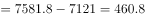万户，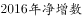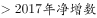，并非逐年增加，错误；

B项：定位柱状图可得， 2016年固定互联网宽带接入用户年净增数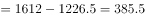万户，2017年固定互联网宽带接入用户年净增数万户，，并非逐年增加，错误；

C项：根据第114题计算结果，只有2016年移动电话用户数量增速超过，错误；

D项：定位柱状图可得，2015～2018年各年移动电话用户数量及固定互联网宽带接入用户数量，2015～2018年所求比例分别为：2015年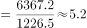，2016年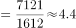，2017年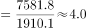，2018年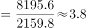，即比例逐年降低，正确。

故正确答案为D。

---

## 材料 2

        2019年1-2月份，全国规模以上工业企业实现利润总额7080.1亿元，同比下降。

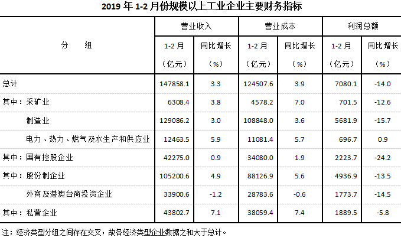

        1-2月份，部分行业利润情况如下：专用设备制造业利润总额同比增长，电气机械和器材制造业增长，电力、热力生产和供应业增长，非金属矿物制品业增长，通用设备制造业增长，汽车制造业下降，化学原料和化学制品制造业下降，煤炭开采和洗选业下降，纺织业下降，石油和天然气开采业下降，农副食品加工业下降。

        1-2月份，规模以上工业企业实现营业收入14.8万亿元，同比增长；发生营业成本12.5万亿元，增长。

        2月末，规模以上工业企业资产总计109.7万亿元，同比增长；负债合计62.4万亿元，增长；所有者权益合计47.3万亿元，增长；资产负债率为，同比降低0.2个百分点。

        1-2月份，规模以上工业企业每百元营业收入中的成本为84.21元，同比增加0.52元；每百元营业收入中的费用为9.12元，同比增加0.29元。

        2月末，规模以上工业企业每百元资产实现的营业收入为80.9元，同比减少2.4元；人均营业收入为119.4万元，同比增加7.6万元；产成品存货周转天数为19.3天，同比增加0.4天；应收票据及应收账款平均回收期为57.5天，同比增加4.6天。

### 第 6 题　qid 2388015 · 综合

2018年1-2月，规模以上工业企业实现利润总额约为多少亿元？

- **A**. 6210.6
- **B**. 7312.8
- **C**. 8232.7　✅
- **D**. 9012.6

**答案**：C

**官方解析**

根据题干“2018年1-2月，规模以上工业企业实现利润总额约为多少亿元”，结合材料时间为2019年1-2月，可判定本题为基期计算问题。定位文字材料第一段：“2019年1-2月份，全国规模以上工业企业实现利润总额7080.1亿元，同比下降”。根据公式：。

故正确答案为C。

---

### 第 7 题　qid 2388022 · 比重

2019年1-2月规模以上工业企业中，股份制企业实现利润所占份额约为多少？

- **A**. 

- **B**. 

　✅
- **C**. 

- **D**. 

**答案**：B

**官方解析**

根据题干“2019年1-2月规模以上工业企业中，股份制企业实现利润所占份额”，可判定此题为现期比重问题。定位统计表，全国规模以上工业企业实现利润总额为7080.1亿元；股份制企业实现利润总额为4936.9亿元。可知，股份制企业所占利润份额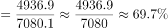。

故正确答案为B。

---

### 第 8 题　qid 2388026 · 综合

2019年1-2月，采矿业营业收入利润率约为多少？

- **A**. 

　✅
- **B**. 

- **C**. 

- **D**. 

**答案**：A

**官方解析**

根据题干“2019年1-2月，采矿业营业收入利润率约为多少”，，可判定本题为现期比重问题。定位统计表，采矿业营业收入为6308.4亿元；利润总额为701.5亿元。可知，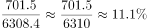。

故正确答案为A。

---

### 第 9 题　qid 2388028 · 增长

2019年1-2月，规模以上工业企业中行业利润总额同比增长幅度从高到低，以下排列正确的是：

- **A**. 非金属矿物制品业  通用设备制造业  纺织业  农副食品加工业
- **B**. 通用设备制造业 农副食品加工业  汽车制造业  煤炭开采和洗选业
- **C**. 专用设备制造业  农副食品加工业  纺织业  非金属矿物制品业
- **D**. 专用设备制造业  非金属矿物制品业  石油和天然气开采业  纺织业　✅

**答案**：D

**官方解析**

根据文字材料第二段，可得：纺织业增长率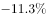农副食品加工业增长率，A项错误，排除；汽车制造业增长率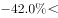煤炭开采和洗选业，B项错误，排除；纺织业增长率非金属矿物制品业增长率，C项错误，排除；专用设备制造业增长率非金属矿物制品业增长率石油和天然气开采业增长率 纺织业增长率，D项正确。

故正确答案为D。

---

### 第 10 题　qid 2388033 · 综合

能够从以上资料中推出的是：

- **A**. 
2018年2月末，规模以上工业企业资产负债率为

- **B**. 
2019年2月，采矿业利润总额高于电力、热力、燃气及水生产和供应业

- **C**. 
2018年2月末，规模以上工业企业每百元资产实现的营业收入为83.3元
　✅
- **D**. 
2019年1-2月，规模以上工业企业利润总额中国有控股企业所占份额超过

**答案**：C

**官方解析**

A项：定位文字材料第四段，“2月末，规模以上工业企业资产···资产负债率为，同比降低0.2个百分点。”，可知2018年2月末，规模以上工业企业资产负债率为，错误； 

B项：定位表格材料，可知2019年1-2月份，采矿业和电力、热力、燃气及水生产和供应业利润总额，但没有2月份相关数据，故无法推断2019年2月，采矿业利润总额是否高于电力、热力、燃气及水生产和供应业，错误；

C项：定位文字材料第六段，“2月末，规模以上工业企业每百元资产实现的营业收入为80.9元，同比减少2.4元”，可知2018年2月末，规模以上工业企业每百元资产实现的营业收入为，正确；

D项：定位文字材料第一段及表格材料，“2019年1-2月份，全国规模以上工业企业实现利润总额7080.1亿元；国有控股企业利润总额2223.7亿元”，可知2019年1-2月，规模以上工业企业利润总额中国有控股企业所占份额为，小于，错误。

故正确答案为C。

---

## 材料 3

根据以下资料，回答下列问题。

        2019年一季度，社会消费品零售总额97790亿元，同比名义增长（扣除价格因素实际增长，以下除特殊说明外均为名义增长）。其中，3月份社会消费品零售总额31726亿元，同比增长。

        按经营单位所在地分，一季度城镇消费品零售额83402亿元，同比增长；乡村消费品零售额14388亿元，增长。其中，3月份城镇消费品零售额27192亿元，同比增长；乡村消费品零售额4534亿元，增长。

        按消费类型分，一季度餐饮收入10644亿元，同比增长；商品零售87146亿元，增长。其中，3月份餐饮收入3393亿元，同比增长；商品零售28333亿元，增长。

        按零售业态分，一季度限额以上零售业单位中的超市、百货店、专业店零售额同比分别增长、、，专卖店同比下降。

        一季度，全国网上零售额22379亿元，同比增长。其中，实物商品网上零售额17772亿元，增长，占社会消费品零售总额的比重为；在实物商品网上零售额中，吃、穿和用类商品分别增长、和。

### 第 11 题　qid 2388066 · 综合

按照2018年一季度价格计算2019年一季度社会消费品零售总额约为多少亿元？

- **A**. 85065
- **B**. 96526　✅
- **C**. 99283
- **D**. 114000

**答案**：B

**官方解析**

根据题干所求“按照2018年一季度价格计算2019年一季度社会消费品零售总额约为”，可判定本题为现期计算问题，定位文字资料第一段可得“2019年一季度，社会消费品零售总额97790亿元，同比名义增长（扣除价格因素实际增长，以下除特殊说明外均为名义增长）”，所以2018年社会消费品零售总额为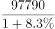。“按照2018年一季度价格计算”，即扣除2019年的价格因素造成的增长，也就是按照2018年实际的增长率来计算，故2019年社会消费品零售总额为，与B选项最接近。

故正确答案为B。

---

### 第 12 题　qid 2388067 · 增长

下列月份中，社会消费品零售总额同比增长速度最快的是：

- **A**. 2018年4月　✅
- **B**. 2018年6月
- **C**. 2018年9月
- **D**. 2018年11月

**答案**：A

**官方解析**

根据题干所求“······增长速度最快的是”，可判定本题为增长率比较问题。定位折线图，2018年4月、6月、9月、11月的增长率分别是：、、、，因此增长速度最快的是2018年4月的 。

故正确答案为A。

---

### 第 13 题　qid 2388068 · 倍数

2019年3月，城镇消费品零售额比乡村消费品零售额多几倍？

- **A**. 3.8
- **B**. 4.8
- **C**. 5.0　✅
- **D**. 6.0

**答案**：C

**官方解析**

根据题干所求“2019年3月···多几倍”，可判定本题为现期倍数问题，定位文字材料第二段， 3月份城镇消费品零售额27192亿元，乡村消费品零售额4534亿元，故城镇消费品零售额比乡村消费品零售额多的倍数为：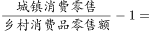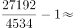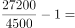，答案与C项最接近。

故正确答案为C。

---

### 第 14 题　qid 2388069 · 综合

2018年1-3月，限额以上单位烟酒类、日用品类、中西药品类及通讯器材类零售总额最高的是：

- **A**. 烟酒类
- **B**. 日用品类
- **C**. 中西药品类　✅
- **D**. 通讯器材类

**答案**：C

**官方解析**

根据题干所求“2018年1-3月···零售总额最高”，结合材料时间为2019年，可判定本题为基期量比较问题。定位表格，根据 ，故限额以上单位烟酒类、日用品类、中西药品类、通讯器材类零售总额分别为： 、 、 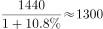、 ；因此最大的为中西药品类。

故正确答案为C。

---

### 第 15 题　qid 2388070 · 综合

根据以上资料，下列说法不正确的是：

- **A**. 
2019年3月，限额以上单位文化办公用品类零售额同比下降

- **B**. 
2019年一季度，实物商品网上零售额同比增长超过

- **C**. 
2019年1-2月，限额以上单位金银珠宝类零售额同比增加

- **D**. 
2019年一季度，限额以上零售业单位中百货店与专卖店零售额同比增长速度相同
　✅

**答案**：D

**官方解析**

A项：定位表格数据可知，2019年3月，限额以上单位文化办公用品类零售额同比增长率为，同比下降，正确；

B项：定位表格数据可知，实物商品网上零售额同比增长超过了，正确；

C项：定位表格数据可知，2019年1-3月份和3月份限额以上单位金银珠宝类零售额增长率的数据分别是、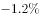；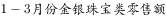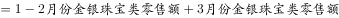，则1-3月份的增长率为1-2月份与3月份混合后的增长率，根据混合增长率口诀“混合居中”，且，可知 ，即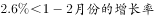，1-2月份的增长率为正即同比增加，正确；

D项：定位第四段文字材料可知，2019年一季度，限额以上零售业单位中百货店与专卖店零售额同比增长分别为、，不相同，错误。

本题为选非题，故正确答案为D。

---

## 材料 4

        2019年1-2月份，全国固定资产投资（不含农户）44849亿元，同比增长，增速比2018年全年提高0.2个百分点。其中，民间固定资产投资26963亿元，同比增长。分产业看，第一产业投资950亿元，同比增长，增速比2018年全年回落9.2个百分点；第二产业投资13864亿元，增长，增速回落0.7个百分点；第三产业投资30035亿元，增长，增速提高1个百分点。

        2019年1-3月份，全国固定资产投资（不含农户）101872亿元，同比增长，增速比去年同期回落1.2个百分点。其中，民间固定资产投资61492亿元，同比增长。

        分产业看，第一产业投资2408亿元，同比增长，增速比1-2月份回落0.7个百分点；第二产业投资33224亿元，增长，增速回落1.3个百分点；第三产业投资66240亿元，增长，增速提高1个百分点。

        第二产业中，工业投资同比增长，增速比1-2月份回落1.4个百分点；其中，采矿业投资增长，增速回落26.6个百分点；制造业投资增长，增速回落1.3个百分点；电力、热力、燃气及水生产和供应业投资增长，1-2月份为下降。

        第三产业中，基础设施投资（不含电力、热力、燃气及水生产和供应业）同比增长，增速比1-2月份提高0.1个百分点。其中，水利管理业投资下降，降幅扩大3.7个百分点；公共设施管理业投资下降，降幅收窄2.3个百分点；道路运输业投资增长，增速回落2.5个百分点；铁路运输业投资增长，增速回落11.5个百分点。

        分地区看，东部地区投资同比增长，增速比1-2月份提高1个百分点；中部地区投资增长，增速提高0.2个百分点；西部地区投资增长，增速提高0.2个百分点；东北地区投资增长，增速回落2.8个百分点。

        分登记注册类型看，内资企业投资同比增长，增速与1-2月份持平；港澳台商投资增长，增速提高2.8个百分点；外商投资增长，增速提高5.3个百分点。

### 第 16 题　qid 2388237 · 综合

2018年1-2月，全国固定资产投资（不含农户）约为多少万亿元？

- **A**. 2.51
- **B**. 3.87
- **C**. 4.23　✅
- **D**. 4.79

**答案**：C

**官方解析**

根据题干“2018年1-2月···约为多少万亿元”，结合材料时间为2019年，可判定本题为基期计算问题。定位文字材料第一段可得：“2019年1-2月份，全国固定资产投资（不含农户）44849亿元，同比增长。”根据公式：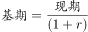，故2018年1-2月，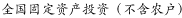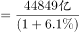万亿元，与C项最接近。

故正确答案为C。

---

### 第 17 题　qid 2388238 · 比重

2019年1-2月，全国固定资产投资（不含农户）中第三产业投资所占比重约为多少？

- **A**. 

　✅
- **B**. 

- **C**. 

- **D**. 

**答案**：A

**官方解析**

根据题干“2019年1-2月···第三产业投资所占比重约为···”，结合材料时间为2019年，可判定本题为现期比重问题。定位文字材料第一段可得：“2019年1-2月份，全国固定资产投资（不含农户）44849亿元···第三产业投资30035亿元···”故。

故正确答案为A。

---

### 第 18 题　qid 2388239 · 综合

2019年3月民间固定资产投资额约为多少亿元？

- **A**. 19360
- **B**. 34529　✅
- **C**. 36205
- **D**. 57022

**答案**：B

**官方解析**

定位文字材料第一段可得：“2019年1-2月份···其中，民间固定资产投资26963亿元，同比增长···”定位文字材料第二段可得：“2019年1-3月份···其中，民间固定资产投资61492亿元，同比增长。”故2019年3月民间固定资产投资额=2019年1-3月份民间固定资产投资额-2019年1-2月份民间固定资产投资额亿元。

故正确答案为B。

---

### 第 19 题　qid 2388240 · 增长

2019年1-2月，分地区看，投资同比增速最快的地区是哪个？

- **A**. 东部地区
- **B**. 中部地区　✅
- **C**. 西部地区
- **D**. 东北地区

**答案**：B

**官方解析**

定位文字材料第六段“东部地区投资同比增长，增速比1-2月份提高1个百分点；中部地区投资增长，增速提高0.2个百分点；西部地区投资增长，增速提高0.2个百分点；东北地区投资增长，增速回落2.8个百分点”，可得2019年1—2月，东部地区同比增速为，中部地区同比增速为，西部地区同比增速为，东北地区同比增速为，所以投资同比增速最快的地区是中部地区。

故正确答案为B。

---

### 第 20 题　qid 2388241 · 综合

根据以上资料，下列说法中不正确的是：

- **A**. 
2018年，第一产业固定资产投资增长

- **B**. 
2019年1-3月，采矿业投资比道路运输业基础设施投资增速快

- **C**. 
2019年1-3月，分产业看，第三产业投资同比增速最快

- **D**. 
2019年1-2月，从登记注册类型看，外商投资同比增速最快
　✅

**答案**：D

**官方解析**

A项：定位文字材料第一段“2019年1-2月份······第一产业投资950亿元，同比增长，增速比2018年全年回落9.2个百分点”，可得2018年全年第一产业固定资产投资增长，正确；

B项：定位文字材料第四段“2019年1—3月采矿业投资增长”，定位文字材料第五段“2019年1-3月道路运输业基础设施投资增长”，比较可知采矿业投资比道路运输业基础设施投资增速快，正确；

C项：定位文字材料第三段“2019年1—3月份，第一产业投资同比增长，第二产业投资增长，第三产业投资66240亿元，增长”，比较可知第三产业投资同比增速最快，正确；

D项：定位文字材料最后一段“2019年1—3月份，分登记注册类型看，内资企业投资同比增长，增速与1-2月份持平；港澳台商投资增长，增速提高2.8个百分点；外商投资增长，增速提高5.3个百分点”，可得2019年1—2月内资企业同比增长，港澳台同比增长，外商同比增长，比较可得内资企业同比增长最快，而非外商投资，错误。

本题为选非题，故正确答案为D。

---
