# 2019年浙江省公务员录用考试《行测》题（A类）（网友回忆版）

> 资料分析 · 15 题 · 浙江 2019

## 材料 1

根据所给资料，回答下列问题。

### 第 1 题　qid 2387615 · 增长

2013~2017年间，我国环境污染治理投资年均增长总额在以下哪个范围内？

- **A**. 
不到55亿元

- **B**. 
在55110亿元之间

- **C**. 
在110145亿元之间
　✅
- **D**. 
超过145亿元

**答案**：C

**官方解析**

根据题干“2013~2017年间···年均增长总额···”可判定本题为年均增长量的计算问题。由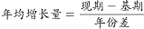，其中2017年为现期，2013年为基期，定位表格材料第二行可知：我国环境污染治理投资总额，2013年为9037.2亿元，2017年为9539.0亿元。则2013~2017年间，我国环境污染治理投资年均增长总额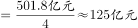，则在110~145亿元之间。

故正确答案为C。

---

### 第 2 题　qid 2387616 · 增长

2017年，我国城镇环境基础设施建设投资额中，同比增速最高的是：

- **A**. 集中供热　✅
- **B**. 排水
- **C**. 园林绿化
- **D**. 市容环境卫生

**答案**：A

**官方解析**

根据题干“2017年···同比增速最高······”可判定本题为一般增长率的比较问题，根据，定位统计表最后两列可知2017年与2016年数据。

A项集中供热2017年增速；

B项排水2017年增速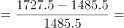；

C项园林绿化2017年增速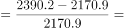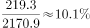；

D项市容环境卫生2017增速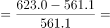。

综上，2017年集中供热投资额同比增速最高。

故正确答案为A。

---

### 第 3 题　qid 2387617 · 综合

20132017年，当年完成环保验收项目环保投资最高的年份其城镇环境基础设施建设投资额约是工业污染源治理投资额的多少倍？

- **A**. 5.5　✅
- **B**. 6.1
- **C**. 6.4
- **D**. 6.6

**答案**：A

**官方解析**

根据题干“20132017年，当年完成···是······多少倍”可判定本题为现期倍数问题。定位统计表倒数第二行可知，20132017年完成环保验收项目投资最高的年份是2014年为3113.9亿元。定位表格2014年城镇环境基础设施建设投资额为5463.9亿元，工业污染源治理投资额为997.7亿元，根据倍数计算问题公式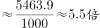。

故正确答案为A。

---

### 第 4 题　qid 2387618 · 综合

20132017年，我国园林绿化投资额和市容环境卫生投资额之和超过2800亿元的年份有几个？

- **A**. 1
- **B**. 2　✅
- **C**. 3
- **D**. 4

**答案**：B

**官方解析**

定位表格第七、八行数据可知：20132017各年份我国园林绿化投资额和市容环境卫生投资额，判断本题为简单加减计算。计算题目所求各年度二者之和：2013年：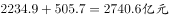；2014年：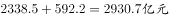；2015年：；2016年：；2017年：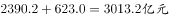，只有2014年和2017年两年超过2800亿元。

故正确答案为B。

---

### 第 5 题　qid 2387619 · 综合

关于20132017年我国环境污染治理投资情况，能够从资料中推出的是：

- **A**. 国内生产总值超过70万亿元的年份有3个
- **B**. 城镇环境基础设施建设投资额呈逐年增长趋势
- **C**. 每年燃气的投资额均高于市容环境卫生的投资额
- **D**. 城镇环境基础设施建设投资额与当年完成环保验收项目环保投资额的比值最高的年份是2017年　✅

**答案**：D

**官方解析**

A项：定位数据表可知2013年2017年各年份环境污染治理投资总额及占国内生产总值的比重，根据比重公式：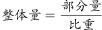可得：2013年国内生产总值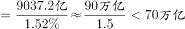；2014年国内生产总值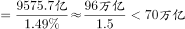；2015年国内生产总值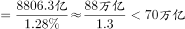；2016年国内生产总值； 2017年国内生产总值，有2个年份超过70亿元，错误；

B项：定位数据表可知，2014年城镇环境基础设施建设投资额大于2015年，错误； 

C项：定位数据表可知2014年燃气投资额（574.0）市容环境卫生的投资额（592.2），错误；

D项：定位数据表可知2013年2017年各年份城镇环境基础设施建设投资额与当年完成环保验收项目环保投资额，故所求比例：；，，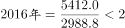，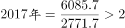，最高年份为2017年，正确。

故正确答案为D。

---

## 材料 2

根据所给资料，回答下列问题。

        2017年112月，全国内燃机累计销量5645.38万台，同比增长，累计完成功率266879.47万千瓦，同比增长，其中柴油内燃机功率同比增长。

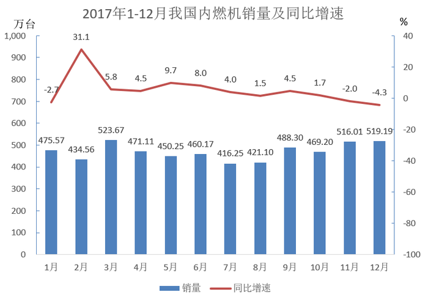

        从燃料类型来看，柴油机增幅明显高于汽油机，柴油机累计销量556万台，同比增长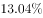；汽油机累计销量5089万台。

        从配套市场来看，乘用车用、摩托车用、园林机械用、发电机组用内燃机平稳增长，累计销量分别为2205.40万台、2030.12万台、341.29万台和170.70万台，同比增长分别为、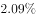、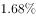和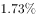；商用车用、农业机械用、工程机械用内燃机增长明显，累计销量分别为398.57万台、381.69万台和73.84万台，同比增长分别为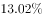、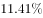和；船用内燃机累计销量2.40万台，同比下降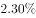；通用机械用内燃机累计销量41.37万台，同比下降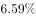。

### 第 6 题　qid 2387621 · 平均数

2016年，我国销售的内燃机平均功率约为：

- **A**. 35千瓦
- **B**. 45千瓦　✅
- **C**. 55千瓦
- **D**. 65千瓦

**答案**：B

**官方解析**

根据题干“2016年···平均功率约为”，结合材料时间为2017年，可判定本题为基期平均数问题。定位文字材料第一段：“2017年112月，全国内燃机累计销量5645.38万台，同比增长，累计完成功率266879.47万千瓦，同比增长”。根据基期平均数公式：，故2016年，我国销售的内燃机平均功率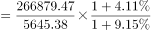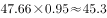，与B选项最为接近。

故正确答案为B。

---

### 第 7 题　qid 2387624 · 增长

2017年，汽油内燃机累计销量同比增速：

- **A**. 
低于

- **B**. 
在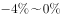之间

- **C**. 
在之间
　✅
- **D**. 
超过

**答案**：C

**官方解析**

根据题干“2017年，汽油内燃机累计销量同比增速”，且材料已知全国内燃机销量和柴油机销量的增长率，可判定此题为混合增长率问题。定位文字材料第一段和第二段，“2017年112月，全国内燃机累计销量5645.38万台，同比增长”，“从燃料类型来看，柴油机增幅明显高于汽油机，柴油机累计销量556万台，同比增长；汽油机累计销量5089万台”。

方法一：根据线段法原理，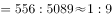，所以设汽油内燃机销量的增长率为，则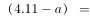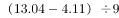，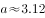。

方法二：对于数据敏感的同学也可直接观察得到答案，混合增长率口诀“居中但不中，偏向基期较大的”，一般情况下，现期量可以近似代替基期量进行比较大小，，可以明显看出，汽油内燃机的销量远大于柴油内燃机，所以整体的增长率会特别偏向于汽油内燃机销量的增长率，即小于又很接近，显然只有C选项满足此条件。

故正确答案为C。

---

### 第 8 题　qid 2387626 · 综合

2017年1～12月，内燃机销量环比下跌的月份有几个？

- **A**. 3
- **B**. 4
- **C**. 5
- **D**. 6　✅

**答案**：D

**官方解析**

根据题干“环比下跌的月份”，可判定本题为一般增长率问题。环比下跌，即，则。定位图形材料，已知1-12月每个月份内燃机销量，则根据柱子比上个月低判断出2-12月中，环比下跌的月份有2月、4月、5月、7月、10月，共5个月份。又2017年1月份环比基期为2016年12月份，2016年12月销量为，所以1月环比下跌，总计有6个月份环比下跌。

故正确答案为D。

---

### 第 9 题　qid 2387627 · 综合

从配套市场来看，与上年相比，2017年销量变化最大的是：

- **A**. 乘用车用内燃机　✅
- **B**. 商用车用内燃机
- **C**. 摩托车用内燃机
- **D**. 农业机械用内燃机

**答案**：A

**官方解析**

根据“与上年相比，2017年销量变化最大的是”，且材料告诉各种配套市场的现期和增长率，可判断此题为增长量比较问题。定位文字材料第三段，“从配套市场来看，乘用车用、摩托车用···内燃机平稳增长，累计销量分别为2205.40万台、2030.12万台···，同比增长分别为2.99、2.09···；商用车用、农业机械用···内燃机增长明显，累计销量分别为398.57万台、381.69万台···，同比增长分别为13.02、11.41···”，可知乘用车用内燃机增长量为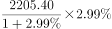 ，摩托车用内燃机增长量为  ，商用车用内燃机增长量为 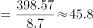，农业机械用内燃机增长量为。所以乘用车内燃机增长量最大，即销量变化最大，对应选项A。

故正确答案为A。

---

### 第 10 题　qid 2387628 · 增长

能够从上述资料中推出的是：

①2016年112月柴油内燃机累计完成功率

②2017年第一季度内燃机累计销量的同比增速

③2016年园林机械用内燃机累计销量所占比重

- **A**. 仅②
- **B**. 仅②③　✅
- **C**. 仅①③
- **D**. ①②③

**答案**：B

**官方解析**

①：定位文字材料第一段，“2017年112月，全国内燃机···累计完成功率266879.47万千瓦，同比增长，其中柴油内燃机功率同比增长”，可知仅有柴油内燃机功率的增长率，没有现期值，故不可推出2016年112月柴油内燃机累计完成功率；

②：定位图形材料，可知2017年第一季度内燃机累计销量为，又已知2017年13月内燃机销量的同比增速，则2016年1月内燃机销量为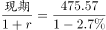 ，2016年2月内燃机销量为 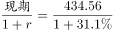，2016年3月内燃机销量为 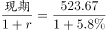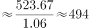，所以2016年第一季度内燃机累计销量为 ，则2017年第一季度内燃机累计销量的同比增速为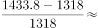，故可推出；

③：定位文字材料第一段，“2017年112月，全国内燃机累计销量5645.38万台，同比增长”，可知2016年112月全国内燃机累计销量为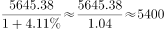 。又根据文字材料第三段，“从配套市场来看，···园林机械用内燃机平稳增长，累计销量分别为···341.29万台，同比增长分别为···”可知2016年园林机械用内燃机累计销量为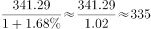，所以2016年园林机械用内燃机累计销量所占比重为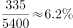 ，故可推出。

故能够从上述资料中直接推出的只有②③。 

故正确答案为B。

---

## 材料 3

根据所给资料，回答下列问题。

注：“15Q1”表示2015年1季度数据，其余类推

### 第 11 题　qid 2387620 · 综合

2017年上半年，在线视频收入：

- **A**. 不到200亿元
- **B**. 在200～300亿元之间
- **C**. 在300～400亿元之间　✅
- **D**. 超过400亿元

**答案**：C

**官方解析**

2017年上半年在线视频收入即为2017年的1季度和2季度在线视频收入之和。定位表格，在线视频收入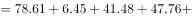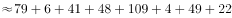亿元。因此介于亿元之间。

故正确答案为C。

---

### 第 12 题　qid 2387622 · 增长

2017年2季度，在线视频移动端广告收入环比增长速度：

- **A**. 
低于

- **B**. 
在之间

- **C**. 
在之间
　✅
- **D**. 
在以上

**答案**：C

**官方解析**

根据题干所求“···环比增长速度”可判定此题为增长率的计算问题，定位折线图，2017年2季度与2017年1季度移动端广告收入占在线视频广告收入的比重分别是：，。 移动端广告收入；在线视频广告收入的数据定位表格，2017年2季度与2017年1季度的分别为

109.24亿元，78.61亿元，根据增长率公式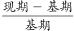，因此答案的范围介于之间。

故正确答案为C。

---

### 第 13 题　qid 2387623 · 倍数

2015～2016年，在线视频移动端广告收入是非移动端的2倍以上的季度有几个？

- **A**. 1　✅
- **B**. 2
- **C**. 3
- **D**. 4

**答案**：A

**官方解析**

根据题干“···2倍以上”，判定本题为现期倍数问题，根据移动端广告收入，非移动端广告收入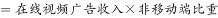，同一季度在线视频广告收入相同，因此只需判断移动端广告收入比重是否大于即可。定位折线图， 2015年1季度、2015年2季度、2015年3季度、2015年4季度、2016年1季度、2016年2季度、2016年3季度、2016年4季度，移动端广告收入比重分别为：，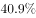，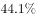，，，，，；非移动端广告收入比重分别为：，，，，，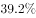，，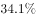；

因此在线视频移动端广告收入是非移动端的2倍以上的季度只有2016年的3季度。

故正确答案为A。

---

### 第 14 题　qid 2387625 · 增长

下列折线图中，能准确反映2016年各个季度在线视频增值服务收入同比增速变化趋势的是：

- **A**. A
- **B**. B
- **C**. C
- **D**. D　✅

**答案**：D

**官方解析**

根据题干“能准确反映2016年各个季度······同比增速变化趋势”，判定本题为一般增长率问题。定位表格数据可得：2015年1季度、2015年2季度、2015年3季度、2015年4季度在线视频增值服务收入分别为9.23亿元、10.40亿元、14.59亿元、17.28亿元；2016年1季度、2016年2季度、2016年3季度、2016年4季度在线视频增值服务收入分别为20.52亿元、28.97亿元、36.12亿元、35.15亿元。根据，可得2016年第1季度同比增速为，2016年第2季度同比增速为，2016年第3季度同比增速为，2016年第4季度同比增速为，根据计算结果可判定选项D趋势图符合。

故正确答案为D。

---

### 第 15 题　qid 2387630 · 综合

能够从上述资料中推出的是：

- **A**. 
2016年1季度，4类在线视频业务收入均环比下降

- **B**. 
2016年4季度，非移动端在线视频广告收入环比上升
　✅
- **C**. 
2017年2季度，在线视频其他业务收入同比下降了以上

- **D**. 
2015年下半年，在线视频版权分销业务收入较上半年增加了不到1倍

**答案**：B

**官方解析**

A项：定位表格数据可知，2015年4季度视频增值服务为17.28亿元，2016年1季度视频增值服务为20.52亿元，所以，故环比上升，错误； 

B项：定位折线图可知，2016年3季度移动端广告收入占在线视频广告收入的比重为，2016年4季度移动端广告收入占在线视频广告收入的比重为，则2016年3季度非移动端广告收入占在线视频广告收入的比重为，2016年4季度非移动端广告收入占在线视频广告收入的比重为；定位表格可知2016年3季度在线视频广告收入91.92亿元，2016年4季度在线视频广告收入102.31亿元；根据非移动端在线视频广告收入，所以3季度非移动端广告收入，4季度非移动端广告收入，因此，故环比上升，正确；

C项：定位表格数据可知，2016年2季度在线视频其他业务收入为41.58亿元，2017年2季度在线视频其他业务收入为21.7亿元，根据，可得2017年2季度同比增长率为，因此下降不到，错误；

D项：定位表格数据可知，2015年下半年即2015年3季度和2015年4季度之和，在线视频版权分销业务收入分别为2.47亿元、8.83亿元；2015年上半年即2015年1季度和2015年2季度之和，在线视频版权分销业务收入分别为1.48亿元、2.58亿元，根据，可得2015年下半年环比增长率为，因此增加超过1倍，错误。

故正确答案为B。

---
