# 2019年湖北省选调生招录考试《综合知识和行政职业能力测验》题

> 资料分析 · 10 题 · 湖北 2019

## 材料 1

        自改革开放以来，外商在华投资势头良好。今年两会期间，《中华人民共和国外商投资法（草案）》成为重要议题。2018年，外商直接在华投资（非金融类）新设立企业60533家。外商直接在华投资金额8856亿元，折1350亿美元。其中“一带一路”沿线国家对华直接投资新设立企业4479家，对华直接投资424亿元。全年高技术制造业实际使用外资（非金融类）898亿元，增长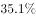。

        2018年，我国对外非金融类直接投资7974亿元，同比下降，其中对“一带一路”沿线国家非金融类直接投资156亿美元，同比增长。

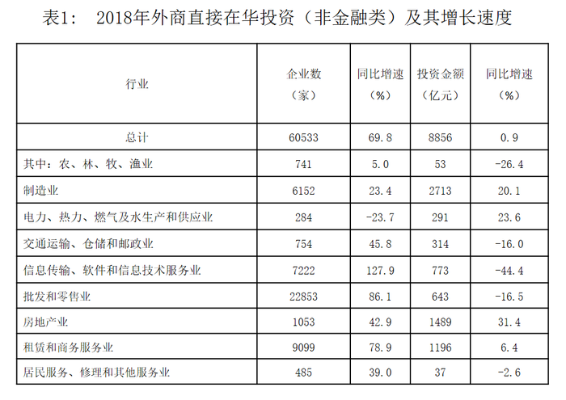

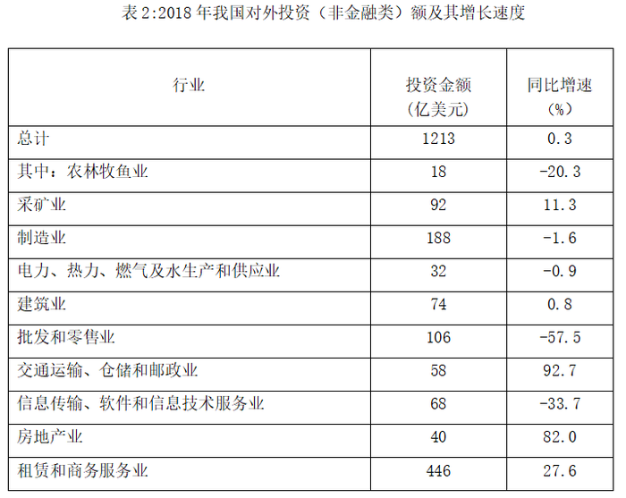

### 第 1 题　qid 2366015 · 综合

2018年，在非金融领域，我国对外直接投资额和外商在华直接投资额之比约为：

- **A**. 10：9
- **B**. 9：10　✅
- **C**. 9：8
- **D**. 8：9

**答案**：B

**官方解析**

根据题干“2018年······之比”，结合材料给出2018年数据，可判定本题为比值计算问题。定位文字材料第二段可知：2018年我国对外非金融类直接投资7974亿元，定位文字材料第一段可知：外商在华投资金额为8856亿元，两者之比约为。

故正确答案为B。

---

### 第 2 题　qid 2366016 · 平均数

2018年，外商直接在华投资（非金融类）新设企业的平均投资额（单位：万元）在以下哪个区间内？

- **A**. （1450，1500）　✅
- **B**. （1500，1550）
- **C**. （1600，1650）
- **D**. （1650，1700）

**答案**：A

**官方解析**

根据题干“2018年······平均投资额”，可判定本题为现期平均数计算问题。定位文字材料第一段，2018年外商直接在华投资金额为8856亿元，新设立企业60533家，则平均投资额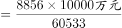，在1450万元至1500万元区间。

故正确答案为A。

---

### 第 3 题　qid 2366017 · 综合

下列行业中，2018年我国对外非金融类直接投资额与外商在华投资额差值最大的是：

- **A**. 批发和零售业
- **B**. 电力、热力、燃气及水生产和供应业
- **C**. 租赁和商务服务业　✅
- **D**. 交通运输、仓储和邮政业

**答案**：C

**官方解析**

定位统计表，分别计算四个选项的投资差值。由于单位不同，先进行单位换算，根据材料文字“外商直接在华投资金额8856亿元，折1350亿美元”，可知1美元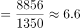元

A项：批发和零售业为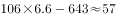亿元；

B项：电力、热力、燃气及水生产和供应业为亿元；

C项：租赁和商务服务业为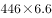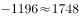亿元；

D项：交通运输、仓储和邮政业为亿元。

租赁和商务服务业的投资额差值最大。

故正确答案为C。

---

### 第 4 题　qid 2366018 · 增长

将下列行业中2018年外商直接在华非金融类投资额按增幅从大到小排序，正确的是：

- **A**. 农林牧渔业＞电力、热力、燃气及水生产和供应业＞批发和零售业
- **B**. 房地产业＞电力、热力、燃气及水生产和供应业＞制造业　✅
- **C**. 信息传输、软件和信息技术服务业＞房地产业＞制造业
- **D**. 农林牧渔业＞批发和零售业＞交通运输、仓储和邮政业

**答案**：B

**官方解析**

定位第一个统计表可知，2018年外商直接在华非金融类投资额增速分别为：

A项：农林牧渔业（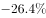）、电力、热力、燃气及水生产和供应业（）、批发和零售业（）；

B项：房地产业（）、电力、热力、燃气及水生产和供应业（）、制造业（）；

C项：信息传输、软件和信息技术服务业（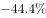）、房地产业（）、制造业（）；

D项：农林牧渔业（）、批发和零售业（）、交通运输、仓储和邮政业（）。

按照从大到小排序，只有B选项满足题意。

故正确答案为B。

---

### 第 5 题　qid 2366019 · 综合

下列说法正确的是：

- **A**. 2018年，外商直接在华投资（非金融类）新设交通运输、仓储和邮政企业同比增量大于房地产企业
- **B**. 2018年我国对外非金融类直接投资额中，对“一带一路”沿线国家投资额占比达两成
- **C**. 2018年，我国对外投资（非金融类）领域，投资额总体增速低于建筑业投资额增速　✅
- **D**. 2017年，我国高技术制造业实际使用外资（非金融类）额超过700亿元

**答案**：C

**官方解析**

A项：定位表1，可知：2018年外商直接在华投资（非金融类）新设交通运输、仓储和邮政企业数为754，增长率为，2018年外商直接在华投资（非金融类）新设房地产企业数为1053，增长率为。那么2018年外商直接在华投资（非金融类）新设交通运输、仓储和邮政企业同比增量，2018年外商直接在华投资（非金融类）房地产企业同比增量，2018年，外商直接在华投资（非金融类）新设交通运输、仓储和邮政企业同比增量小于房地产企业，说法错误，排除；

B项：定位文字材料第二段，可知：2018年，我国对外非金融类直接投资7974亿元，······其中对“一带一路”沿线国家非金融类直接投资156亿美元,根据表2，2018年我国对外非金融类投资1213亿美元。因此2018年我国对外非金融类直接投资额中，对“一带一路”沿线国家投资额占比为，未达到两成（），说法错误，排除；

C项：定位表2，可知：2018年，我国对外投资（非金融类）领域，投资额总体增速为，建筑业同比增速为，，说法正确，当选；

D项：定位文字材料第一段，可知：2018年全年高技术制造业实际使用外资（非金融类）898亿元，增长。那么2017年，我国高技术制造业实际使用外资（非金融类）额亿元，未超过700亿元，说法错误，排除。

故正确答案为C。

---

## 材料 2

        2018年，我国软件和信息技术服务业运行态势良好，收入和效益增长较快，吸纳就业人数稳定增长。2018年，全国软件和信息技术服务业规模以上企业3.78万家，累计完成软件业务收入63061亿元，软件和信息技术服务业实现利润总额8079亿元，同比增长，从业人数比上年增加25万人。

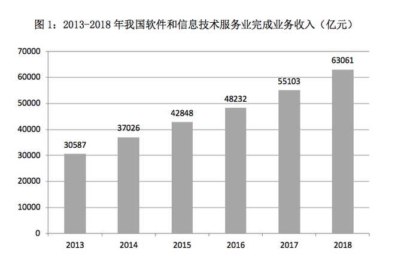

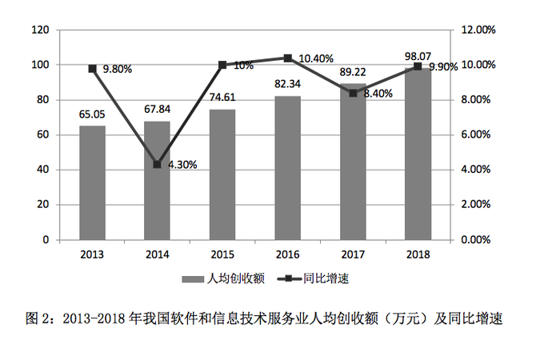

### 第 6 题　qid 2366020 · 增长

2013-2018年，我国软件和信息技术服务业人均创收额同比增速回落超过5个百分点的年度有：

- **A**. 3个
- **B**. 2个
- **C**. 1个　✅
- **D**. 0个

**答案**：C

**官方解析**

“回落”代表增长率减少，定位图2折线图，同比增速减少的只有2014年和2017年，2014年：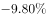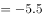个百分点，回落了5.5个百分点，符合；2017年：个百分点，回落了2个百分点，排除。因此只有1个年度符合。

故正确答案为C。

---

### 第 7 题　qid 2366021 · 综合

2017年，我国软件和信息技术服务业从业人员人数约为多少万人？

- **A**. 701
- **B**. 652
- **C**. 633
- **D**. 618　✅

**答案**：D

**官方解析**

根据问题“2017年，我国软件和信息技术服务业从业人员人数约为多少万人”，结合两个图形中的完成业务收入和人均创收额，可判断本题为现期平均数问题。定位图1，可知：2017年我国软件和信息技术服务业完成业务收入为55103亿元，定位图2，可知：2017年我国软件和信息技术服务业人均创收额89.22万元，那么2017年，我国软件和信息技术服务业从业人员人数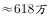。

故正确答案为D。

---

### 第 8 题　qid 2366022 · 增长

2014-2018年，我国软件和信息技术服务业完成业务收入同比增速最接近的是：

- **A**. 2014年和2018年
- **B**. 2017年和2018年　✅
- **C**. 2015年和2016年
- **D**. 2016年和2017年

**答案**：B

**官方解析**

定位图1，时间段为2014～2018年，因没有直接给同比增速，需要进行计算之后再进行比较。

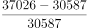；

；

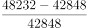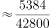；

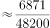；

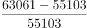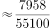。

通过以上数据可以发现，我国软件和信息技术服务业完成业务收入同比增速最接近的是2017年和2018年。

故正确答案为B。

---

### 第 9 题　qid 2366023 · 增长

如果我国2019年要实现在2014年基础上软件和信息技术服务业业务收入翻番的目标，则2019年业务收入同比增速要达到约：

- **A**. 

　✅
- **B**. 

- **C**. 

- **D**. 

**答案**：A

**官方解析**

根据问题“2019年业务收入同比增速要达到约”，可判断为一般增长率问题。定位图1，根据“我国2019年要实现在2014年基础上软件和信息技术服务业业务收入翻番的目标”，可得2019年软件和信息技术服务业业务收入（翻番指的是变为原来的2倍）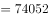亿元，则2019年业务收入同比增速要达到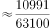，A选项最接近。

故正确答案为A。

---

### 第 10 题　qid 2366024 · 综合

下列不能根据所给资料推出的是：

- **A**. 2015年，我国软件和信息技术服务业从业人员人数的同比增速
- **B**. 2015-2018年，我国软件和信息技术服务业完成业务收入年均增量
- **C**. 2013-2017年，我国软件和信息技术服务业人均创收额的年均增速
- **D**. 2012-2016年，我国软件和信息技术服务业年均完成业务收入额　✅

**答案**：D

**官方解析**

A项：定位图1，已知2015年、2014年的软件和信息技术服务业完成业务收入，定位图2，已知2015年、2014年的软件和信息技术服务业人均创收额，那么2015年我国软件和信息技术服务业从业人员人数的同比增速，可以推出，排除；

B项：定位图1，可知：2015年、2018年我国软件和信息技术服务业完成业务收入分别为42848亿元、63061亿元，那么年均增量，可以推出，排除；

C项：定位图2，可知：2013年、2017年我国软件和信息技术服务业人均创收额分别为65.05万元、89.22万元，由年均增长率公式，代入数据，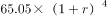，即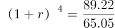，可以求出，排除；

D项：要求2012～2016年我国软件和信息技术服务业年均完成业务收入额，需要把2012～2016年的每个年份的收入额相加再除以5个年份。定位图1，没有给出也无法求出2012年我国软件和信息技术服务业完成业务收入额，无法推出，当选。

本题为选非题，故正确答案为D。

---
