# 2019年福建省选调生考试《行政职业能力测验》

> 资料分析 · 20 题 · 福建 2019

## 材料 1

### 第 1 题　qid 4708172 · 综合

2017年实征营业税收合计为：

- **A**. 9015.19亿元　✅
- **B**. 9804.58亿元
- **C**. 18819.77亿元
- **D**. 27834.96亿元

**答案**：A

**官方解析**

定位统计表可得：2017年第一产业实征营业税收为3亿元，第二产业实征营业税收为2065.97亿元，第三产业实征营业税收为6946.22亿元。则2017年实征营业税收合计为3+2065.97+6946.22=9015.19亿元。
故正确答案为A。

---

### 第 2 题　qid 4708175 · 综合

2017年第三产业营业税的转出规模（实征税收-归宿税收）约为        亿元，占其产业实征营业税的        ？

- **A**. 1383.34 20%　✅
- **B**. 1383.34 25%
- **C**. 840.39 20%
- **D**. 840.39 17%

**答案**：A

**官方解析**

定位统计表可得：2017年第三产业实征营业税收为6946.22亿元，归宿营业税收为5562.88亿元。则2017年第三产业营业税的转出规模为6946.22-5562.88=1383.34亿元。

根据题干“2017年······占其······”，可判定本题为现期比重问题。则所求比重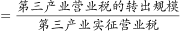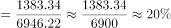。

故正确答案为A。

---

### 第 3 题　qid 4708182 · 平均数

根据表格信息，第三产业营业税净转出方（归宿税收小于实征税收）行业共有（    ）个，这行业转出比例的平均值约为（    ）。

- **A**. 4 12%
- **B**. 9 27%　✅
- **C**. 10 30%
- **D**. 13 39%

**答案**：B

**官方解析**

定位统计表可知，第三产业营业税净转出方行业，即归宿营业税小于实征营业税的行业有：交通运输、仓储及邮政业（361.71亿元＜668.86亿元），信息传输、计算机服务和软件业（267.08亿元＜334.89亿元），住宿和餐饮业（283.6亿元＜357.39亿元），金融业（661.84亿元＜1478.54亿元），房地产业（2265.24亿元＜2368.8亿元），租赁业和商务服务业（389.45亿元＜594.25亿元），居民服务和其他服务业（378.72亿元＜459.29亿元），文化、体育和娱乐业（93.24亿元＜100.87亿元），其他行业（243.53亿元＜375.25亿元），共9个。

根据题干“······的平均值约为”，可判定本题为现期平均数问题。则该9个行业转出比例分别为：

交通运输、仓储及邮政业：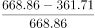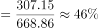；

信息传输、计算机服务和软件业：；

住宿和餐饮业：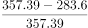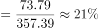；

金融业：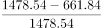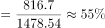；

房地产业：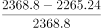；

租赁业和商务服务业：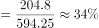；

居民服务和其他服务业：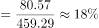；

文化、体育和娱乐业：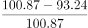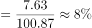；

其他行业：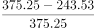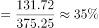。

则所求平均值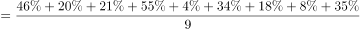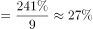。

故正确答案为B。

注：问题2中的“转出”指经济学中的税负转移，即税收的转嫁，意指纳税人通过各种途径将应缴税金全部或部分转给他人负担从而造成纳税人与负税人不一致的经济现象。因此本题转出比例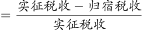或可参考92题“转出规模”的定义进行引申。

---

### 第 4 题　qid 4708191 · 比重

若比较对各自所属产业实征国内增值税的比重，2017年，制造业约比批发和零售业 （    ）？

- **A**. 高38％
- **B**. 低38％
- **C**. 高19％
- **D**. 低19％　✅

**答案**：D

**官方解析**

根据题干“若比较······的比重，2017年······”，结合选项为高/低+%，可判定本题为现期比重问题。定位统计表可知：2017年第二产业实征国内增值税14715.79亿元，其中，制造业实征国内增值税11035.77亿元；第三产业实征国内增值税4099.6亿元，其中，批发和零售业实征国内增值税3833.15亿元。根据公式：比重，可知2017年制造业占第二产业实征国内增值税的比重，批发和零售业占第三产业实征国内增值税的比重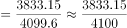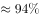，题目所求比重差=75%-94%=-19%，即约低19%。

故正确答案为D。

---

### 第 5 题　qid 4708194 · 综合

关于2017年不同行业实征税收和归宿税收，以下说法不正确的是（    ）。

- **A**. 第二产业是营业税的主要转入产业
- **B**. 第三产业是营业税的主要转出产业
- **C**. 在所有行业中，营业税转出比例最大的是房地产行业　✅
- **D**. 建筑业属于营业税的转入行业

**答案**：C

**官方解析**

A项：定位统计表，第一产业、第二产业、第三产业营业税的实征税收分别为3亿元、2065.97亿元、6946.22亿元；归宿税收分别为52.52亿元、3399.78亿元、5562.88亿元。三大产业营业税的转入规模分别为52.52-3=49.52亿元、3399.78-2065.97=1333.81亿元、5562.88-6946.22=-1383.34亿元，第二产业营业税的转入规模最大，为主要转入产业，正确；

B项：定位统计表，第一产业、第二产业、第三产业营业税的实征税收分别为3亿元、2065.97亿元、6946.22亿元；归宿税收分别为52.52亿元、3399.78亿元、5562.88亿元。三大产业中只有第三产业的实征税收大于归宿税收，是主要转出产业，正确；

C项：定位统计表，金融业营业税的实征税收和归宿税收分别为1478.54亿元、661.84亿元；房地产业营业税的实征税收和归宿税收分别为2368.8亿元、2265.24亿元。金融业的营业税转出比例，房地产业的营业税转出比例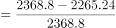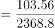，房地产行业不是营业税转出比例最大的行业，错误；

D项：定位统计表，建筑业营业税的实征税收和归宿税收分别为1921.7亿元、2376.54亿元，归宿税收大于实征税收，是营业税的转入行业，正确。

本题为选非题，故正确答案为C。

注：结合本篇材料第二题及第三题，可引申出转入产业/行业为归宿税收大于实征税收的产业/行业、转出产业/行业为实征税收大于归宿税收的产业/行业、转入规模为（归宿税收-实征税收）、转出比例为。

---

## 材料 2

        2012年F省社会消费品零售总额7149.54亿元，比上年增长15.9％，其中12月份的社会消费品零售总额645.36亿元。按经营地统计，城镇消费品零售额6563.57亿元，增长16.0％；乡村消费品零售额585.97亿元，增长14.6％。按消费形态统计，商品零售额6276.04亿元，增长15.7％；餐饮收入额873.50亿元，增长17.6％。

        在限额以上企业商品零售额中，家具类零售额比上年增长47.8％，金银珠宝类增长47.4％，服装鞋帽针织纺织品类增长32.5％，食品饮料烟酒类增长24.9％，其中食品类增长24.4％，日用品类增长22.8％，化妆品类增长18.6％，汽车类增长14.7％，石油及制品类增长13.8％，通讯器材类增长8.1％，家用电器和音响器材类增长6.1％，体育、娱乐用品类下降6.1％。

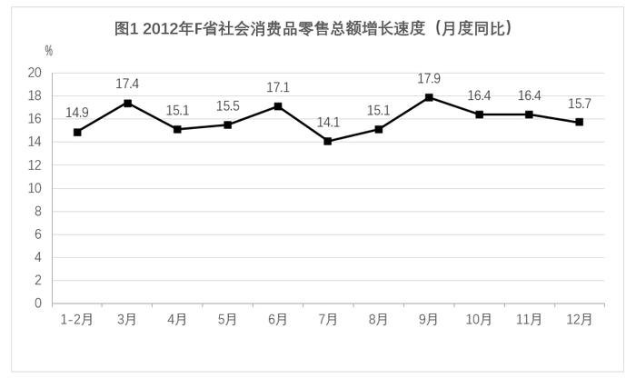

### 第 6 题　qid 4708226 · 增长

2012年，F省社会消费品零售总额同比增速最慢的月份是？

- **A**. 3月
- **B**. 7月　✅
- **C**. 10月
- **D**. 12月

**答案**：B

**官方解析**

定位统计图可知，2012年F省3月、7月、10月、12月的社会消费品零售总额同比增速分别为17.4%、14.1%、16.4%、15.7%，其中，同比增速最慢的月份是7月。
故正确答案为B。

---

### 第 7 题　qid 4708227 · 增长

2012年12月份，F省社会消费品零售总额同比增量约为：

- **A**. 120.2亿元
- **B**. 101.3亿元
- **C**. 87.6亿元　✅
- **D**. 557.8亿元

**答案**：C

**官方解析**

根据题干“2012年12月份······同比增量约为”，可判定本题为增长量计算问题。定位文字材料第一段可得：（2012年）12月份，F省社会消费品零售总额645.36亿元；定位统计图可得：（2012年）12月份，F省社会消费品零售总额同比增长15.7%。根据公式：增长量，则2012年12月份，F省社会消费品零售总额同比增量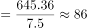亿元，与C项最接近。

故正确答案为C。

---

### 第 8 题　qid 4708228 · 综合

2011年，F省城镇消费品零售额比乡村消费品零售额高约：

- **A**. 5147亿元　✅
- **B**. 5543亿元
- **C**. 5978亿元
- **D**. 6065亿元

**答案**：A

**官方解析**

根据题干“2011年······比······高约”，结合材料时间为2012年，可判定本题为基期和差问题。定位文字材料第一段可得：2012年，F省城镇消费品零售额6563.57亿元，增长16.0％；乡村消费品零售额585.97亿元，增长14.6％。根据公式：基期量，则2011年，F省城镇消费品零售额比乡村消费品零售额高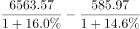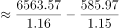亿元，与A项最接近。

故正确答案为A。

---

### 第 9 题　qid 4708229 · 综合

下列说法正确的是：

- **A**. 2012年有10个月份社会消费品零售总额月底同比增长速度超过15％
- **B**. 2012年餐饮收入额占社会消费品零售总额的比重不超过10％
- **C**. 在2012年限额以上企业商品零售额相比上年的增长速度的排行上，服装鞋帽针织纺织品类位居第四
- **D**. 与2011年相比，2012年商品零售额比餐饮收入额增量多　✅

**答案**：D

**官方解析**

A项：定位统计图，2012年1-2月，F省社会消费品零售总额同比增长14.9%。材料给出2012年1-2月的混合增长率，不能确定1月和2月单独的同比增长率，则无法判断其增长速度是否超过15%，错误；

B项：定位文字材料第一段，2012年F省社会消费品零售总额7149.54亿元，比上年增长15.9％；餐饮收入额873.50亿元，增长17.6％。根据公式：，则2012年餐饮收入额占社会消费品零售总额的比重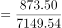，错误；

C项：定位文字材料第二段，（2012年）在限额以上企业商品零售额中，家具类零售额比上年增长47.8％，金银珠宝类增长47.4％，服装鞋帽针织纺织品类增长32.5％，食品饮料烟酒类增长24.9％，其中食品类增长24.4％，日用品类增长22.8％，化妆品类增长18.6％，汽车类增长14.7％，石油及制品类增长13.8％，通讯器材类增长8.1％，家用电器和音响器材类增长6.1％，体育、娱乐用品类下降6.1％。观察数据发现，服装鞋帽针织纺织品类增长32.5％，增长速度位居第三，错误；

D项：定位文字材料第一段，（2012年）商品零售额6276.04亿元，增长15.7％；餐饮收入额873.50亿元，增长17.6％。根据公式：，则2012年商品零售额同比增量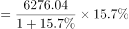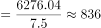亿元；2012年餐饮收入额同比增量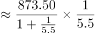亿元。故与2011年相比，2012年商品零售额比餐饮收入额增量多，正确。

故正确答案为D。

---

### 第 10 题　qid 4708235 · 增长

下列说法中，正确的有几个？
I：2012年限额以上企业商品零售额中，家具类零售额的增量大于服装鞋帽针织纺织品类
II：2012年F省社会消费品零售总额不是6000亿元
III：2012年11月社会消费品零售总额环比增长约50亿元
IV：2012年所有类别的限额以上企业商品零售额都有不同程度的上涨

- **A**. 0个
- **B**. 1个　✅
- **C**. 2个
- **D**. 3个

**答案**：B

**官方解析**

I：定位文字材料第二段可知，（2012年）在限额以上企业商品零售额中，家具类零售额比上年增长47.8％，服装鞋帽针织纺织品类增长32.5％。仅有增长率，无对应的现期量，无法求解同比增长量，故无法推出家具类零售额的增量大于服装鞋帽针织纺织品类，错误；
II：定位文字材料第一段可知，2012年F省社会消费品零售总额7149.54亿元。不是6000亿元，正确；
III：定位图1可知，材料仅给出2012年10月和11月F省社会消费品零售总额的同比增速，无法求解出2012年11月和10月的具体值，故无法推出2012年11月社会消费品零售总额的环比增量，错误；
IV：定位文字材料第二段可知，（2012年）在限额以上企业商品零售额中，体育、娱乐用品类下降6.1％。并非所有类别的限额以上企业商品零售额都有不同程度的上涨，错误。
则正确的有1个。
故正确答案为B。

---

## 材料 3

        2012年我国粮食种植面积11127万公顷，比上年增加69万公顷；棉花种植面积470万公顷，减少34万公顷，油科种植面积1398万公顷，增加12万公顷；糖料种植面积203万公顷，增加9万公顷。

        全年粮食产量58957万吨，比上年增加1836万吨，增产3.2%。全年棉花产量684万吨，比上年增产3.8%，油料产量3476万吨，比上年增产5.1%，糖料产量13493万吨，比上年增产7.8%，烤烟产量320万吨，比上年增产11.5%；茶叶产量180万吨，比上年增产11.2%。

        全年肉类产量8384万吨，比上年增产5.4%；禽蛋产量2861万吨，比上年增产1.8%，牛奶产量3744万吨，比上年增产2.3%；水产品产量5906万吨，比上年增产5.4%；全年木材产量8088万立方米，比上年下降0.7%；全年新增产效灌溉面积172万公顷，新增节水灌溉面积235万公顷。

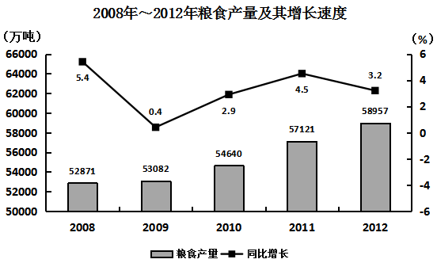

### 第 11 题　qid 2047654 · 综合

2007年我国的粮食产量约为（    ）。

- **A**. 55889万吨
- **B**. 50162万吨　✅
- **C**. 55726万吨
- **D**. 52866万吨

**答案**：B

**官方解析**

第一步：分析问题

材料中给出现期量和增长率，求基期量，为基期量的计算。现期量为2008年我国粮食产量，增长率为2008年相对2007年的增长率。基期量。

第二步：计算过程

根据图形材料可知，2008年我国粮食产量为52871万吨，增长率为5.4%，故2007年我国粮食产量为：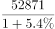，首位商50，只有B项符合。

第三步：再次标注答案

故正确答案为B。

---

### 第 12 题　qid 2047656 · 综合

2011年我国粮食的单位面积产量约为（    ）。

- **A**. 5.13万吨/公顷
- **B**. 5.13吨/公顷
- **C**. 5.17万吨/公顷
- **D**. 5.17吨/公顷　✅

**答案**：D

**官方解析**

第一步：分析问题

图形材料中给出2011年我国粮食产量，文字材料中给出2012年粮食种植面积及增长量，故可得出2011年粮食种植面积。2011年我国粮食的单位面积产量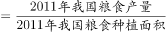，注意单位。

第二步：计算过程

根据图形材料可知，2011年我国粮食产量57121万吨；

根据文字型材料“2012年我国粮食种植面积11127万公顷，比上年增加69万公顷”，可知2011年我国粮食种植面积为：11127-69=11058万公顷。

可得：2011年我国粮食的单位面积产量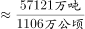，首三位商5.16，单位为吨/公顷，最接近的为D项。

第三步：再次标注答案

故正确答案为D。

---

### 第 13 题　qid 2047658 · 综合

能够从上述资料推出的是（    ）。

- **A**. 2009年我国粮食的种植面积
- **B**. 2010年我国水产品的产量
- **C**. 2011年我国木材产量　✅
- **D**. 2011年我国猪肉产量

**答案**：C

**官方解析**

第一步：分析问题

根据材料，找出能算出结果的一项即可。

第二步：计算过程

A项：错误，材料中只给了2012年我国粮食种植面积及增长量，得不出2009年粮食种植面积；

B项：错误，材料中给出2012年我国水产品的产量及2012年相对2011年的增长率，无法求出2010年的我国水产品产量；

C项：正确，根据材料“全年木材产量8088万立方米，比上年下降0.7%”，故可得2011年木材产量为：，是可以得出的；

D项：错误，材料中只给出肉类整体的产量及增长率，并未涉及到猪肉的信息，因此无法得出2011年猪肉的产量。

第三步：再次标注答案

故正确答案为C。

---

### 第 14 题　qid 2047660 · 增长

与2011年相比，下列农作物中在2012年产量增加最多的是（    ）。

- **A**. 棉花
- **B**. 油料
- **C**. 烤烟
- **D**. 糖料　✅

**答案**：D

**官方解析**

第一步：分析问题
材料中给出各农作物的现期量及增长率，比较增长量大小。现期量为2013年农作物的产量。1.若现期量大、增长率大，则对应的增长量大；2.若现期量大，增长率小，一般情况下比较现期量×增长率即可。
第二步：计算过程
根据“全年棉花产量684万吨，比上年增产3.8%，油料产量3476万吨，比上年增产5.1%，糖料产量13493万吨，比上年增产7.8%，烤烟产量320万吨，比上年增产11.5%”。
可知棉花的现期量为684万吨，增长率为3.8%，油料的现期量为3476万吨，增长率为5.1%，棉花与油料相比，油料的现期量3476万吨&gt;棉花的现期量684万吨，油料的增长率5.1%&gt;棉花的增长率3.8%，因此油料的增长量大于棉花的增长量；
糖料的现期量13493万吨，增长率7.8%，糖料与油料相比，糖料的现期量13493万吨&gt;油料的现期量3476万吨，糖料的增长率7.8%&gt;油料的增长率5.1%，因此糖料的增长量大于油料的增长量；
烤烟的现期量320万吨，增长量11.5%，糖料与烤烟相比，糖料的现期量13493万吨&gt;烤烟的现期量320万吨，糖料的增长率7.8%&lt;烤烟的增长率11.5%，因此，比较：13493×7.8%与320×11.5%，显然13493×7.8%&gt;320×11.5%，故糖料的增长量最大。
第三步：再次标注答案
故正确答案为D。

---

### 第 15 题　qid 2047662 · 增长

下列说法中，正确的有（    ）。
I.2008~2012年我国粮食产量是逐年增加的
II.2008~2012年我国年均粮食产量增加不到1000万吨
III.2012年各种农作物的产量比上年都有不同程度的增长
Ⅳ.2011年茶叶产量不超过170万吨

- **A**. 1个
- **B**. 2个　✅
- **C**. 3个
- **D**. 4个

**答案**：B

**官方解析**

第一步：分析问题

根据材料，找出正确表述的个数即可。

第二步：计算过程

I.根据图形材料可知，2008~2012年我国粮食产量是逐年增加的，表述正确；

II.根据图形材料可知，2008年、2012年我国粮食产量分别为52871万吨、58957万吨，则2008~2012年我国年均粮食产量增长量为：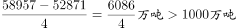，表述错误；

III.题目中只列举了几种农作物，不代表各种农作物，表述错误；

Ⅳ.根据“茶叶产量180万吨，比上年增产11.2%”，可知2011年茶叶产量为：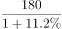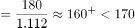，表述正确。

第三步：再次标注答案

故正确答案为B。

---

## 材料 4

        近岸海域298个海水水质监测点，在2015年监测中，达到国家一、二类海水水质标准的监测点占62.8%，比上年下降10.1个百分点；三类海水占14.1％，上升8.1个百分点；四类、劣四类海水占23.1％，上升2.1个百分点。

        在监测的330个城市中，有273个城市空气质量达到二级以上(含二级)标准，占监测城市数的82.7％；有53个城市为三级，占16.1％；有4个城市为劣三级，占1.2％。在监测的331个城市中，城市区域声环境质量好的城市占6.3％，较好的占67.4％，轻度污染的占25%，中度污染的占0.9％。

        2015年年末城市污水处理厂日处理能力达10262万立方米，比上年末增长13.4％；城市污水处理率达到76.9％，提高1.6个百分点。集中供热面积39.1亿平方米，增长3.0％。建成区绿地率达到34.5％，提高0.3个百分点。

        2015年全年各类自然灾害造成直接经济损失5340亿元，比上年增加1.1倍，占国内生产总值的1.31％。全年农作物受灾面积3743万公顷，减少20.7％。其中，绝收486万公顷，减少1.1％。全年因洪涝、滑坡和泥石流灾害造成直接经济损失3505亿元，增加4.4倍；死亡3101人。全年因旱灾造成直接经济损失757亿元，下降31.2％。全年因低温冷冻和雪灾造成直接经济损失318亿元，死亡51人。全年因海洋灾害造成直接经济损失149.4亿元，增加49.1％。全年累计发生赤潮面积10892平方公里，减少22.8％。全年大陆地区共发生5级以上地震17次，成灾10次，造成直接经济损失235.7亿元，死亡2705人。全年共发生森林火灾7723起，下降12.8％。

        2015年全年各类生产安全事故共死亡79552人，比上年下降4.4％。亿元国内生产总值生产安全事故死亡人数为0.201人，下降19.0％；工矿商贸企业就业人员10万人生产安全事故死亡人数为2.13人，下降11.3％；道路交通万车死亡人数为3.2人，下降11.1％；煤矿百万吨死亡人数为0.749人，下降16.0％。

### 第 16 题　qid 4708236 · 综合

2014年海水质量达到三类及以上海水水质标准的监测点的数量为：

- **A**. 187
- **B**. 223
- **C**. 229
- **D**. 235　✅

**答案**：D

**官方解析**

根据题干“2014年······数量为”，结合材料时间是2015年，同时给出了海水水质监测点总数和各类占比，可判定本题为基期比重问题。定位文字材料第一段可知：近岸海域298个海水水质监测点，在2015年监测中，达到国家一、二类海水水质标准的监测点占62.8％，比上年下降10.1个百分点；三类海水占14.1％，上升8.1个百分点。故2014年达到国家一、二类海水水质标准的监测点占比=62.8%+10.1%=72.9%；三类海水占比=14.1％-8.1%=6%，则2014年海水质量达到三类及以上的海水水质监测点占比为72.9%+6%=78.9%。根据公式：部分量=总量×比重，可知所求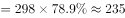个。

故正确答案为D。

---

### 第 17 题　qid 4708239 · 综合

2014年全年因旱灾造成直接经济损失是该年度因海洋灾害造成直接经济损失的多少倍？

- **A**. 0.8
- **B**. 5.0
- **C**. 7.3
- **D**. 11.0　✅

**答案**：D

**官方解析**

根据题干“2014年······是······”，可判定本题为基期倍数问题。定位文字材料第四段可知：（2015年）全年因旱灾造成直接经济损失757亿元（A），下降31.2％（a）。全年因海洋灾害造成直接经济损失149.4亿元（B），增加49.1％（b）。根据公式：基期倍数，可知所求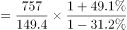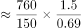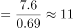。

故正确答案为D。

---

### 第 18 题　qid 4708242 · 综合

2015年国内生产总值约为（    ）万亿？

- **A**. 28.9
- **B**. 33.6
- **C**. 41.6　✅
- **D**. 50.7

**答案**：C

**官方解析**

根据题干“2015年······约为······万亿”，结合材料给出了各类自然灾害造成直接经济损失及其占国内生产总值的比重，可判定本题为现期比重问题。定位文字材料第四段可知：2015年全年各类自然灾害造成直接经济损失5340亿元，占国内生产总值的1.31%。根据公式：总量，可知所求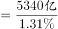万亿，与C项最为接近。

故正确答案为C。

---

### 第 19 题　qid 4708244 · 综合

2014年年末城市污水处理厂日处理能力为（    ）万立方米。

- **A**. 11849.9
- **B**. 9049.4　✅
- **C**. 8862.5
- **D**. 8563.6

**答案**：B

**官方解析**

根据题干“2014年年末······为······万立方米”，结合材料时间2015年，可判定本题为基期计算问题。定位文字材料第三段可知：2015年年末城市污水处理厂日处理能力达10262万立方米，比上年末增长13.4％。根据公式：基期量，代入数据可得，2014年年末城市污水处理厂日处理能力为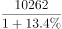万立方米，与B项最接近。

故正确答案为B。

---

### 第 20 题　qid 4708247 · 综合

根据材料，以下说法正确的是（    ）。

- **A**. 2015年全年各类自然灾害造成直接经济损失较上年度相比均有所增加
- **B**. 2015年全年因洪涝、滑坡和泥石流灾害造成经济损失3505亿元，同比增加了2856亿元　✅
- **C**. 2014年全年农作物受灾面积为4228.6万公顷
- **D**. 2014年全年发生森林火灾次数比2010年全年发生森林火灾次数多12.8％

**答案**：B

**官方解析**

A项：定位文字材料第四段可知，（2015年）全年因旱灾造成直接经济损失757亿元，下降31.2％，并非各类自然灾害造成直接经济损失较上年度相比均有所增加，错误；

B项：定位文字材料第四段可知，（2015年）全年因洪涝、滑坡和泥石流灾害造成直接经济损失3505亿元，增加4.4倍。则同比增加了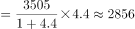亿元，正确；

C项：定位文字材料第四段可知，（2015年）全年农作物受灾面积3743万公顷，减少20.7％。则2014年全年农作物受灾面积万公顷，错误；

D项：定位文字材料第四段可知，（2015年）全年共发生森林火灾7723起，下降12.8%。无2010年相关的数据，无法推出2014年全年发生森林火灾次数比2010年多12.8％，错误。

故正确答案为B。

---
