# 2019年辽宁省公务员录用考试《行测》题（网友回忆版）

> 资料分析 · 20 题 · 辽宁 2019

## 材料 1

        2019年1-8月，全国房地产开发投资84589亿元，同比增长，增速比1-7月回落0.1个百分点。其中，住宅投资65187亿元，增长，增速回落0.2个百分点。

        1-8月，东部地区房地产开发投资44857亿元，同比增长，增速比1-7月回落0.4个百分点；中部地区投资17809亿元，增长，增速加快0.3个百分点；西部地区投资18506亿元，增长，增速加快0.9个百分点；东北地区投资3418亿元，增长，增速回落1.3个百分点。

        1-8月，房地产开发企业土地购置面积12236万平方米，同比下降，每平方米土地价格同比上涨，土地成交额6374亿元。

        1-8月，东部地区商品房销售面积40303万平方米，同比下降，降幅比1-7月收窄0.6个百分点；销售额50739亿元，增长，增速加快0.3个百分点。中部地区商品房销售面积28791万平方米，增长，1-7月为下降；销售额20682亿元，增长，增速加快0.7个百分点。西部地区商品房销售面积28284万平方米，增长，增速加快1.0个百分点；销售额20363亿元，增长，增速加快0.6个百分点。东北地区商品房销售面积4471万平方米，下降，降幅收窄1.2个百分点；销售额3589亿元，增长，增速加快1.8个百分点。

### 第 1 题　qid 2443066 · 比重

2018年1-8月，住宅投资占全国房地产开发投资比重约为：

- **A**. 

- **B**. 

- **C**. 

　✅
- **D**. 

**答案**：C

**官方解析**

根据题干“2018年1-8月，······占······比重约为”，结合材料时间为2019年1-8月，可判定本题为基期比重问题。定位文字资料第一段可知，2019年1-8月，全国房地产开发投资84589亿元（B），同比增长（b），······其中，住宅投资65187亿元（A），增长（a）。根据基期比重公式：，则 2018年1-8月住宅投资所占比重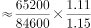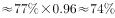。

故正确答案为C。

---

### 第 2 题　qid 2443072 · 增长

2019年1-8月，西部地区投资比去年同期增加约      亿元。

- **A**. 2812
- **B**. 2643
- **C**. 2552　✅
- **D**. 2313

**答案**：C

**官方解析**

根据题干“2019年1-8月，······增加约<u>      </u>亿元”，可判定本题为增长量计算问题。定位文字资料第二段可知，2019年1-8月，西部地区投资18506亿元，增长。则2019年1-8月西部地区投资增长量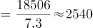亿元，C项最接近。

故正确答案为C。

备注:原题干时间为“2018年1-8月”，但没有相关数据进行计算，故粉笔将本题时间修改为“2019年1-8月”，可以得出C项。

---

### 第 3 题　qid 2443083 · 增长

2019年1-8月，房地产开发企业土地成交额与去年同期相比增长约：

- **A**. 

- **B**. 
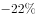
　✅
- **C**. 

- **D**. 

**答案**：B

**官方解析**

根据题干“2019年1-8月，······与去年同期相比增长约”，结合选项是百分数，且每平方米土地价格，可判定本题为平均数的增长率问题。定位文字资料第三段可知，2019年1-8月，房地产开发企业土地购置面积同比下降（b），每平方米土地价格同比上涨（r）。根据平均数增长率公式：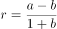，房地产开发企业土地成交额增速为，代入公式得：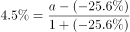，则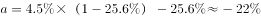。

故正确答案为B。

---

### 第 4 题　qid 2443086 · 增长

2019年1-8月，下列地区中商品房价格同比增长最慢的是：

- **A**. 东部地区
- **B**. 西部地区　✅
- **C**. 中部地区
- **D**. 东北地区

**答案**：B

**官方解析**

根据题干“2019年1-8月，下列地区中商品房价格同比增长最慢的是”，商品房价格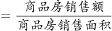，可判定本题为平均数的增长率问题。定位文字资料第四段可知，2019年1-8月，东部地区商品房销售面积同比下降（b），销售额增长（a）；中部地区商品房销售面积增长（b），销售额增长（a）；西部地区商品房销售面积增长（b），销售额增长（a）；东北地区商品房销售面积下降（b），销售额增长（a）。

根据平均数增长率公式：，则2019年1-8月东部地区商品房价格同比增速；西部地区商品房价格同比增速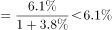；中部地区商品房价格同比增速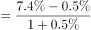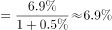；东北部地区商品房价格同比增速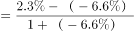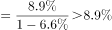比较可知，西部地区商品房价格同比增速最慢。

故正确答案为B。 

---

### 第 5 题　qid 2443089 · 综合

下列说法错误的是：

- **A**. 2019年1-8月，全国各地区商品房单价均保持上涨
- **B**. 2019年1-8月，全国商品房销售额最多的是东部地区
- **C**. 2019年1-8月，西部地区商品房销售面积约27248万平方米　✅
- **D**. 2019年1-7月，全国房地产开发投资东部地区增速高于东北地区

**答案**：C

**官方解析**

A项：定位文字资料第四段可知，2019年1-8月，东部地区商品房销售面积同比下降（b），销售额增长（a）；中部地区商品房销售面积增长（b），销售额增长（a）；西部地区商品房销售面积增长（b），销售额增长（a）；东北地区商品房销售面积下降（b），销售额增长（a）。商品房单价，根据两期平均数结论，当分子增长率（a）分母增长率（b），则平均数较去年上升。东部地区：；中部地区：；西部地区：；东北地区：。则全国各地区商品房单价均保持上涨，正确；

B项：定位文字资料第四段可知，2019年1-8月，东部地区商品房销售额50739亿元，中部地区商品房销售额20682亿元，西部地区商品房销售额20363亿元，东北地区商品房销售额3589亿元，则全国商品房销售额最多的是东部地区，正确；

C项：定位文字资料第四段可知，2019年1-8月西部地区商品房销售面积28284万平方米，并非27248万平方米，错误；

D项：定位文字资料第二段可知，2019年1-8月，东部地区房地产开发投资44857亿元，同比增长，增速比1-7月回落0.4个百分点；东北地区投资3418亿元，增长，增速回落1.3个百分点。则2019年1-7月全国东部地区房地产开发投资增速；东北部地区增速，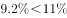。错误。

本题为选非题，故正确答案为C、D。

备注：本题C、D项均有明显错误，C项表述“西部地区商品房销售面积约27248万平方米”是基期2018年1-8月数据，若将C项时间改为基期时间，则有唯一答案，但题干明确表述是现期，故粉笔认为本题C、D项均为正确答案。

---

## 材料 2

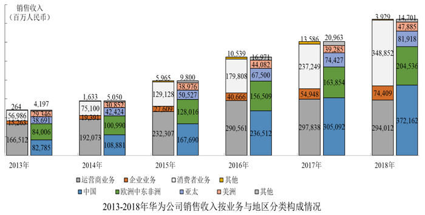

### 第 6 题　qid 2443050 · 综合

“十二五”期间华为销售收入总计达到        百万元。

- **A**. 1,344,565
- **B**. 1,346,358　✅
- **C**. 1,348,467
- **D**. 1,350,118

**答案**：B

**官方解析**

定位统计图1，“十二五时期”即2011-2015年华为公司销售收入分别为203929百万元、220198百万元、239025百万元、288197百万元、395009百万元。可计算出“十二五”期间华为销售收入总计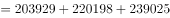百万元。

故正确答案为B。

---

### 第 7 题　qid 2443061 · 增长

下面折线图能反映2015-2018年华为在美洲地区销售收入同比增长率趋势的是：

- **A**. A　✅
- **B**. B
- **C**. C
- **D**. D

**答案**：A

**官方解析**

由题干“···2015-2018年···同比增长率”，可判定本题为一般增长率计算问题。定位统计图2，2014年-2018年华为在美洲地区销售收入分别为30852百万、38976百万、44082百万、39285百万、47885百万。根据公式，可计算出：

2015年增长率；

2016年增长率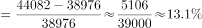；

2017年增长率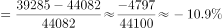；

2018年增长率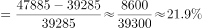。

最大是2015年，第二是2018年，排除B、C、D三项。

故正确答案为A。

---

### 第 8 题　qid 2443067 · 增长

2010年-2018年华为公司销售收入同比增长低于的年份有<u>        </u>个。

- **A**. 2　✅
- **B**. 3
- **C**. 4
- **D**. 5

**答案**：A

**官方解析**

定位统计图1可知，2010-2018年华为公司销售收入同比增长率。其中2012年（）、2013年（）低于，所以满足题意的年份有2个。

故正确答案为A。

---

### 第 9 题　qid 2443073 · 增长

2013年-2018年华为公司各类业务销售收入同比增长率最高的是：

- **A**. 2018年的运营商业务
- **B**. 2017年的其他业务
- **C**. 2016年的企业业务
- **D**. 2015年的消费者业务　✅

**答案**：D

**官方解析**

由题干“2013-2018年···同比增长率最高”，可判定本题为一般增长率比较问题。定位统计图2，2017年、2018年的运营商业务分别为297838百万元、294012百万元；2016年、2017年的其他业务分别为10539百万元、13586百万元；2015年、2016年的企业业务分别为27609百万元、40666百万元；2014年、2015年的消费者业务分别为75100百万元、129128百万元。根据公式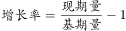，比较增长率可直接用；

A项：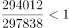；

B项：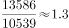；

C项：；

D项：。

比较上述数字，2013年-2018年华为公司各类业务销售收入同比增长率最高的是2015年的消费者业务。

故正确答案为D。

---

### 第 10 题　qid 2443079 · 综合

根据上述信息，欧洲中东非洲地区的销售收入占公司总销售收入的说法不正确的是：

- **A**. 欧洲中东非洲地区的销售收入占比一直高于亚太与美洲地区之和的占比
- **B**. 2016年欧洲中东非洲地区的销售收入占比比2015年的下降了约3个百分点
- **C**. 2013年欧洲中东非洲地区的销售收入占比为最高
- **D**. 2017年欧洲中东非洲地区的销售收入占比排第四位　✅

**答案**：D

**官方解析**

A项，总体量相同，比较它们之间的占比，只需比较部分量大小即可。定位统计图2，

2013年欧洲中东非洲地区的销售收入为百万元；

2014年欧洲中东非洲地区的销售收入为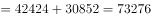百万元；

2015年欧洲中东非洲地区的销售收入为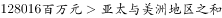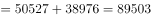百万元；

2016年欧洲中东非洲地区的销售收入为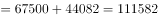百万元；

2017年欧洲中东非洲地区的销售收入为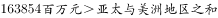百万元；

2018年欧洲中东非洲地区的销售收入为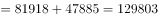百万元；

从上述数据可知，欧洲中东非洲地区的销售收入占比一直高于亚太与美洲地区之和的占比。正确；

B项，定位统计图2，2015年、2016年欧洲中东非洲地区的销售收入分别为128016百万元、156509百万元；定位统计图1，2015年、2016年公司总销售收入分别为395009百万元、521574百万元。根据公式，可计算出2016年欧洲中东非洲地区的销售收入占比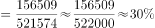，2015年占比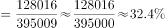。可知，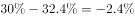，下降约3个百分点。正确；

C项，定位统计图2，2013年中国、欧洲中东非洲、亚太、美洲、其他地区的销售收入分别为82785百万元、84006百万元、38691百万元、29346百万元、4197百万元。根据公式，总体量相同，只比较部分量即可，从上述数字看出，2013年欧洲中东非洲地区的销售收入占比为最高，正确；

D项，定位统计图2，2017年中国、欧洲中东非洲、亚太、美洲、其他地区的销售收入分别为305092百万元、163854百万元、74427百万元、39285百万元、20963百万元。根据公式，总体量相同，只比较部分量即可，从上述数字看出，2017年欧洲中东非洲地区的销售收入占比排第二位，而非第四位，错误。

本题为选非题，故正确答案为D。

备注：CD项，表述有歧义，也可以按照时间比较，即比较2013年-2018年，欧洲中东非洲的销售收入占比，答案一致。粉笔更倾向于按地区比较。

---

## 材料 3

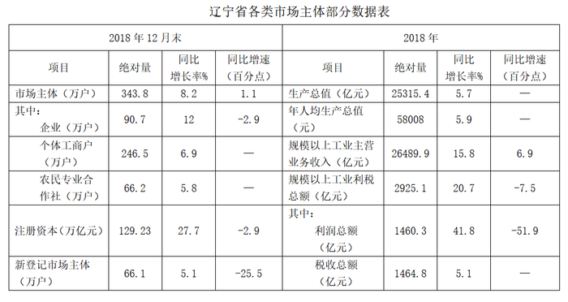

### 第 11 题　qid 2443012 · 增长

2018年比2016年新登记注册市场主体约增加        万户。

- **A**. 16
- **B**. 18　✅
- **C**. 20
- **D**. 22

**答案**：B

**官方解析**

由题目问“2018年比2016年···增加多少万户”，可判定本题为间隔增长量问题。根据表中数据，可得2018年末，新登记市场主体户数约为66.1万户，同比增长，增速比上年少25.5个百分点，则2017年同比增速为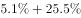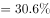。则与2016年相比，2018年新登记注册市场主体户数的增长率为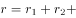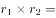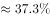，题目所求为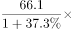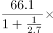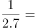万户，与B项最接近。

故正确答案为B。

---

### 第 12 题　qid 2443017 · 比重

2016年各类市场主体中企业占比约为：

- **A**. 

　✅
- **B**. 

- **C**. 

- **D**. 

**答案**：A

**官方解析**

由题目问“2016年各类市场主体中企业占比”，判定本题为基期比重问题。根据表中数据，可得2018年，市场主体有343.8万户，同比增长，增速比上年多1.1个百分点，则2017年市场主体户数同比增长，则2016年市场主体户数为；同理可得2018年，企业有90.7万户，同比增长，增速比上年少2.9个百分点，则2017年企业户数同比增长，则2016年企业户数为；题目所求比重为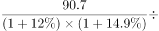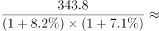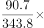，与A项最接近。

故正确答案为A。

---

### 第 13 题　qid 2443023 · 增长

2018年规模以上工业主营业务利润总额比2016年增长了约        亿元。

- **A**. 471
- **B**. 535
- **C**. 703
- **D**. 928　✅

**答案**：D

**官方解析**

由题目问“2018年···利润总额比2016年···增长多少亿元”，可判定本题为间隔增长量问题。根据表中数据，可得2018年规模以上工业主营业务利润总额1460.3亿元，同比增长，增速比上年少51.9个百分点，则2017年同比增速为。则与2016年相比，2018年规模以上工业主营业务利润总额的增长率为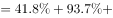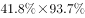，题目所求为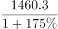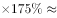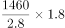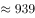亿元，与D项最接近。

故正确答案为D。

---

### 第 14 题　qid 2443030 · 综合

2017年规模以上工业主营业务利润率约为：

- **A**. 

- **B**. 

　✅
- **C**. 

- **D**. 

**答案**：B

**官方解析**

由题目问“2017年···利润率约为多少”，，判定本题为基期比重问题。根据表中数据，可得2018年规模以上工业主营业务利润总额1460.3亿元，同比增长；主营业务收入26489.9亿元，同比增长；题目所求为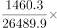。

故正确答案为B。

---

### 第 15 题　qid 2443033 · 综合

能够从上述资料中推出的是：

- **A**. 2018年平均每个新登记市场主体贡献地区生产总值增加额约为360亿元
- **B**. 2016年农民专业合作社在全部市场主体中的占比高于2018年
- **C**. 2017年平均约13.8人拥有一户市场主体　✅
- **D**. 规模以上工业主营业务纳税总额增速低于利润总额增速是因为实行了减税政策

**答案**：C

**官方解析**

A项：地区生产总值的增加额并不一定都是由新登记市场主体所贡献的，根据表格信息，无法计算新登记市场主体贡献了多少地区生产总值，因此无法得出平均每个新登记市场主体贡献地区生产总值增加额，错误；

B项：根据表格，无法得出2017年农民专业合作社数量同比增长率，即无法得出2016年农民专业合作社数量，因此无法得出2016年农民专业合作社在全部市场主体中的占比，错误；

C项：根据表格，2018年生产总值25315.4亿元，同比增长，年人均生产总值为58008元，同比增长，则2017年人口数为：亿人。2018年市场主体有343.8万户，同比增长，则2017年有市场主体万户，则题目所求为人/户，即平均约13.8人拥有一户市场主体，正确；

D项：根据表格信息，规模以上工业主营业务纳税总额增速低于利润总额增速的原因是无法得知的，错误。

故正确答案为C。

---

## 材料 4

        2019年1-8月，辽宁省社会消费品零售总额9846.6亿元，比上年同期增长，增速回落1.6个百分点。限额以上单位消费品零售额实现2254.6亿元，同比下降，增速回落6.5个百分点。

        又知2019年1-7月全省限额以上批发业，零售业，住宿业和餐饮业实现零售额同比分别增长、、和。

### 第 16 题　qid 2443041 · 综合

2017年8月，辽宁省社会消费品零售总额约为：

- **A**. 1121亿元
- **B**. 1184亿元　✅
- **C**. 4750亿元
- **D**. 8633亿元

**答案**：B

**官方解析**

根据题干“2017年8月······”，结合材料时间为2019年，可判定本题为间隔基期计算问题。定位折线图可知2018年8月辽宁省社会消费品零售总额同比增速为，2019年8月为，根据间隔增长率公式。定位表格材料可知2019年8月，辽宁省社会消费品零售总额为1280.7亿元，根据基期计算公式可计算得2017年8月辽宁省社会消费品零售总额亿元，与B项接近。

故正确答案为B。

---

### 第 17 题　qid 2443046 · 平均数

2019年1-7月，限额以上批发业平均每月实现销售额是住宿业的约        倍

- **A**. 7.12
- **B**. 7.69
- **C**. 8.28　✅
- **D**. 9.01

**答案**：C

**官方解析**

根据题干“2019年1-7月，······是······倍”，可判定本题为现期倍数问题。定位表格数据可知批发业零售额2019年1-8月为170.4亿元，8月为4.9亿元，住宿业零售额2019年1-8月为23.9亿元，8月为3.9亿元。计算可得：2019年1-7月批发业零售额亿元，2019年1-7月住宿业零售额亿元，故题干所求倍数倍。

故正确答案为C。

---

### 第 18 题　qid 2443048 · 增长

2019年8月全省限额以上住宿业实现销售额同比约增长：

- **A**. 

- **B**. 

　✅
- **C**. 

- **D**. 

**答案**：B

**官方解析**

根据题干“2019年8月全省限额以上住宿业实现销售额同比约增长”，结合选项都为百分数，且材料给出2019年1-7月和1-8月全省限额以上住宿业实现销售额同比增长率，可判定本题为混合增长率问题。定位表格数据可知“2019年1-8月全省限额以上住宿业实现零售额为23.9亿元，同比增长，8月零售额为3.9亿元”，定位最后一段文字数据可知“2019年1-7月全省限额以上住宿业实现零售额同比分别增长”，设2019年8月增长率为r。

方法一：根据混合增长率的口诀“混合增长率居中不正中，偏向基期量较大的一方”，1-7月大于8月份数据，因此混合后的增长率更靠近。根据线段法可得：，解得：。排除A和C选项。代入D选项：，和差距太大，排除D选项。

方法二：根据线段法，距离与量成反比，1-7月：8月，则，则。

备注：虽然精确计算没有接近的答案，但按照命题思路来看应该是选择B选项。

故正确答案为B。

---

### 第 19 题　qid 2443051 · 综合

2018年8月通讯器材类实现消费品零售额比日用品类约多        亿元。

- **A**. 2.6
- **B**. 2.4
- **C**. 2.2　✅
- **D**. 2.0

**答案**：C

**官方解析**

根据题干“2018年8月······比······亿元”，结合材料时间为2019年，可判定本题为基期和差问题。定位表格材料可知：“2019年8月，通讯器材类实现消费品零售额9.6亿元，同比增长，日用品7.1亿元，同比增长”，根据公式：基期量，2018年8月通讯器材类实现消费品零售额比日用品类多。

故正确答案为C。

---

### 第 20 题　qid 2443054 · 综合

根据上述材料，下列说法正确的是：

- **A**. 2017年8月社会消费品零售总额约为1208亿元
- **B**. 2019年1-7月烟酒类实现消费品零售总额少于2018年同期　✅
- **C**. 2019年1-8月，1月的社会消费品零售总额同比增速高于4月同比增速
- **D**. 2019年1-8月汽车类零售总额同比减少，而石油及其制品类零售总额同比增加是因为石油及其制品涨价

**答案**：B

**官方解析**

A项：根据116题计算得2017年8月辽宁省社会消费品零售总额，错误；

B项：定位表格数据可知“2019年8月全省限额以上烟酒类实现零售额为3.5亿元，同比增长，1-8月零售额为29.8亿元，同比增长”，设1-7月增长率为r。根据混合增长率的口诀“混合增长率居中”，8月增长率1-8月增长率1-7月增长率r，解得：，即2019年1-7月少于2018年同期，正确；

C项：定位折线图数据可知2019年1-2月增速为，4月增速为，但无法求出1月份增速，无法判断1月和4月增速大小关系，错误；

D项：定位表格数据可知“2019年1-8月全省限额以上汽车类同比增长，石油及其制品类同比增长”，但无法判断石油及其制品类零售总额同比增加的原因，错误。

故正确答案为B。

---
