# 2019年重庆市法检系统招录考试《行测》题（网友回忆版）

> 资料分析 · 20 题 · 重庆 2019

## 材料 1

        2018年全国网络零售额90100亿元，同比增长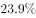。其中，实物商品网上零售额为70200亿元，同比增长；非实物商品网上零售额19900亿元，同比增长。

        2018年全国农村网络零售额为13700亿元。其中，农村实物商品网络零售额为10900亿元，同比增长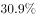；农村非实物商品网络零售额2800亿元，同比增长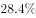。分品类看，农村实物商品零售额前三位的品类分别为服装鞋帽针织品、日用品、粮油食品及饮料烟酒，分别占农村实物商品零售额的、和，同比增速分别为、和。

        2018年全国农产品网络零售额达2305亿元，比全国网络零售额同比增速高9.9个百分点。其中，休闲食品、茶叶、滋补食品零售额排名前三，占比分别为、和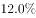，同比增速分别为、和。

### 第 1 题　qid 2423305 · 比重

2018年全国网络零售额中，实物商品网上零售额的比重约为：

- **A**. 

- **B**. 

- **C**. 
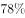
　✅
- **D**. 

**答案**：C

**官方解析**

根据问题“2018年······比重约为”，结合材料时间为2018年，判定本题为现期比重问题。定位材料第一段“2018年全国网络零售额90100亿元，······，其中，实物商品网上零售额为70200亿元”。故所求占比，对应C选项。

故正确答案为C。

---

### 第 2 题　qid 2423336 · 增长

2018年全国农村网络零售额同比增速在以下哪个范围之内？

- **A**. 
低于

- **B**. 
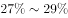

- **C**. 
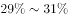
　✅
- **D**. 
超过

**答案**：C

**官方解析**

根据问题“2018年全国农村网络零售额同比增速······”，定位第二段“2018年······农村实物商品网络零售额为10900亿元，同比增长；农村非实物商品网络零售额2800亿元，同比增长”，判定本题为混合增长率问题。根据混合口诀：混合居中不正中，偏向量大的。因此2018年全国农村网络零售额增长率在两个部分增长率之间，即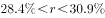，观察选项，排除A、D项。且正中间的增长率为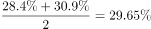，偏向量大的对应的增长率，因此总体增长率偏向10900亿元对应的，则在之间，对应C选项。

故正确答案为C。

---

### 第 3 题　qid 2423341 · 综合

2018年全国农村实物商品零售额前三位品类的总零售额约为多少亿元？

- **A**. 1960
- **B**. 7400
- **C**. 7600　✅
- **D**. 9600

**答案**：C

**官方解析**

由题干“2018年全国农村······总零售额为多少亿元”，结合材料已知2018年农村实物商品网络零售额及零售额前三位品类所占的比重，判定本题为现期比重问题。定位文字材料第二段可得“农村实物商品网络零售额为10900亿元”，“农村实物商品零售额前三位······分别占农村实物商品零售额的、和”，根据公式：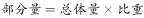，可得全国农村实物商品零售额前三位品类的总零售额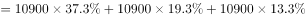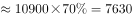亿元，与C项最为接近。

故正确答案为C。

---

### 第 4 题　qid 2423343 · 综合

2017年全国农产品网络零售品类中，休闲食品零售额约是滋补食品的：

- **A**. 1.7倍
- **B**. 2倍　✅
- **C**. 2.3倍
- **D**. 2.6倍

**答案**：B

**官方解析**

由题干“2017年······是······”，选项为倍数，结合材料时间为2018年，判定本题为基期倍数问题。定位文字材料第三段可得“2018年全国农产品网络零售额达2305亿元”。休闲食品占比为，同比增速为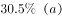；滋补食品占比为，同比增速为。根据公式：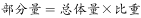，可得2018年休闲食品零售额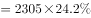；滋补食品零售额。根据基期公式：，可得所求倍数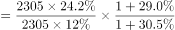倍。

故正确答案为B。

---

### 第 5 题　qid 2423345 · 综合

根据给定资料，无法推出的是：

- **A**. 2017年全国网络零售额不到75000亿元
- **B**. 2017年全国农产品网络零售额超过1800亿元　✅
- **C**. 2018年全国农村网络零售额前三位品类中，增速最慢的是日用品
- **D**. 2018年全国网络零售额中，实物商品占比约是非实物商品的3倍多

**答案**：B

**官方解析**

A项：定位材料第一段可得“2018年全国网络零售额90100亿元，同比增长”，根据公式：，可得2017年全国网络零售额，正确；

B项：定位材料第三段可得“2018年全国农产品网络零售额达2305亿元，比全国网络零售额同比增速高9.9个百分点。”定位材料第一段“2018年全国网络零售额······同比增长”，可得2018年全国农产品网络零售额增长率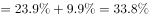。根据公式：，可得2017年全国农产品网络零售额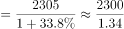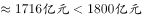，错误；

C项：定位材料第二段可得农村实物商品网络零售额前三位增速，而非实物商品网络零售额各品类增速未知，故无法推出全国农村网络零售额前三位品类，无法判断；

D项：定位材料第一段，可得2018年全国网络零售额90100亿元，实物商品网上零售额为70200亿元，非实物商品网上零售额19900亿元。根据公式：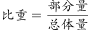，可得实物商品占比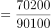，非实物商品占比，故所求倍数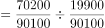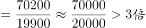，正确。

本题为选非题，故正确答案为B。

注：本题C项存在争议，材料中农村非实物商品网络零售额并没有给出具体品类的数据，无法判断全国农村网络零售额前三位的品类，故粉笔认为本题C项也无法推出，但B项可直接得出计算错误，因此粉笔推荐本题优先选择B项。

---

## 材料 2

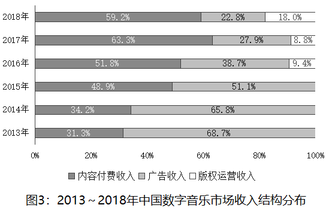

### 第 6 题　qid 2423335 · 增长

2014～2018年，中国数字音乐用户规模同比增速呈什么趋势？

- **A**. 先下降后上升
- **B**. 先上升后下降
- **C**. 先下降再上升后下降　✅
- **D**. 先上升再下降后上升

**答案**：C

**官方解析**

根据题干“2014～2018年······同比增速”判定本题为一般增长率问题。定位图1可得，2013～2018年，中国数字音乐用户规模为6.1亿人、6.3亿人、6.5亿人、6.8亿人、7.1亿人、7.4亿人。根据公式：增长率可得，2014～2018年，中国数字音乐用户规模同比增速分别为、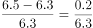、、、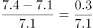，根据分数比较规则可得，2014年增速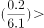2015年增速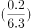、2015年增速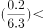2016年增速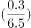、2016年增速2017年增速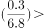2018年增速，则2014～2018年，中国数字音乐用户规模同比增速趋势为先下降再上升后下降。

故正确答案为C。

---

### 第 7 题　qid 2423338 · 综合

付费用户规模除以总用户规模可得到付费渗透率。据此，2013～2018年中国数字音乐付费渗透率超过的年份有几个？

- **A**. 1
- **B**. 2　✅
- **C**. 3
- **D**. 4

**答案**：B

**官方解析**

根据题干“2013～2018年中国数字音乐付费渗透率超过的年份有几个”判定本题为现期比重问题。定位图1可得，2013～2018年，中国数字音乐用户规模为6.1亿人、6.3亿人、6.5亿人、6.8亿人、7.1亿人、7.4亿人；付费用户规模为242万人、494万人、1138万人、2017万人、2747万人、3877万人。根据公式：付费渗透率可得，2013～2018年，中国数字音乐付费渗透率分别为、、、、、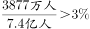，则2017年、2018年，中国数字音乐付费渗透率超过，共2个年份。

故正确答案为B。

---

### 第 8 题　qid 2423342 · 综合

2018年，中国数字音乐市场收入规模约为多少亿元？

- **A**. 68
- **B**. 72
- **C**. 76　✅
- **D**. 80

**答案**：C

**官方解析**

由题干“2018年······约为多少亿元”，结合材料给出2017年收入规模及2018年增速，可判定本题为现期计算问题。定位图2可得，2017年中国数字音乐市场收入规模为47.7亿元，2018年增速为。代入公式：可得，2018年，中国数字音乐市场收入规模约为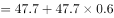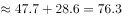亿元，与C项最接近。

故正确答案为C。

---

### 第 9 题　qid 2423344 · 综合

2015-2017年三年中国数字音乐市场的广告收入由高到低排序正确的是：

- **A**. 
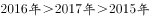
　✅
- **B**. 

- **C**. 
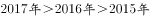

- **D**. 
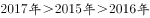

**答案**：A

**官方解析**

定位图2可得，2015-2017年中国数字音乐市场收入分别为18.8、36.4、47.7亿元，定位图3可得，其中广告收入占比分别为、、。则2015年中国数字音乐市场的广告收入为亿元，2016年为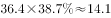亿元，2017年为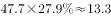亿元，由高到低排序为。

故正确答案为A。

---

### 第 10 题　qid 2423346 · 综合

关于中国数字音乐市场，由上述资料能够推出的是：

- **A**. 2017年版权运营收入超过4亿元　✅
- **B**. 2015～2018年中国数字音乐市场收入规模增速持续下降
- **C**. 2018年付费用户规模同比增长约30%
- **D**. 内容付费收入2017年是2015年的4倍多

**答案**：A

**官方解析**

A项：定位图2可得，2017年中国数字音乐市场收入规模为47.7亿元，定位图3可得，2017年版权运营收入占比为。则2017年版权运营收入为亿元，超过4亿元，正确；

B项：定位图2可得，2015～2018年中国数字音乐市场收入规模增速分别为、、、，增速先下降后上升，并非持续下降，错误；

C项：定位图1可得，2018年付费用户规模为3877万人，2017年为2747万人，则2018年付费用户规模同比增长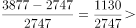,并非约，错误；

D项：定位图2可得，2017年中国数字音乐市场收入规模为47.7亿元，2015年为18.8亿元；定位图3可得，2017年内容付费收入占比为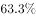，2015年为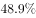。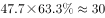亿元，亿元，， 2017年内容付费收入不到2015年的4倍，错误。

故正确答案为A。

---

## 材料 3

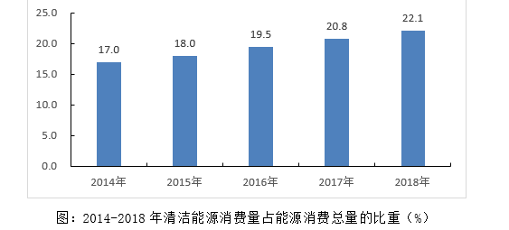

        2018年全年能源消费总量46.4亿吨标准煤，比上年增长。其中，煤炭消费量增长，原油消费量增长，天然气消费量增长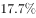，电力消费量增长。煤炭消费量占能源消费总量的，比上年下降1.4个百分点；天然气、水电、核电、风电等清洁能源消费量占能源消费总量的，上升1.3个百分点。

### 第 11 题　qid 2423363 · 增长

2018年，全国能源消费总量同比增长约多少亿吨标准煤？

- **A**. 0.9
- **B**. 1.5　✅
- **C**. 2.1
- **D**. 2.5

**答案**：B

**官方解析**

由题干“2018年···同比增长约多少亿吨标准煤”，可判定本题为增长量计算问题。定位文字材料可得，2018年全年能源消费总量46.4亿吨标准煤，比上年增长。则2018年，全国能源消费总量同比增长量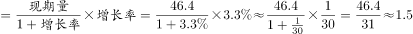亿吨标准煤。

故正确答案为B。

---

### 第 12 题　qid 2423364 · 综合

2017年，全国清洁能源消费总量约为多少亿吨标准煤？

- **A**. 8.7
- **B**. 9.3　✅
- **C**. 10.8
- **D**. 12.3

**答案**：B

**官方解析**

由题干“2017年，全国清洁能源消费总量约为多少亿吨标准煤”，结合文字材料给出2018年全年能源消费总量及增长率，图表材料给出2017年清洁能源消费量占比，可判定本题为基期比重计算问题。定位文字材料可得，2018年全年能源消费总量46.4亿吨标准煤，比上年增长；定位图表可得，2017年清洁能源消费量占比为。则2017年全年能源消费总量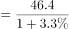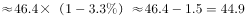亿吨标准煤，2017年全国清洁能源消费总量约为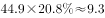亿吨标准煤。

故正确答案为B。

注：也可根据111题计算结果，计算出2017年全年能源消费总量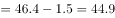亿吨标准煤。

---

### 第 13 题　qid 2423365 · 增长

2018年全年消费量同比增速最低的是：

- **A**. 煤炭　✅
- **B**. 原油
- **C**. 天然气
- **D**. 电力

**答案**：A

**官方解析**

定位文字材料可得，2018年煤炭消费量增长，原油消费量增长，天然气消费量增长，电力消费量增长，同比增速最低的是煤炭消费量。

故正确答案为A。

---

### 第 14 题　qid 2423366 · 增长

按照2014-2018年清洁能源消费量占能源消费总量的平均增长率，2019年清洁能源消费量占比约为：

- **A**. 

- **B**. 

　✅
- **C**. 

- **D**. 

**答案**：B

**官方解析**

由题干“按照······的平均增长率，2019年清洁能源消费量占比约为”，可判定本题为年均增长率问题。定位图表可得，2014年清洁能源消费量占能源消费总量的，2018年为。代入年均增长率公式可得，，，则2019年清洁能源消费量占比约为，与B项最接近。

故正确答案为B。

注：，此公式往往是在，并且较小时使用。

---

### 第 15 题　qid 2423367 · 综合

根据给定资料，可以推出的是：

- **A**. 
2018年，全国煤炭的消费量比上年有所上升
　✅
- **B**. 
2014-2018年，全国清洁能源消费量逐年上升

- **C**. 
2017年，煤炭消费量约占能源消费总量的

- **D**. 
2018年，除煤炭、清洁能源外，其他能源消费量超过9亿吨标准煤

**答案**：A

**官方解析**

A项：定位文字材料可得，2018年全年煤炭消费量增长，可知2018年煤炭的消费量比上年有所上升，正确；

B项：定位材料可知，只给出2014-2018年清洁能源消费量占能源消费总量的比重，但并未给出2014-2018年每一年的能源消费总量，无法判断清洁能源消费量是否逐年上升，错误；

C项：定位文字材料可得，2018年煤炭消费量占能源消费总量的，比上年下降1.4个百分点。则2017年，煤炭消费量约占能源消费总量的，错误；

D项：定位文字材料可得，2018年全年能源消费总量46.4亿吨标准煤，煤炭消费量占能源消费总量的，清洁能源消费量占能源消费总量的。则其他能源消费量为亿吨标准煤，并未超过9亿吨标准煤，错误。

故正确答案为A。

---

## 材料 4

        2018年第一季度我国水产品进出口192.67万吨，同比减少，增速较上年同期减少21.97个百分点；进出口总额77.15亿美元，同比增加。贸易顺差19.66亿美元，同比减少2.15亿美元。

        出口方面，2018年第一季度我国水产品出口量98.04万吨，同比减少，出口额48.41亿美元，增加。一般贸易出口量71.18万吨，同比减少；出口额36.71亿美元，同比增加。

### 第 16 题　qid 2423368 · 增长

2018年第一季度我国水产品进口额同比增量约为多少亿美元？

- **A**. 5　✅
- **B**. 7
- **C**. 9
- **D**. 11

**答案**：A

**官方解析**

根据题干“······同比增量······”判定本题为增长量计算问题。定位材料第二段：“出口方面，2018年第一季度······出口额48.41亿美元，增加”，可知出口额的增量亿美元。定位材料第一段：“贸易顺差19.66亿美元，同比减少2.15亿美元”，可知顺差的增量亿美元，顺差，因此，进口额，则进口额的增量亿美元，与A选项最接近。

故正确答案为A。

---

### 第 17 题　qid 2423369 · 综合

2016年第一季度我国水产品进出口总量最接近以下哪个数字？

- **A**. 140万吨
- **B**. 160万吨
- **C**. 180万吨　✅
- **D**. 200万吨

**答案**：C

**官方解析**

根据题干“2016年第一季度······”，结合材料时间为2018年第一季度，可判定本题为间隔基期问题。定位材料第一段：“2018年第一季度我国水产品进出口192.67万吨，同比减少，增速较上年同期减少21.97个百分点”，则2018年我国水产品进出口同比增速，2017年同比增速，根据间隔增长率公式，可得2018年相比2016年增长率。根据，可得2016年第一季度我国水产品进出口总量万吨，C选项最接近。

故正确答案为C。

---

### 第 18 题　qid 2423370 · 比重

2018年第一季度，我国水产品一般贸易主要出口品种中，出口额占我国水产品一般贸易出口额的比重，超过的有几个？

- **A**. 5
- **B**. 6　✅
- **C**. 7
- **D**. 8

**答案**：B

**官方解析**

根据题干“2018年第一季度······出口额占我国水产品一般贸易出口额的比重”，结合材料时间为2018年第一季度，可判定本题为现期比重问题。定位材料第二段：“出口方面，2018年第一季度······一般贸易······出口额36.71亿美元”，则一般贸易出口额的亿美元。定位表格材料第三列“出口额”数据，超过1.8355亿美元的有：头足类、对虾、贝类、罗非鱼、鳗鱼、蟹类，共6个。

故正确答案为B。

---

### 第 19 题　qid 2423371 · 增长

2018年第一季度，下列产品平均单价同比下降最多的是：

- **A**. 鲭鱼
- **B**. 罗非鱼
- **C**. 大黄鱼　✅
- **D**. 淡水小龙虾

**答案**：C

**官方解析**

根据题干“······平均单价同比下降最多”判定本题为平均数的增长量问题。，平均数的增长量，A是出口金额，B是数量。定位表格材料可得，鲭鱼平均单价的增长量，罗非鱼平均单价的增长量，大黄鱼平均单价的增长量，淡水小龙虾平均单价的增长量。因此，平均单价下降最多的是大黄鱼。

故正确答案为C。

---

### 第 20 题　qid 2423372 · 综合

根据给定资料，无法推出的是：

- **A**. 
2017年第一季度，我国水产品进出口总额超过65亿美元

- **B**. 
2018年第一季度，我国水产品一般贸易主要出口品种中平均单价最高的是蟹类
　✅
- **C**. 
2018年第一季度，我国水产品一般贸易出口量和出口额在水产品中的占比均超过

- **D**. 
2018年第一季度，我国水产品一般贸易主要出口品种中数量增速最快的种类，出口额增速也最快

**答案**：B

**官方解析**

A项：定位材料第一段：“2018年第一季度我国水产品······进出口总额77.15亿美元，同比增加”，根据，可得2017年第一季度我国水产品进出口总额亿美元，正确；

B项：定位表格材料可知，，因此，蟹类出口平均单价不是最高的，错误；

C项：定位材料第二段：“出口方面，2018年第一季度我国水产品出口量98.04万吨，同比减少，出口额48.41亿美元，增加。一般贸易出口量71.18万吨，同比减少；出口额36.71亿美元，同比增加”，可知一般贸易出口量在水产品的占比，一般贸易出口额在水产品的占比，正确；

D项：定位表格材料，我国水产品一般贸易主要出口品种中数量增速最快的是大黄鱼（），其出口额的增速（）也是最快的，正确。

本题为选非题，故正确答案为B。

---
