# 2019年重庆市选调优秀大学生到基层工作考试《行测》题

> 资料分析 · 10 题 · 选调 2019

## 材料 1

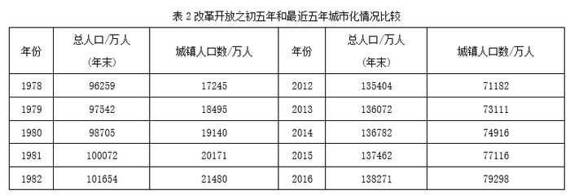

### 第 1 题　qid 2669872 · 增长

2013-2016年，人均GDP增长率最高的一年是：

- **A**. 2013年　✅
- **B**. 2014年
- **C**. 2015年
- **D**. 2016年

**答案**：A

**官方解析**

根据题干“·····人均GDP增长率最高的一年是”，可判定本题为一般增长率比较问题。定位表1可得2012~2016年的人均GDP，代入公式“增长率”，则2013年：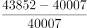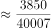；2014年：；2015年：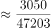；2016年：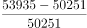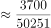。根据分数比较技巧：分子大、分母小的分数大，2013年人均GDP增长率的分子最大，分母最小，因此2013年人均GDP增长率最高。

故正确答案为A。

---

### 第 2 题　qid 2669878 · 平均数

最近五年人均GDP的平均值，较之改革开放之初五年人均GDP的平均值，增长了约多少倍？

- **A**. 100
- **B**. 101　✅
- **C**. 102
- **D**. 103

**答案**：B

**官方解析**

根据题干“最近五年······，较之改革开放之初五年······，增长了约多少倍”，可判定本题为现期倍数问题。定位表1可知，改革开放之初五年和最近五年的人均GDP，则最近五年人均GDP的平均值为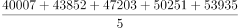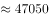，改革开放之初五年的平均值为，则增长了约倍。

故正确答案为B。

---

### 第 3 题　qid 2669886 · 综合

2016年GDP约是1978年GDP的多少倍？

- **A**. 140
- **B**. 186
- **C**. 200
- **D**. 201　✅

**答案**：D

**官方解析**

根据题干“2016年GDP约是1978年GDP的多少倍”，可判定本题为现期倍数计算问题。定位表1可知，2016年人均GDP为53935元，1978年为385元；定位表2可知，2016年总人口为138271万人，1978年为96259万人。GDP人均GDP总人口，则所求倍数为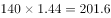倍，与D项最接近。

故正确答案为D。

---

### 第 4 题　qid 2669898 · 增长

1979-1982年，总人口增长率最高不超过：

- **A**. 

- **B**. 

- **C**. 

- **D**. 

　✅

**答案**：D

**官方解析**

根据题干“1979-1982年，总人口增长率最高不超过”，结合选项为百分数，可判定本题为一般增长率比较问题。定位表2可知，1978-1982年，总人口分别为96259、97542、98705、100072、101654万人。根据公式“增长率”，计算各年增速即可。

1979年：；1980年：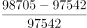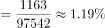；1981年：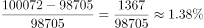；1982年：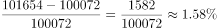。计算可知1979-1982年，总人口增速最高不超过。

故正确答案为D。

---

### 第 5 题　qid 2669903 · 综合

下列说法正确的是：

- **A**. 1979-1982年，GDP增长率逐年提高
- **B**. 1979-1982年，农村人口数逐年下降
- **C**. 2013-2016年，城镇人口数较上年增长最多的一年是2016年
- **D**. 1979-1982年和2013-2016年的城市化率都呈逐年上升趋势　✅

**答案**：D

**官方解析**

A项：定位表1与表2可知，1978-1982年的人均GDP与总人口，GDP人均GDP总人口。根据“增长率”，则1980年GDP增长率为，1981年为，可知GDP增长率并非逐年提高，错误；

B项：定位表2可知，1979年总人口为97542万人，城镇人口为18495万人，则农村人口为万人；1980年总人口为98705万人，城镇人口为19140万人，则农村人口为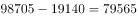万人，可知农村人口数并非逐年下降，错误；

C项：定位表2可知，2012-2016年城镇人口分别为71182、73111、74916、77116、79298万人。则2013-2016年城镇人口数增长量分别为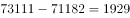万人、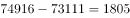万人、万人、万人。增长最多的为2015年，并非2016年，错误；

D项：定位表2可知，1979-1982年及2013-2016年总人口及城镇人口。城市化率（也叫城镇化率），则1979-1982年城市化率分别为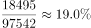、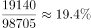、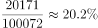、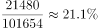；2013-2016年城市化率分别为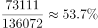、、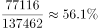、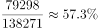。可知1979-可知1979-1982年和2013-2016年的城市化率都呈逐年上升趋势，正确。

故正确答案为D。

---

## 材料 2

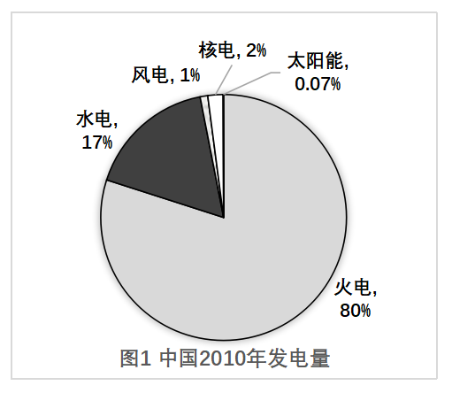

### 第 6 题　qid 2670123 · 增长

与2010年相比，预测中国2020年发电量所占比重增幅最大的是：

- **A**. 太阳能
- **B**. 核电
- **C**. 风电　✅
- **D**. 水电

**答案**：C

**官方解析**

根据题干“与2010年相比······比重增幅最大的是”，由于比重自身是百分率，一般不考查比重的变化率，因此对比重的增长问题优先进行作差计算。定位图1与图2可知，2010年与2020年各类型发电量占比数据。

太阳能的比重增幅为：；

核电的比重增幅为：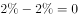；

风电的比重增幅为：；

水电的比重增幅为：。

可看出风电所占比重的增幅最大。

故正确答案为C。

---

### 第 7 题　qid 2670127 · 综合

已知中国2010年水电发电量为6867亿兆瓦时，那同年核电发电量约为（    ）亿兆瓦时。

- **A**. 583
- **B**. 763
- **C**. 808　✅
- **D**. 926

**答案**：C

**官方解析**

根据题干“······水电发电量为6867亿兆瓦时，那同年核电发电量约为······”，结合材料给出2010年各类型发电量所占比重，可判定本题为现期比重计算问题。定位图1可知，2010年水电发电量占比为，核电占比为。则核电发电量为亿兆瓦时，与C项最接近。

故正确答案为C。

---

### 第 8 题　qid 2670133 · 增长

假设中国2020年发电量相较于2010年发电量总量增长率为，则2020年风电发电量约为（    ）亿兆瓦时。

- **A**. 2828
- **B**. 4096
- **C**. 4779　✅
- **D**. 4817

**答案**：C

**官方解析**

根据题干“······2020年风电发电量约为······”，结合材料给出2020年各类型发电量所占比重，可判定本题为现期比重计算问题。由88题可知，2010年水电发电量为6867亿兆瓦时；定位图1与图2可知，2010年水电发电量占比为，2020年风电发电量占比为。则2020年风电发电量为亿兆瓦时。

故正确答案为C。

---

### 第 9 题　qid 2670137 · 比重

假设中国2030年发电量总量将比2020年提高，水电发电量占比不变，则2030年水电发电量将约为2020年的（    ）倍。

- **A**. 1.1
- **B**. 1.3　✅
- **C**. 2.1
- **D**. 2.3

**答案**：B

**官方解析**

根据题干“······2030年水电发电量将约为2020年的多少倍”，可判定本题为现期倍数计算问题。由题干可知，与2020年相比，2030年发电总量提高；水电发电量占比不变，定位图2可知占比为。则所求倍数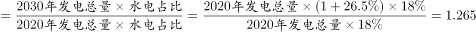倍，与B项最接近。

故正确答案为B。

---

### 第 10 题　qid 2670139 · 综合

下列说法正确的是：

- **A**. 预测中国2020年风电发电量约为2010年的7倍
- **B**. 预测中国2020年各种发电方式的发电量占比将均有所提高
- **C**. 预测中国2020年火电发电量将依然占很大比重　✅
- **D**. 预测中国2020年火电发电量将会减少

**答案**：C

**官方解析**

A项：定位统计图可知，只给出2020年与2010年各类型发电量占比，并未给出具体发电量，无法计算出2020年发电量与2010年的倍数关系，错误；

B项：定位图1与图2可知，2020年火电发电量占比由2010年的降为，并非各种方式的发电量占比均有所提高，错误；

C项：定位图2可知，2020年火电发电量占比为，超过了一半，占很大比重，正确；

D项：定位统计图可知，只给出2020年与2010年各类型发电量占比，并未给出具体发电量，无法计算出火电发电量是否减少，错误。

故正确答案为C。

---
