# 2019年青海省公务员录用考试《行测》题省市州级（A类）（网友回忆版）

> 资料分析 · 15 题 · 青海 2019

## 材料 1

        2018年我国国内生产总值900309亿元，比上年增长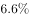，全国居民人均可支配收入28228元，比上年增长，全国居民恩格尔系数为。2018年我国总人口139538万人，比上年增加530万人，其中城镇常住人口83137万人，全年出生人口1523万人，死亡人口993万人。

        2018年我国货物进出口总额305050亿元，比上年增长。其中，出口164177亿元，增长；进口140873亿元，增长。货物进出口顺差23304亿元，比上年减少5217亿元。对“一带一路”沿线国家进出口总额83657亿元，比上年增长。其中，出口46478亿元，增长；进口37179亿元，增长。

        2018年社会消费品零售总额380987亿元，比上年增长。全年实物商品网上零售额70198亿元，比上年增长。按经营地统计，城镇消费品零售额325637亿元，增长；乡村消费品零售额55350亿元，增长。按消费类型统计，商品零售额338271亿元，增长；餐饮收入额42716亿元，增长。

注释：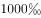

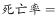

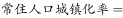

### 第 1 题　qid 2393997 · 平均数

2017年我国人均国内生产总值约为（    ）。

- **A**. 6万元　✅
- **B**. 6.5万元
- **C**. 7万元
- **D**. 7.5万元

**答案**：A

**官方解析**

根据题干“2017年我国人均···约为”，结合材料时间为2018年，可判定本题为基期平均数计算问题。定位文字材料第一段，2018年我国国内生产总值900309亿元，比上年增长；2018年我国总人口139538万人，比上年增加530万人。可得，2017年我国总人口为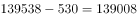。则2017年我国人均国内生产总值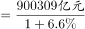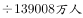。

故正确答案为A。

---

### 第 2 题　qid 2393999 · 综合

2018年我国常住人口城镇化率约为当年人口出生率的（    ）。

- **A**. 5.5倍
- **B**. 5.9倍
- **C**. 55倍　✅
- **D**. 59倍

**答案**：C

**官方解析**

根据题干“2018年···为···”，结合选项求倍数，且材料时间为2018年，可判定本题为现期倍数问题。根据注释可知，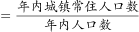，。则因此2018年常住人口城镇化率是当年人口出生率的倍数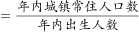。定位文字材料第一段可知，2018年我国城镇常住人口83137万人，全年出生人口1523万人，故所求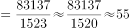。

故正确答案为C。

---

### 第 3 题　qid 2394008 · 综合

2018年我国货物进出口顺差总额和出口总额较上一年分别（    ）。

- **A**. 
减少，增加10684亿元

- **B**. 
减少，增加10884亿元
　✅
- **C**. 
增加，增加10874亿元

- **D**. 
增加，增加10654亿元

**答案**：B

**官方解析**

根据题干“2018年···”结合选项“增加/减少···%”，可判定本题为一般增长率问题，结合选项“增加/减少···亿元”可判定本题为增长量计算问题。定位文字材料第二段，2018年货物进出口顺差23304亿元，比上年减少5217亿元；则根据公式：可得，2018年货物进出口顺差总额增长率，即减少。定位文字材料第二段，2018年我国出口164177亿元，增长；根据公式：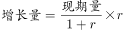可得，2018年出口总额增长量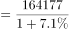亿元（B、C之间差距极小，估算易错，需要精算）。

故正确答案为B。

注：在算出增长率为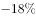，即减少后，可结合选项排除A、C、D，直接选B。

---

### 第 4 题　qid 2394011 · 综合

2018年我国对“一带一路”沿线国家的贸易顺差为（    ）亿元。

- **A**. 11308
- **B**. 10190
- **C**. 46478
- **D**. 9299　✅

**答案**：D

**官方解析**

定位文字材料第二段，2018年我国对“一带一路”沿线国家出口46478亿元，进口37179亿元，因此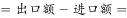亿元，只有D满足。

故正确答案为D。

---

### 第 5 题　qid 2394017 · 比重

下列关于我国经济和社会发展情况描述正确的有（    ）。

①2018年城镇消费品零售额占社会消费品零售总额的比重为

②相比2017年，2018年数据增长最快的是全年实物商品网上零售额

③我国对“一带一路”沿线国家的贸易顺差值，2017年大于2018年

④2017年我国餐饮收入额在40000亿元以上

- **A**. 1个
- **B**. 2个　✅
- **C**. 3个
- **D**. 4个

**答案**：B

**官方解析**

①：定位材料第三段可得，2018年城镇消费品零售额325637亿元，社会消费品零售总额380987亿元，则2018年城镇消费品零售额占社会消费品零售总额的比重为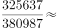，正确；

②：数据增长最快即增速最大。若题干为“根据上述材料，下列描述正确的有”，则全年实物商品网上零售额的增速（）确实最大，但是，题干为“关于我国经济和社会发展情况描述正确的有”，我国经济和社会发展情况的范围过大，因此在不知其它相关信息增速的情况下，无法推出全年实物商品网上零售额的增速最大，错误；

③：定位材料第二段，2018年我国对“一带一路”沿线国家出口46478亿元，增长；进口37179亿元，增长。结合109题结论可知，2018年顺差值为9299亿元。根据“”，则2017年顺差值亿元，即2017年大于2018年，正确；

④：定位文字材料第三段，2018年我国餐饮收入额42716亿元，增长，根据“”，则2017年我国餐饮收入额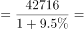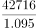，直除首位上不到4，即小于40000亿元，错误；

正确的描述有2项。

故正确答案为B。

---

## 材料 2

        1979年全国普通高校毕业生人数为8.5万人，1980年为14.7万人，2001年为114万人，2002年为145万人，2010年较上一年同比增长，2018年首次突破了800万人，2019年预计达到834万人，毕业生就业创业面临严峻形势。

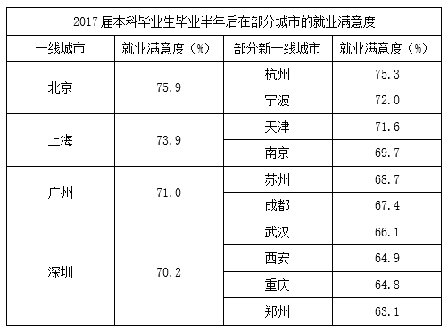

### 第 6 题　qid 2394030 · 综合

2009年全国普通高校毕业生人数约为（    ）。

- **A**. 600万人
- **B**. 610万人　✅
- **C**. 620万人
- **D**. 630万人

**答案**：B

**官方解析**

根据“2009年······约为”，结合材料给出2010年数据，判断本题为基期计算问题。定位文字材料和图形材料可知，2010年全国普通高校毕业生人数为631万人，较上一年同比增长，则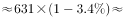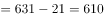万人。

故正确答案为B。

---

### 第 7 题　qid 2394032 · 增长

在2010～2019年中，全国普通高校毕业生同比增长最快的两个年份是（    ）。

- **A**. 2011年和2014年　✅
- **B**. 2011年和2017年
- **C**. 2014年和2017年
- **D**. 2018年和2019年

**答案**：A

**官方解析**

根据“······同比增长最快的两个年份”可判定本题为一般增长率的比较问题。定位图形材料，根据，可得全国普通高校毕业生同比增速如下：

2011年：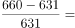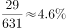；

2014年：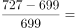；

2017年：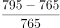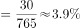；

2018年：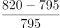；

2019年：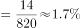。

则同比增长最快的两个年份是2011年和2014年。

故正确答案为A。

---

### 第 8 题　qid 2393936 · 比重

最能准确反映2001年，2010年和2019年全国普通高校毕业生人数比重的统计图是（    ）。

- **A**. A
- **B**. B
- **C**. C
- **D**. D　✅

**答案**：D

**官方解析**

根据“······比重的统计图是”，结合材料已给2001年、2010年、2019年数据，可判定本题为现期比重问题。定位文字材料和图形材料，可知2001年全国普通高校毕业生人数为114万人，2010年为631万人，2019年为834万人，则这三年总毕业人数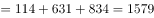万人。根据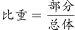，则2001年毕业人数所占比重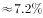；2010年毕业人数所占比重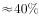；2019年毕业人数所占比重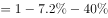，结合选项饼形图的比重关系，D选项最符合。

故正确答案为D。

---

### 第 9 题　qid 2393942 · 综合

下列关于2017届本科毕业生毕业半年后在各城市的就业满意度排序正确的一项是（    ）。

- **A**. 

- **B**. 
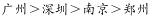
　✅
- **C**. 

- **D**. 
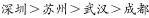

**答案**：B

**官方解析**

定位表格材料，选项中涉及的2017年本科毕业生毕业半年后在部分城市的就业满意度从大到小依次为：北京；上海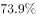；宁波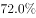；天津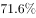；广州；深圳；南京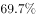；苏州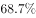；成都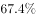；武汉；重庆；郑州；只有B选项排序正确。

故正确答案为B。

---

### 第 10 题　qid 2393943 · 倍数

根据以上资料，下列说法正确的有（    ）。

①2019年全国普通高校毕业生人数约为1979年人数的100倍

②近5年全国普通高校毕业生人数基数很大，增长速率比较稳定，每年都是按照的速度在增长

③近8年间累计培养全国普通高校毕业生人数已经超过6000万人，按现有的增长速度，估计2020年全国普通高校毕业生人数将达到840万人以上

④2017届本科毕业生毕业半年后在各城市的就业满意度高于的城市有6个

⑤在一线城市中，北京是就业满意度最高的城市，其次是杭州

- **A**. 1个
- **B**. 2个　✅
- **C**. 3个
- **D**. 4个

**答案**：B

**官方解析**

①：定位文字和图形材料，1979年全国普通高校毕业生人数为8.5万人，2019年全国普通高校毕业生人数为834万人，倍数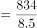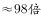，正确；

（备注：如果表述为“约为……的101倍”，则该表述错误，因为101是精确到个位，则计算值必须在100.5-101.4范围内才是正确的。但本题表述为“约为……的100倍”，则不必精确到个位，98倍四舍五入约为100倍是正确的） 

②：定位图形材料，2019年全国普通高校毕业生同比增速为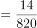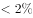，故并非均按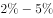的速度增长，错误；

③：定位图形材料，近8年累计毕业生人数为，由②知，2019年毕业生人数的增长速度约为，则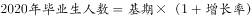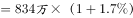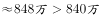，正确；

④：定位表格材料，2017届本科毕业生毕业半年后在部分城市的就业满意度高于的有：北京；上海；杭州；宁波；天津，共5个，错误；

（备注：即使表述为“2017届本科毕业生毕业半年后在各城市的就业满意度高于的城市有5个”，但由于表格只给了部分城市的就业满意度，不能确定所有城市的相关数据，因此该表述依然是错误的）

⑤定位表格材料，一线城市中，就业满意度最高的城市是北京，其次是上海，杭州属于“新一线城市”，错误。

综上所述，说法正确的为①③，共两个。

故正确答案为B。

---

## 材料 3

        Q省2018年客货运输换算周转量5096.9亿吨公里，比上年增长。货物周转量4143.3亿吨公里，增长。其中，铁路周转量729.6亿吨公里，下降；公路周转量2731.8亿吨公里，增长。旅客周转量1768.2亿人公里，增长。其中，铁路周转量865.6亿人公里，增长；公路周转量767.3亿人公里，下降；民航周转量132.3亿人公里，增长。

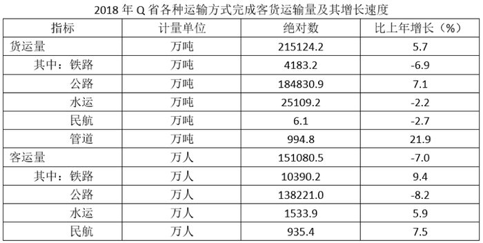

### 第 11 题　qid 2393951 · 增长

2018年，Q省货运量增速最大的是（    ）。

- **A**. 铁路
- **B**. 管道　✅
- **C**. 公路
- **D**. 民航

**答案**：B

**官方解析**

根据题干“增速最大”，结合表格材料，判定本题为直接找数。定位表格材料上半部分可知，2018年货运量增长速度：铁路（）；管道（）；公路（）；民航（）。比较四个数字，其中最大，故2018年，Q省货运量增速最大的是管道。

故正确答案为B。

---

### 第 12 题　qid 2393952 · 综合

2017年，Q省货物周转量为（    ）。

- **A**. 4877.4亿吨公里
- **B**. 4820.3亿吨公里
- **C**. 4153.3亿吨公里
- **D**. 4110.4亿吨公里　✅

**答案**：D

**官方解析**

由题干“2017年，Q省货物周转量······”，结合材料时间为2018年，可判定本题为基期计算问题。定位文字材料“Q省2018年······货物周转量4143.3亿吨公里，增长。”代入基期计算公式：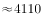亿吨公里，与D项最接近。

故正确答案为D。 

---

### 第 13 题　qid 2393960 · 比重

2018年，Q省公路客运量占客运总量的比重约为（    ）。

- **A**. 

　✅
- **B**. 

- **C**. 

- **D**. 

**答案**：A

**官方解析**

由题干“2018年，Q省公路客运量占······的比重”，材料时间为2018年，可判定本题为现期比重问题。定位表格材料下半部分可知，客运总量为151080.5万人，公路客运量为138221.0万人。根据，则2018年，Q省公路客运量占客运总量的比重。

故正确答案为A。

---

### 第 14 题　qid 2393964 · 平均数

2018年，Q省客运平均运送距离约为（    ）。

- **A**. 107公里
- **B**. 1007公里
- **C**. 1170公里
- **D**. 117公里　✅

**答案**：D

**官方解析**

由题干“2018年，Q省客运平均······”，结合材料时间为2018年，可判定本题为现期平均数问题。定位文字材料“Q省2018年······旅客周转量1768.2亿人公里”；定位表格材料，Q省客运总量为151080.5万人。由，则2018年，Q省客运平均运送距离。

故正确答案为D。

---

### 第 15 题　qid 2393970 · 综合

关于Q省客货运输情况，以下说法正确的是（    ）。

- **A**. 
2017年，Q省客货运输换算周转量约为5000亿吨公里

- **B**. 
2018年，Q省铁路货物周转量增速大于公路货物周转量增速

- **C**. 
2018年，Q省4种客运方式客运量比上年平均增长以上

- **D**. 
2018年，Q省水运客运量比民航客运量多598.5万人
　✅

**答案**：D

**官方解析**

A项：定位文字材料，Q省2018年客货运输换算周转量5096.9亿吨公里，比上年增长。根据，则2017年，Q省客货运输换算周转量亿吨公里，非5000亿吨公里，错误；

B项：定位文字材料，Q省铁路货物周转量增速下降；公路货物周转量增速为增长，则铁路货物周转量增速小于公路货物周转量增速，错误；

C项：定位表格材料，2018年，Q省4种客运方式客运量比上年的平均增长率，为4种客运方式客运量的混合增长率，即为客运量的整体增长率（），显然，则平均增长率非以上，错误；

D项：定位表格材料，2018年，Q省水运客运量1533.9万人，民航客运量935.4万人，前者比后者多万人，正确。

故正确答案为D。

---
