# 2019年青海省法院、检察院录用考试《行测》题

> 资料分析 · 5 题 · 青海 2019

## 材料 1

        2018年1-10月份，全国房地产开发投资99325亿元，同比增长，增速比1-9月份回落0.2个百分点。其中，住宅投资70370亿元，增长，增速回落0.3个百分点。住宅投资占房地产开发投资的比重为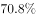。

        1-10月份，东部地区房地产开发投资53136亿元，同比增长，增速比1-9月份回落0.2个百分点；中部地区投资20755亿元，增长，增速回落1.3个百分点；西部地区投资21254亿元，增长，增速提高0.9个百分点；东北地区投资4180亿元，增长，增速回落0.9个百分点。

        1-10月份，商品房销售面积133117万平方米，同比增长，增速比1-9月份回落0.7个百分点。其中，住宅销售面积增长，办公楼销售面积下降，商业营业用房销售面积下降。商品房销售额115913亿元，增长，增速回落0.8个百分点。其中，住宅销售额增长，办公楼销售额下降，商业营业用房销售额增长。

        1-10月份，东部地区商品房销售面积53545万平方米，同比下降，降幅比1-9月份扩大0.4个百分点；销售额61680亿元，增长，增速回落0.6个百分点。中部地区商品房销售面积37733万平方米，增长，增速回落1.5个百分点；销售额25380亿元，增长，增速回落1.6个百分点。西部地区商品房销售面积35430万平方米，增长，增速回落0.3个百分点；销售额24165亿元，增长，增速回落0.6个百分点。东北地区商品房销售面积6409万平方米，下降，降幅扩大1.2个百分点；销售额4688亿元，增长，增速回落2.5个百分点。

        10月末，商品房待售面积52789万平方米，比9月末减少401万平方米。其中，住宅待售面积减少321万平方米，办公楼待售面积减少19万平方米，商业营业用房待售面积减少46万平方米。

### 第 1 题　qid 2440282 · 比重

2017年1-10月，住宅投资占房地产开发投资的比重约为：

- **A**. 

　✅
- **B**. 

- **C**. 

- **D**. 
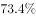

**答案**：A

**官方解析**

根据题干“2017年1-10月···占···的比重”，结合材料时间为2018年，可判定本题为基期比重问题。定位材料第一段数据可得：“2018年1-10月份，全国房地产开发投资99325亿元，同比增长。住宅投资70370亿元，增长。住宅投资占房地产开发投资的比重为。”根据基期比重的公式：基期比重，故题干所求2017年1-10月份住宅投资占房地产开发投资的比重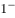，只有A项满足。

故正确答案为A。

---

### 第 2 题　qid 2440284 · 综合

2018年1-10月，在东部、中部、西部、东北四个地区中，商品房销售单价与全国变化相同的有几项？

- **A**. 1
- **B**. 2
- **C**. 3
- **D**. 4　✅

**答案**：D

**官方解析**

根据题干“······销售单价与全国变化相同”，可判定本题为两期平均数的比较问题。销售单价，根据平均数升降判断的方法：若销售额的增速大于销售面积的增速，则单价与去年相比上升，反之下降。定位第三段可知“2018年1-10月份，商品房销售面积······同比增长。商品房销售额······增长”。销售额增速销售面积的增速，因此全国商品房销售单价与去年相比有所上升。

定位第四段可得到数据“2018年1-10月份，东部地区商品房销售面积同比下降；销售额增长。中部地区面积37733增长；销售额增长；西部地区销售面积增长；销售额增长；东北地区销售面积下降；销售额增长。”观察发现，四个地区都满足销售额增速销售面积的增速，即四个地区商品房销售单价与去年相比都有所上升。故商品房销售单价与全国变化相同的地区有4项。

故正确答案为D。

备注：各地区单价与全国单价变化相同，即单价涨跌方向一致（同增或者同减），判断单价涨跌时比较增长率或者增长量的正负即可。

---

### 第 3 题　qid 2440285 · 增长

在2018年的下列指标中，同比增长幅度最大的是：

- **A**. 1-9月东部地区房地产开发投资
- **B**. 1-10月西部地区商品房销售额　✅
- **C**. 1-9月商品房销售额
- **D**. 1-10月住宅投资

**答案**：B

**官方解析**

由题干“在2018年···同比增长幅度最大···”，可判定本题为一般增长率比较问题。

A项，定位文字材料第二段，“1-10月份，东部地区房地产开发投资53136亿元，同比增长，增速比1-9月份回落0.2个百分点；”，可计算出2018年1-9月东部地区房地产开发投资增速为；

B项，定位文字材料第四段，“1-10月份···西部地区商品房···销售额24165亿元，增长···。”，可知2018年1-10月西部地区商品房销售额增速为；

C项，定位文字材料第三段，“1-10月份，···商品房销售额115913亿元，增长，增速回落0.8个百分点。···”，可计算出2018年1-9月商品房销售额增速为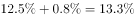；

D项，定位文字材料第一段，“2018年1-10月份，···其中，住宅投资70370亿元，增长···”，可知2018年1-10月住宅投资增速为。

比较上述增速，最大的是1-10月西部地区商品房销售额（）。

故正确答案为B。

---

### 第 4 题　qid 2440288 · 增长

2018年1-10月，在东部、中部、西部、东北四个地区中，按商品房销售额同比增长量的排序正确的是哪一项？

- **A**. 
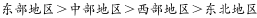

- **B**. 

　✅
- **C**. 
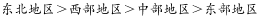

- **D**. 

**答案**：B

**官方解析**

由题干“2018年1-10月，···同比增长量的排序···”，可判定本题为增长量比较问题。定位文字材料第四段，“1-10月份，东部地区···销售额61680亿元，增长，···。中部地区···销售额25380亿元，增长，···。西部地区···销售额24165亿元，增长，···。东北地区···销售额4688亿元，增长，···”。根据公式，增长量，可计算出东部地区商品房销售额同比增长量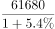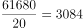亿元；中部地区商品房销售额同比增长量亿元；西部地区商品房销售额同比增长量亿元；东北地区商品房销售额同比增长量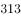亿元。比较四个数字，可知西部地区最大，满足的只有B项。

故正确答案为B。

---

### 第 5 题　qid 2440290 · 综合

根据材料，下列说法正确的是：

- **A**. 
如果保持2018年10月末的同比增量不变，商品房待售面积将在2019年下半年跌破5亿平方米

- **B**. 
2018年10月末，商品房待售面积同比下降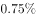

- **C**. 
2018年1-10月，在我国四个区域中，东部地区的商品房销售单价最高
　✅
- **D**. 
2018年10月末，在商品房待售面积中，住宅待售面积环比变化最小

**答案**：C

**官方解析**

A项，定位文字材料最后一段，“10月末，商品房待售面积52789万平方米，比9月末减少401万平方米。”材料给出比9月末减少，属于10月末的环比数据，而题干是“保持2018年10月末的同比增量不变，”没有2017年10月的数据，无法推出，错误；

B项，定位文字材料最后一段，“10月末，商品房待售面积52789万平方米，比9月末减少401万平方米。”材料给出比9月末减少，属于10月末的环比数据，而题干是“同比下降”，没有2017年10月的数据，无法推出，错误；

C项，定位文字材料第四段，“1-10月份，东部地区商品房销售面积53545万平方米，···；销售额61680亿元，···。中部地区商品房销售面积37733万平方米，···；销售额25380亿元，···。西部地区商品房销售面积35430万平方米，···；销售额24165亿元，···。东北地区商品房销售面积6409万平方米，···；销售额4688亿元，···。”。根据公式销售单价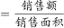，可计算出东部地区销售单价万元/平方米；中部地区销售单价万元/平方米；西部地区销售单价万元/平方米；东北地区销售单价万元/平方米。由此可知，东部地区的商品房销售单价最高。正确；

D项，定位文字材料最后一段，“10月末，商品房待售面积52789万平方米，比9月末减少401万平方米。其中，住宅待售面积减少321万平方米，办公楼待售面积减少19万平方米，商业营业用房待售面积减少46万平方米。”比较上述数字，办公楼待售面积减少19万平方米是环比变化最小的，而非住宅待售面积，错误。

故正确答案为C。

---
