# 2019深圳市公务员录用考试《行测》题（网友回忆版）

> 资料分析 · 15 题 · 深圳市考 2019

## 材料 1

        2018年1-9月汽车行业统计数据如下：

        乘用车累计产销分别完成1735.1万辆和1726.0万辆，同比分别增长和。其中，轿车产销分别完成841.3万辆和842.6万辆，同比分别增长和；SUV产销分别完成737.1万辆和723.5万辆，同比分别增长和；MPV产销分别完成124.4万辆和126.2万辆，同比分别下降和；交叉型乘用车产销分别完成32.2万辆和33.7万辆，同比分别下降和。中国品牌乘用车累计销售724.2万辆，同比下降。

        商用车累计产销分别完成314.1万辆和323.1万辆，同比分别增长和。分车型情况看，客车产销分别完成33.9万辆和33.3万辆，同比分别下降和；货车产销分别完成280.1万辆和289.8万辆，同比分别增长和。

        新能源汽车中，纯电动汽车产销分别完成55.5万辆和54.1万辆，同比分别增长和；插电式混合动力汽车产销分别完成18.0万辆和18.1万辆，同比分别增长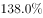和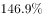。

        汽车整车出口81.4万辆，同比增长。分车型情况看，乘用车出口60.1万辆，同比增长；商用车出口21.3万辆，同比增长。

### 第 1 题　qid 2385108 · 增长

对2018年1-9月商用车销量增长贡献最大的是（    ）。

- **A**. 轿车销量
- **B**. MPV销量
- **C**. 客车销量
- **D**. 货车销量　✅

**答案**：D

**官方解析**

根据题干“对2018年1-9月商用车销量增长贡献最大的是（）”，可判断本题为增长量比较问题。根据主体“商用车”定位材料第三段，商用车按照车型分为客车和货车，排除A、B项。由材料可知：客车销量同比下降，增长率为负数，代表下降；货车同比增长，增长率为正数，代表上升，问增长贡献最大的，正数一定大于负数，排除C项。

故正确答案为D。

---

### 第 2 题　qid 2385112 · 综合

2018年1-9月，产销率最高的乘用车车型是（    ）。

- **A**. 轿车
- **B**. SUV
- **C**. MPV
- **D**. 交叉型乘用车　✅

**答案**：D

**官方解析**

根据题干“2018年1-9月，产销率最高的乘用车车型是（）”，结合材料时间为2018年1-9月，可判断本题为现期比重问题。，主体是乘用车车型，定位材料第二段，A项轿车：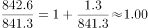；B项SUV：；C项MPV：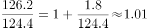；D项交叉型乘用车：。产销率最高的乘用车车型是交叉型乘用车。

故正确答案为D。

---

### 第 3 题　qid 2385131 · 比重

2017年1-9月，中国品牌乘用车销量占乘用车销量的比重是（    ）。

- **A**. 

- **B**. 

　✅
- **C**. 

- **D**. 

**答案**：B

**官方解析**

根据题干“2017年1-9月，中国品牌乘用车销量占乘用车销量的比重是（）”，结合材料时间为2018年1-9月，可判断本题为基期比重问题。定位材料，可得：2018年1-9月汽车行业统计数据如下：乘用车累计产销分别完成1735.1万辆和1726.0（B）万辆，同比分别增长和(b)······，中国品牌乘用车累计销售724.2（A）万辆，同比下降(a)。根据基期比重公式，则2017年1-9月，中国品牌乘用车销量占乘用车销量的比重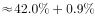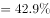，对应B项。 

故正确答案为B。

---

### 第 4 题　qid 2385134 · 综合

2017年1-9月，乘用车的四类车型按销量从高至低排列，依次为（    ）。

- **A**. 
轿车SUV交叉型乘用车MPV

- **B**. 
SUV轿车交叉型乘用车MPV

- **C**. 
轿车SUVMPV交叉型乘用车
　✅
- **D**. 
SUV轿车MPV交叉型乘用车

**答案**：C

**官方解析**

根据题干“2017年1-9月，乘用车的四类车型按销量从高至低排列，依次为”，结合材料时间为2018年1-9月，可判定本题为基期比较问题。根据，可知：2017年1-9月轿车销量为万辆；SUV销量为万辆，和 两个分数比较，的分子大分母小，分数一定大，说明轿车SUV，排除B、D项。剩余A、C项，只需要比较交叉型乘用车和MPV的销量，2017年1-9月MPV销量为万辆，交叉型乘用车销量为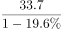万辆，和比较，分母十分接近，MPV的分子远远大于交叉型乘用车，因此MPV交叉型乘用车，排除A项。

故正确答案为C。

---

### 第 5 题　qid 2385135 · 综合

根据上文，以下说法一定正确的是（    ）。

- **A**. 2017年1-9月，纯电动汽车和插电式混合动力汽车的产量均高于自身销量　✅
- **B**. 2017年1-9月，货车销量是客车销量的9.7倍
- **C**. 2018年1-9月，非中国品牌乘用车销量同比下降
- **D**. 2018年1-9月，乘用车与商用车的整车出口量差距同比进一步扩大

**答案**：A

**官方解析**

A项：定位材料第四段，纯电动汽车产销分别完成55.5万辆和54.1万辆，同比分别增长和；插电式混合动力汽车产销分别完成18.0万辆和18.1万辆，同比分别增长和。2017年1-9月纯电动汽车产量为万辆；销量为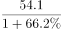万辆，产量对应分子大，分母小，明显结果更大；2017年1-9月插电式混合动力汽车产量为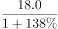万辆；销量为万辆，二者分子几乎相等，而产量对应分母更小，因此结果也更大，正确；

B项：定位材料第三段，可得：客车销量为33.3（B）万辆，同比下降（b）；货车销量289.8（A）万辆，同比增长（a）。根据基期倍数公式，货车销量是客车销量的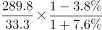倍，错误；

C项：定位材料第二段，2018年1-9月，乘用车累计销量同比增长0.6%，中国品牌乘用车累计销售同比下降，因为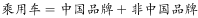，根据混合增长率居中，可知整体增长率大于中国品牌乘用车销量同比增长率（），必然小于非中国品牌乘用车销量同比增长率，即2018年1-9月，非中国品牌乘用车销量同比增长率大于，并非同比下降，错误；

D项：定位材料第五段，可得：乘用车出口60.1万辆，同比增长；商用车出口21.3万辆，同比增长。题干“2018年1-9月，乘用车与商用车的整车出口量差距同比进一步扩大”，同比进一步扩大，是指2017年比2016年扩大，2018年又比2017年扩大，而根据材料无法求出2016年的整车出口量差距数据，所以无法推断，错误。

故正确答案为A。

---

## 材料 2

### 第 6 题　qid 2385100 · 综合

2011年，深圳市进出口总额为（    ）亿美元。

- **A**. 4877.41
- **B**. 4668.31
- **C**. 4142.24　✅
- **D**. 3984.39

**答案**：C

**官方解析**

由题干“2011年，深圳市进出口总额为（    ）亿美元”且材料时间是2012年，判定此题为基期计算问题。定位统计图，根据公式：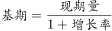，则2011年深圳市进出口总额为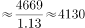亿美元，与C项最接近。

故正确答案为C。

---

### 第 7 题　qid 2385101 · 综合

2012-2017年，深圳市进出口贸易顺差最大的年份是（    ）年。

- **A**. 2012
- **B**. 2014
- **C**. 2015　✅
- **D**. 2017

**答案**：C

**官方解析**

定位材料可知，2012年深圳市进出口贸易顺差为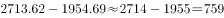亿美元；2014年深圳市进出口贸易顺差为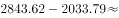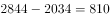亿美元；2015年深圳市进出口贸易顺差为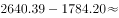亿美元；2017年深圳市进出口贸易顺差为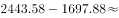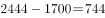亿美元。因此，深圳市进出口贸易顺差最大的年份是2015年。（只计算选项中给的年份即可）

故正确答案为C。

---

### 第 8 题　qid 2385105 · 增长

2012-2017年，深圳市进出口总额同比增幅最大的年份和同比减幅最大的年份相比，其进口总额相差（    ）亿美元。

- **A**. 1390.35
- **B**. 982.01
- **C**. 708.80　✅
- **D**. 681.55

**答案**：C

**官方解析**

由材料可知深圳市进出口总额同比增幅最大的年份为2013年（），降幅最大的年份为2016年（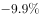），其进口总额相差亿美元。

故正确答案为C。

---

### 第 9 题　qid 2385115 · 增长

2012-2017年，深圳市进口总额的年均增长率约为（    ）。

- **A**. 

　✅
- **B**. 

- **C**. 
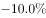

- **D**. 

**答案**：A

**官方解析**

由题干“2012-2017年，深圳市进口总额的年均增长率约为（）”判定此题为年均增长率问题。根据公式：，由材料可知，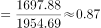，结合选项增长率数值较小，根据进行估算，则有1+5r＜0.87，解得r＜-2.6%，只有A项略小于-2.6%。

故正确答案为A。

---

### 第 10 题　qid 2385119 · 综合

根据上图，下列说法正确的是（    ）。

- **A**. 2013-2017年，深圳市进出口总额呈先升后降的趋势
- **B**. 2013年深圳市出口总额是2017年进口总额的2倍多
- **C**. 2013-2017年，深圳市进出口总额的同比增速均高于本年出口总额的同比增速
- **D**. 2017年，深圳市进出口总额同比增加157.07亿美元　✅

**答案**：D

**官方解析**

A项：观察折线图可知，2017年进出口总额同比增长，即2017年进出口总额高于2016年，并不是下降。错误；

B项：由材料可知，2013年深圳市出口额为3057.02亿美元，2017年深圳市进口额为1697.88亿美元，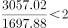，不足2倍。错误；

C项：由折线图可知2014年深圳市进出口总额增速为，出口额增速为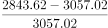，即2014深圳市进出口总额的同比增速低于本年出口总额的同比增速。错误；

D项：2017年深圳市进出口总额同比增长亿美元。正确。

故正确答案为D。

---

## 材料 3

### 第 11 题　qid 2385093 · 增长

2018年，广东省生产总值同比增长（    ）。

- **A**. 
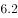
　✅
- **B**. 

- **C**. 
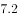

- **D**. 
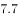

**答案**：A

**官方解析**

由题干“2018年，广东省生产总值同比增长”，结合选项为百分数，可判定本题为增长率计算问题。定位表2可得，2018年珠三角地区、粤东西北地区生产总值分别为81048.50、19977.45亿元，2017年分别为75809.75、19345.38亿元。根据文字部分可知，粤东西北地区是指广东省除珠三角地区之外的所有地区，则2018年广东省生产总值同比增长率为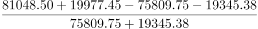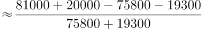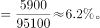

故正确答案为A。

---

### 第 12 题　qid 2385096 · 比重

2016年，珠三角地区下列经济指标占全省总额的比重，与珠三角地区生产总值占全省生产总值的比重最接近的是（    ）。

- **A**. 固定资产投资
- **B**. 房地产开发投资　✅
- **C**. 社会消费品零售总额
- **D**. 进出口总额

**答案**：B

**官方解析**

由题干“2016年···占···的比重，与···占···的比重最接近的是”，可判定本题为现期比重比较问题。定位表2可得，2016年珠三角地区、粤东西北地区生产总值分别为67841.85、17713.81亿元，则珠三角地区生产总值占全省生产总值的比重为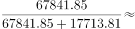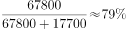。定位表1可得2016年广东各区域主要经济总量指标，分别计算珠三角所占比重即可。

A固定资产投资：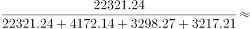；

B房地产开发投资：；

C社会消费品零售总额：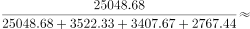；

D进出口总额：。

比较可知，与珠三角地区生产总值占全省生产总值的比重最接近的是房地产开发投资。

故正确答案为B。

---

### 第 13 题　qid 2385097 · 增长

2013-2018年，粤东西北地区生产总值同比增速最快的年份是（    ）年。

- **A**. 2013　✅
- **B**. 2014
- **C**. 2017
- **D**. 2018

**答案**：A

**官方解析**

由题干“2013-2018年···同比增速最快的年份是”，可判定本题为增长率比较问题。定位表2可得，2012-2018年粤东西北地区生产总值，根据计算各选项年份增长率，进行比较即可。

A:2013年：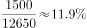；

B:2014年：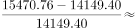；

C:2017年：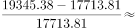；

D:2018年：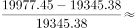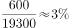。

比较可知，粤东西北地区生产总值同比增速最快的年份是2013年。

故正确答案为A。

备注：本题按照网友回忆版题干为“2013-2018年，粤东西北地区生产总值同比增速最快的年份”，答案应为2016年，但选项中无此年份，故解析以选项中的四个年份进行比较。

---

### 第 14 题　qid 2385098 · 综合

2016年，广东各区域按社会消费品零售总额与地区生产总值的比值由大到小排列，依次为（    ）。

- **A**. 
珠三角粤北山区东翼西翼

- **B**. 
珠三角粤北山区西翼东翼

- **C**. 
东翼西翼珠三角粤北山区

- **D**. 
东翼西翼粤北山区珠三角
　✅

**答案**：D

**官方解析**

由题干“2016年···与···的比值由大到小排列，依次为”，可判定本题为比值比较问题。定位表1可得2016年广东各区域社会消费品零售总额与地区生产总值，比值分别为：珠三角、东翼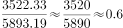、西翼、粤北山区。由大到小排列依次为东翼、西翼、粤北山区、珠三角，与D项顺序一致。

故正确答案为D。

---

### 第 15 题　qid 2385099 · 综合

根据上表，下列说法正确的是（    ）。

- **A**. 2016年，珠三角地方一般公共预算收入比粤东西北地区多7.0倍
- **B**. 2012-2018年，珠三角与粤东西北地区生产总值的差距逐年缩小
- **C**. 按2018年珠三角地区生产总值的同比增速，预计2020年珠三角地区生产总值将突破9万亿元　✅
- **D**. 2016年，广东省固定资产投资30008.86亿元

**答案**：C

**官方解析**

A项：定位表1可得，2016年珠三角地方一般公共预算收入为6923.98亿元，粤东西北地区为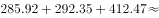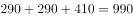亿元。多7倍代表是8倍，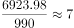倍8倍，错误；

B项：定位表2可得，2012年珠三角与粤东西北地区生产总值分别为47824.18、12650.41亿元，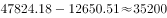亿元。2013年珠三角与粤东西北地区生产总值分别为53307.67、14149.40亿元，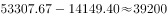亿元。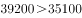，可知差距并非逐年缩小，错误；

C项：定位表2可得，2018年珠三角地区生产总值为81048.50亿元，2017年为75809.75亿元。2018年珠三角地区生产总值同比增量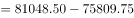亿元。根据增长量与现期量成正比，保持增长率不变，则2020年的增长量2019年的增长量2018年的增长量，则2020年珠三角地区生产总值2018年珠三角地区生产总值2018年的增长量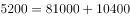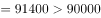亿元，正确；

D项：定位表1可得，2016年，广东省固定资产投资为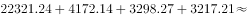亿元，错误。

故正确答案为C。

---
