# 2020年上海市公务员录用考试《行测》题（A类）（网友回忆版）

> 资料分析 · 7 题 · 上海 2020

## 材料 1

### 第 1 题　qid 2453096 · 增长

在上述城市中，2016年末（    ）市常住人口数量同比增量最大。

- **A**. 深圳
- **B**. 广州　✅
- **C**. 天津
- **D**. 武汉

**答案**：B

**官方解析**

根据题干“2016年末······同比增量最大”，可判定本题为增长量计算问题。定位表格可知深圳、广州、天津、武汉2016年末、2015年末对应的人口数量。根据增长量可得，选项中的四个城市2016年末常住人口数量同比增量分别为：

深圳：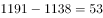万人；

广州：万人；

天津：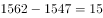万人；

武汉：万人；故同比增长量最大的为广州。

故正确答案为B。

---

### 第 2 题　qid 2453101 · 增长

2014年末，表中所列超大城市常住人口同比增量占全国人口同比增量的（    ）。

- **A**. 不到两成
- **B**. 两成多　✅
- **C**. 三成多
- **D**. 四成以上

**答案**：B

**官方解析**

根据题干“2014年末······占······”且材料有2014年相关数据，可判定本题为现期比重问题。根据注释可知，超大城市为常住人口超过1000万的城市，则根据表格数据，2014年末是超大城市的有深圳、广州、天津、重庆、北京、武汉、成都。根据增长量，可求超大城市的增长量分别为：深圳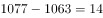万人、广州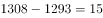万人、天津万人、重庆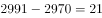万人、北京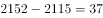万人、武汉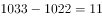万人、成都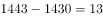万人。则超大城市的增长量之和为万人。

全国人口同比增量为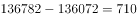万人。则超大城市常住人口同比增量占全国人口同比增量的比重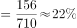，即两成多。

故正确答案为B。

---

### 第 3 题　qid 2453102 · 增长

以下折线图反映了2013—2017年（    ）年末常住人口同比增量的变化趋势。

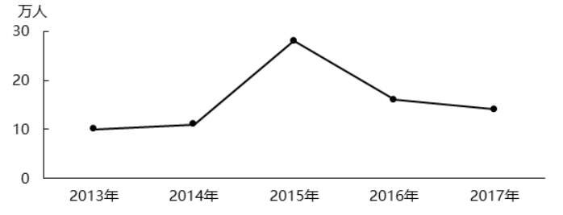

- **A**. 武汉　✅
- **B**. 长沙
- **C**. 杭州
- **D**. 北京

**答案**：A

**官方解析**

根据题干“······同比增量的变化趋势”，可判定本题为增长量比较问题。由于有坐标轴且有具体数值，因此可先看2013年的增长量。定位表格可得选项各城市2012、2013年人口数据。根据增长量，可得选项城市2013年增量分别为：

武汉：万人，与折线图一致，保留A；

长沙：万人，与折线图不一致，而折线图为10万人，排除；

杭州：万人，与折线图不一致，而折线图为10万人，排除；

北京：万人，与折线图不一致，而折线图为10万人，排除。

故正确答案为A。

---

## 材料 2

                      表1  2016～2021年我国工业大数据市场规模增长及预测 

                    表2  按不同方式划分的2018年我国工业大数据销售额比例

### 第 4 题　qid 2452979 · 增长

2016-2019年，我国工业大数据市场规模同比增速最快的为            年。

- **A**. 2016
- **B**. 2017
- **C**. 2018
- **D**. 2019　✅

**答案**：D

**官方解析**

定位表1，2016-2019年我国工业大数据市场规模同比增速分别为：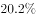、、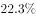、，可见，增速最快的为2019年。

故正确答案为D。

---

### 第 5 题　qid 2452981 · 增长

如保持2021年同比增量不变，则在            年我国工业大数据市场规模将比2021年翻一番。

- **A**. 2025
- **B**. 2026　✅
- **C**. 2027
- **D**. 2028

**答案**：B

**官方解析**

根据题干“···在哪年···比2021年翻一番”，可判定本题为现期计算问题。定位表1，2020年、2021年我国工业大数据市场规模分别为192.6亿元、256.0亿元。根据计算公式，2021年同比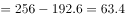亿元；市场规模比2021年翻一番，即增长，增长256.0亿元。则需要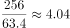年，即至少需要5年，应为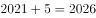年。

故正确答案为B。

---

### 第 6 题　qid 2452983 · 综合

2018年，我国离散型制造业大数据市场规模约比流程型制造业大数据市场规模高            亿元。

- **A**. 44
- **B**. 50　✅
- **C**. 98
- **D**. 113

**答案**：B

**官方解析**

根据题干“2018年，···比···高多少亿元”，材料中包含2018年数据，可判定本题为现期计算问题。定位表1与表2，2018年我国工业大数据市场规模为114.2亿元，其中离散型制造业占比，流程型制造业占比，则前者比后者高：亿元，与B项接近。

故正确答案为B。 

---

## 材料 3

                             表  2018年全国及京津沪各类型外资企业进出口贸易额及同比增速

### 第 7 题　qid 2452996 · 增长

将上海市的中外合作企业、中外合资企业和外商独资企业按2018年全年进出口贸易总额同比增量从高到低排列，正确的是<u>            </u>。

- **A**. 

　✅
- **B**. 

- **C**. 

- **D**. 
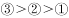

**答案**：A

**官方解析**

根据题干“将上海市的······同比增量从高到低排列”，可判定此题为增长量的比较问题。由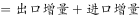，定位表格材料数据可得三种类型外资企业进出口贸易总额。根据增长量，则所求同比增量分别为：

①中外合作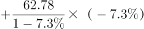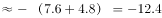亿元；

②中外合资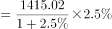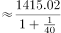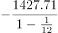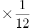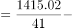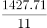亿元；

③外商独资出口额增速、进口额增速均为正值，同比增量大于0，则。

故正确答案为A。

---
