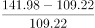
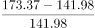
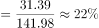
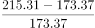
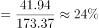

# 2020年上海市公务员录用考试《行测》题（B类）（网友回忆版）

> 资料分析 · 5 题 · 上海 2020

## 材料 1

根据下列资料，回答76～80题。

### 第 1 题　qid 2452966 · 增长

2017-2019年，每年上半年网店图书零售码洋同比增速                    。

- **A**. 逐年升高
- **B**. 逐年降低
- **C**. 先升高后降低
- **D**. 先降低后升高　✅

**答案**：D

**官方解析**

根据“2017-2019年，每年上半年网店图书零售码洋同比增速”，结合选项判断趋势，判定本题为一般增长率比较问题。定位图形，2016年-2019年，每年上半年网店图书零售码洋分别为109.22、141.98、173.37、215.31亿元。根据公式：增长率，则2017年上半年网店图书零售码洋同比增速为；2018年上半年同比增速为；2019年上半年同比增速为。因此同比增速先降低后升高，D选项符合。

故正确答案为D。

---

## 材料 2

                      表1  2016～2021年我国工业大数据市场规模增长及预测 

                    表2  按不同方式划分的2018年我国工业大数据销售额比例

### 第 2 题　qid 2452979 · 增长

2016-2019年，我国工业大数据市场规模同比增速最快的为            年。

- **A**. 2016
- **B**. 2017
- **C**. 2018
- **D**. 2019　✅

**答案**：D

**官方解析**

定位表1，2016-2019年我国工业大数据市场规模同比增速分别为：、、、，可见，增速最快的为2019年。

故正确答案为D。

---

### 第 3 题　qid 2452981 · 增长

如保持2021年同比增量不变，则在            年我国工业大数据市场规模将比2021年翻一番。

- **A**. 2025
- **B**. 2026　✅
- **C**. 2027
- **D**. 2028

**答案**：B

**官方解析**

根据题干“···在哪年···比2021年翻一番”，可判定本题为现期计算问题。定位表1，2020年、2021年我国工业大数据市场规模分别为192.6亿元、256.0亿元。根据计算公式，2021年同比亿元；市场规模比2021年翻一番，即增长，增长256.0亿元。则需要年，即至少需要5年，应为年。

故正确答案为B。

---

### 第 4 题　qid 2452983 · 综合

2018年，我国离散型制造业大数据市场规模约比流程型制造业大数据市场规模高            亿元。

- **A**. 44
- **B**. 50　✅
- **C**. 98
- **D**. 113

**答案**：B

**官方解析**

根据题干“2018年，···比···高多少亿元”，材料中包含2018年数据，可判定本题为现期计算问题。定位表1与表2，2018年我国工业大数据市场规模为114.2亿元，其中离散型制造业占比，流程型制造业占比，则前者比后者高：亿元，与B项接近。

故正确答案为B。 

---

## 材料 3

                             表  2018年全国及京津沪各类型外资企业进出口贸易额及同比增速

### 第 5 题　qid 2452996 · 增长

将上海市的中外合作企业、中外合资企业和外商独资企业按2018年全年进出口贸易总额同比增量从高到低排列，正确的是<u>            </u>。

- **A**. 

　✅
- **B**. 

- **C**. 

- **D**. 

**答案**：A

**官方解析**

根据题干“将上海市的······同比增量从高到低排列”，可判定此题为增长量的比较问题。由，定位表格材料数据可得三种类型外资企业进出口贸易总额。根据增长量，则所求同比增量分别为：

①中外合作亿元；

②中外合资亿元；

③外商独资出口额增速、进口额增速均为正值，同比增量大于0，则。

故正确答案为A。

---
