# 2020年北京市公务员录用考试《行测》题（乡镇卷）（网友回忆版）

> 资料分析 · 20 题 · 北京 2020

## 材料 1

        2017年全国共有各级各类民办学校17.76万所，占全国学校总数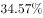；各类民办教育在校生达5120.47万人，比上年增长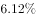。其中：民办幼儿园16.04万所，比上年增长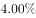；在园儿童2572.34万人，比上年增长。民办普通小学6107所，比上年增长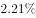；在校生814.17万人，比上年增长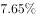。民办初中5277所，比上年增长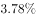；在校生577.68万人，比上年增长。民办普通高中3002所，比上年增长；在校生306.26万人，比上年增长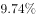。民办中等职业学校2069所，比上年下降；在校生197.33万人，比上年增长。

### 第 1 题　qid 2453200 · 综合

2017年全国学校总数在以下哪个范围内？

- **A**. 不到50万所
- **B**. 50～60万所之间　✅
- **C**. 60～70万所之间
- **D**. 超过70万所

**答案**：B

**官方解析**

根据“2017年全国学校总数在以下哪个范围内”，结合材料所给数据为2017年的比重数据，判断本题为现期比重问题。定位材料，“2017年全国共有各级各类民办学校17.76万所，占全国学校总数”。因此全国的学校总数为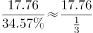万所，在B选项范围内。

故正确答案为B。

---

### 第 2 题　qid 2453202 · 比重

2017年民办幼儿园在园儿童人数占民办教育在校生总人数的比例约为

- **A**. 

- **B**. 

　✅
- **C**. 

- **D**. 

**答案**：B

**官方解析**

根据“2017年······占······的比例约为多少”，结合材料时间为2017年，判断本题为现期比重问题。定位材料，各类民办教育在校生达5120.47万人，民办幼儿园在园儿童2572.34万人。根据公式：，则2017年民办幼儿园在园儿童人数占民办教育在校生总人数的比例约为。

故正确答案为B。

---

### 第 3 题　qid 2453203 · 增长

以下民办学校类型中，2017年学校数量同比增长最多的是

- **A**. 民办普通高中
- **B**. 民办普通小学
- **C**. 民办初中
- **D**. 民办幼儿园　✅

**答案**：D

**官方解析**

根据“······2017年学校数量同比增长最多的是”，判断本题为增长量比较问题。定位材料可得，“民办普通小学6107所，比上年增长；民办初中5277所，比上年增长，民办幼儿园16.04万所，比上年增长”，根据增长量比较口诀“大大则大”，民办幼儿园的现期量（16.04万所=160400所）和增长率（）均大于民办普通小学与民办初中，所以民办幼儿园的增长量大于民办普通小学与民办初中。

根据增长量计算公式：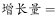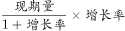，计算比较民办普通高中和民办幼儿园的增长量。

民办普通高中的增长量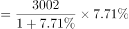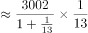；

民办幼儿园的增长量。 

故2017年学校数量同比增长最多的是民办幼儿园。

故正确答案为D。

---

### 第 4 题　qid 2453204 · 平均数

2016年平均每所民办中等职业学校在校生人数约为

- **A**. 871人　✅
- **B**. 991人
- **C**. 1091人
- **D**. 1181人

**答案**：A

**官方解析**

由题干“2016年平均每······”，结合材料时间是2017年，可判定本题为基期平均数问题。定位文字材料，“2017年，······民办中等职业学校2069所（），比上年下降（）；在校生197.33万人（），比上年增长（）。”根据基期平均数公式：，可计算出2016年平均每所民办中等职业学校在校生人数约为：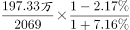 人人，满足的只有A项。

故正确答案为A。

---

### 第 5 题　qid 2453206 · 综合

能够从上述资料中推出的是

- **A**. 
2017年平均每所民办学校在校生人数超过300人

- **B**. 
2017年民办中等职业学校在校生人数同比增加了20多万人

- **C**. 
2017年民办初中学校数量占民办学校总数的以上

- **D**. 
2017年民办普通高中在校生人数同比增速快于民办普通小学
　✅

**答案**：D

**官方解析**

A项：定位文字材料，“2017年全国共有各级各类民办学校17.76万所（），······各类民办教育在校生达5120.47万人（），比上年增长”。根据现期平均数公式：，可以计算出2017年平均每所民办学校在校生人数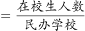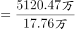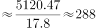人人。错误；

B项：定位文字材料，“2017年，······民办中等职业学校······在校生197.33万人，比上年增长”。根据增长量，可计算出2017年民办中等职业学校在校生人数同比增加了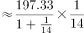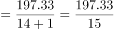万人万人。错误；

C项：定位文字材料，“2017年全国共有各级各类民办学校17.76万所，······民办初中5277所”。根据公式：比重，可计算出2017年民办初中学校数量占民办学校总数的比重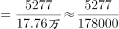。错误；

D项：定位文字材料，“2017年民办普通小学在校生814.17万人，比上年增长；民办普通高中在校生306.26万人，比上年增长”。可知2017年民办普通高中在校生人数同比增速（）快于民办普通小学（）。正确。

故正确答案为D。

---

## 材料 2

        2016年末，A自治区城镇人口为1542.1万人，城镇化率(城镇人口占总人口比重)为。

        2016年末A自治区城镇人均居住面积达32.20平方米，比1978年末增长了5.5倍；农村牧区人均居住面积达27.40平方米，比1985年末增长。2016年末A自治区城镇居民家庭每百户拥有家用汽车38.48辆、家用电脑62台、移动电话222.21部；农牧民家庭每百户拥有家用汽车27.29辆、家用电脑23台、移动电话231.53部。

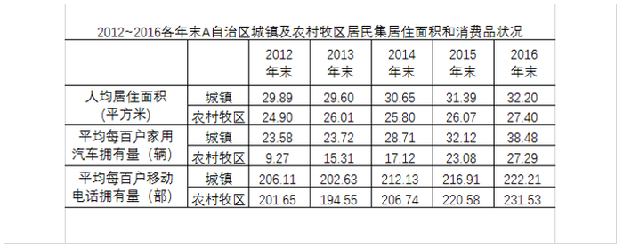

### 第 6 题　qid 2453134 · 综合

2016年末A自治区城镇人口总居住面积约为多少亿平方米？

- **A**. 3
- **B**. 5　✅
- **C**. 7
- **D**. 9

**答案**：B

**官方解析**

根据题干所求“2016年末······人口总居住面积约为······”，结合材料可判定此题为现期平均数问题。定位文字材料第一段“2016年末，A自治区城镇人口为1542.1万人”，定位文字材料第二段“2016年末A自治区城镇人均居住面积达32.20平方米”。由城镇人均居住面积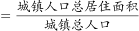得，城镇人口总居住面积亿平方米，与B项最接近。

故正确答案为B。

---

### 第 7 题　qid 2453138 · 增长

以下折线图最能准确反映2013～2016年A自治区哪一类居民的哪一类产品拥有量同比增量变化趋势？

- **A**. 城镇居民，家用汽车　✅
- **B**. 农村牧区居民，家用汽车
- **C**. 城镇居民，移动电话
- **D**. 农村牧区居民，移动电话

**答案**：A

**官方解析**

根据题干所求“以下折线图······同比增量变化趋势”，可判定此题为增长量比较问题。定位表格材料，由可得，2013~2016年A自治区城镇居民、农村牧区居民不同产品拥有量同比增量分别为：

A项：城镇居民，家用汽车：0.14辆、4.99辆、3.41辆、6.36辆，满足折线图变化趋势，当选。

B项：农村牧区居民，家用汽车：6.04辆、1.81辆、5.96辆、4.21辆，观察折线图第一个点应为最低点，与数据不符，排除；

C项：城镇居民，移动电话：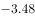部、9.5部、4.78部、5.3部，由折线图第四个点应为最高点，排除；

D项：农村牧区居民，移动电话：部、12.19部、13.84部、10.95部，由折线图第四个点应为最高点，排除。

故正确答案为A。

---

### 第 8 题　qid 2453143 · 平均数

2013～2016各年末，A自治区城镇、农村牧区居民人均居住面积、户均家用汽车和移动电话拥有量均高于上年的年份有几个？

- **A**. 1
- **B**. 2　✅
- **C**. 3
- **D**. 4

**答案**：B

**官方解析**

定位表格材料可得，2012年末A自治区城镇居民人均居住面积为29.89平方米，2013年末为29.60平方米，2013年末低于上年，则2013年末排除；2013年末农村牧区居民人均居住面积为26.01平方米，2014年末为25.80平方米，2014年末低于上年，则2014年末排除；2015年末、2016年末A自治区城镇、农村牧区居民人均居住面积、户均家用汽车和移动电话拥有量均高于上年，即2015年、2016年这2个年份满足。
故正确答案为B。

---

### 第 9 题　qid 2453146 · 平均数

假设平均每户城镇居民家庭的人口数与农牧民家庭相同，则2016年末A自治区城镇居民拥有的家用电脑总量约是农村牧区居民的多少倍？

- **A**. 1.6
- **B**. 2.1
- **C**. 2.7
- **D**. 4.3　✅

**答案**：D

**官方解析**

由题干“2016年末······是······的多少倍”，且材料数据为2016年，可判定本题为现期倍数问题。定位文字材料第二段“2016年末A自治区城镇居民家庭每百户拥有家用电脑62台；农牧家庭每百户拥有家用电脑23台”。城镇居民家庭拥有电脑总量是农村牧区居民的倍数为：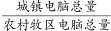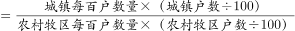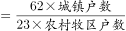。由题干“平均每户城镇居民家庭人口数与农牧家庭相同”，可知平均每户人口数，则，因此。定位文字材料第一段“A自治区城镇人口为1542.1万人，城镇化率为”，可知A自治区农村牧区人口比例为（），则人口总数为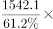，因此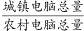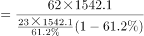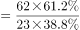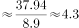倍。

故正确答案为D。

---

### 第 10 题　qid 2453155 · 综合

关于A自治区的以下信息，能够从上述资料中推出的是

- **A**. 
1978年末城镇人均居住面积高于1985年末农村牧区人均居住面积

- **B**. 
2016年末城镇人口数量是农村牧区人口数量的2倍以上

- **C**. 
2016年末城镇居民户均移动电话拥有量比2012年末增长了以上

- **D**. 
2014年末农村牧区平均每6户农牧民拥有的汽车数量在1辆以上
　✅

**答案**：D

**官方解析**

A项：定位文字材料第二段“2016年末A自治区城镇人均居住面积达32.20平方米，比1978年末增长了5.5倍；农村牧区人均居住面积达27.40平方米，比1985年末增长”，则1978年末城镇人均居住面积为：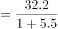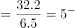平方米；1985年末农村牧区人均居住面积为：平方米，因此前者小于后者，错误；

B项：定位文字材料第一段“2016年末，A自治区城镇人口为1542.1万人，城镇化率(城镇人口占总人口比重)为”，则2016年末农村牧区人口占比，2016年末城镇人口数量是农村牧区人口数量的倍数为：，错误；

C项：定位表格，2016年末、2012年末城镇居民户均移动电话拥有量分别为222.21部、206.11部，则2016年增长率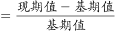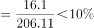，错误；

D项：定位表格，2014年末农村牧区平均每百户家用汽车拥有量为17.12辆，则平均每6户农牧民拥有的汽车数量为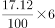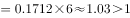辆，正确。

故正确答案为D。

---

## 材料 3

        截至2015年12月底，北京市文化及相关产业企业共有198948户，同比增长，占全市企业总数的；2015年新设文化及相关产业企业30323户，同比增长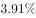。

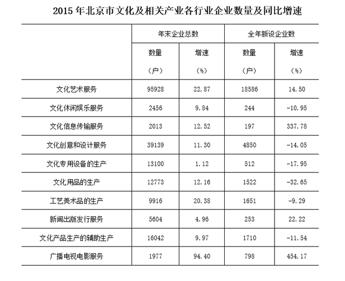

### 第 11 题　qid 2453126 · 综合

截至2015年12月底北京市企业总数约为多少万户？

- **A**. 120　✅
- **B**. 23
- **C**. 17
- **D**. 3

**答案**：A

**官方解析**

根据题干“截至2015年12月底北京市企业总数约为多少万户”，结合材料时间为2015年，可判定本题为现期比重计算问题。定位文字材料可得：“截至2015年12月底，北京市文化及相关产业企业共有198948户······”，占全市企业总数的；故北京市企业总数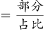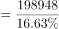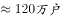。

故正确答案为A。

---

### 第 12 题　qid 2453127 · 综合

北京市2015年12月底前成立的文化及相关产业企业中，约有多少万户在2015年注销（上年末企业数＋本年内新增企业数-本年内注销企业数＝本年末企业数）？

- **A**. 20.1
- **B**. 17.1
- **C**. 1.1
- **D**. 0.2　✅

**答案**：D

**官方解析**

根据题干“······约有多少万户在2015年注销”，结合材料时间为2015年，可判定本题为现期计算问题。定位文字材料：“截至2015年12月底，北京市文化及相关产业企业共有198948户，同比增长，2015年新设文化及相关产业企业30323户”。结合题干给出的等式：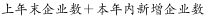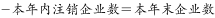，可得：，本年内注销企业数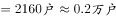。

故正确答案为D。

---

### 第 13 题　qid 2453130 · 综合

截至2015年12月底北京市文化及相关产业各行业中，企业数量最多的行业的企业户数比企业数量最少的行业多多少倍？

- **A**. 5.6
- **B**. 22.7
- **C**. 47.5　✅
- **D**. 93.3

**答案**：C

**官方解析**

根据题干“截至2015年12月底······多多少倍”，结合材料时间为2015年，可判定本题为现期倍数计算问题。定位材料表格可得：企业数量最多的行业是文化艺术服务业，其企业数量为95928户；企业数量最少的行业是广播电视电影服务业，其企业数量为1977户，代入公式：多几倍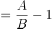。

故正确答案为C。

---

### 第 14 题　qid 2453136 · 综合

2015年文化及相关产业新设企业中，新设户数排名前三位的行业合计占全市文化及相关产业新设企业户数的：

- **A**. 

- **B**. 

- **C**. 
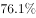

- **D**. 

　✅

**答案**：D

**官方解析**

由题干“2015年，······占······”，判定本题为现期比重问题。定位表格可得：2015年文化及相关产业各行业全年新设企业户数排名前三位的行业分别为：文化艺术服务（18586户）、文化创意和设计服务（4850户）和文化产品生产的辅助生产（1710户）；定位文字材料可得：“2015年新设文化及相关产业企业30323户”，根据公式：比重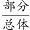，则所求比重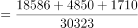，与D项最接近。

故正确答案为D。

---

### 第 15 题　qid 2453141 · 综合

下列有关北京市文化及相关产业各行业企业的表述中，错误的是：

- **A**. 截至2015年12月底文化休闲娱乐服务业的企业中，一成以上为2015年新设企业　✅
- **B**. 截止2015年12月底北京市文化及相关产业各行业企业数量都比上年有一定增加
- **C**. 北京市文化及相关产业各行业中，在2015年新设企业户数同比降幅最大的行业是文化用品的生产业
- **D**. 截至2015年12月底企业数量同比增速最快的三个行业是广播电视电影服务业、文化艺术服务业、工艺美术品的生产业

**答案**：A

**官方解析**

A项：定位表格可得，文化休闲娱乐服务业2015年年末企业总数为2456户，全年新设企业数为244户。根据公式：比重，则所求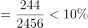，即不足一成，错误；

B项：定位表格可得，截至2015年12月底，北京市文化及相关产业各行业企业总数同比增速均大于0，说明企业数量都比上年有一定增加，正确；

C项：定位表格可得，2015年新设企业户数同比增速为负数的行业有：文化休闲娱乐服务（）、文化创意和设计服务（）、文化专用设备的生产（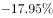）、文化用品的生产（）、工艺美术品的生产（）、文化产品生产的辅助生产（），降幅比较的是增长率的绝对值，则降幅最大的为文化用品生产业，正确；

D项：定位表格可得，2015年各行业年末企业总数同比增速最快的三个行业是广播电视电影服务（）、文化艺术服务（）和工艺美术品的生产（），正确。

本题为选非题，故正确答案为A。

---

## 材料 4

        2016年“一带一路”沿线64个国家GDP之和约为12.0万亿美元，占全球GDP的；人口总数约为32.1亿人，占全球人口的；对外贸易总额约为71885.5亿美元，占全球贸易总额的。

### 第 16 题　qid 2453176 · 综合

2016年东南亚“一带一路”沿线国家人口总数约占“一带一路”沿线64个国家人口总数的：

- **A**. 

- **B**. 

- **C**. 

　✅
- **D**. 

**答案**：C

**官方解析**

由题干“2016年······约占······的”，结合选项为百分数，可判定本题为现期比重问题。定位文字材料可得，2016年“一带一路”沿线64个国家人口总数约为32.1亿人，定位表格可得，2016年东南亚“一带一路”沿线国家人口总数为63852.5万人。则所求比重，与C项最接近。

故正确答案为C。

---

### 第 17 题　qid 2453183 · 平均数

2016年“一带一路”沿线国家人均GDP约是全球水平的多少倍：

- **A**. 2.7
- **B**. 1.6
- **C**. 0.9
- **D**. 0.4　✅

**答案**：D

**官方解析**

由题干“2016年······约是······的多少倍”，可判定本题为现期倍数问题。定位文字材料可得，2016年“一带一路”沿线64个国家GDP之和约为12.0万亿美元，占全球GDP的；人口总数约为32.1亿人，占全球人口的。则2016年“一带一路”沿线国家人均GDP美元/人，全球人均GDP美元/人，所求倍数，与D项最接近。

故正确答案为D。

---

### 第 18 题　qid 2453185 · 综合

2016年东南亚“一带一路”沿线国家有几个呈现贸易逆差（进口额高于出口额）：

- **A**. 5
- **B**. 6　✅
- **C**. 7
- **D**. 8

**答案**：B

**官方解析**

定位表格查找可得，2016年东南亚“一带一路”沿线国家进口额高于出口额的有越南、菲律宾、缅甸、柬埔寨、老挝、东帝汶，共6个国家。
故正确答案为B。

---

### 第 19 题　qid 2453191 · 平均数

2016年东南亚人均GDP最低的“一带一路”沿线国家，当年其进出口额约占东南亚“一带一路”沿线国家：

- **A**. 
不到

- **B**. 
-之间

- **C**. 
-之间
　✅
- **D**. 
以上

**答案**：C

**官方解析**

由题干“······占······”，结合材料时间与题干一致，可判定本题为现期比重问题。需先找到2016年东南亚人均GDP最低的“一带一路”沿线国家，也就是找最小的国家，反过来就是找最大的国家。定位表格，发现明显最大的是缅甸和柬埔寨，直除比较，，，即2016年东南亚人均GDP最低的“一带一路”沿线国家是柬埔寨。其当年进出口额占东南亚“一带一路”沿线国家的比重为，即在～之间。

故正确答案为C。

---

### 第 20 题　qid 2453192 · 比重

以下信息，可从资料中推出的有几条：

①2012-2016年，每年“一带一路”沿线国家对外贸易占全球份额均低于上年水平

②2016年东南亚“一带一路”沿线国家GDP占全球GDP的比重在-之间

③2016年东南亚“一带一路”沿线国家中，人口最多的2个国家进出口总额均未排进前三

- **A**. 0
- **B**. 1　✅
- **C**. 2
- **D**. 3

**答案**：B

**官方解析**

①定位折线图，发现2012年和2013年“一带一路”沿线国家对外贸易占全球份额是不变的，均为，不满足均低于上年水平，因此说法错误；

②方法一：定位表格，已知2016年东南亚“一带一路”沿线国家GDP合计为25802.2亿美元；定位文字材料，已知2016年“一带一路”沿线64个国家GDP之和约为12.0万亿美元，占全球GDP的。那么2016年全球GDP为万亿美元，那么所求比重为，不在～之间，因此说法错误。

方法二：定位表格，已知2016年东南亚“一带一路”沿线国家GDP合计为25802.2亿美元；定位文字材料，已知2016年“一带一路”沿线64个国家GDP之和约为12.0万亿美元，占全球GDP的。全球GDP的为12.0万亿美元，全球GDP的为3.0万亿美元，万亿美元，说明不到，因此说法错误；

③定位表格，发现2016年东南亚“一带一路”沿线国家中，人口数最多的2个国家分别是印度尼西亚和菲律宾，进出口总额排在前三名的国家分别是新加坡、泰国、越南，印度尼西亚和菲律宾均未排进前三名，因此说法正确。能推出的只有③。

故正确答案为B。

---
